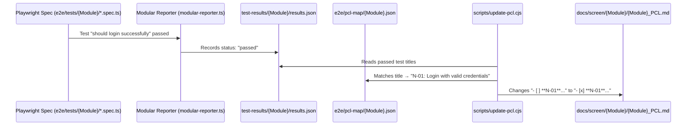

# PCL (Program Checklist) Template Guide

---

## Document Control

| Attribute | Value |
|-----------|-------|
| **Document ID** | SKM-GUIDE-PCL-001 |
| **Purpose** | Standard template for creating Test-Focused Program Checklists per screen/module |
| **Version** | 3.0 (Test-Driven Architecture) |
| **Created** | 2026-09-16 |
| **Last Updated** | 2026-09-16 |
| **Status** | Active |

---

## 1. What is a PCL?

A **Program Checklist (PCL)** is a quality-assurance and verification document for each screen module.

In this architecture, the PCL is **strictly test-focused**. Detailed architectural designs (DB schemas, backend modules, DTO decorators, responsive layout tables) are maintained in `docs/screen/{Screen}/Detailed Design/`. 

The PCL focuses exclusively on **test verification scenarios** that directly integrate with Playwright E2E automated tests and the `update-pcl` pipeline.

### Purpose
- Define all verification criteria before coding begins.
- Act as the single source of truth for screen delivery readiness.
- Automatically track test passage via E2E test execution (`- [ ]` → `- [x]`).
- Enable multiple developers to work independently without merge conflicts.

---

## 2. The 4 Test Categories (N / A / B / I)

Every screen PCL is organized into **4 standardized test categories**:

| Category | Symbol | Focus | Description | Examples |
|----------|:------:|-------|-------------|----------|
| **Normal** | **N** | Happy Path | Standard user journeys where correct inputs are provided and operations succeed. | User registers successfully, logs in, filters items, checks out. |
| **Abnormal** | **A** | Negative Path | Validation errors, permission denials, unauthorized attempts, duplicate constraints, server errors. | Submitting empty form, duplicate email, expired token, accessing route without login. |
| **Boundary** | **B** | Edge Conditions | Field length limits, min/max numbers, zero states, file size limits, threshold conditions. | Name at min (2 chars) vs max (200 chars), file size at 10MB limit, empty search list. |
| **Interface** | **I** | API Contracts | Direct API request/response contracts, HTTP status codes, payload structures, cookie flags. | `POST /api/v1/...` returns 201 with `data` payload, Set-Cookie flags (`HttpOnly; Secure`). |

---

## 3. Standard Test Case Format

Each test case item in the checklist must strictly follow this structure:

```markdown
- [ ] **{CAT}-{NN}**: Title of the test scenario
  - **Precondition**: What state or data must exist before running
  - **Steps**: Step-by-step user or API actions
    1. First action
    2. Second action
  - **Expected Result**: What should happen visually or logically
  - **Business Rules**: Rule IDs enforced (e.g. BR-AUTH-001)
  - **API**: Relevant endpoint (if applicable)
```

> [!IMPORTANT]
> The line must start with `- [ ] **{CAT}-{NN}**: {Title}`.
> The auto-update script (`scripts/update-pcl.cjs`) looks for this exact format to replace `- [ ]` with `- [x]`.

---

## 4. Standard PCL File Template

Developers creating a PCL for any screen can copy this template directly into:  
`docs/screen/{ScreenName}/{ScreenName}_PCL.md`

```markdown
# Program Checklist (PCL) — {Screen Name}

---

## Document Control

| Attribute | Value |
|-----------|-------|
| **Document ID** | SKM-PCL-{MODULE}-001 |
| **Target Screen** | {Screen Name} |
| **Subsystem** | {Subsystem Name} |
| **Version** | 1.0 |
| **Status** | Active |

---

## 1. Normal Scenarios (N) — Happy Path

- [ ] **N-01**: {Primary action success}
  - **Precondition**: {Precondition}
  - **Steps**:
    1. Navigate to {URL}
    2. Fill valid form data
    3. Click submit
  - **Expected Result**: Success toast displayed, redirects to {destination}
  - **Business Rules**: BR-{MODULE}-001
  - **API**: `POST /api/v1/{endpoint}`

- [ ] **N-02**: {Secondary action success}
  - **Precondition**: {Precondition}
  - **Steps**:
    1. Action steps...
  - **Expected Result**: {Result}
  - **Business Rules**: BR-{MODULE}-002

- [ ] **N-03**: Language toggle works on screen
  - **Precondition**: User is on {screen}
  - **Steps**:
    1. Toggle language to Japanese / Myanmar
  - **Expected Result**: All UI labels update to selected language
  - **Business Rules**: None (i18n)

- [ ] **N-04**: Theme toggle works on screen
  - **Precondition**: User is on {screen}
  - **Steps**:
    1. Toggle theme to dark / light
  - **Expected Result**: Styling switches between dark and light modes
  - **Business Rules**: None (UI)

- [ ] **N-05**: Responsive layout on desktop viewport
  - **Precondition**: Viewport >= 1024px
  - **Steps**:
    1. Set viewport to 1280x720
  - **Expected Result**: Desktop layout displays correctly
  - **Business Rules**: None (Responsive)

- [ ] **N-06**: Responsive layout on mobile viewport
  - **Precondition**: Viewport < 768px
  - **Steps**:
    1. Set viewport to 375x667
  - **Expected Result**: Mobile layout stacks and scrolls correctly
  - **Business Rules**: None (Responsive)

---

## 2. Abnormal Scenarios (A) — Error & Negative Paths

- [ ] **A-01**: Submit form with empty required fields
  - **Precondition**: User is on {screen}
  - **Steps**:
    1. Leave required fields blank
    2. Click submit
  - **Expected Result**: Inline validation error messages displayed; submit blocked
  - **Business Rules**: BR-{MODULE}-001
  - **API**: `POST /api/v1/{endpoint}`

- [ ] **A-02**: Submit with invalid format / conflict
  - **Precondition**: {Precondition}
  - **Steps**:
    1. Enter invalid data
    2. Click submit
  - **Expected Result**: Error notification or field error shown
  - **Business Rules**: BR-{MODULE}-002
  - **API**: `POST /api/v1/{endpoint}`

- [ ] **A-03**: Access without required permissions
  - **Precondition**: User not authenticated or lacks role
  - **Steps**:
    1. Navigate directly to {protected URL}
  - **Expected Result**: Redirect to `/login` or 403 Forbidden page
  - **Business Rules**: BR-{MODULE}-003

---

## 3. Boundary Scenarios (B) — Edge Cases & Limits

- [ ] **B-01**: Field input at minimum allowable length
  - **Precondition**: User is on {screen}
  - **Steps**:
    1. Enter input with exact minimum character count
    2. Submit form
  - **Expected Result**: Input accepted successfully
  - **Business Rules**: BR-{MODULE}-004

- [ ] **B-02**: Field input at maximum allowable length
  - **Precondition**: User is on {screen}
  - **Steps**:
    1. Enter input with exact maximum character count
    2. Submit form
  - **Expected Result**: Input accepted successfully
  - **Business Rules**: BR-{MODULE}-004

- [ ] **B-03**: Field input exceeding maximum allowable length
  - **Precondition**: User is on {screen}
  - **Steps**:
    1. Enter input with (max + 1) characters
  - **Expected Result**: Validation error for length displayed or input truncated
  - **Business Rules**: BR-{MODULE}-004

- [ ] **B-04**: Empty state handling
  - **Precondition**: Database has 0 records for this view
  - **Steps**:
    1. Navigate to screen
  - **Expected Result**: Friendly "No items found" empty state component displayed
  - **Business Rules**: None (UI)

---

## 4. Interface Scenarios (I) — API Contracts & Payloads

- [ ] **I-01**: `POST /api/v1/{endpoint}` — returns 201 with created entity
  - **Precondition**: Valid payload provided
  - **Steps**:
    1. Call API with valid request body
  - **Expected Response**: Status code 201, JSON `{ data: { id, ... } }`
  - **Business Rules**: BR-{MODULE}-001
  - **API**: `POST /api/v1/{endpoint}`

- [ ] **I-02**: `GET /api/v1/{endpoint}` — returns 200 with list and pagination
  - **Precondition**: Records exist
  - **Steps**:
    1. Call API with valid query parameters
  - **Expected Response**: Status code 200, JSON `{ data: [...], meta: { total, page, limit } }`
  - **Business Rules**: None
  - **API**: `GET /api/v1/{endpoint}`

- [ ] **I-03**: `GET /api/v1/{endpoint}/:id` — returns 404 for non-existent ID
  - **Precondition**: Non-existent UUID
  - **Steps**:
    1. Call API with fake ID
  - **Expected Response**: Status code 404, JSON `{ statusCode: 404, error: "NOT_FOUND" }`
  - **Business Rules**: None
  - **API**: `GET /api/v1/{endpoint}/:id`

- [ ] **I-04**: Error response follows standard API format
  - **Precondition**: Any error scenario
  - **Steps**:
    1. Trigger error
  - **Expected Response**: JSON contains `{ statusCode, message, error, timestamp, path }`
  - **Business Rules**: None
  - **API**: Any endpoint

---

## Sign-Off

| Item | Status |
|------|--------|
| Test scenarios defined (N, A, B, I) | ☑️ |
| E2E tests implemented | ☑️ |
| PCL auto-update verified | ☑️ |
```

---

## 5. How PCL Connects to E2E (Automation Flow)



### The Mapping File (`e2e/pcl-map/{ModuleName}.json`)

Each screen has a dedicated JSON mapping file:

```json
{
  "pclFile": "docs/screen/ModuleName/ModuleName_PCL.md",
  "specFiles": [
    "e2e/tests/ModuleName/module.spec.ts"
  ],
  "mappings": {
    "Playwright test title": "CAT-NN: PCL checklist text"
  }
}
```

---

## 6. Step-by-Step Developer Workflow

When starting on a screen, each developer follows these 6 steps:

### Step 1: Read Detailed Design
Review design files in `docs/screen/{Screen}/Detailed Design/`:
- `DD_*_01_MODULE_OVERVIEW.md`
- `DD_*_02_FRONTEND_Page.md`
- `DD_*_03_API_ENDPOINTS.md`
- `DD_*_05_BUSINESS_LOGIC.md`
- `DD_*_06_TEST_SPEC.md`

### Step 2: Create `{ScreenName}_PCL.md`
Create `docs/screen/{ScreenName}/{ScreenName}_PCL.md` using the **N / A / B / I template** from Section 4 above.

### Step 3: Create Page Object Model (POM)
Create `e2e/pages/{ScreenName}/{ScreenName}Page.ts` with locators and action helpers.

### Step 4: Write Playwright E2E Tests
Create `e2e/tests/{ScreenName}/{screen}.spec.ts` covering the scenarios defined in your PCL.

### Step 5: Configure PCL Map
Add mappings in `e2e/pcl-map/{ScreenName}.json` linking each `test('...')` description to its corresponding PCL item.

### Step 6: Run Tests and Update PCL
```bash
cd e2e

# 1. Run this screen's tests
npx playwright test tests/{ScreenName}/

# 2. Update this screen's PCL
npm run update-pcl:{ScreenName}
# or: node ../scripts/update-pcl.cjs {ScreenName}
```

Verify that passed tests turned from `- [ ]` to `- [x]` in your PCL markdown file!

---

## 7. Reference Implementations

| Screen Module | PCL File | Page Object | Spec File | PCL Map |
|---------------|----------|-------------|-----------|---------|
| **SignUp_LogIn** | `docs/screen/SignUp_LogIn/SignUp_LogIn_PCL.md` | `e2e/pages/SignUp_LogIn/LoginPage.ts` | `e2e/tests/SignUp_LogIn/*.spec.ts` | `e2e/pcl-map/SignUp_LogIn.json` |
| **SearchAndFilter** | `docs/screen/SearchAndFilter/Search_And_Filter_PCL.md` | `e2e/pages/SearchAndFilter/SearchPage.ts` | `e2e/tests/SearchAndFilter/search-filter.spec.ts` | `e2e/pcl-map/SearchAndFilter.json` |

---

*Document maintained by the Engineering Division. Version 3.0.*
