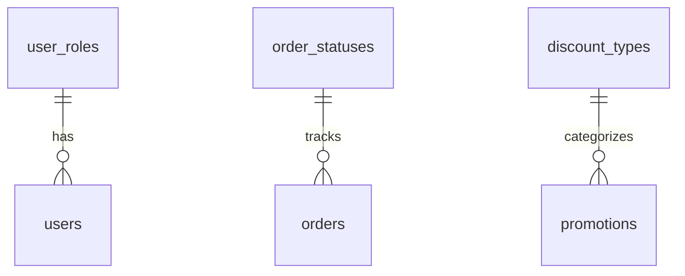
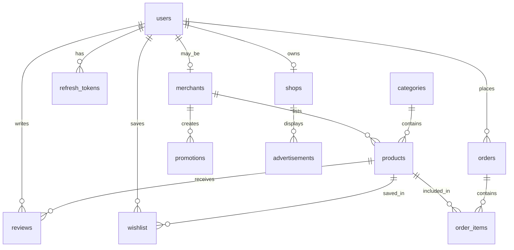
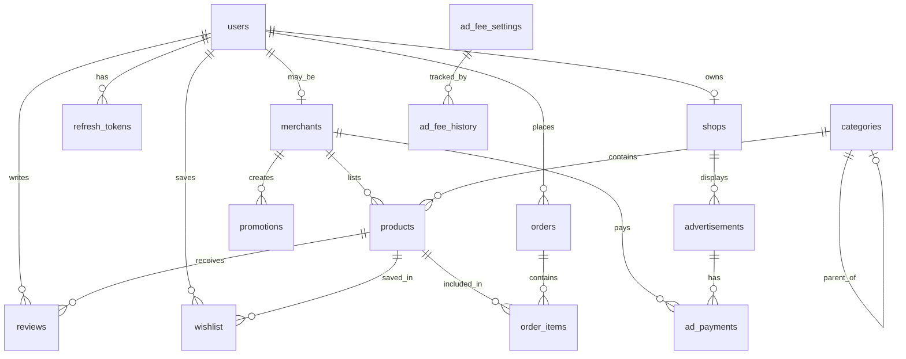

# Database Design Specification（データベース設計書）

---

## Document Control（ドキュメント管理）

| Attribute | Value |
| :--- | :--- |
| **Document ID** | SKM-DBS-001 |
| **System** | Cosmetics Finder |
| **Phase** | Technical Design |
| **Version** | 2.0 |
| **Created** | 2026-08-03 |
| **Last Updated** | 2026-08-14 |
| **Author** | Lead Database Engineer |
| **Status** | Released（承認済み） |

### Document Revision History（ドキュメント改訂履歴）

| Version | Date | Author | Description of Changes（変更説明） |
| :--- | :--- | :--- | :--- |
| 1.0 | 2026-08-03 | Lead Database Engineer | 初回技術設計仕様（新規作成） |
| 1.1 | 2026-08-10 | Lead Database Engineer | 広告承認ワークフロー、支払い追跡、週間制限のためのadvertisementsテーブルにフィールドを追加 |
| 2.0 | 2026-08-14 | Lead Database Engineer | REQUIREMENT_SPEC v1.5に整合: UUID主キー、merchantsテーブル、ordersの再構成、広告料金テーブル、FKリレーションシップの更新 |

---

## 1. Database Overview & Naming Conventions（データベース概要と命名規則）

### 1.1 Database Engine Constraints（データベースエンジン制約）
* **プライマリデータベース:** PostgreSQL 16+
* **ストレージエンジン:** PostgreSQLデフォルトヒープストレージ（トランザクションサポート付き、ACID準拠）
* **分離レベル:** Read Committed（デフォルト。ディーティッドリードの防止と高い並行性を両立）
* **エンコーディング:** `UTF8`（日本語、ミャンマー語、英語の文字入力に対応する多言語互換性）
* **照合順序:** `C` or `en_US.utf8`（一貫したソートルール）

### 1.2 Naming Conventions（命名規則）
プラットフォーム全体の一貫性を確保するため、データベースは厳格なsnake_case規則に準拠します:
* **テーブル:** 複数形、小文字、アンダースコア区切り（例: `products`, `order_items`）
* **カラム:** 小文字、単数形、アンダースコア区切り（例: `merchant_id`, `stock_quantity`）
* **プライマリキー:** `id`として統一（分散システム向けUUID形式）
* **フォーリンキー:** `<referenced_table_singular>_id`の形式（例: `user_id`が`users`を参照）
* **インデックス:** `idx_`プレフィックス + テーブル名 + インデックスされたカラム（例: `idx_products_category_id`）。ユニークインデックスには`uq_`プレフィックス
* **制約:** チェック制約に`chk_`、フォーリンキーに`fk_`、プライマリキーに`pk_`プレフィックス

### 1.3 Timezone & Temporal Configuration（タイムゾーンと時間設定）
* すべてのdatetimeカラムは`TIMESTAMP WITH TIME ZONE`（またはPostgreSQLの`TIMESTAMPTZ`）を使用
* **保存標準:** すべてのタイムスタンプはデータベースレイヤーで**UTC**（協定世界時）に正規化して保存
* **アプリケーション処理:** NestJS/PrismaバックエンドはUTCで日付の受信とクエリを行い、ローカルタイムゾーン変換はプレゼンテーション/クライアントレイヤーで実行
* **時刻なしの日付:** 時間/分なしのカレンダー日付を追跡するカラム（注文日など）は`DATE`型を使用

### 1.4 ID Strategy（ID戦略）
* **プライマリキー:** 分散フレンドリーでグローバルユニークなIDとしてUUID（Universally Unique Identifier）を使用
* **フォーマット:** PostgreSQLで`DEFAULT gen_random_uuid()`を持つ`UUID`型
* **利点:** グローバルユニーク、シーケンシャルギャップなし、PostgreSQLネイティブサポート、外部依存なし

---

## 2. Master / Lookup Tables DDL（マスター/ルックアップテーブルDDL）

ルックアップテーブルは、ユーザーロール、注文ステータス、割引タイプ、その他のカテゴリ分類を駆動するマスターデータを表します。これらのテーブルはデータ整合性を保護するためにデータベースレベルのフォーリンキーで実行されます。



### 2.1 SQL DDL Scripts（SQL DDLスクリプト）

```sql
-- =========================================================================
-- 1. USER ROLES LOOKUP TABLE
-- =========================================================================
CREATE TABLE user_roles (
    role_id SERIAL,
    role_code VARCHAR(20) NOT NULL,
    role_name VARCHAR(50) NOT NULL,
    description VARCHAR(500),
    is_active BOOLEAN NOT NULL DEFAULT TRUE,
    created_at TIMESTAMP WITH TIME ZONE NOT NULL DEFAULT CURRENT_TIMESTAMP,
    CONSTRAINT pk_user_roles PRIMARY KEY (role_id),
    CONSTRAINT uq_user_roles_role_code UNIQUE (role_code),
    CONSTRAINT uq_user_roles_role_name UNIQUE (role_name)
);

-- =========================================================================
-- 2. ORDER STATUSES LOOKUP TABLE
-- =========================================================================
CREATE TABLE order_statuses (
    status_id SERIAL,
    status_code VARCHAR(30) NOT NULL,
    status_name VARCHAR(50) NOT NULL,
    display_order INTEGER NOT NULL,
    is_terminal_state BOOLEAN NOT NULL DEFAULT FALSE,
    description VARCHAR(500),
    CONSTRAINT pk_order_statuses PRIMARY KEY (status_id),
    CONSTRAINT uq_order_statuses_status_code UNIQUE (status_code),
    CONSTRAINT uq_order_statuses_status_name UNIQUE (status_name)
);

-- =========================================================================
-- 3. DISCOUNT TYPES LOOKUP TABLE
-- =========================================================================
CREATE TABLE discount_types (
    discount_type_id SERIAL,
    type_code VARCHAR(20) NOT NULL,
    type_name VARCHAR(50) NOT NULL,
    is_active BOOLEAN NOT NULL DEFAULT TRUE,
    created_at TIMESTAMP WITH TIME ZONE NOT NULL DEFAULT CURRENT_TIMESTAMP,
    CONSTRAINT pk_discount_types PRIMARY KEY (discount_type_id),
    CONSTRAINT uq_discount_types_type_code UNIQUE (type_code),
    CONSTRAINT uq_discount_types_type_name UNIQUE (type_name)
);
```

### 2.2 DML Master Seeding Scripts（DMLマスターシードスクリプト）

```sql
-- Seed User Roles
INSERT INTO user_roles (role_code, role_name, description, is_active) VALUES
('buyer', 'Buyer', '商品を閲覧および購入するエンドユーザー', TRUE),
('merchant', 'Merchant', 'マーケットプレイスに商品を出品する販売者', TRUE),
('admin', 'Admin', '完全なアクセス権を持つプラットフォーム管理者', TRUE);

-- Seed Order Statuses (Workflow lifecycle tracking)
INSERT INTO order_statuses (status_code, status_name, display_order, is_terminal_state, description) VALUES
('placed', 'Placed', 1, FALSE, '注文作成済み、確認待ち'),
('confirmed', 'Confirmed', 2, FALSE, '出品者による注文確認'),
('packed', 'Packed', 3, FALSE, '注文が梱包され、発送準備完了'),
('shipped', 'Shipped', 4, FALSE, '注文が運送業者に引き渡された'),
('out_for_delivery', 'Out for Delivery', 5, FALSE, '注文が購入者へ配達中'),
('delivered', 'Delivered', 6, TRUE, '購入者が注文を受け取った'),
('cancelled', 'Cancelled', 7, TRUE, '注文がキャンセルされた（購入者または出品者）');

-- Seed Discount Types
INSERT INTO discount_types (type_code, type_name, is_active) VALUES
('percentage', 'Percentage Discount', TRUE),
('fixed', 'Fixed Amount Discount', TRUE);
```

---

## 3. Core Entity Tables DDL & Structural Integrity（コアエンティティテーブルDDLと構造的整合性）

トランザクショナルエンティティは、ユーザー資格情報、商品、注文、レビュー、お気に入り、店舗、プロモーション、広告を処理します。リレーションシップは、孤立レコードを防止しつつ明確な履歴を維持するように設計されています。



### 3.1 Users Table（`users` - ユーザーマスタ）
ロールベースアクセス制御を持つシステムユーザー情報を管理します。

#### Data Dictionary（データ辞書）
| No（項番） | Logical Name（論理名） | Physical Name（物理名） | Data Type & Length（データ型・桁数） | PK | FK | Nullable（NULL許容） | Default Value（初期値） | Constraints & Remarks（制約・備考） |
|---|---|---|---|---|---|---|---|---|
| 1 | ユーザーID | `id` | UUID | Y | - | N | gen_random_uuid() | Primary key. UUID形式。 |
| 2 | メールアドレス | `email` | VARCHAR(255) | - | - | N | - | ユニークキー（`uq_users_email`）。ログインIDとして使用。 |
| 3 | パスワードハッシュ | `password_hash` | VARCHAR(255) | - | - | N | - | 認証用暗号化パスワードハッシュ（Argon2）。 |
| 4 | フルネーム | `name` | VARCHAR(255) | - | - | N | - | ユーザーのフルネーム。 |
| 5 | ロール | `role` | VARCHAR(20) | - | - | N | 'buyer' | ユーザーロール（buyer, merchant, admin, super_admin）。 |
| 6 | 出品者ID | `merchant_id` | UUID | - | Y | Y | NULL | フォーリンキー（`fk_users_merchant`）。`merchants(id)`を参照。ON DELETE SET NULL ON UPDATE CASCADE。 |
| 7 | 電話番号 | `phone` | VARCHAR(20) | - | - | Y | NULL | 連絡先電話番号。 |
| 8 | アバターURL | `avatar_url` | TEXT | - | - | Y | NULL | プロフィール画像URL。 |
| 9 | 有効フラグ | `is_active` | BOOLEAN | - | - | N | TRUE | アカウント有効（TRUE）または無効（FALSE）ステータス。 |
| 10 | メール認証済み | `email_verified` | BOOLEAN | - | - | N | FALSE | メール認証ステータス。 |
| 11 | 作成日時 | `created_at` | TIMESTAMPTZ | - | - | N | CURRENT_TIMESTAMP | レコード作成タイムスタンプ。 |
| 12 | 更新日時 | `updated_at` | TIMESTAMPTZ | - | - | N | CURRENT_TIMESTAMP | レコード最終更新タイムスタンプ。 |

#### Reference SQL DDL
```sql
CREATE TABLE users (
    id UUID PRIMARY KEY DEFAULT gen_random_uuid(),
    email VARCHAR(255) NOT NULL,
    password_hash VARCHAR(255) NOT NULL,
    name VARCHAR(255) NOT NULL,
    role VARCHAR(20) NOT NULL DEFAULT 'buyer',
    merchant_id UUID,
    phone VARCHAR(20),
    avatar_url TEXT,
    is_active BOOLEAN NOT NULL DEFAULT TRUE,
    email_verified BOOLEAN NOT NULL DEFAULT FALSE,
    created_at TIMESTAMP WITH TIME ZONE NOT NULL DEFAULT CURRENT_TIMESTAMP,
    updated_at TIMESTAMP WITH TIME ZONE NOT NULL DEFAULT CURRENT_TIMESTAMP,
    CONSTRAINT uq_users_email UNIQUE (email),
    CONSTRAINT chk_users_role CHECK (role IN ('buyer', 'merchant', 'admin', 'super_admin')),
    CONSTRAINT fk_users_merchant FOREIGN KEY (merchant_id)
        REFERENCES merchants(id) ON DELETE SET NULL ON UPDATE CASCADE
);
```

---

### 3.2 Merchants Table（`merchants` - 出品者テーブル）
ライセンス検証と承認ワークフローを持つ出品者プロフィールを管理します。

#### Data Dictionary（データ辞書）
| No（項番） | Logical Name（論理名） | Physical Name（物理名） | Data Type & Length（データ型・桁数） | PK | FK | Nullable（NULL許容） | Default Value（初期値） | Constraints & Remarks（制約・備考） |
|---|---|---|---|---|---|---|---|---|
| 1 | 出品者ID | `id` | UUID | Y | - | N | gen_random_uuid() | Primary key. UUID形式。 |
| 2 | ユーザーID | `user_id` | UUID | - | Y | N | - | ユニークキー（`uq_merchants_user_id`）。`users(id)`を参照。ON DELETE CASCADE ON UPDATE CASCADE。 |
| 3 | 店舗名 | `shop_name` | VARCHAR(255) | - | - | N | - | 出品者の店舗表示名。 |
| 4 | 事業許可証URL | `business_license_url` | TEXT | - | - | N | - | アップロードされた事業許可証ドキュメントのURL。 |
| 5 | 許可状態 | `license_status` | VARCHAR(20) | - | - | N | 'pending' | ライセンス検証ステータス: pending/approved/rejected。 |
| 6 | 却下理由 | `rejection_reason` | TEXT | - | - | Y | NULL | ライセンス却下の理由。 |
| 7 | レビュー日時 | `reviewed_at` | TIMESTAMPTZ | - | - | Y | NULL | 管理者レビュータイムスタンプ。 |
| 8 | レビュー者ID | `reviewed_by` | UUID | - | Y | Y | NULL | フォーリンキー（`fk_merchants_reviewed_by`）。`users(id)`を参照。ON DELETE SET NULL ON UPDATE CASCADE。 |
| 9 | 許可証有効期限 | `license_expires_at` | TIMESTAMPTZ | - | - | Y | NULL | 事業許可証の有効期限。 |
| 10 | 作成日時 | `created_at` | TIMESTAMPTZ | - | - | N | CURRENT_TIMESTAMP | レコード作成タイムスタンプ。 |
| 11 | 更新日時 | `updated_at` | TIMESTAMPTZ | - | - | N | CURRENT_TIMESTAMP | レコード最終更新タイムスタンプ。 |

#### Reference SQL DDL
```sql
CREATE TABLE merchants (
    id UUID PRIMARY KEY DEFAULT gen_random_uuid(),
    user_id UUID NOT NULL,
    shop_name VARCHAR(255) NOT NULL,
    business_license_url TEXT NOT NULL,
    license_status VARCHAR(20) NOT NULL DEFAULT 'pending',
    rejection_reason TEXT,
    reviewed_at TIMESTAMP WITH TIME ZONE,
    reviewed_by UUID,
    license_expires_at TIMESTAMP WITH TIME ZONE,
    created_at TIMESTAMP WITH TIME ZONE NOT NULL DEFAULT CURRENT_TIMESTAMP,
    updated_at TIMESTAMP WITH TIME ZONE NOT NULL DEFAULT CURRENT_TIMESTAMP,
    CONSTRAINT uq_merchants_user_id UNIQUE (user_id),
    CONSTRAINT chk_merchants_license_status CHECK (license_status IN ('pending', 'approved', 'rejected')),
    CONSTRAINT fk_merchants_user FOREIGN KEY (user_id)
        REFERENCES users(id) ON DELETE CASCADE ON UPDATE CASCADE,
    CONSTRAINT fk_merchants_reviewed_by FOREIGN KEY (reviewed_by)
        REFERENCES users(id) ON DELETE SET NULL ON UPDATE CASCADE
);
```

---

### 3.3 Refresh Tokens Table（`refresh_tokens` - リフレッシュトークンテーブル）
セッション管理用のJWTリフレッシュトークンを管理します。

#### Data Dictionary（データ辞書）
| No（項番） | Logical Name（論理名） | Physical Name（物理名） | Data Type & Length（データ型・桁数） | PK | FK | Nullable（NULL許容） | Default Value（初期値） | Constraints & Remarks（制約・備考） |
|---|---|---|---|---|---|---|---|---|
| 1 | リフレッシュトークンID | `id` | UUID | Y | - | N | gen_random_uuid() | Primary key. UUID形式。 |
| 2 | ユーザーID | `user_id` | UUID | - | Y | N | - | フォーリンキー（`fk_refresh_tokens_user`）。`users(id)`を参照。ON DELETE CASCADE ON UPDATE CASCADE。 |
| 3 | トークンハッシュ | `token_hash` | VARCHAR(255) | - | - | N | - | ハッシュ化されたリフレッシュトークン値。 |
| 4 | ファミリー | `family` | VARCHAR(255) | - | - | N | - | 侵入検出のためのトークンファミリー。 |
| 5 | デバイス情報 | `device_info` | JSONB | - | - | Y | NULL | デバイスメタデータ（User-Agent解析）。 |
| 6 | IPアドレス | `ip_address` | VARCHAR(50) | - | - | Y | NULL | クライアントIPアドレス。 |
| 7 | 無効化フラグ | `is_revoked` | BOOLEAN | - | - | N | FALSE | トークン無効化ステータス。 |
| 8 | 絶対期限 | `absolute_limit_at` | TIMESTAMPTZ | - | - | N | - | ハードセッション上限（90日）。 |
| 9 | 有効期限 | `expires_at` | TIMESTAMPTZ | - | - | N | - | トークン有効期限タイムスタンプ。 |
| 10 | 作成日時 | `created_at` | TIMESTAMPTZ | - | - | N | CURRENT_TIMESTAMP | レコード作成タイムスタンプ。 |

#### Reference SQL DDL
```sql
CREATE TABLE refresh_tokens (
    id UUID PRIMARY KEY DEFAULT gen_random_uuid(),
    user_id UUID NOT NULL,
    token_hash VARCHAR(255) NOT NULL,
    family VARCHAR(255) NOT NULL,
    device_info JSONB,
    ip_address VARCHAR(50),
    is_revoked BOOLEAN NOT NULL DEFAULT FALSE,
    absolute_limit_at TIMESTAMP WITH TIME ZONE NOT NULL,
    expires_at TIMESTAMP WITH TIME ZONE NOT NULL,
    created_at TIMESTAMP WITH TIME ZONE NOT NULL DEFAULT CURRENT_TIMESTAMP,
    CONSTRAINT fk_refresh_tokens_user FOREIGN KEY (user_id)
        REFERENCES users(id) ON DELETE CASCADE ON UPDATE CASCADE
);
```

---

### 3.4 Categories Table（`categories` - カテゴリテーブル）
階層ツリー構造を持つ商品カテゴリを管理します。

#### Data Dictionary（データ辞書）
| No（項番） | Logical Name（論理名） | Physical Name（物理名） | Data Type & Length（データ型・桁数） | PK | FK | Nullable（NULL許容） | Default Value（初期値） | Constraints & Remarks（制約・備考） |
|---|---|---|---|---|---|---|---|---|
| 1 | カテゴリID | `id` | UUID | Y | - | N | gen_random_uuid() | Primary key. UUID形式。 |
| 2 | カテゴリ名 | `name` | VARCHAR(255) | - | - | N | - | カテゴリ表示名。 |
| 3 | スラッグ | `slug` | VARCHAR(255) | - | - | N | - | ユニークキー（`uq_categories_slug`）。URLフレンドリー識別子。 |
| 4 | 親カテゴリID | `parent_id` | UUID | - | Y | Y | NULL | ツリー構造用の自己参照フォーリンキー。ON DELETE SET NULL ON UPDATE CASCADE。 |
| 5 | アイコンURL | `icon_url` | TEXT | - | - | Y | NULL | カテゴリアイコン画像URL。 |
| 6 | ソート順 | `sort_order` | INTEGER | - | - | N | 0 | 親カテゴリ内での表示順序。 |
| 7 | 作成日時 | `created_at` | TIMESTAMPTZ | - | - | N | CURRENT_TIMESTAMP | レコード作成タイムスタンプ。 |

#### Reference SQL DDL
```sql
CREATE TABLE categories (
    id UUID PRIMARY KEY DEFAULT gen_random_uuid(),
    name VARCHAR(255) NOT NULL,
    slug VARCHAR(255) NOT NULL,
    parent_id UUID,
    icon_url TEXT,
    sort_order INTEGER NOT NULL DEFAULT 0,
    created_at TIMESTAMP WITH TIME ZONE NOT NULL DEFAULT CURRENT_TIMESTAMP,
    CONSTRAINT uq_categories_slug UNIQUE (slug),
    CONSTRAINT fk_categories_parent FOREIGN KEY (parent_id)
        REFERENCES categories(id) ON DELETE SET NULL ON UPDATE CASCADE
);
```

---

### 3.5 Products Table（`products` - 商品テーブル）
出品者によるスキンケア商品リストを管理します。

#### Data Dictionary（データ辞書）
| No（項番） | Logical Name（論理名） | Physical Name（物理名） | Data Type & Length（データ型・桁数） | PK | FK | Nullable（NULL許容） | Default Value（初期値） | Constraints & Remarks（制約・備考） |
|---|---|---|---|---|---|---|---|---|
| 1 | 商品ID | `id` | UUID | Y | - | N | gen_random_uuid() | Primary key. UUID形式。 |
| 2 | 出品者ID | `merchant_id` | UUID | - | Y | N | - | フォーリンキー（`fk_products_merchant`）。`merchants(id)`を参照。ON DELETE CASCADE ON UPDATE CASCADE。 |
| 3 | カテゴリID | `category_id` | UUID | - | Y | N | - | フォーリンキー（`fk_products_category`）。`categories(id)`を参照。ON DELETE RESTRICT ON UPDATE CASCADE。 |
| 4 | 商品名 | `name` | VARCHAR(255) | - | - | N | - | 商品表示名。 |
| 5 | スラッグ | `slug` | VARCHAR(255) | - | - | N | - | ユニークキー（`uq_products_slug`）。URLフレンドリー識別子。 |
| 6 | 説明 | `description` | TEXT | - | - | Y | NULL | 詳細な商品説明。 |
| 7 | 短い説明 | `short_description` | VARCHAR(500) | - | - | Y | NULL | 簡潔な商品概要。 |
| 8 | 価格 | `price` | DECIMAL(10,2) | - | - | N | - | チェック制約: `price > 0`。 |
| 9 | 比較価格 | `compare_at_price` | DECIMAL(10,2) | - | - | Y | NULL | 割引表示用の元価格。 |
| 10 | SKU | `sku` | VARCHAR(100) | - | - | Y | NULL | ユニークキー（`uq_products_sku`）。在庫管理単位。 |
| 11 | 在庫数 | `stock_quantity` | INTEGER | - | - | N | 0 | チェック制約: `stock_quantity >= 0`。 |
| 12 | 低在庫閾値 | `low_stock_threshold` | INTEGER | - | - | N | 10 | 低在庫警告閾値。 |
| 13 | 画像URLs | `images` | TEXT[] | - | - | N | '{}' | 商品画像URLの配列。 |
| 14 | タグ | `tags` | TEXT[] | - | - | N | '{}' | 検索/フィルタ用商品タグ。 |
| 15 | 肌タイプ | `skin_types` | TEXT[] | - | - | N | '{}' | 対応肌タイプ。 |
| 16 | 成分 | `ingredients` | TEXT[] | - | - | N | '{}' | 商品成分リスト。 |
| 17 | 有効フラグ | `is_active` | BOOLEAN | - | - | N | TRUE | 商品表示ステータス。 |
| 18 | おすすめフラグ | `is_featured` | BOOLEAN | - | - | N | FALSE | おすすめ商品フラグ。 |
| 19 | 平均評価 | `avg_rating` | DECIMAL(3,2) | - | - | N | 0 | 自動計算された平均評価。 |
| 20 | レビュー数 | `review_count` | INTEGER | - | - | N | 0 | 自動計算されたレビュー数。 |
| 21 | 作成日時 | `created_at` | TIMESTAMPTZ | - | - | N | CURRENT_TIMESTAMP | レコード作成タイムスタンプ。 |
| 22 | 更新日時 | `updated_at` | TIMESTAMPTZ | - | - | N | CURRENT_TIMESTAMP | レコード最終更新タイムスタンプ。 |

#### Reference SQL DDL
```sql
CREATE TABLE products (
    id UUID PRIMARY KEY DEFAULT gen_random_uuid(),
    merchant_id UUID NOT NULL,
    category_id UUID NOT NULL,
    name VARCHAR(255) NOT NULL,
    slug VARCHAR(255) NOT NULL,
    description TEXT,
    short_description VARCHAR(500),
    price DECIMAL(10, 2) NOT NULL,
    compare_at_price DECIMAL(10, 2),
    sku VARCHAR(100),
    stock_quantity INTEGER NOT NULL DEFAULT 0,
    low_stock_threshold INTEGER NOT NULL DEFAULT 10,
    images TEXT[] DEFAULT '{}',
    tags TEXT[] DEFAULT '{}',
    skin_types TEXT[] DEFAULT '{}',
    ingredients TEXT[] DEFAULT '{}',
    is_active BOOLEAN NOT NULL DEFAULT TRUE,
    is_featured BOOLEAN NOT NULL DEFAULT FALSE,
    avg_rating DECIMAL(3, 2) DEFAULT 0,
    review_count INTEGER DEFAULT 0,
    created_at TIMESTAMP WITH TIME ZONE NOT NULL DEFAULT CURRENT_TIMESTAMP,
    updated_at TIMESTAMP WITH TIME ZONE NOT NULL DEFAULT CURRENT_TIMESTAMP,
    CONSTRAINT uq_products_slug UNIQUE (slug),
    CONSTRAINT uq_products_sku UNIQUE (sku),
    CONSTRAINT chk_products_price CHECK (price > 0),
    CONSTRAINT chk_products_stock CHECK (stock_quantity >= 0),
    CONSTRAINT fk_products_merchant FOREIGN KEY (merchant_id)
        REFERENCES merchants(id) ON DELETE CASCADE ON UPDATE CASCADE,
    CONSTRAINT fk_products_category FOREIGN KEY (category_id)
        REFERENCES categories(id) ON DELETE RESTRICT ON UPDATE CASCADE
);
```

---

### 3.6 Reviews Table（`reviews` - レビューテーブル）
評価付きの商品レビューを管理します。

#### Data Dictionary（データ辞書）
| No（項番） | Logical Name（論理名） | Physical Name（物理名） | Data Type & Length（データ型・桁数） | PK | FK | Nullable（NULL許容） | Default Value（初期値） | Constraints & Remarks（制約・備考） |
|---|---|---|---|---|---|---|---|---|
| 1 | レビューID | `id` | UUID | Y | - | N | gen_random_uuid() | Primary key. UUID形式。 |
| 2 | ユーザーID | `user_id` | UUID | - | Y | N | - | フォーリンキー（`fk_reviews_user`）。`users(id)`を参照。ON DELETE CASCADE ON UPDATE CASCADE。 |
| 3 | 商品ID | `product_id` | UUID | - | Y | N | - | フォーリンキー（`fk_reviews_product`）。`products(id)`を参照。ON DELETE CASCADE ON UPDATE CASCADE。 |
| 4 | 評価 | `rating` | INTEGER | - | - | N | - | チェック制約: `rating >= 1 AND rating <= 5`。 |
| 5 | タイトル | `title` | VARCHAR(255) | - | - | Y | NULL | レビュータイトル。 |
| 6 | 本文 | `body` | TEXT | - | - | Y | NULL | レビュー内容。 |
| 7 | 画像URLs | `images` | TEXT[] | - | - | N | '{}' | レビュー画像URL。 |
| 8 | 認証済み購入 | `is_verified_purchase` | BOOLEAN | - | - | N | FALSE | 認証済み購入フラグ。 |
| 9 | 承認済み | `is_approved` | BOOLEAN | - | - | N | TRUE | 管理者モデレーションステータス。 |
| 10 | 作成日時 | `created_at` | TIMESTAMPTZ | - | - | N | CURRENT_TIMESTAMP | レコード作成タイムスタンプ。 |
| 11 | 更新日時 | `updated_at` | TIMESTAMPTZ | - | - | N | CURRENT_TIMESTAMP | レコード最終更新タイムスタンプ。 |

#### Reference SQL DDL
```sql
CREATE TABLE reviews (
    id UUID PRIMARY KEY DEFAULT gen_random_uuid(),
    user_id UUID NOT NULL,
    product_id UUID NOT NULL,
    rating INTEGER NOT NULL,
    title VARCHAR(255),
    body TEXT,
    images TEXT[] DEFAULT '{}',
    is_verified_purchase BOOLEAN NOT NULL DEFAULT FALSE,
    is_approved BOOLEAN NOT NULL DEFAULT TRUE,
    created_at TIMESTAMP WITH TIME ZONE NOT NULL DEFAULT CURRENT_TIMESTAMP,
    updated_at TIMESTAMP WITH TIME ZONE NOT NULL DEFAULT CURRENT_TIMESTAMP,
    CONSTRAINT uq_reviews_user_product UNIQUE (user_id, product_id),
    CONSTRAINT chk_reviews_rating CHECK (rating >= 1 AND rating <= 5),
    CONSTRAINT fk_reviews_user FOREIGN KEY (user_id)
        REFERENCES users(id) ON DELETE CASCADE ON UPDATE CASCADE,
    CONSTRAINT fk_reviews_product FOREIGN KEY (product_id)
        REFERENCES products(id) ON DELETE CASCADE ON UPDATE CASCADE
);
```

---

### 3.7 Wishlist Table（`wishlist` - お気に入りテーブル）
ユーザーの保存された商品を管理します。

#### Data Dictionary（データ辞書）
| No（項番） | Logical Name（論理名） | Physical Name（物理名） | Data Type & Length（データ型・桁数） | PK | FK | Nullable（NULL許容） | Default Value（初期値） | Constraints & Remarks（制約・備考） |
|---|---|---|---|---|---|---|---|---|
| 1 | お気に入りID | `id` | UUID | Y | - | N | gen_random_uuid() | Primary key. UUID形式。 |
| 2 | ユーザーID | `user_id` | UUID | - | Y | N | - | フォーリンキー（`fk_wishlist_user`）。`users(id)`を参照。ON DELETE CASCADE ON UPDATE CASCADE。 |
| 3 | 商品ID | `product_id` | UUID | - | Y | N | - | フォーリンキー（`fk_wishlist_product`）。`products(id)`を参照。ON DELETE CASCADE ON UPDATE CASCADE。 |
| 4 | 作成日時 | `created_at` | TIMESTAMPTZ | - | - | N | CURRENT_TIMESTAMP | レコード作成タイムスタンプ。 |

#### Reference SQL DDL
```sql
CREATE TABLE wishlist (
    id UUID PRIMARY KEY DEFAULT gen_random_uuid(),
    user_id UUID NOT NULL,
    product_id UUID NOT NULL,
    created_at TIMESTAMP WITH TIME ZONE NOT NULL DEFAULT CURRENT_TIMESTAMP,
    CONSTRAINT uq_wishlist_user_product UNIQUE (user_id, product_id),
    CONSTRAINT fk_wishlist_user FOREIGN KEY (user_id)
        REFERENCES users(id) ON DELETE CASCADE ON UPDATE CASCADE,
    CONSTRAINT fk_wishlist_product FOREIGN KEY (product_id)
        REFERENCES products(id) ON DELETE CASCADE ON UPDATE CASCADE
);
```

---

### 3.8 Orders Table（`orders` - 注文テーブル）
顧客注文情報を管理します。

#### Data Dictionary（データ辞書）
| No（項番） | Logical Name（論理名） | Physical Name（物理名） | Data Type & Length（データ型・桁数） | PK | FK | Nullable（NULL許容） | Default Value（初期値） | Constraints & Remarks（制約・備考） |
|---|---|---|---|---|---|---|---|---|
| 1 | 注文ID | `id` | UUID | Y | - | N | gen_random_uuid() | Primary key. UUID形式。 |
| 2 | 購入者ID | `buyer_id` | UUID | - | Y | N | - | フォーリンキー（`fk_orders_buyer`）。`users(id)`を参照。ON DELETE RESTRICT ON UPDATE CASCADE。 |
| 3 | 出品者ID | `merchant_id` | UUID | - | Y | N | - | フォーリンキー（`fk_orders_merchant`）。`merchants(id)`を参照。ON DELETE RESTRICT ON UPDATE CASCADE。 |
| 4 | ステータス | `status` | VARCHAR(30) | - | - | N | 'placed' | 注文ステータス（placed, confirmed, packed, shipped, out_for_delivery, delivered, cancelled）。 |
| 5 | 合計金額 | `total_amount` | DECIMAL(10,2) | - | - | N | - | チェック制約: `total_amount > 0`。 |
| 6 | 配送先住所 | `shipping_address` | JSONB | - | - | N | - | 配送先住所詳細（JSON）。 |
| 7 | 決済方法 | `payment_method` | VARCHAR(50) | - | - | N | - | 使用した決済方法。 |
| 8 | 決済ステータス | `payment_status` | VARCHAR(20) | - | - | N | 'pending' | 決済処理ステータス（pending, completed, failed, refunded）。 |
| 9 | クーポンコード | `coupon_code` | VARCHAR(50) | - | - | Y | NULL | 適用されたクーポンコード。 |
| 10 | 割引金額 | `discount_amount` | DECIMAL(10,2) | - | - | N | 0 | 適用された割引金額。 |
| 11 | 備考 | `notes` | TEXT | - | - | Y | NULL | 顧客からの注文メモ。 |
| 12 | 作成日時 | `created_at` | TIMESTAMPTZ | - | - | N | CURRENT_TIMESTAMP | レコード作成タイムスタンプ。 |
| 13 | 更新日時 | `updated_at` | TIMESTAMPTZ | - | - | N | CURRENT_TIMESTAMP | レコード最終更新タイムスタンプ。 |

#### Reference SQL DDL
```sql
CREATE TABLE orders (
    id UUID PRIMARY KEY DEFAULT gen_random_uuid(),
    buyer_id UUID NOT NULL,
    merchant_id UUID NOT NULL,
    status VARCHAR(30) NOT NULL DEFAULT 'placed',
    total_amount DECIMAL(10, 2) NOT NULL,
    shipping_address JSONB NOT NULL,
    payment_method VARCHAR(50) NOT NULL,
    payment_status VARCHAR(20) NOT NULL DEFAULT 'pending',
    coupon_code VARCHAR(50),
    discount_amount DECIMAL(10, 2) DEFAULT 0,
    notes TEXT,
    created_at TIMESTAMP WITH TIME ZONE NOT NULL DEFAULT CURRENT_TIMESTAMP,
    updated_at TIMESTAMP WITH TIME ZONE NOT NULL DEFAULT CURRENT_TIMESTAMP,
    CONSTRAINT chk_orders_total CHECK (total_amount > 0),
    CONSTRAINT chk_orders_status CHECK (status IN ('placed', 'confirmed', 'packed', 'shipped', 'out_for_delivery', 'delivered', 'cancelled')),
    CONSTRAINT chk_orders_payment_status CHECK (payment_status IN ('pending', 'completed', 'failed', 'refunded')),
    CONSTRAINT fk_orders_buyer FOREIGN KEY (buyer_id)
        REFERENCES users(id) ON DELETE RESTRICT ON UPDATE CASCADE,
    CONSTRAINT fk_orders_merchant FOREIGN KEY (merchant_id)
        REFERENCES merchants(id) ON DELETE RESTRICT ON UPDATE CASCADE
);
```

---

### 3.9 Order Items Table（`order_items` - 注文商品テーブル）
注文内の個別アイテムを管理します。

#### Data Dictionary（データ辞書）
| No（項番） | Logical Name（論理名） | Physical Name（物理名） | Data Type & Length（データ型・桁数） | PK | FK | Nullable（NULL許容） | Default Value（初期値） | Constraints & Remarks（制約・備考） |
|---|---|---|---|---|---|---|---|---|
| 1 | 注文商品ID | `id` | UUID | Y | - | N | gen_random_uuid() | Primary key. UUID形式。 |
| 2 | 注文ID | `order_id` | UUID | - | Y | N | - | フォーリンキー（`fk_order_items_order`）。`orders(id)`を参照。ON DELETE CASCADE ON UPDATE CASCADE。 |
| 3 | 商品ID | `product_id` | UUID | - | Y | N | - | フォーリンキー（`fk_order_items_product`）。`products(id)`を参照。ON DELETE RESTRICT ON UPDATE CASCADE。 |
| 4 | 出品者ID | `merchant_id` | UUID | - | Y | N | - | フォーリンキー（`fk_order_items_merchant`）。`merchants(id)`を参照。ON DELETE RESTRICT ON UPDATE CASCADE。 |
| 5 | 数量 | `quantity` | INTEGER | - | - | N | - | チェック制約: `quantity > 0`。 |
| 6 | 単価 | `unit_price` | DECIMAL(10,2) | - | - | N | - | 注文時の価格。 |
| 7 | 合計金額 | `total_price` | DECIMAL(10,2) | - | - | N | - | チェック制約: `total_price > 0`。 |

#### Reference SQL DDL
```sql
CREATE TABLE order_items (
    id UUID PRIMARY KEY DEFAULT gen_random_uuid(),
    order_id UUID NOT NULL,
    product_id UUID NOT NULL,
    merchant_id UUID NOT NULL,
    quantity INTEGER NOT NULL,
    unit_price DECIMAL(10, 2) NOT NULL,
    total_price DECIMAL(10, 2) NOT NULL,
    CONSTRAINT chk_order_items_quantity CHECK (quantity > 0),
    CONSTRAINT chk_order_items_total CHECK (total_price > 0),
    CONSTRAINT fk_order_items_order FOREIGN KEY (order_id)
        REFERENCES orders(id) ON DELETE CASCADE ON UPDATE CASCADE,
    CONSTRAINT fk_order_items_product FOREIGN KEY (product_id)
        REFERENCES products(id) ON DELETE RESTRICT ON UPDATE CASCADE,
    CONSTRAINT fk_order_items_merchant FOREIGN KEY (merchant_id)
        REFERENCES merchants(id) ON DELETE RESTRICT ON UPDATE CASCADE
);
```

---

### 3.10 Shops Table（`shops` - 店舗テーブル）
出品者店舗プロフィールを管理します。

#### Data Dictionary（データ辞書）
| No（項番） | Logical Name（論理名） | Physical Name（物理名） | Data Type & Length（データ型・桁数） | PK | FK | Nullable（NULL許容） | Default Value（初期値） | Constraints & Remarks（制約・備考） |
|---|---|---|---|---|---|---|---|---|
| 1 | 店舗ID | `id` | UUID | Y | - | N | gen_random_uuid() | Primary key. UUID形式。 |
| 2 | ユーザーID | `user_id` | UUID | - | Y | N | - | ユニークキー（`uq_shops_user_id`）。`users(id)`を参照。ON DELETE CASCADE ON UPDATE CASCADE。 |
| 3 | 店舗名 | `name` | VARCHAR(255) | - | - | N | - | 店舗表示名。 |
| 4 | スラッグ | `slug` | VARCHAR(255) | - | - | N | - | ユニークキー（`uq_shops_slug`）。URLフレンドリー識別子。 |
| 5 | 説明 | `description` | TEXT | - | - | Y | NULL | 店舗説明。 |
| 6 | ロゴURL | `logo_url` | TEXT | - | - | Y | NULL | 店舗ロゴ画像URL。 |
| 7 | バナーURL | `banner_url` | TEXT | - | - | Y | NULL | 店舗バナー画像URL。 |
| 8 | 住所 | `address` | TEXT | - | - | Y | NULL | 物理的な店舗住所。 |
| 9 | 電話番号 | `phone` | VARCHAR(20) | - | - | Y | NULL | 店舗連絡先電話番号。 |
| 10 | メール | `email` | VARCHAR(255) | - | - | Y | NULL | 店舗連絡先メール。 |
| 11 | 緯度 | `latitude` | DECIMAL(10,7) | - | - | Y | NULL | ショップファインダー用GPS緯度。 |
| 12 | 経度 | `longitude` | DECIMAL(10,7) | - | - | Y | NULL | ショップファインダー用GPS経度。 |
| 13 | 承認済み | `is_approved` | BOOLEAN | - | - | N | FALSE | 管理者承認ステータス。 |
| 14 | 作成日時 | `created_at` | TIMESTAMPTZ | - | - | N | CURRENT_TIMESTAMP | レコード作成タイムスタンプ。 |
| 15 | 更新日時 | `updated_at` | TIMESTAMPTZ | - | - | N | CURRENT_TIMESTAMP | レコード最終更新タイムスタンプ。 |

#### Reference SQL DDL
```sql
CREATE TABLE shops (
    id UUID PRIMARY KEY DEFAULT gen_random_uuid(),
    user_id UUID NOT NULL,
    name VARCHAR(255) NOT NULL,
    slug VARCHAR(255) NOT NULL,
    description TEXT,
    logo_url TEXT,
    banner_url TEXT,
    address TEXT,
    phone VARCHAR(20),
    email VARCHAR(255),
    latitude DECIMAL(10, 7),
    longitude DECIMAL(10, 7),
    is_approved BOOLEAN NOT NULL DEFAULT FALSE,
    created_at TIMESTAMP WITH TIME ZONE NOT NULL DEFAULT CURRENT_TIMESTAMP,
    updated_at TIMESTAMP WITH TIME ZONE NOT NULL DEFAULT CURRENT_TIMESTAMP,
    CONSTRAINT uq_shops_user_id UNIQUE (user_id),
    CONSTRAINT uq_shops_slug UNIQUE (slug),
    CONSTRAINT fk_shops_user FOREIGN KEY (user_id)
        REFERENCES users(id) ON DELETE CASCADE ON UPDATE CASCADE
);
```

---

### 3.11 Promotions Table（`promotions` - プロモーションテーブル）
割引コードとプロモーションを管理します。

#### Data Dictionary（データ辞書）
| No（項番） | Logical Name（論理名） | Physical Name（物理名） | Data Type & Length（データ型・桁数） | PK | FK | Nullable（NULL許容） | Default Value（初期値） | Constraints & Remarks（制約・備考） |
|---|---|---|---|---|---|---|---|---|
| 1 | プロモーションID | `id` | UUID | Y | - | N | gen_random_uuid() | Primary key. UUID形式。 |
| 2 | 出品者ID | `merchant_id` | UUID | - | Y | N | - | フォーリンキー（`fk_promotions_merchant`）。`merchants(id)`を参照。ON DELETE CASCADE ON UPDATE CASCADE。 |
| 3 | クーポンコード | `code` | VARCHAR(50) | - | - | N | - | ユニークキー（`uq_promotions_code`）。割引コード。 |
| 4 | 説明 | `description` | TEXT | - | - | Y | NULL | プロモーション説明。 |
| 5 | 割引タイプ | `discount_type` | VARCHAR(20) | - | - | N | - | 列挙型: 'percentage' or 'fixed'。 |
| 6 | 割引値 | `discount_value` | DECIMAL(10,2) | - | - | N | - | チェック制約: `discount_value > 0`。 |
| 7 | 最低注文金額 | `min_order_amount` | DECIMAL(10,2) | - | - | Y | NULL | 割引適用の最低注文金額。 |
| 8 | 最大使用数 | `max_uses` | INTEGER | - | - | Y | NULL | このコードの最大使用回数。 |
| 9 | 使用回数 | `used_count` | INTEGER | - | - | N | 0 | 現在の使用回数。 |
| 10 | 開始日時 | `starts_at` | TIMESTAMPTZ | - | - | N | - | プロモーション開始タイムスタンプ。 |
| 11 | 終了日時 | `expires_at` | TIMESTAMPTZ | - | - | N | - | プロモーション終了タイムスタンプ。 |
| 12 | 有効フラグ | `is_active` | BOOLEAN | - | - | N | TRUE | プロモーション有効ステータス。 |
| 13 | 作成日時 | `created_at` | TIMESTAMPTZ | - | - | N | CURRENT_TIMESTAMP | レコード作成タイムスタンプ。 |

#### Reference SQL DDL
```sql
CREATE TABLE promotions (
    id UUID PRIMARY KEY DEFAULT gen_random_uuid(),
    merchant_id UUID NOT NULL,
    code VARCHAR(50) NOT NULL,
    description TEXT,
    discount_type VARCHAR(20) NOT NULL,
    discount_value DECIMAL(10, 2) NOT NULL,
    min_order_amount DECIMAL(10, 2),
    max_uses INTEGER,
    used_count INTEGER NOT NULL DEFAULT 0,
    starts_at TIMESTAMP WITH TIME ZONE NOT NULL,
    expires_at TIMESTAMP WITH TIME ZONE NOT NULL,
    is_active BOOLEAN NOT NULL DEFAULT TRUE,
    created_at TIMESTAMP WITH TIME ZONE NOT NULL DEFAULT CURRENT_TIMESTAMP,
    CONSTRAINT uq_promotions_code UNIQUE (code),
    CONSTRAINT chk_promotions_discount_type CHECK (discount_type IN ('percentage', 'fixed')),
    CONSTRAINT chk_promotions_discount_value CHECK (discount_value > 0),
    CONSTRAINT chk_promotions_dates CHECK (expires_at > starts_at),
    CONSTRAINT fk_promotions_merchant FOREIGN KEY (merchant_id)
        REFERENCES merchants(id) ON DELETE CASCADE ON UPDATE CASCADE
);
```

---

### 3.12 Advertisements Table（`advertisements` - 広告テーブル）
承認ワークフロー、支払い追跡、週間制限を備えた店舗広告を管理します。

#### Data Dictionary（データ辞書）
| No（項番） | Logical Name（論理名） | Physical Name（物理名） | Data Type & Length（データ型・桁数） | PK | FK | Nullable（NULL許容） | Default Value（初期値） | Constraints & Remarks（制約・備考） |
|---|---|---|---|---|---|---|---|---|
| 1 | 広告ID | `id` | UUID | Y | - | N | gen_random_uuid() | Primary key. UUID形式。 |
| 2 | 店舗ID | `shop_id` | UUID | - | Y | N | - | フォーリンキー（`fk_advertisements_shop`）。`shops(id)`を参照。ON DELETE CASCADE ON UPDATE CASCADE。 |
| 3 | タイトル | `title` | VARCHAR(255) | - | - | N | - | 広告タイトル。 |
| 4 | 内容 | `content` | TEXT | - | - | Y | NULL | 広告コンテンツ/説明。 |
| 5 | 告知メッセージ | `announcement_message` | VARCHAR(500) | - | - | N | - | バナー告知メッセージ。 |
| 6 | 画像URL | `image_url` | TEXT | - | - | Y | NULL | 広告画像URL。 |
| 7 | リンクURL | `link_url` | TEXT | - | - | Y | NULL | クリックスルーリンクURL。 |
| 8 | 有効フラグ | `is_active` | BOOLEAN | - | - | N | TRUE | 広告有効ステータス。 |
| 9 | 承認状態 | `approval_status` | VARCHAR(20) | - | - | N | 'pending' | 承認状態: pending/approved/rejected。 |
| 10 | 支払い状態 | `payment_status` | VARCHAR(20) | - | - | N | 'pending' | 支払い状態: pending/completed/refunded/failed。 |
| 11 | 支払い金額 | `payment_amount` | DECIMAL(10,2) | - | - | Y | NULL | 広告料金額。 |
| 12 | 支払い参照番号 | `payment_reference` | VARCHAR(255) | - | - | Y | NULL | 支払い取引参照。 |
| 13 | 承認者ID | `approved_by` | UUID | - | Y | Y | NULL | フォーリンキー（`fk_advertisements_approved_by`）。`users(id)`を参照。ON DELETE SET NULL ON UPDATE CASCADE。 |
| 14 | 承認日時 | `approved_at` | TIMESTAMPTZ | - | - | Y | NULL | 承認/却下タイムスタンプ。 |
| 15 | 却下理由 | `rejection_reason` | TEXT | - | - | Y | NULL | 却下理由。 |
| 16 | 週番号 | `week_number` | INTEGER | - | - | N | - | 週間制限追跡用ISO週番号。 |
| 17 | 開始日時 | `starts_at` | TIMESTAMPTZ | - | - | N | - | 広告開始タイムスタンプ。 |
| 18 | 終了日時 | `expires_at` | TIMESTAMPTZ | - | - | N | - | 広告終了タイムスタンプ。 |
| 19 | 作成日時 | `created_at` | TIMESTAMPTZ | - | - | N | CURRENT_TIMESTAMP | レコード作成タイムスタンプ。 |

#### Reference SQL DDL
```sql
CREATE TABLE advertisements (
    id UUID PRIMARY KEY DEFAULT gen_random_uuid(),
    shop_id UUID NOT NULL,
    title VARCHAR(255) NOT NULL,
    content TEXT,
    announcement_message VARCHAR(500) NOT NULL,
    image_url TEXT,
    link_url TEXT,
    is_active BOOLEAN NOT NULL DEFAULT TRUE,
    approval_status VARCHAR(20) NOT NULL DEFAULT 'pending',
    payment_status VARCHAR(20) NOT NULL DEFAULT 'pending',
    payment_amount DECIMAL(10,2),
    payment_reference VARCHAR(255),
    approved_by UUID,
    approved_at TIMESTAMP WITH TIME ZONE,
    rejection_reason TEXT,
    week_number INTEGER NOT NULL,
    starts_at TIMESTAMP WITH TIME ZONE NOT NULL,
    expires_at TIMESTAMP WITH TIME ZONE NOT NULL,
    created_at TIMESTAMP WITH TIME ZONE NOT NULL DEFAULT CURRENT_TIMESTAMP,
    CONSTRAINT chk_advertisements_dates CHECK (expires_at > starts_at),
    CONSTRAINT chk_advertisements_approval_status CHECK (approval_status IN ('pending', 'approved', 'rejected')),
    CONSTRAINT chk_advertisements_payment_status CHECK (payment_status IN ('pending', 'completed', 'refunded', 'failed')),
    CONSTRAINT fk_advertisements_shop FOREIGN KEY (shop_id)
        REFERENCES shops(id) ON DELETE CASCADE ON UPDATE CASCADE,
    CONSTRAINT fk_advertisements_approved_by FOREIGN KEY (approved_by)
        REFERENCES users(id) ON DELETE SET NULL ON UPDATE CASCADE
);
```

---

### 3.13 Ad Fee Settings Table（`ad_fee_settings` - 広告料金設定テーブル）
配置場所とティアごとの広告料金レートを管理します。

#### Data Dictionary（データ辞書）
| No（項番） | Logical Name（論理名） | Physical Name（物理名） | Data Type & Length（データ型・桁数） | PK | FK | Nullable（NULL許容） | Default Value（初期値） | Constraints & Remarks（制約・備考） |
|---|---|---|---|---|---|---|---|---|
| 1 | 設定ID | `id` | UUID | Y | - | N | gen_random_uuid() | Primary key. UUID形式。 |
| 2 | 配置場所 | `placement` | VARCHAR(50) | - | - | N | - | 広告配置場所（homepage_slider, product_sidebar, category_banner, search_top）。 |
| 3 | ティア | `tier` | VARCHAR(20) | - | - | N | - | 価格ティア（basic, standard, premium）。 |
| 4 | 日額料金 | `daily_rate` | DECIMAL(10,2) | - | - | N | - | 日次広告料金。 |
| 5 | 有効フラグ | `is_active` | BOOLEAN | - | - | N | TRUE | 設定の有効ステータス。 |
| 6 | 作成日時 | `created_at` | TIMESTAMPTZ | - | - | N | CURRENT_TIMESTAMP | レコード作成タイムスタンプ。 |
| 7 | 更新日時 | `updated_at` | TIMESTAMPTZ | - | - | N | CURRENT_TIMESTAMP | レコード最終更新タイムスタンプ。 |

#### Reference SQL DDL
```sql
CREATE TABLE ad_fee_settings (
    id UUID PRIMARY KEY DEFAULT gen_random_uuid(),
    placement VARCHAR(50) NOT NULL,
    tier VARCHAR(20) NOT NULL,
    daily_rate DECIMAL(10,2) NOT NULL,
    is_active BOOLEAN NOT NULL DEFAULT TRUE,
    created_at TIMESTAMP WITH TIME ZONE NOT NULL DEFAULT CURRENT_TIMESTAMP,
    updated_at TIMESTAMP WITH TIME ZONE NOT NULL DEFAULT CURRENT_TIMESTAMP,
    CONSTRAINT uq_ad_fee_settings_placement_tier UNIQUE (placement, tier)
);
```

#### Default Fee Settings（デフォルト料金設定）
| Placement | Basic | Standard | Premium |
|-----------|-------|----------|---------|
| Homepage Slider | $3.00/day | $5.00/day | $8.00/day |
| Product Page Sidebar | $2.00/day | $3.50/day | $6.00/day |
| Category Banner | $2.50/day | $4.00/day | $7.00/day |
| Search Results Top | $1.50/day | $2.50/day | $5.00/day |

---

### 3.14 Ad Payments Table（`ad_payments` - 広告支払いテーブル）
広告の支払い取引を管理します。

#### Data Dictionary（データ辞書）
| No（項番） | Logical Name（論理名） | Physical Name（物理名） | Data Type & Length（データ型・桁数） | PK | FK | Nullable（NULL許容） | Default Value（初期値） | Constraints & Remarks（制約・備考） |
|---|---|---|---|---|---|---|---|---|
| 1 | 支払いID | `id` | UUID | Y | - | N | gen_random_uuid() | Primary key. UUID形式。 |
| 2 | 広告ID | `ad_id` | UUID | - | Y | N | - | フォーリンキー（`fk_ad_payments_ad`）。`advertisements(id)`を参照。ON DELETE CASCADE ON UPDATE CASCADE。 |
| 3 | 出品者ID | `merchant_id` | UUID | - | Y | N | - | フォーリンキー（`fk_ad_payments_merchant`）。`merchants(id)`を参照。ON DELETE RESTRICT ON UPDATE CASCADE。 |
| 4 | 金額 | `amount` | DECIMAL(10,2) | - | - | N | - | 支払い金額。 |
| 5 | 決済方法 | `payment_method` | VARCHAR(50) | - | - | N | - | 使用した決済方法。 |
| 6 | 支払い状態 | `payment_status` | VARCHAR(20) | - | - | N | 'pending' | 支払い状態: pending/completed/refunded/failed。 |
| 7 | トランザクションID | `transaction_id` | VARCHAR(255) | - | - | Y | NULL | 外部決済トランザクションID。 |
| 8 | 支払日時 | `paid_at` | TIMESTAMPTZ | - | - | Y | NULL | 支払い完了タイムスタンプ。 |
| 9 | 返金額 | `refund_amount` | DECIMAL(10,2) | - | - | Y | NULL | 該当する場合の返金額。 |
| 10 | 返金理由 | `refund_reason` | TEXT | - | - | Y | NULL | 返金の理由。 |
| 11 | 返金日時 | `refunded_at` | TIMESTAMPTZ | - | - | Y | NULL | 返金処理タイムスタンプ。 |
| 12 | 作成日時 | `created_at` | TIMESTAMPTZ | - | - | N | CURRENT_TIMESTAMP | レコード作成タイムスタンプ。 |
| 13 | 更新日時 | `updated_at` | TIMESTAMPTZ | - | - | N | CURRENT_TIMESTAMP | レコード最終更新タイムスタンプ。 |

#### Reference SQL DDL
```sql
CREATE TABLE ad_payments (
    id UUID PRIMARY KEY DEFAULT gen_random_uuid(),
    ad_id UUID NOT NULL,
    merchant_id UUID NOT NULL,
    amount DECIMAL(10,2) NOT NULL,
    payment_method VARCHAR(50) NOT NULL,
    payment_status VARCHAR(20) NOT NULL DEFAULT 'pending',
    transaction_id VARCHAR(255),
    paid_at TIMESTAMP WITH TIME ZONE,
    refund_amount DECIMAL(10,2),
    refund_reason TEXT,
    refunded_at TIMESTAMP WITH TIME ZONE,
    created_at TIMESTAMP WITH TIME ZONE NOT NULL DEFAULT CURRENT_TIMESTAMP,
    updated_at TIMESTAMP WITH TIME ZONE NOT NULL DEFAULT CURRENT_TIMESTAMP,
    CONSTRAINT chk_ad_payments_payment_status CHECK (payment_status IN ('pending', 'completed', 'refunded', 'failed')),
    CONSTRAINT fk_ad_payments_ad FOREIGN KEY (ad_id)
        REFERENCES advertisements(id) ON DELETE CASCADE ON UPDATE CASCADE,
    CONSTRAINT fk_ad_payments_merchant FOREIGN KEY (merchant_id)
        REFERENCES merchants(id) ON DELETE RESTRICT ON UPDATE CASCADE
);
```

---

### 3.15 Ad Fee History Table（`ad_fee_history` - 広告料金履歴テーブル）
時間経過に伴う広告料金設定の変更を追跡します。

#### Data Dictionary（データ辞書）
| No（項番） | Logical Name（論理名） | Physical Name（物理名） | Data Type & Length（データ型・桁数） | PK | FK | Nullable（NULL許容） | Default Value（初期値） | Constraints & Remarks（制約・備考） |
|---|---|---|---|---|---|---|---|---|
| 1 | 履歴ID | `id` | UUID | Y | - | N | gen_random_uuid() | Primary key. UUID形式。 |
| 2 | 料金設定ID | `ad_fee_setting_id` | UUID | - | Y | N | - | フォーリンキー（`fk_ad_fee_history_setting`）。`ad_fee_settings(id)`を参照。ON DELETE CASCADE ON UPDATE CASCADE。 |
| 3 | 旧日額料金 | `old_daily_rate` | DECIMAL(10,2) | - | - | Y | NULL | 前回の日額料金（初回作成時はNULL）。 |
| 4 | 新日額料金 | `new_daily_rate` | DECIMAL(10,2) | - | - | N | - | 変更後の新しい日額料金。 |
| 5 | 変更者ID | `changed_by` | UUID | - | Y | N | - | フォーリンキー（`fk_ad_fee_history_changed_by`）。`users(id)`を参照。ON DELETE RESTRICT ON UPDATE CASCADE。 |
| 6 | 変更理由 | `change_reason` | TEXT | - | - | Y | NULL | 料金変更の理由。 |
| 7 | 適用開始日時 | `effective_from` | TIMESTAMPTZ | - | - | N | - | 新しいレートが適用される時期。 |
| 8 | 作成日時 | `created_at` | TIMESTAMPTZ | - | - | N | CURRENT_TIMESTAMP | レコード作成タイムスタンプ。 |

#### Reference SQL DDL
```sql
CREATE TABLE ad_fee_history (
    id UUID PRIMARY KEY DEFAULT gen_random_uuid(),
    ad_fee_setting_id UUID NOT NULL,
    old_daily_rate DECIMAL(10,2),
    new_daily_rate DECIMAL(10,2) NOT NULL,
    changed_by UUID NOT NULL,
    change_reason TEXT,
    effective_from TIMESTAMP WITH TIME ZONE NOT NULL,
    created_at TIMESTAMP WITH TIME ZONE NOT NULL DEFAULT CURRENT_TIMESTAMP,
    CONSTRAINT fk_ad_fee_history_setting FOREIGN KEY (ad_fee_setting_id)
        REFERENCES ad_fee_settings(id) ON DELETE CASCADE ON UPDATE CASCADE,
    CONSTRAINT fk_ad_fee_history_changed_by FOREIGN KEY (changed_by)
        REFERENCES users(id) ON DELETE RESTRICT ON UPDATE CASCADE
);
```

#### Fee History Rules（料金履歴ルール）
- 料金変更は、支払い済みの広告には影響しない
- 新しい料金は、変更発効日以降に作成された広告のみに適用
- すべての料金変更は `ad_fee_history` にログ記録される
- Adminはタイムスタンプと理由付きの料金変更履歴を閲覧できる

---

## 4. Performance Optimization Layer (Indexes)（パフォーマンス最適化レイヤー）

非機能要件**NFR-001**（ページロード時間 ≤ 2秒）を満たし、同時アクセス下でのルックアップ時間を最適化するために、特定のB-Treeインデックス構造を定義します。

### 4.1 Index Mapping Matrix（インデックスマッピングマトリクス）

| No | Index Physical Name | Target Table | Key Columns | Target Optimization Purpose |
|---|---|---|---|---|
| 1 | `idx_users_email` | `users` | `email` | ログイン時のメールルックアップと一意性検証を最適化。 |
| 2 | `idx_users_role` | `users` | `role` | ユーザーロールフィルタと権限ソーティングを最適化。 |
| 3 | `idx_users_is_active` | `users` | `is_active` | 有効ユーザーのフィルタルックアップを高速化。 |
| 4 | `idx_users_merchant_id` | `users` | `merchant_id` | ユーザー-出品者リレーションシップのルックアップを最適化。 |
| 5 | `idx_refresh_tokens_user_id` | `refresh_tokens` | `user_id` | ユーザーごとのトークンルックアップを高速化。 |
| 6 | `idx_refresh_tokens_family` | `refresh_tokens` | `family` | 侵入検出のためのトークンファミリー追跡を最適化。 |
| 7 | `idx_refresh_tokens_token_hash` | `refresh_tokens` | `token_hash` | トークン検証ルックアップを最適化。 |
| 8 | `idx_merchants_user_id` | `merchants` | `user_id` | ユーザーごとの出品者ルックアップを最適化。 |
| 9 | `idx_merchants_license_status` | `merchants` | `license_status` | 出品者承認ワークフローフィルタを高速化。 |
| 10 | `idx_categories_parent_id` | `categories` | `parent_id` | カテゴリツリーのトラバーサルを高速化。 |
| 11 | `idx_categories_slug` | `categories` | `slug` | URLスラッグによるカテゴリルックアップを最適化。 |
| 12 | `idx_products_merchant_id` | `products` | `merchant_id` | 出品者の商品リストを高速化。 |
| 13 | `idx_products_category_id` | `products` | `category_id` | カテゴリベースの商品フィルタを最適化。 |
| 14 | `idx_products_slug` | `products` | `slug` | URLスラッグによる商品ルックアップを最適化。 |
| 15 | `idx_products_price` | `products` | `price` | 価格ベースのソーティングとフィルタを高速化。 |
| 16 | `idx_products_is_active` | `products` | `is_active` | 有効商品のフィルタを最適化。 |
| 17 | `idx_products_created_at` | `products` | `created_at` | 新着商品リストを高速化。 |
| 18 | `idx_reviews_product_id` | `reviews` | `product_id` | 商品レビューのロードを最適化。 |
| 19 | `idx_reviews_rating` | `reviews` | `rating` | 評価ベースのフィルタを高速化。 |
| 20 | `idx_wishlist_user_id` | `wishlist` | `user_id` | ユーザーのお気に入りリストのロードを最適化。 |
| 21 | `idx_orders_buyer_id` | `orders` | `buyer_id` | 購入者の注文履歴を高速化。 |
| 22 | `idx_orders_merchant_id` | `orders` | `merchant_id` | 出品者の注文フィルタを最適化。 |
| 23 | `idx_orders_status` | `orders` | `status` | 注文ステータスフィルタを最適化。 |
| 24 | `idx_orders_created_at` | `orders` | `created_at` | 注文日ソーティングを高速化。 |
| 25 | `idx_order_items_order_id` | `order_items` | `order_id` | 注文詳細のロードを最適化。 |
| 26 | `idx_order_items_product_id` | `order_items` | `product_id` | 商品注文履歴を高速化。 |
| 27 | `idx_order_items_merchant_id` | `order_items` | `merchant_id` | 出品者の注文フィルタを最適化。 |
| 28 | `idx_shops_user_id` | `shops` | `user_id` | ユーザーごとの店舗ルックアップを最適化。 |
| 29 | `idx_shops_slug` | `shops` | `slug` | URLスラッグによる店舗ルックアップを最適化。 |
| 30 | `idx_shops_is_approved` | `shops` | `is_approved` | 承認済み店舗フィルタを高速化。 |
| 31 | `idx_promotions_merchant_id` | `promotions` | `merchant_id` | 出品者プロモーションのロードを最適化。 |
| 32 | `idx_promotions_code` | `promotions` | `code` | クーポンコード検証を高速化。 |
| 33 | `idx_promotions_is_active` | `promotions` | `is_active` | 有効プロモーションフィルタを最適化。 |
| 34 | `idx_promotions_expires_at` | `promotions` | `expires_at` | 期限切れプロモーションのクリーンアップを高速化。 |
| 35 | `idx_advertisements_shop_id` | `advertisements` | `shop_id` | 店舗広告のロードを最適化。 |
| 36 | `idx_advertisements_is_active` | `advertisements` | `is_active` | 有効広告フィルタを高速化。 |
| 37 | `idx_advertisements_expires_at` | `advertisements` | `expires_at` | 期限切れ広告のクリーンアップを最適化。 |
| 38 | `idx_advertisements_approval_status` | `advertisements` | `approval_status` | 承認状態フィルタを高速化。 |
| 39 | `idx_advertisements_payment_status` | `advertisements` | `payment_status` | 支払い状態フィルタを最適化。 |
| 40 | `idx_advertisements_week_number` | `advertisements` | `week_number` | 週間広告制限チェックを高速化。 |
| 41 | `idx_ad_payments_ad_id` | `ad_payments` | `ad_id` | 広告支払いルックアップを最適化。 |
| 42 | `idx_ad_payments_merchant_id` | `ad_payments` | `merchant_id` | 出品者の支払い履歴を高速化。 |
| 43 | `idx_ad_fee_settings_placement_tier` | `ad_fee_settings` | `placement, tier` | 配置場所とティアによる料金ルックアップを最適化。 |
| 44 | `idx_ad_fee_history_setting_id` | `ad_fee_history` | `ad_fee_setting_id` | 料金履歴ルックアップを高速化。 |

### 4.2 DDL Index Scripts（DDLインデックススクリプト）

```sql
-- Indexes for Users Table
CREATE INDEX idx_users_email ON users (email);
CREATE INDEX idx_users_role ON users (role);
CREATE INDEX idx_users_is_active ON users (is_active);
CREATE INDEX idx_users_merchant_id ON users (merchant_id);

-- Indexes for Refresh Tokens Table
CREATE INDEX idx_refresh_tokens_user_id ON refresh_tokens (user_id);
CREATE INDEX idx_refresh_tokens_family ON refresh_tokens (family);
CREATE INDEX idx_refresh_tokens_token_hash ON refresh_tokens (token_hash);

-- Indexes for Merchants Table
CREATE INDEX idx_merchants_user_id ON merchants (user_id);
CREATE INDEX idx_merchants_license_status ON merchants (license_status);

-- Indexes for Categories Table
CREATE INDEX idx_categories_parent_id ON categories (parent_id);
CREATE INDEX idx_categories_slug ON categories (slug);

-- Indexes for Products Table
CREATE INDEX idx_products_merchant_id ON products (merchant_id);
CREATE INDEX idx_products_category_id ON products (category_id);
CREATE INDEX idx_products_slug ON products (slug);
CREATE INDEX idx_products_price ON products (price);
CREATE INDEX idx_products_is_active ON products (is_active);
CREATE INDEX idx_products_created_at ON products (created_at DESC);

-- Indexes for Reviews Table
CREATE INDEX idx_reviews_product_id ON reviews (product_id);
CREATE INDEX idx_reviews_rating ON reviews (rating);

-- Indexes for Wishlist Table
CREATE INDEX idx_wishlist_user_id ON wishlist (user_id);

-- Indexes for Orders Table
CREATE INDEX idx_orders_buyer_id ON orders (buyer_id);
CREATE INDEX idx_orders_merchant_id ON orders (merchant_id);
CREATE INDEX idx_orders_status ON orders (status);
CREATE INDEX idx_orders_created_at ON orders (created_at DESC);

-- Indexes for Order Items Table
CREATE INDEX idx_order_items_order_id ON order_items (order_id);
CREATE INDEX idx_order_items_product_id ON order_items (product_id);
CREATE INDEX idx_order_items_merchant_id ON order_items (merchant_id);

-- Indexes for Shops Table
CREATE INDEX idx_shops_user_id ON shops (user_id);
CREATE INDEX idx_shops_slug ON shops (slug);
CREATE INDEX idx_shops_is_approved ON shops (is_approved);

-- Indexes for Promotions Table
CREATE INDEX idx_promotions_merchant_id ON promotions (merchant_id);
CREATE INDEX idx_promotions_code ON promotions (code);
CREATE INDEX idx_promotions_is_active ON promotions (is_active);
CREATE INDEX idx_promotions_expires_at ON promotions (expires_at);

-- Indexes for Advertisements Table
CREATE INDEX idx_advertisements_shop_id ON advertisements (shop_id);
CREATE INDEX idx_advertisements_is_active ON advertisements (is_active);
CREATE INDEX idx_advertisements_expires_at ON advertisements (expires_at);
CREATE INDEX idx_advertisements_approval_status ON advertisements (approval_status);
CREATE INDEX idx_advertisements_payment_status ON advertisements (payment_status);
CREATE INDEX idx_advertisements_week_number ON advertisements (week_number);

-- Indexes for Ad Payments Table
CREATE INDEX idx_ad_payments_ad_id ON ad_payments (ad_id);
CREATE INDEX idx_ad_payments_merchant_id ON ad_payments (merchant_id);

-- Indexes for Ad Fee Settings Table
CREATE INDEX idx_ad_fee_settings_placement_tier ON ad_fee_settings (placement, tier);

-- Indexes for Ad Fee History Table
CREATE INDEX idx_ad_fee_history_setting_id ON ad_fee_history (ad_fee_setting_id);

-- Partial Indexing for Active Products (Soft Delete Equivalent)
CREATE INDEX idx_products_active_featured ON products (is_featured, created_at DESC) 
WHERE is_active = TRUE;
```

---

## 5. Redis Caching Layout Architecture（Redisキャッシングレイヤーアーキテクチャ）

パフォーマンス指標を満たすために、Redis 7+が共有高速インメモリストアとして活用されます。キャッシングは、セッション管理、トークンブラックリスト化、マスターテーブルルックアップ、高頻度APIレスポンスキャッシュにメモリパーティションを分割することでPostgreSQLの負荷を軽減します。

```
┌──────────────────────────────────────────────────────────────────┐
│                          Redis Memory                            │
├───────────────────┬──────────────────────────┬───────────────────┤
│ Sessions Hash     │ Blacklist String         │ Cache String      │
│ TTL: 7d           │ TTL: 15min               │ TTL: 5min         │
│ session:<token>   │ blacklist:<jti>          │ cache:<entity>:<id>│
└───────────────────┴──────────────────────────┴───────────────────┘
```

### 5.1 Key Namespace & Schema Design（キーネームスペース＆スキーマ設計）

| Cache Domain | Key Pattern | Redis Data Type | Serialized Format | TTL Expiration | Cache Invalidation Trigger |
| :--- | :--- | :--- | :--- | :--- | :--- |
| **アクセストークンブラックリスト** | `blacklist:{jti}` | **String** | "1"（存在） | トークン有効期限まで | ユーザーログアウトまたはトークン無効化 |
| **リフレッシュトークンブラックリスト** | `refresh:blacklist:{jti}` | **String** | "1"（存在） | 7日 | トークンリユーズ検出 |
| **ユーザーセッション** | `session:{userId}` | **Hash** | フィールド・値ペア（ユーザー詳細、ロール） | 7日（スライディング） | ログアウトまたはセッション有効期限切れ |
| **商品キャッシュ** | `cache:product:{id}` | **String** | JSONオブジェクト | 5分 | 商品更新/削除 |
| **商品リストキャッシュ** | `cache:products:list:{hash}` | **String** | JSON配列 | 2分 | 任何の商品変更 |
| **カテゴリキャッシュ** | `cache:categories` | **String** | JSON配列 | 30分 | カテゴリ変更 |
| **ユーザープロフィールキャッシュ** | `cache:user:{id}` | **String** | JSONオブジェクト | 5分 | プロフィール更新 |
| **店舗キャッシュ** | `cache:shop:{id}` | **String** | JSONオブジェクト | 10分 | 店舗プロフィール更新 |
| **APIレートリミッター** | `rate:api:{ip}` | **Sorted Set** | タイムスタンプ | 60秒 | 自動スライディングウィンドウ |
| **認証レートリミッター** | `rate:auth:{ip}` | **String** | カウンター | 300秒 | ログイン試行 |
| **アップロードレートリミッター** | `rate:upload:{userId}` | **String** | カウンター | 60秒 | ファイルアップロード |

### 5.2 Cache Invalidation & Event Sync Workflows（キャッシュ無効化＆イベント同期ワークフロー）

1. **商品のライトスルー/削除戦略:**
   データ整合性を確保するために、更新は常にリレーショナルデータベースに最初に永続化されます。トランザクションコミット後、バックエンドはRedisから対応するキーを`DEL`で削除します。
   ```
   [NestJS Backend] ─► 1. PostgreSQLに変更を保存
                    ─► 2. キャッシュキー削除: DEL cache:product:<id>
                    ─► 3. リストキャッシュ無効化: DEL cache:products:list:*
   ```

2. **マスタールックアップホットキャッシュ:**
   静的構成とルックアップはCache-Asideパターンを使用して管理されます。アプリケーションは最初にRedisをチェックし、キャッシュミスの場合、PostgreSQLから読み取り、30分のTTLでRedisにシードします。

3. **スライディングウィンドウを使用したレート制限:**
   APIレート制限は、複数バックエンドインスタンス間で正確で分散されたレート制限のために、スライディングウィンドウアルゴリズムを使用したRedisソートセットを使用します。

```lua
-- sliding_window.lua
local key = KEYS[1]
local limit = tonumber(ARGV[1])
local window = tonumber(ARGV[2])
local now = tonumber(ARGV[3])
local window_start = now - window

redis.call('ZREMRANGEBYSCORE', key, '-inf', window_start)
local count = redis.call('ZCARD', key)

if count < limit then
  redis.call('ZADD', key, now, now .. ':' .. math.random(1000000))
  redis.call('EXPIRE', key, window)
  return {1, limit - count - 1}
else
  return {0, 0}
end
```

---

## 6. Prisma ORM Integration Mapping Notes（Prisma ORM統合マッピングノート）

NestJSバックエンドエンティティ構築のための重要な実装指示:

### 6.1 Type Mapping（タイプマッピング）

| PostgreSQL Type | Prisma Type | TypeScript Type | Notes |
|----------------|-------------|-----------------|-------|
| `VARCHAR(n)` | `String` | `string` | Direct mapping |
| `TEXT` | `String` | `string` | Direct mapping |
| `INTEGER` | `Int` | `number` | Direct mapping |
| `DECIMAL(p,s)` | `Decimal` | `string` | 浮動小数点精度問題を回避するため文字列を使用 |
| `BOOLEAN` | `Boolean` | `boolean` | Direct mapping |
| `TIMESTAMPTZ` | `DateTime` | `Date` | Direct mapping |
| `JSONB` | `Json` | `JsonValue` | 注意して使用 |
| `TEXT[]` | `String[]` | `string[]` | PostgreSQL配列タイプ |
| `UUID` | `String` | `string` | `@default(uuid())` or `@default(dbgenerated("gen_random_uuid()"))`を使用 |
| `SERIAL` | `Int` | `number` | ルックアップテーブル用の自動インクリメント |

### 6.2 Lookup Table Integration（ルックアップテーブル統合）

#### Prisma Model Definitions（Prismaモデル定義）

```prisma
// Lookup Table Models
model UserRole {
  id          Int      @id @default(autoincrement())
  roleCode    String   @unique @map("role_code")
  roleName    String   @unique @map("role_name")
  description String?
  isActive    Boolean  @default(true) @map("is_active")
  createdAt   DateTime @default(now()) @map("created_at")
  users       User[]
  @@map("user_roles")
}

model OrderStatus {
  id              Int      @id @default(autoincrement())
  statusCode      String   @unique @map("status_code")
  statusName      String   @unique @map("status_name")
  displayOrder    Int      @map("display_order")
  isTerminalState Boolean  @default(false) @map("is_terminal_state")
  description     String?
  orders          Order[]
  @@map("order_statuses")
}

model DiscountType {
  id        Int      @id @default(autoincrement())
  typeCode  String   @unique @map("type_code")
  typeName  String   @unique @map("type_name")
  isActive  Boolean  @default(true) @map("is_active")
  createdAt DateTime @default(now()) @map("created_at")
  promotions Promotion[]
  @@map("discount_types")
}
```

#### Foreign Key References（フォーリンキー参照）

| Core Table | Column | References | On Delete | On Update |
|------------|--------|------------|-----------|-----------|
| `users` | `role` | `user_roles.role_code` | RESTRICT | CASCADE |
| `orders` | `status` | `order_statuses.status_code` | RESTRICT | CASCADE |
| `promotions` | `discount_type` | `discount_types.type_code` | RESTRICT | CASCADE |

### 6.2 Cascade Rules（カスケードルール）

| Relation | onDelete | onUpdate | Rationale |
|----------|----------|----------|-----------|
| User → RefreshToken | Cascade | Cascade | ユーザー削除時にすべてのトークンを削除 |
| User → Merchant | Cascade | Cascade | ユーザー削除時に出品者プロフィールを削除 |
| User → Review | Cascade | Cascade | ユーザー削除時にすべてのレビューを削除 |
| User → Wishlist | Cascade | Cascade | ユーザー削除時にすべてのお気に入りを削除 |
| User → Order (buyer) | Restrict | Cascade | 既存注文があるユーザーの削除を防止 |
| User → Shop | Cascade | Cascade | ユーザー削除時に店舗を削除 |
| Merchant → Product | Cascade | Cascade | 出品者削除時にすべての商品を削除 |
| Merchant → Order | Restrict | Cascade | 既存注文がある出品者の削除を防止 |
| Merchant → Promotion | Cascade | Cascade | 出品者削除時にプロモーションを削除 |
| Merchant → AdPayment | Restrict | Cascade | 支払い履歴がある出品者の削除を防止 |
| Category → Product | Restrict | Cascade | 商品があるカテゴリの削除を防止 |
| Product → Review | Cascade | Cascade | 商品削除時にレビューを削除 |
| Product → Wishlist | Cascade | Cascade | 商品削除時にお気に入りを削除 |
| Product → OrderItem | Restrict | Cascade | 注文履歴がある商品の削除を防止 |
| Order → OrderItem | Cascade | Cascade | 注文削除時に注文商品を削除 |
| Shop → Advertisement | Cascade | Cascade | 店舗削除時に広告を削除 |
| Advertisement → AdPayment | Cascade | Cascade | 広告削除時に支払いを削除 |
| AdFeeSetting → AdFeeHistory | Cascade | Cascade | 設定削除時に履歴を削除 |

### 6.3 Soft Delete Pattern（ソフト削除パターン）

ソフト削除が必要なテーブル（商品、店舗）では、`is_active`ブールフラグで実装:

```typescript
// Query filtering for active records
const activeProducts = await prisma.product.findMany({
  where: {
    isActive: true,
    // ... other filters
  }
});
```

### 6.4 Transactions（トランザクション）

アトミシティが必要な複数ステップの書き込みにはPrisma `$transaction`を使用:

```typescript
// Example: Creating order with stock decrement
await prisma.$transaction(async (tx) => {
  const order = await tx.order.create({ data: orderData });
  await tx.orderItem.createMany({
    data: items.map(i => ({ ...i, orderId: order.id })),
  });
  await tx.product.updateMany({
    where: { id: { in: productIds } },
    data: { stockQuantity: { decrement: 1 } },
  });
});
```

### 6.5 Generated Types（生成されたタイプ）

手書きのインターフェースではなく、Prisma生成されたタイプを使用:

```typescript
import type { Prisma } from '../generated/prisma/client';

type ProductWithRelations = Prisma.ProductGetPayload<{
  include: { 
    category: true; 
    merchant: { select: { name: true; shop: true } };
    reviews: { select: { rating: true } };
  };
}>;
```

---

## 7. Database Schema Summary（データベーススキーマ概要）

### 7.1 Entity Relationship Diagram（エンティティリレーション図）



### 7.2 Table Count Summary（テーブル数サマリー）

| Category | Tables | Description |
|----------|--------|-------------|
| **Master/Lookup** | 3 | user_roles, order_statuses, discount_types |
| **Core Entities** | 12 | users, merchants, refresh_tokens, categories, products, reviews, wishlist, orders, order_items, shops, promotions, advertisements |
| **Ad Fee Management** | 3 | ad_fee_settings, ad_payments, ad_fee_history |
| **Total** | 18 | 完全なデータベーススキーマ |

---

**Document Management（文書管理）:**
- Author: Lead Database Engineer
- Created: 2026-08-03
- Last Updated: 2026-08-14
- Next Review: Phase 2 Planning

---

*データベース設計書 ここまで*