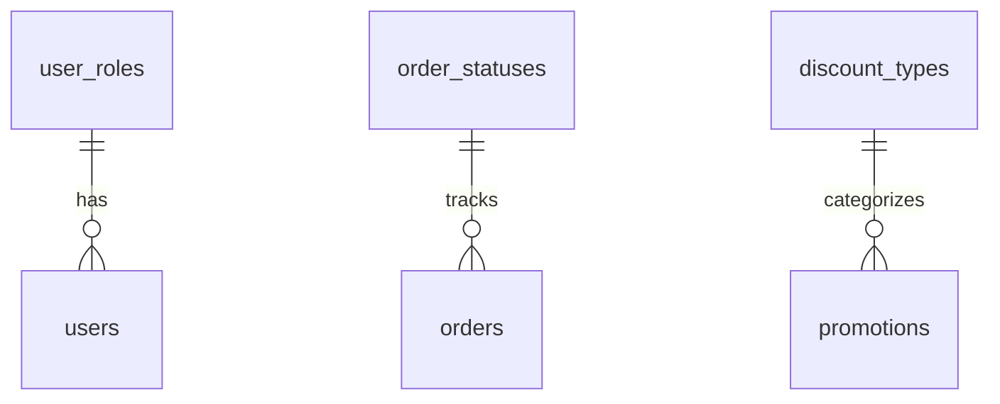
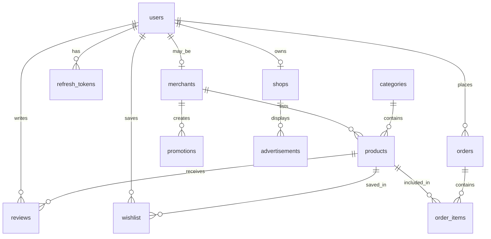
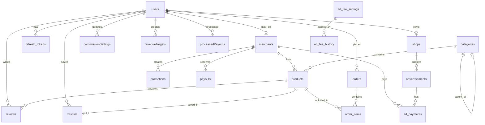

# Database Design Specification (データベース設計書)

---

## Document Control (ドキュメント管理)

| Attribute | Value |
| :--- | :--- |
| **Document ID** | SKM-DBS-001 |
| **System** | Cosmetics Finder |
| **Phase** | Technical Design |
| **Version** | 2.3 |
| **Created** | 2026-08-03 |
| **Last Updated** | 2026-08-19 |
| **Author** | Lead Database Engineer |
| **Status** | Released (承認済み) |

### Document Revision History

| Version | Date | Author | Description of Changes |
| :--- | :--- | :--- | :--- |
| 1.0 | 2026-08-03 | Lead Database Engineer | Initial technical design specification (新規作成) |
| 1.1 | 2026-08-10 | Lead Database Engineer | Added new fields to advertisements table for approval workflow, payment tracking, and weekly limits |
| 2.0 | 2026-08-14 | Lead Database Engineer | Aligned with REQUIREMENT_SPEC v1.5: UUID primary keys, merchants table, restructured orders, ad fee tables, updated FK relationships |
| 2.1 | 2026-08-17 | Lead Database Engineer | Added commission_settings, revenue_targets, and payouts tables for Commission & Revenue management feature (手数料・売上管理機能テーブル追加) |
| 2.2 | 2026-08-17 | Lead Database Engineer | Added 10 new tables: skin_analyses, skin_analysis_conditions, skin_analysis_recommendations, carts, cart_items, order_status_history, inventory_transactions, review_reports, audit_logs, notifications (AI肌分析・カート・監査・通知テーブル追加) |
| 2.3 | 2026-08-19 | Lead Database Engineer | Aligned with REQUIREMENT_SPEC v2.0: Added duration_days and max_ads to ad_fee_settings, updated ad_fee_history to track duration/max_ads changes, fixed commission rate at 12% (admin cannot adjust) |

---

## 1. Database Overview & Naming Conventions

### 1.1 Database Engine Constraints
* **Primary Database:** PostgreSQL 16+
* **Storage Engine:** PostgreSQL Default Heap Storage with transaction support (ACID compliant).
* **Isolation Level:** Read Committed (Default, ensures prevention of dirty reads while keeping high concurrency).
* **Encoding:** `UTF8` for multi-language compatibility (including Japanese, Myanmar, and English character inputs).
* **Collation:** `C` or `en_US.utf8` for consistent sorting rules.

### 1.2 Naming Conventions
To ensure consistency across the platform, the database adheres to strict snake_case conventions:
* **Tables:** Pluralized, lowercase, separated by underscores (e.g., `products`, `order_items`).
* **Columns:** Lowercase, singular, separated by underscores (e.g., `merchant_id`, `stock_quantity`).
* **Primary Keys:** Standardized as `id` (UUID format for distributed systems). 
* **Foreign Keys:** Named as `<referenced_table_singular>_id` (e.g., `user_id` referencing `users`).
* **Indexes:** Prefixed with `idx_` followed by the table name and columns indexed (e.g., `idx_products_category_id`). Unique indexes use the `uq_` prefix.
* **Constraints:** Prefixed with `chk_` for check constraints, `fk_` for foreign keys, and `pk_` for primary keys.

### 1.3 Timezone & Temporal Configuration
* All datetime columns must use `TIMESTAMP WITH TIME ZONE` (or `TIMESTAMPTZ` in PostgreSQL).
* **Storage Standard:** All timestamps are normalized and stored in **UTC** (Coordinated Universal Time) at the database layer.
* **Application Handling:** The NestJS/Prisma backend is responsible for receiving and querying dates in UTC, while local time zone conversions are performed in the presentation/client layer.
* **Dates without time:** Columns tracking calendar dates without hours/minutes (like order dates) must use the `DATE` type.

### 1.4 ID Strategy
* **Primary Keys:** Use UUID (Universally Unique Identifier) for distributed-friendly, globally unique IDs.
* **Format:** `UUID` type with `DEFAULT gen_random_uuid()` in PostgreSQL.
* **Benefits:** Globally unique, no sequential gaps, native PostgreSQL support, no external dependencies.

---

## 2. Master / Lookup Tables DDL

The lookup tables represent the master data that drives user roles, order statuses, discount types, and other categorical classifications. These tables are enforced via database-level foreign keys to protect data integrity.



### 2.1 SQL DDL Scripts

```sql
-- =========================================================================
-- 1. USER ROLES LOOKUP TABLE
-- =========================================================================
CREATE TABLE user_roles (
    role_id SERIAL,
    role_code VARCHAR(20) NOT NULL,
    role_name VARCHAR(50) NOT NULL,
    description VARCHAR(500),
    is_active BOOLEAN NOT NULL DEFAULT TRUE,
    created_at TIMESTAMP WITH TIME ZONE NOT NULL DEFAULT CURRENT_TIMESTAMP,
    CONSTRAINT pk_user_roles PRIMARY KEY (role_id),
    CONSTRAINT uq_user_roles_role_code UNIQUE (role_code),
    CONSTRAINT uq_user_roles_role_name UNIQUE (role_name)
);

-- =========================================================================
-- 2. ORDER STATUSES LOOKUP TABLE
-- =========================================================================
CREATE TABLE order_statuses (
    status_id SERIAL,
    status_code VARCHAR(30) NOT NULL,
    status_name VARCHAR(50) NOT NULL,
    display_order INTEGER NOT NULL,
    is_terminal_state BOOLEAN NOT NULL DEFAULT FALSE,
    description VARCHAR(500),
    CONSTRAINT pk_order_statuses PRIMARY KEY (status_id),
    CONSTRAINT uq_order_statuses_status_code UNIQUE (status_code),
    CONSTRAINT uq_order_statuses_status_name UNIQUE (status_name)
);

-- =========================================================================
-- 3. DISCOUNT TYPES LOOKUP TABLE
-- =========================================================================
CREATE TABLE discount_types (
    discount_type_id SERIAL,
    type_code VARCHAR(20) NOT NULL,
    type_name VARCHAR(50) NOT NULL,
    is_active BOOLEAN NOT NULL DEFAULT TRUE,
    created_at TIMESTAMP WITH TIME ZONE NOT NULL DEFAULT CURRENT_TIMESTAMP,
    CONSTRAINT pk_discount_types PRIMARY KEY (discount_type_id),
    CONSTRAINT uq_discount_types_type_code UNIQUE (type_code),
    CONSTRAINT uq_discount_types_type_name UNIQUE (type_name)
);
```

### 2.2 DML Master Seeding Scripts

```sql
-- Seed User Roles
INSERT INTO user_roles (role_code, role_name, description, is_active) VALUES
('buyer', 'Buyer', 'End user who browses and purchases products', TRUE),
('merchant', 'Merchant', 'Seller who lists products on the marketplace', TRUE),
('admin', 'Admin', 'Platform administrator with full access', TRUE);

-- Seed Order Statuses (Workflow lifecycle tracking)
INSERT INTO order_statuses (status_code, status_name, display_order, is_terminal_state, description) VALUES
('placed', 'Placed', 1, FALSE, 'Order created, awaiting confirmation'),
('confirmed', 'Confirmed', 2, FALSE, 'Merchant accepted order'),
('packed', 'Packed', 3, FALSE, 'Order packed and ready to ship'),
('shipped', 'Shipped', 4, FALSE, 'Order sent to courier'),
('out_for_delivery', 'Out for Delivery', 5, FALSE, 'Order on the way to buyer'),
('delivered', 'Delivered', 6, TRUE, 'Buyer received order');

-- Seed Discount Types
INSERT INTO discount_types (type_code, type_name, is_active) VALUES
('percentage', 'Percentage Discount', TRUE),
('fixed', 'Fixed Amount Discount', TRUE);
```

---

## 3. Core Entity Tables DDL & Structural Integrity

Transactional entities handle user credentials, products, orders, reviews, wishlists, shops, promotions, and advertisements. The relationships are designed to prevent orphan records while keeping clear histories.



### 3.1 Users Table (`users` - ユーザーマスタ)
Manages system user information with role-based access.

#### Data Dictionary
| No (項番) | Logical Name (論理名) | Physical Name (物理名) | Data Type & Length (データ型・桁数) | PK | FK | Nullable (NULL許容) | Default Value (初期値) | Constraints & Remarks (制約・備考) |
|---|---|---|---|---|---|---|---|---|
| 1 | ユーザーID | `id` | UUID | Y | - | N | gen_random_uuid() | Primary key. UUID format. |
| 2 | メールアドレス | `email` | VARCHAR(255) | - | - | N | - | Unique key (`uq_users_email`). Used as login ID. |
| 3 | パスワードハッシュ | `password_hash` | VARCHAR(255) | - | - | N | - | Encrypted password hash (Argon2) for authentication. |
| 4 | フルネーム | `name` | VARCHAR(255) | - | - | N | - | Full name of the user. |
| 5 | ロール | `role` | VARCHAR(20) | - | - | N | 'buyer' | User role (buyer, merchant, admin, super_admin). |
| 6 | 出品者ID | `merchant_id` | UUID | - | Y | Y | NULL | Foreign key (`fk_users_merchant`). References `merchants(id)`. ON DELETE SET NULL ON UPDATE CASCADE. |
| 7 | 電話番号 | `phone` | VARCHAR(20) | - | - | Y | NULL | Contact phone number. |
| 8 | アバターURL | `avatar_url` | TEXT | - | - | Y | NULL | Profile picture URL. |
| 9 | 有効フラグ | `is_active` | BOOLEAN | - | - | N | TRUE | Account active (TRUE) or inactive (FALSE) status. |
| 10 | メール認証済み | `email_verified` | BOOLEAN | - | - | N | FALSE | Email verification status. |
| 11 | 作成日時 | `created_at` | TIMESTAMPTZ | - | - | N | CURRENT_TIMESTAMP | Record creation timestamp. |
| 12 | 更新日時 | `updated_at` | TIMESTAMPTZ | - | - | N | CURRENT_TIMESTAMP | Record last modification timestamp. |

#### Reference SQL DDL
```sql
CREATE TABLE users (
    id UUID PRIMARY KEY DEFAULT gen_random_uuid(),
    email VARCHAR(255) NOT NULL,
    password_hash VARCHAR(255) NOT NULL,
    name VARCHAR(255) NOT NULL,
    role VARCHAR(20) NOT NULL DEFAULT 'buyer',
    merchant_id UUID,
    phone VARCHAR(20),
    avatar_url TEXT,
    is_active BOOLEAN NOT NULL DEFAULT TRUE,
    email_verified BOOLEAN NOT NULL DEFAULT FALSE,
    created_at TIMESTAMP WITH TIME ZONE NOT NULL DEFAULT CURRENT_TIMESTAMP,
    updated_at TIMESTAMP WITH TIME ZONE NOT NULL DEFAULT CURRENT_TIMESTAMP,
    CONSTRAINT uq_users_email UNIQUE (email),
    CONSTRAINT chk_users_role CHECK (role IN ('buyer', 'merchant', 'admin', 'super_admin')),
    CONSTRAINT fk_users_merchant FOREIGN KEY (merchant_id)
        REFERENCES merchants(id) ON DELETE SET NULL ON UPDATE CASCADE
);
```

---

### 3.2 Merchants Table (`merchants` - 出品者テーブル)
Manages merchant profiles with license verification and approval workflow.

#### Data Dictionary
| No (項番) | Logical Name (論理名) | Physical Name (物理名) | Data Type & Length (データ型・桁数) | PK | FK | Nullable (NULL許容) | Default Value (初期値) | Constraints & Remarks (制約・備考) |
|---|---|---|---|---|---|---|---|---|
| 1 | 出品者ID | `id` | UUID | Y | - | N | gen_random_uuid() | Primary key. UUID format. |
| 2 | ユーザーID | `user_id` | UUID | - | Y | N | - | Unique key (`uq_merchants_user_id`). References `users(id)`. ON DELETE CASCADE ON UPDATE CASCADE. |
| 3 | 店舗名 | `shop_name` | VARCHAR(255) | - | - | N | - | Merchant shop display name. |
| 4 | 事業許可証URL | `business_license_url` | TEXT | - | - | N | - | URL to uploaded business license document. |
| 5 | 許可状態 | `license_status` | VARCHAR(20) | - | - | N | 'pending' | License verification status: pending/approved/rejected. |
| 6 | 却下理由 | `rejection_reason` | TEXT | - | - | Y | NULL | Reason for license rejection. |
| 7 | レビュー日時 | `reviewed_at` | TIMESTAMPTZ | - | - | Y | NULL | Admin review timestamp. |
| 8 | レビュー者ID | `reviewed_by` | UUID | - | Y | Y | NULL | Foreign key (`fk_merchants_reviewed_by`). References `users(id)`. ON DELETE SET NULL ON UPDATE CASCADE. |
| 9 | 許可証有効期限 | `license_expires_at` | TIMESTAMPTZ | - | - | Y | NULL | Business license expiration date. |
| 10 | 作成日時 | `created_at` | TIMESTAMPTZ | - | - | N | CURRENT_TIMESTAMP | Record creation timestamp. |
| 11 | 更新日時 | `updated_at` | TIMESTAMPTZ | - | - | N | CURRENT_TIMESTAMP | Record last modification timestamp. |

#### Reference SQL DDL
```sql
CREATE TABLE merchants (
    id UUID PRIMARY KEY DEFAULT gen_random_uuid(),
    user_id UUID NOT NULL,
    shop_name VARCHAR(255) NOT NULL,
    business_license_url TEXT NOT NULL,
    license_status VARCHAR(20) NOT NULL DEFAULT 'pending',
    rejection_reason TEXT,
    reviewed_at TIMESTAMP WITH TIME ZONE,
    reviewed_by UUID,
    license_expires_at TIMESTAMP WITH TIME ZONE,
    created_at TIMESTAMP WITH TIME ZONE NOT NULL DEFAULT CURRENT_TIMESTAMP,
    updated_at TIMESTAMP WITH TIME ZONE NOT NULL DEFAULT CURRENT_TIMESTAMP,
    CONSTRAINT uq_merchants_user_id UNIQUE (user_id),
    CONSTRAINT chk_merchants_license_status CHECK (license_status IN ('pending', 'approved', 'rejected')),
    CONSTRAINT fk_merchants_user FOREIGN KEY (user_id)
        REFERENCES users(id) ON DELETE CASCADE ON UPDATE CASCADE,
    CONSTRAINT fk_merchants_reviewed_by FOREIGN KEY (reviewed_by)
        REFERENCES users(id) ON DELETE SET NULL ON UPDATE CASCADE
);
```

---

### 3.3 Refresh Tokens Table (`refresh_tokens` - リフレッシュトークンテーブル)
Manages JWT refresh tokens for session management.

#### Data Dictionary
| No (項番) | Logical Name (論理名) | Physical Name (物理名) | Data Type & Length (データ型・桁数) | PK | FK | Nullable (NULL許容) | Default Value (初期値) | Constraints & Remarks (制約・備考) |
|---|---|---|---|---|---|---|---|---|
| 1 | リフレッシュトークンID | `id` | UUID | Y | - | N | gen_random_uuid() | Primary key. UUID format. |
| 2 | ユーザーID | `user_id` | UUID | - | Y | N | - | Foreign key (`fk_refresh_tokens_user`). References `users(id)`. ON DELETE CASCADE ON UPDATE CASCADE. |
| 3 | トークンハッシュ | `token_hash` | VARCHAR(255) | - | - | N | - | Hashed refresh token value. |
| 4 | ファミリー | `family` | VARCHAR(255) | - | - | N | - | Token family for breach detection. |
| 5 | デバイス情報 | `device_info` | JSONB | - | - | Y | NULL | Device metadata (User-Agent parsing). |
| 6 | IPアドレス | `ip_address` | VARCHAR(50) | - | - | Y | NULL | Client IP address. |
| 7 | 無効化フラグ | `is_revoked` | BOOLEAN | - | - | N | FALSE | Token revocation status. |
| 8 | 絶対期限 | `absolute_limit_at` | TIMESTAMPTZ | - | - | N | - | Hard session cap (90 days). |
| 9 | 有効期限 | `expires_at` | TIMESTAMPTZ | - | - | N | - | Token expiration timestamp. |
| 10 | 作成日時 | `created_at` | TIMESTAMPTZ | - | - | N | CURRENT_TIMESTAMP | Record creation timestamp. |

#### Reference SQL DDL
```sql
CREATE TABLE refresh_tokens (
    id UUID PRIMARY KEY DEFAULT gen_random_uuid(),
    user_id UUID NOT NULL,
    token_hash VARCHAR(255) NOT NULL,
    family VARCHAR(255) NOT NULL,
    device_info JSONB,
    ip_address VARCHAR(50),
    is_revoked BOOLEAN NOT NULL DEFAULT FALSE,
    absolute_limit_at TIMESTAMP WITH TIME ZONE NOT NULL,
    expires_at TIMESTAMP WITH TIME ZONE NOT NULL,
    created_at TIMESTAMP WITH TIME ZONE NOT NULL DEFAULT CURRENT_TIMESTAMP,
    CONSTRAINT fk_refresh_tokens_user FOREIGN KEY (user_id)
        REFERENCES users(id) ON DELETE CASCADE ON UPDATE CASCADE
);
```

---

### 3.4 Categories Table (`categories` - カテゴリテーブル)
Manages product categories with hierarchical tree structure.

#### Data Dictionary
| No (項番) | Logical Name (論理名) | Physical Name (物理名) | Data Type & Length (データ型・桁数) | PK | FK | Nullable (NULL許容) | Default Value (初期値) | Constraints & Remarks (制約・備考) |
|---|---|---|---|---|---|---|---|---|
| 1 | カテゴリID | `id` | UUID | Y | - | N | gen_random_uuid() | Primary key. UUID format. |
| 2 | カテゴリ名 | `name` | VARCHAR(255) | - | - | N | - | Category display name. |
| 3 | スラッグ | `slug` | VARCHAR(255) | - | - | N | - | Unique key (`uq_categories_slug`). URL-friendly identifier. |
| 4 | 親カテゴリID | `parent_id` | UUID | - | Y | Y | NULL | Self-referencing foreign key for tree structure. ON DELETE SET NULL ON UPDATE CASCADE. |
| 5 | アイコンURL | `icon_url` | TEXT | - | - | Y | NULL | Category icon image URL. |
| 6 | ソート順 | `sort_order` | INTEGER | - | - | N | 0 | Display ordering within parent category. |
| 7 | 作成日時 | `created_at` | TIMESTAMPTZ | - | - | N | CURRENT_TIMESTAMP | Record creation timestamp. |

#### Reference SQL DDL
```sql
CREATE TABLE categories (
    id UUID PRIMARY KEY DEFAULT gen_random_uuid(),
    name VARCHAR(255) NOT NULL,
    slug VARCHAR(255) NOT NULL,
    parent_id UUID,
    icon_url TEXT,
    sort_order INTEGER NOT NULL DEFAULT 0,
    created_at TIMESTAMP WITH TIME ZONE NOT NULL DEFAULT CURRENT_TIMESTAMP,
    CONSTRAINT uq_categories_slug UNIQUE (slug),
    CONSTRAINT fk_categories_parent FOREIGN KEY (parent_id)
        REFERENCES categories(id) ON DELETE SET NULL ON UPDATE CASCADE
);
```

---

### 3.5 Products Table (`products` - 商品テーブル)
Manages skincare product listings by merchants.

#### Data Dictionary
| No (項番) | Logical Name (論理名) | Physical Name (物理名) | Data Type & Length (データ型・桁数) | PK | FK | Nullable (NULL許容) | Default Value (初期値) | Constraints & Remarks (制約・備考) |
|---|---|---|---|---|---|---|---|---|
| 1 | 商品ID | `id` | UUID | Y | - | N | gen_random_uuid() | Primary key. UUID format. |
| 2 | 出品者ID | `merchant_id` | UUID | - | Y | N | - | Foreign key (`fk_products_merchant`). References `merchants(id)`. ON DELETE CASCADE ON UPDATE CASCADE. |
| 3 | カテゴリID | `category_id` | UUID | - | Y | N | - | Foreign key (`fk_products_category`). References `categories(id)`. ON DELETE RESTRICT ON UPDATE CASCADE. |
| 4 | 商品名 | `name` | VARCHAR(255) | - | - | N | - | Product display name. |
| 5 | スラッグ | `slug` | VARCHAR(255) | - | - | N | - | Unique key (`uq_products_slug`). URL-friendly identifier. |
| 6 | 説明 | `description` | TEXT | - | - | Y | NULL | Detailed product description. |
| 7 | 短い説明 | `short_description` | VARCHAR(500) | - | - | Y | NULL | Brief product summary. |
| 8 | 価格 | `price` | DECIMAL(10,2) | - | - | N | - | Check constraint: `price > 0`. |
| 9 | 比較価格 | `compare_at_price` | DECIMAL(10,2) | - | - | Y | NULL | Original price for discount display. |
| 10 | SKU | `sku` | VARCHAR(100) | - | - | Y | NULL | Unique key (`uq_products_sku`). Stock Keeping Unit. |
| 11 | 在庫数 | `stock_quantity` | INTEGER | - | - | N | 0 | Check constraint: `stock_quantity >= 0`. |
| 12 | 低在庫閾値 | `low_stock_threshold` | INTEGER | - | - | N | 10 | Low stock warning threshold. |
| 13 | 画像URLs | `images` | TEXT[] | - | - | N | '{}' | Array of product image URLs. |
| 14 | タグ | `tags` | TEXT[] | - | - | N | '{}' | Product tags for search/filter. |
| 15 | 肌タイプ | `skin_types` | TEXT[] | - | - | N | '{}' | Compatible skin types. |
| 16 | 成分 | `ingredients` | TEXT[] | - | - | N | '{}' | Product ingredients list. |
| 17 | 有効フラグ | `is_active` | BOOLEAN | - | - | N | TRUE | Product visibility status. |
| 18 | おすすめフラグ | `is_featured` | BOOLEAN | - | - | N | FALSE | Featured product flag. |
| 19 | 平均評価 | `avg_rating` | DECIMAL(3,2) | - | - | N | 0 | Auto-calculated average rating. |
| 20 | レビュー数 | `review_count` | INTEGER | - | - | N | 0 | Auto-calculated review count. |
| 21 | 作成日時 | `created_at` | TIMESTAMPTZ | - | - | N | CURRENT_TIMESTAMP | Record creation timestamp. |
| 22 | 更新日時 | `updated_at` | TIMESTAMPTZ | - | - | N | CURRENT_TIMESTAMP | Record last modification timestamp. |

#### Reference SQL DDL
```sql
CREATE TABLE products (
    id UUID PRIMARY KEY DEFAULT gen_random_uuid(),
    merchant_id UUID NOT NULL,
    category_id UUID NOT NULL,
    name VARCHAR(255) NOT NULL,
    slug VARCHAR(255) NOT NULL,
    description TEXT,
    short_description VARCHAR(500),
    price DECIMAL(10, 2) NOT NULL,
    compare_at_price DECIMAL(10, 2),
    sku VARCHAR(100),
    stock_quantity INTEGER NOT NULL DEFAULT 0,
    low_stock_threshold INTEGER NOT NULL DEFAULT 10,
    images TEXT[] DEFAULT '{}',
    tags TEXT[] DEFAULT '{}',
    skin_types TEXT[] DEFAULT '{}',
    ingredients TEXT[] DEFAULT '{}',
    is_active BOOLEAN NOT NULL DEFAULT TRUE,
    is_featured BOOLEAN NOT NULL DEFAULT FALSE,
    avg_rating DECIMAL(3, 2) DEFAULT 0,
    review_count INTEGER DEFAULT 0,
    created_at TIMESTAMP WITH TIME ZONE NOT NULL DEFAULT CURRENT_TIMESTAMP,
    updated_at TIMESTAMP WITH TIME ZONE NOT NULL DEFAULT CURRENT_TIMESTAMP,
    CONSTRAINT uq_products_slug UNIQUE (slug),
    CONSTRAINT uq_products_sku UNIQUE (sku),
    CONSTRAINT chk_products_price CHECK (price > 0),
    CONSTRAINT chk_products_stock CHECK (stock_quantity >= 0),
    CONSTRAINT fk_products_merchant FOREIGN KEY (merchant_id)
        REFERENCES merchants(id) ON DELETE CASCADE ON UPDATE CASCADE,
    CONSTRAINT fk_products_category FOREIGN KEY (category_id)
        REFERENCES categories(id) ON DELETE RESTRICT ON UPDATE CASCADE
);
```

---

### 3.6 Reviews Table (`reviews` - レビューテーブル)
Manages product reviews with ratings.

#### Data Dictionary
| No (項番) | Logical Name (論理名) | Physical Name (物理名) | Data Type & Length (データ型・桁数) | PK | FK | Nullable (NULL許容) | Default Value (初期値) | Constraints & Remarks (制約・備考) |
|---|---|---|---|---|---|---|---|---|
| 1 | レビューID | `id` | UUID | Y | - | N | gen_random_uuid() | Primary key. UUID format. |
| 2 | ユーザーID | `user_id` | UUID | - | Y | N | - | Foreign key (`fk_reviews_user`). References `users(id)`. ON DELETE CASCADE ON UPDATE CASCADE. |
| 3 | 商品ID | `product_id` | UUID | - | Y | N | - | Foreign key (`fk_reviews_product`). References `products(id)`. ON DELETE CASCADE ON UPDATE CASCADE. |
| 4 | 評価 | `rating` | INTEGER | - | - | N | - | Check constraint: `rating >= 1 AND rating <= 5`. |
| 5 | タイトル | `title` | VARCHAR(255) | - | - | Y | NULL | Review title. |
| 6 | 本文 | `body` | TEXT | - | - | Y | NULL | Review content. |
| 7 | 画像URLs | `images` | TEXT[] | - | - | N | '{}' | Review image URLs. |
| 8 | 認証済み購入 | `is_verified_purchase` | BOOLEAN | - | - | N | FALSE | Verified purchase flag. |
| 9 | 承認済み | `is_approved` | BOOLEAN | - | - | N | TRUE | Admin moderation status. |
| 10 | 作成日時 | `created_at` | TIMESTAMPTZ | - | - | N | CURRENT_TIMESTAMP | Record creation timestamp. |
| 11 | 更新日時 | `updated_at` | TIMESTAMPTZ | - | - | N | CURRENT_TIMESTAMP | Record last modification timestamp. |

#### Reference SQL DDL
```sql
CREATE TABLE reviews (
    id UUID PRIMARY KEY DEFAULT gen_random_uuid(),
    user_id UUID NOT NULL,
    product_id UUID NOT NULL,
    rating INTEGER NOT NULL,
    title VARCHAR(255),
    body TEXT,
    images TEXT[] DEFAULT '{}',
    is_verified_purchase BOOLEAN NOT NULL DEFAULT FALSE,
    is_approved BOOLEAN NOT NULL DEFAULT TRUE,
    created_at TIMESTAMP WITH TIME ZONE NOT NULL DEFAULT CURRENT_TIMESTAMP,
    updated_at TIMESTAMP WITH TIME ZONE NOT NULL DEFAULT CURRENT_TIMESTAMP,
    CONSTRAINT uq_reviews_user_product UNIQUE (user_id, product_id),
    CONSTRAINT chk_reviews_rating CHECK (rating >= 1 AND rating <= 5),
    CONSTRAINT fk_reviews_user FOREIGN KEY (user_id)
        REFERENCES users(id) ON DELETE CASCADE ON UPDATE CASCADE,
    CONSTRAINT fk_reviews_product FOREIGN KEY (product_id)
        REFERENCES products(id) ON DELETE CASCADE ON UPDATE CASCADE
);
```

---

### 3.7 Wishlist Table (`wishlist` - お気に入りテーブル)
Manages user's saved products.

#### Data Dictionary
| No (項番) | Logical Name (論理名) | Physical Name (物理名) | Data Type & Length (データ型・桁数) | PK | FK | Nullable (NULL許容) | Default Value (初期値) | Constraints & Remarks (制約・備考) |
|---|---|---|---|---|---|---|---|---|
| 1 | お気に入りID | `id` | UUID | Y | - | N | gen_random_uuid() | Primary key. UUID format. |
| 2 | ユーザーID | `user_id` | UUID | - | Y | N | - | Foreign key (`fk_wishlist_user`). References `users(id)`. ON DELETE CASCADE ON UPDATE CASCADE. |
| 3 | 商品ID | `product_id` | UUID | - | Y | N | - | Foreign key (`fk_wishlist_product`). References `products(id)`. ON DELETE CASCADE ON UPDATE CASCADE. |
| 4 | 作成日時 | `created_at` | TIMESTAMPTZ | - | - | N | CURRENT_TIMESTAMP | Record creation timestamp. |

#### Reference SQL DDL
```sql
CREATE TABLE wishlist (
    id UUID PRIMARY KEY DEFAULT gen_random_uuid(),
    user_id UUID NOT NULL,
    product_id UUID NOT NULL,
    created_at TIMESTAMP WITH TIME ZONE NOT NULL DEFAULT CURRENT_TIMESTAMP,
    CONSTRAINT uq_wishlist_user_product UNIQUE (user_id, product_id),
    CONSTRAINT fk_wishlist_user FOREIGN KEY (user_id)
        REFERENCES users(id) ON DELETE CASCADE ON UPDATE CASCADE,
    CONSTRAINT fk_wishlist_product FOREIGN KEY (product_id)
        REFERENCES products(id) ON DELETE CASCADE ON UPDATE CASCADE
);
```

---

### 3.8 Orders Table (`orders` - 注文テーブル)
Manages customer order information.

#### Data Dictionary
| No (項番) | Logical Name (論理名) | Physical Name (物理名) | Data Type & Length (データ型・桁数) | PK | FK | Nullable (NULL許容) | Default Value (初期値) | Constraints & Remarks (制約・備考) |
|---|---|---|---|---|---|---|---|---|
| 1 | 注文ID | `id` | UUID | Y | - | N | gen_random_uuid() | Primary key. UUID format. |
| 2 | 購入者ID | `buyer_id` | UUID | - | Y | N | - | Foreign key (`fk_orders_buyer`). References `users(id)`. ON DELETE RESTRICT ON UPDATE CASCADE. |
| 3 | 出品者ID | `merchant_id` | UUID | - | Y | N | - | Foreign key (`fk_orders_merchant`). References `merchants(id)`. ON DELETE RESTRICT ON UPDATE CASCADE. |
| 4 | ステータス | `status` | VARCHAR(30) | - | - | N | 'placed' | Order status (placed, confirmed, packed, shipped, out_for_delivery, delivered). |
| 5 | 合計金額 | `total_amount` | DECIMAL(10,2) | - | - | N | - | Check constraint: `total_amount > 0`. |
| 6 | 配送先住所 | `shipping_address` | JSONB | - | - | N | - | Shipping address details (JSON). |
| 7 | 決済方法 | `payment_method` | VARCHAR(50) | - | - | N | - | Payment method used. |
| 8 | 決済ステータス | `payment_status` | VARCHAR(20) | - | - | N | 'pending' | Payment processing status (pending, completed, failed, refunded). |
| 9 | クーポンコード | `coupon_code` | VARCHAR(50) | - | - | Y | NULL | Applied coupon code. |
| 10 | 割引金額 | `discount_amount` | DECIMAL(10,2) | - | - | N | 0 | Discount amount applied. |
| 11 | 備考 | `notes` | TEXT | - | - | Y | NULL | Order notes from customer. |
| 12 | 作成日時 | `created_at` | TIMESTAMPTZ | - | - | N | CURRENT_TIMESTAMP | Record creation timestamp. |
| 13 | 更新日時 | `updated_at` | TIMESTAMPTZ | - | - | N | CURRENT_TIMESTAMP | Record last modification timestamp. |

#### Reference SQL DDL
```sql
CREATE TABLE orders (
    id UUID PRIMARY KEY DEFAULT gen_random_uuid(),
    buyer_id UUID NOT NULL,
    merchant_id UUID NOT NULL,
    status VARCHAR(30) NOT NULL DEFAULT 'placed',
    total_amount DECIMAL(10, 2) NOT NULL,
    shipping_address JSONB NOT NULL,
    payment_method VARCHAR(50) NOT NULL,
    payment_status VARCHAR(20) NOT NULL DEFAULT 'pending',
    coupon_code VARCHAR(50),
    discount_amount DECIMAL(10, 2) DEFAULT 0,
    notes TEXT,
    created_at TIMESTAMP WITH TIME ZONE NOT NULL DEFAULT CURRENT_TIMESTAMP,
    updated_at TIMESTAMP WITH TIME ZONE NOT NULL DEFAULT CURRENT_TIMESTAMP,
    CONSTRAINT chk_orders_total CHECK (total_amount > 0),
    CONSTRAINT chk_orders_status CHECK (status IN ('placed', 'confirmed', 'packed', 'shipped', 'out_for_delivery', 'delivered')),
    CONSTRAINT chk_orders_payment_status CHECK (payment_status IN ('pending', 'completed', 'failed', 'refunded')),
    CONSTRAINT fk_orders_buyer FOREIGN KEY (buyer_id)
        REFERENCES users(id) ON DELETE RESTRICT ON UPDATE CASCADE,
    CONSTRAINT fk_orders_merchant FOREIGN KEY (merchant_id)
        REFERENCES merchants(id) ON DELETE RESTRICT ON UPDATE CASCADE
);
```

---

### 3.9 Order Items Table (`order_items` - 注文商品テーブル)
Manages individual items within an order.

#### Data Dictionary
| No (項番) | Logical Name (論理名) | Physical Name (物理名) | Data Type & Length (データ型・桁数) | PK | FK | Nullable (NULL許容) | Default Value (初期値) | Constraints & Remarks (制約・備考) |
|---|---|---|---|---|---|---|---|---|
| 1 | 注文商品ID | `id` | UUID | Y | - | N | gen_random_uuid() | Primary key. UUID format. |
| 2 | 注文ID | `order_id` | UUID | - | Y | N | - | Foreign key (`fk_order_items_order`). References `orders(id)`. ON DELETE CASCADE ON UPDATE CASCADE. |
| 3 | 商品ID | `product_id` | UUID | - | Y | N | - | Foreign key (`fk_order_items_product`). References `products(id)`. ON DELETE RESTRICT ON UPDATE CASCADE. |
| 4 | 出品者ID | `merchant_id` | UUID | - | Y | N | - | Foreign key (`fk_order_items_merchant`). References `merchants(id)`. ON DELETE RESTRICT ON UPDATE CASCADE. |
| 5 | 数量 | `quantity` | INTEGER | - | - | N | - | Check constraint: `quantity > 0`. |
| 6 | 単価 | `unit_price` | DECIMAL(10,2) | - | - | N | - | Price at time of order. |
| 7 | 合計金額 | `total_price` | DECIMAL(10,2) | - | - | N | - | Check constraint: `total_price > 0`. |

#### Reference SQL DDL
```sql
CREATE TABLE order_items (
    id UUID PRIMARY KEY DEFAULT gen_random_uuid(),
    order_id UUID NOT NULL,
    product_id UUID NOT NULL,
    merchant_id UUID NOT NULL,
    quantity INTEGER NOT NULL,
    unit_price DECIMAL(10, 2) NOT NULL,
    total_price DECIMAL(10, 2) NOT NULL,
    CONSTRAINT chk_order_items_quantity CHECK (quantity > 0),
    CONSTRAINT chk_order_items_total CHECK (total_price > 0),
    CONSTRAINT fk_order_items_order FOREIGN KEY (order_id)
        REFERENCES orders(id) ON DELETE CASCADE ON UPDATE CASCADE,
    CONSTRAINT fk_order_items_product FOREIGN KEY (product_id)
        REFERENCES products(id) ON DELETE RESTRICT ON UPDATE CASCADE,
    CONSTRAINT fk_order_items_merchant FOREIGN KEY (merchant_id)
        REFERENCES merchants(id) ON DELETE RESTRICT ON UPDATE CASCADE
);
```

---

### 3.10 Shops Table (`shops` - 店舗テーブル)
Manages merchant shop profiles.

#### Data Dictionary
| No (項番) | Logical Name (論理名) | Physical Name (物理名) | Data Type & Length (データ型・桁数) | PK | FK | Nullable (NULL許容) | Default Value (初期値) | Constraints & Remarks (制約・備考) |
|---|---|---|---|---|---|---|---|---|
| 1 | 店舗ID | `id` | UUID | Y | - | N | gen_random_uuid() | Primary key. UUID format. |
| 2 | ユーザーID | `user_id` | UUID | - | Y | N | - | Unique key (`uq_shops_user_id`). References `users(id)`. ON DELETE CASCADE ON UPDATE CASCADE. |
| 3 | 店舗名 | `name` | VARCHAR(255) | - | - | N | - | Shop display name. |
| 4 | スラッグ | `slug` | VARCHAR(255) | - | - | N | - | Unique key (`uq_shops_slug`). URL-friendly identifier. |
| 5 | 説明 | `description` | TEXT | - | - | Y | NULL | Shop description. |
| 6 | ロゴURL | `logo_url` | TEXT | - | - | Y | NULL | Shop logo image URL. |
| 7 | バナーURL | `banner_url` | TEXT | - | - | Y | NULL | Shop banner image URL. |
| 8 | 住所 | `address` | TEXT | - | - | Y | NULL | Physical shop address. |
| 9 | 電話番号 | `phone` | VARCHAR(20) | - | - | Y | NULL | Shop contact phone. |
| 10 | メール | `email` | VARCHAR(255) | - | - | Y | NULL | Shop contact email. |
| 11 | 緯度 | `latitude` | DECIMAL(10,7) | - | - | Y | NULL | GPS latitude for shop finder. |
| 12 | 経度 | `longitude` | DECIMAL(10,7) | - | - | Y | NULL | GPS longitude for shop finder. |
| 13 | 承認済み | `is_approved` | BOOLEAN | - | - | N | FALSE | Admin approval status. |
| 14 | 作成日時 | `created_at` | TIMESTAMPTZ | - | - | N | CURRENT_TIMESTAMP | Record creation timestamp. |
| 15 | 更新日時 | `updated_at` | TIMESTAMPTZ | - | - | N | CURRENT_TIMESTAMP | Record last modification timestamp. |

#### Reference SQL DDL
```sql
CREATE TABLE shops (
    id UUID PRIMARY KEY DEFAULT gen_random_uuid(),
    user_id UUID NOT NULL,
    name VARCHAR(255) NOT NULL,
    slug VARCHAR(255) NOT NULL,
    description TEXT,
    logo_url TEXT,
    banner_url TEXT,
    address TEXT,
    phone VARCHAR(20),
    email VARCHAR(255),
    latitude DECIMAL(10, 7),
    longitude DECIMAL(10, 7),
    is_approved BOOLEAN NOT NULL DEFAULT FALSE,
    created_at TIMESTAMP WITH TIME ZONE NOT NULL DEFAULT CURRENT_TIMESTAMP,
    updated_at TIMESTAMP WITH TIME ZONE NOT NULL DEFAULT CURRENT_TIMESTAMP,
    CONSTRAINT uq_shops_user_id UNIQUE (user_id),
    CONSTRAINT uq_shops_slug UNIQUE (slug),
    CONSTRAINT fk_shops_user FOREIGN KEY (user_id)
        REFERENCES users(id) ON DELETE CASCADE ON UPDATE CASCADE
);
```

---

### 3.11 Promotions Table (`promotions` - プロモーションテーブル)
Manages discount codes and promotions.

#### Data Dictionary
| No (項番) | Logical Name (論理名) | Physical Name (物理名) | Data Type & Length (データ型・桁数) | PK | FK | Nullable (NULL許容) | Default Value (初期値) | Constraints & Remarks (制約・備考) |
|---|---|---|---|---|---|---|---|---|
| 1 | プロモーションID | `id` | UUID | Y | - | N | gen_random_uuid() | Primary key. UUID format. |
| 2 | 出品者ID | `merchant_id` | UUID | - | Y | N | - | Foreign key (`fk_promotions_merchant`). References `merchants(id)`. ON DELETE CASCADE ON UPDATE CASCADE. |
| 3 | クーポンコード | `code` | VARCHAR(50) | - | - | N | - | Unique key (`uq_promotions_code`). Discount code. |
| 4 | 説明 | `description` | TEXT | - | - | Y | NULL | Promotion description. |
| 5 | 割引タイプ | `discount_type` | VARCHAR(20) | - | - | N | - | Enum type: 'percentage' or 'fixed'. |
| 6 | 割引値 | `discount_value` | DECIMAL(10,2) | - | - | N | - | Check constraint: `discount_value > 0`. |
| 7 | 最低注文金額 | `min_order_amount` | DECIMAL(10,2) | - | - | Y | NULL | Minimum order amount for discount. |
| 8 | 最大使用数 | `max_uses` | INTEGER | - | - | Y | NULL | Maximum times this code can be used. |
| 9 | 使用回数 | `used_count` | INTEGER | - | - | N | 0 | Current usage count. |
| 10 | 開始日時 | `starts_at` | TIMESTAMPTZ | - | - | N | - | Promotion start timestamp. |
| 11 | 終了日時 | `expires_at` | TIMESTAMPTZ | - | - | N | - | Promotion end timestamp. |
| 12 | 有効フラグ | `is_active` | BOOLEAN | - | - | N | TRUE | Promotion active status. |
| 13 | 作成日時 | `created_at` | TIMESTAMPTZ | - | - | N | CURRENT_TIMESTAMP | Record creation timestamp. |

#### Reference SQL DDL
```sql
CREATE TABLE promotions (
    id UUID PRIMARY KEY DEFAULT gen_random_uuid(),
    merchant_id UUID NOT NULL,
    code VARCHAR(50) NOT NULL,
    description TEXT,
    discount_type VARCHAR(20) NOT NULL,
    discount_value DECIMAL(10, 2) NOT NULL,
    min_order_amount DECIMAL(10, 2),
    max_uses INTEGER,
    used_count INTEGER NOT NULL DEFAULT 0,
    starts_at TIMESTAMP WITH TIME ZONE NOT NULL,
    expires_at TIMESTAMP WITH TIME ZONE NOT NULL,
    is_active BOOLEAN NOT NULL DEFAULT TRUE,
    created_at TIMESTAMP WITH TIME ZONE NOT NULL DEFAULT CURRENT_TIMESTAMP,
    CONSTRAINT uq_promotions_code UNIQUE (code),
    CONSTRAINT chk_promotions_discount_type CHECK (discount_type IN ('percentage', 'fixed')),
    CONSTRAINT chk_promotions_discount_value CHECK (discount_value > 0),
    CONSTRAINT chk_promotions_dates CHECK (expires_at > starts_at),
    CONSTRAINT fk_promotions_merchant FOREIGN KEY (merchant_id)
        REFERENCES merchants(id) ON DELETE CASCADE ON UPDATE CASCADE
);
```

---

### 3.12 Advertisements Table (`advertisements` - 広告テーブル)
Manages shop advertisements with approval workflow, payment tracking, and weekly limits.

#### Data Dictionary
| No (項番) | Logical Name (論理名) | Physical Name (物理名) | Data Type & Length (データ型・桁数) | PK | FK | Nullable (NULL許容) | Default Value (初期値) | Constraints & Remarks (制約・備考) |
|---|---|---|---|---|---|---|---|---|
| 1 | 広告ID | `id` | UUID | Y | - | N | gen_random_uuid() | Primary key. UUID format. |
| 2 | 店舗ID | `shop_id` | UUID | - | Y | N | - | Foreign key (`fk_advertisements_shop`). References `shops(id)`. ON DELETE CASCADE ON UPDATE CASCADE. |
| 3 | タイトル | `title` | VARCHAR(255) | - | - | N | - | Advertisement title. |
| 4 | 内容 | `content` | TEXT | - | - | Y | NULL | Advertisement content/description. |
| 5 | 告知メッセージ | `announcement_message` | VARCHAR(500) | - | - | N | - | Banner announcement message. |
| 6 | 画像URL | `image_url` | TEXT | - | - | Y | NULL | Advertisement image URL. |
| 7 | リンクURL | `link_url` | TEXT | - | - | Y | NULL | Click-through link URL. |
| 8 | 有効フラグ | `is_active` | BOOLEAN | - | - | N | TRUE | Advertisement active status. |
| 9 | 承認状態 | `approval_status` | VARCHAR(20) | - | - | N | 'pending' | Approval status: pending/approved/rejected. |
| 10 | 支払い状態 | `payment_status` | VARCHAR(20) | - | - | N | 'pending' | Payment status: pending/completed/refunded/failed. |
| 11 | 支払い金額 | `payment_amount` | DECIMAL(10,2) | - | - | Y | NULL | Advertising fee amount. |
| 12 | 支払い参照番号 | `payment_reference` | VARCHAR(255) | - | - | Y | NULL | Payment transaction reference. |
| 13 | 承認者ID | `approved_by` | UUID | - | Y | Y | NULL | Foreign key (`fk_advertisements_approved_by`). References `users(id)`. ON DELETE SET NULL ON UPDATE CASCADE. |
| 14 | 承認日時 | `approved_at` | TIMESTAMPTZ | - | - | Y | NULL | Approval/rejection timestamp. |
| 15 | 却下理由 | `rejection_reason` | TEXT | - | - | Y | NULL | Reason for rejection. |
| 16 | 週番号 | `week_number` | INTEGER | - | - | N | - | ISO week number for limit tracking. |
| 17 | 開始日時 | `starts_at` | TIMESTAMPTZ | - | - | N | - | Advertisement start timestamp. |
| 18 | 終了日時 | `expires_at` | TIMESTAMPTZ | - | - | N | - | Advertisement end timestamp. |
| 19 | 作成日時 | `created_at` | TIMESTAMPTZ | - | - | N | CURRENT_TIMESTAMP | Record creation timestamp. |

#### Reference SQL DDL
```sql
CREATE TABLE advertisements (
    id UUID PRIMARY KEY DEFAULT gen_random_uuid(),
    shop_id UUID NOT NULL,
    title VARCHAR(255) NOT NULL,
    content TEXT,
    announcement_message VARCHAR(500) NOT NULL,
    image_url TEXT,
    link_url TEXT,
    is_active BOOLEAN NOT NULL DEFAULT TRUE,
    approval_status VARCHAR(20) NOT NULL DEFAULT 'pending',
    payment_status VARCHAR(20) NOT NULL DEFAULT 'pending',
    payment_amount DECIMAL(10,2),
    payment_reference VARCHAR(255),
    approved_by UUID,
    approved_at TIMESTAMP WITH TIME ZONE,
    rejection_reason TEXT,
    week_number INTEGER NOT NULL,
    starts_at TIMESTAMP WITH TIME ZONE NOT NULL,
    expires_at TIMESTAMP WITH TIME ZONE NOT NULL,
    created_at TIMESTAMP WITH TIME ZONE NOT NULL DEFAULT CURRENT_TIMESTAMP,
    CONSTRAINT chk_advertisements_dates CHECK (expires_at > starts_at),
    CONSTRAINT chk_advertisements_approval_status CHECK (approval_status IN ('pending', 'approved', 'rejected')),
    CONSTRAINT chk_advertisements_payment_status CHECK (payment_status IN ('pending', 'completed', 'refunded', 'failed')),
    CONSTRAINT fk_advertisements_shop FOREIGN KEY (shop_id)
        REFERENCES shops(id) ON DELETE CASCADE ON UPDATE CASCADE,
    CONSTRAINT fk_advertisements_approved_by FOREIGN KEY (approved_by)
        REFERENCES users(id) ON DELETE SET NULL ON UPDATE CASCADE
);

---

### 3.13 Ad Fee Settings Table (`ad_fee_settings` - 広告料金設定テーブル)
Manages advertising fee rates by placement and tier, including package duration and slot limits.

#### Data Dictionary
| No (項番) | Logical Name (論理名) | Physical Name (物理名) | Data Type & Length (データ型・桁数) | PK | FK | Nullable (NULL許容) | Default Value (初期値) | Constraints & Remarks (制約・備考) |
|---|---|---|---|---|---|---|---|---|
| 1 | 設定ID | `id` | UUID | Y | - | N | gen_random_uuid() | Primary key. UUID format. |
| 2 | 配置場所 | `placement` | VARCHAR(50) | - | - | N | - | Ad placement location (homepage_slider, product_sidebar, category_banner, search_top). |
| 3 | ティア | `tier` | VARCHAR(20) | - | - | N | - | Pricing tier (basic, standard, premium). |
| 4 | 日額料金 | `daily_rate` | DECIMAL(10,2) | - | - | N | - | Daily advertising rate. |
| 5 | 期間（日数） | `duration_days` | INTEGER | - | - | N | - | Ad duration in days for this placement. Check: `duration_days > 0`. |
| 6 | 最大広告数 | `max_ads` | INTEGER | - | - | N | - | Maximum ads allowed for this placement. Check: `max_ads > 0`. |
| 7 | 有効フラグ | `is_active` | BOOLEAN | - | - | N | TRUE | Setting active status. |
| 8 | 作成日時 | `created_at` | TIMESTAMPTZ | - | - | N | CURRENT_TIMESTAMP | Record creation timestamp. |
| 9 | 更新日時 | `updated_at` | TIMESTAMPTZ | - | - | N | CURRENT_TIMESTAMP | Record last modification timestamp. |

#### Reference SQL DDL
```sql
CREATE TABLE ad_fee_settings (
    id UUID PRIMARY KEY DEFAULT gen_random_uuid(),
    placement VARCHAR(50) NOT NULL,
    tier VARCHAR(20) NOT NULL,
    daily_rate DECIMAL(10,2) NOT NULL,
    duration_days INTEGER NOT NULL,
    max_ads INTEGER NOT NULL,
    is_active BOOLEAN NOT NULL DEFAULT TRUE,
    created_at TIMESTAMP WITH TIME ZONE NOT NULL DEFAULT CURRENT_TIMESTAMP,
    updated_at TIMESTAMP WITH TIME ZONE NOT NULL DEFAULT CURRENT_TIMESTAMP,
    CONSTRAINT uq_ad_fee_settings_placement_tier UNIQUE (placement, tier),
    CONSTRAINT chk_ad_fee_settings_duration CHECK (duration_days > 0),
    CONSTRAINT chk_ad_fee_settings_max_ads CHECK (max_ads > 0)
);
```

#### Default Fee Settings
| Placement | Basic | Standard | Premium | Duration | Max Ads |
|-----------|-------|----------|---------|----------|---------|
| Homepage Slider | $3.00/day | $5.00/day | $8.00/day | 7 Days | 1 |
| Product Page Sidebar | $2.00/day | $3.50/day | $6.00/day | 15 Days | 3 |
| Category Banner | $2.50/day | $4.00/day | $7.00/day | 30 Days | 5 |
| Search Results Top | $1.50/day | $2.50/day | $5.00/day | 7 Days | 6 |

---

### 3.14 Ad Payments Table (`ad_payments` - 広告支払いテーブル)
Manages payment transactions for advertisements.

#### Data Dictionary
| No (項番) | Logical Name (論理名) | Physical Name (物理名) | Data Type & Length (データ型・桁数) | PK | FK | Nullable (NULL許容) | Default Value (初期値) | Constraints & Remarks (制約・備考) |
|---|---|---|---|---|---|---|---|---|
| 1 | 支払いID | `id` | UUID | Y | - | N | gen_random_uuid() | Primary key. UUID format. |
| 2 | 広告ID | `ad_id` | UUID | - | Y | N | - | Foreign key (`fk_ad_payments_ad`). References `advertisements(id)`. ON DELETE CASCADE ON UPDATE CASCADE. |
| 3 | 出品者ID | `merchant_id` | UUID | - | Y | N | - | Foreign key (`fk_ad_payments_merchant`). References `merchants(id)`. ON DELETE RESTRICT ON UPDATE CASCADE. |
| 4 | 金額 | `amount` | DECIMAL(10,2) | - | - | N | - | Payment amount. |
| 5 | 決済方法 | `payment_method` | VARCHAR(50) | - | - | N | - | Payment method used. |
| 6 | 支払い状態 | `payment_status` | VARCHAR(20) | - | - | N | 'pending' | Payment status: pending/completed/refunded/failed. |
| 7 | トランザクションID | `transaction_id` | VARCHAR(255) | - | - | Y | NULL | External payment transaction ID. |
| 8 | 支払日時 | `paid_at` | TIMESTAMPTZ | - | - | Y | NULL | Payment completion timestamp. |
| 9 | 返金額 | `refund_amount` | DECIMAL(10,2) | - | - | Y | NULL | Refund amount if applicable. |
| 10 | 返金理由 | `refund_reason` | TEXT | - | - | Y | NULL | Reason for refund. |
| 11 | 返金日時 | `refunded_at` | TIMESTAMPTZ | - | - | Y | NULL | Refund processing timestamp. |
| 12 | 作成日時 | `created_at` | TIMESTAMPTZ | - | - | N | CURRENT_TIMESTAMP | Record creation timestamp. |
| 13 | 更新日時 | `updated_at` | TIMESTAMPTZ | - | - | N | CURRENT_TIMESTAMP | Record last modification timestamp. |

#### Reference SQL DDL
```sql
CREATE TABLE ad_payments (
    id UUID PRIMARY KEY DEFAULT gen_random_uuid(),
    ad_id UUID NOT NULL,
    merchant_id UUID NOT NULL,
    amount DECIMAL(10,2) NOT NULL,
    payment_method VARCHAR(50) NOT NULL,
    payment_status VARCHAR(20) NOT NULL DEFAULT 'pending',
    transaction_id VARCHAR(255),
    paid_at TIMESTAMP WITH TIME ZONE,
    refund_amount DECIMAL(10,2),
    refund_reason TEXT,
    refunded_at TIMESTAMP WITH TIME ZONE,
    created_at TIMESTAMP WITH TIME ZONE NOT NULL DEFAULT CURRENT_TIMESTAMP,
    updated_at TIMESTAMP WITH TIME ZONE NOT NULL DEFAULT CURRENT_TIMESTAMP,
    CONSTRAINT chk_ad_payments_payment_status CHECK (payment_status IN ('pending', 'completed', 'refunded', 'failed')),
    CONSTRAINT fk_ad_payments_ad FOREIGN KEY (ad_id)
        REFERENCES advertisements(id) ON DELETE CASCADE ON UPDATE CASCADE,
    CONSTRAINT fk_ad_payments_merchant FOREIGN KEY (merchant_id)
        REFERENCES merchants(id) ON DELETE RESTRICT ON UPDATE CASCADE
);
```

---

### 3.15 Ad Fee History Table (`ad_fee_history` - 広告料金履歴テーブル)
Tracks changes to advertising fee settings over time.

#### Data Dictionary
| No (項番) | Logical Name (論理名) | Physical Name (物理名) | Data Type & Length (データ型・桁数) | PK | FK | Nullable (NULL許容) | Default Value (初期値) | Constraints & Remarks (制約・備考) |
|---|---|---|---|---|---|---|---|---|
| 1 | 履歴ID | `id` | UUID | Y | - | N | gen_random_uuid() | Primary key. UUID format. |
| 2 | 料金設定ID | `ad_fee_setting_id` | UUID | - | Y | N | - | Foreign key (`fk_ad_fee_history_setting`). References `ad_fee_settings(id)`. ON DELETE CASCADE ON UPDATE CASCADE. |
| 3 | 旧日額料金 | `old_daily_rate` | DECIMAL(10,2) | - | - | Y | NULL | Previous daily rate (NULL for initial creation). |
| 4 | 新日額料金 | `new_daily_rate` | DECIMAL(10,2) | - | - | N | - | New daily rate after change. |
| 5 | 旧期間（日数） | `old_duration_days` | INTEGER | - | - | Y | NULL | Previous duration in days (NULL for initial creation). |
| 6 | 新期間（日数） | `new_duration_days` | INTEGER | - | - | N | - | New duration in days after change. |
| 7 | 旧最大広告数 | `old_max_ads` | INTEGER | - | - | Y | NULL | Previous max ads (NULL for initial creation). |
| 8 | 新最大広告数 | `new_max_ads` | INTEGER | - | - | N | - | New max ads after change. |
| 9 | 変更者ID | `changed_by` | UUID | - | Y | N | - | Foreign key (`fk_ad_fee_history_changed_by`). References `users(id)`. ON DELETE RESTRICT ON UPDATE CASCADE. |
| 10 | 変更理由 | `change_reason` | TEXT | - | - | Y | NULL | Reason for fee change. |
| 11 | 適用開始日時 | `effective_from` | TIMESTAMPTZ | - | - | N | - | When the new rate takes effect. |
| 12 | 作成日時 | `created_at` | TIMESTAMPTZ | - | - | N | CURRENT_TIMESTAMP | Record creation timestamp. |

#### Reference SQL DDL
```sql
CREATE TABLE ad_fee_history (
    id UUID PRIMARY KEY DEFAULT gen_random_uuid(),
    ad_fee_setting_id UUID NOT NULL,
    old_daily_rate DECIMAL(10,2),
    new_daily_rate DECIMAL(10,2) NOT NULL,
    old_duration_days INTEGER,
    new_duration_days INTEGER NOT NULL,
    old_max_ads INTEGER,
    new_max_ads INTEGER NOT NULL,
    changed_by UUID NOT NULL,
    change_reason TEXT,
    effective_from TIMESTAMP WITH TIME ZONE NOT NULL,
    created_at TIMESTAMP WITH TIME ZONE NOT NULL DEFAULT CURRENT_TIMESTAMP,
    CONSTRAINT fk_ad_fee_history_setting FOREIGN KEY (ad_fee_setting_id)
        REFERENCES ad_fee_settings(id) ON DELETE CASCADE ON UPDATE CASCADE,
    CONSTRAINT fk_ad_fee_history_changed_by FOREIGN KEY (changed_by)
        REFERENCES users(id) ON DELETE RESTRICT ON UPDATE CASCADE
);
```

#### Fee History Rules
- Fee changes do not affect already-paid advertisements
- New fees apply only to ads created after the change effective date
- All fee changes are logged in `ad_fee_history`
- Admin can view fee change history with timestamps and reasons

---

### 3.16 Commission Settings Table (`commission_settings` - 手数料設定テーブル)
Manages platform commission rate settings. **Commission rate is fixed at 12% and cannot be adjusted by admin.**

#### Data Dictionary
| No (項番) | Logical Name (論理名) | Physical Name (物理名) | Data Type & Length (データ型・桁数) | PK | FK | Nullable (NULL許容) | Default Value (初期値) | Constraints & Remarks (制約・備考) |
|---|---|---|---|---|---|---|---|---|
| 1 | 設定ID | `id` | UUID | Y | - | N | gen_random_uuid() | Primary key. UUID format. |
| 2 | 手数料率 | `commission_rate` | DECIMAL(5,2) | - | - | N | 12.00 | Fixed commission rate (12%). **Admin cannot adjust.** Check: `commission_rate = 12`. |
| 3 | 更新者ID | `updated_by` | UUID | - | Y | Y | NULL | Foreign key (`fk_commission_settings_updated_by`). References `users(id)`. ON DELETE SET NULL ON UPDATE CASCADE. |
| 4 | 更新日時 | `updated_at` | TIMESTAMPTZ | - | - | N | CURRENT_TIMESTAMP | Record last modification timestamp. |
| 5 | 作成日時 | `created_at` | TIMESTAMPTZ | - | - | N | CURRENT_TIMESTAMP | Record creation timestamp. |

#### Reference SQL DDL
```sql
CREATE TABLE commission_settings (
    id UUID PRIMARY KEY DEFAULT gen_random_uuid(),
    commission_rate DECIMAL(5,2) NOT NULL DEFAULT 12.00,
    updated_by UUID,
    updated_at TIMESTAMP WITH TIME ZONE NOT NULL DEFAULT CURRENT_TIMESTAMP,
    created_at TIMESTAMP WITH TIME ZONE NOT NULL DEFAULT CURRENT_TIMESTAMP,
    CONSTRAINT chk_commission_settings_rate CHECK (commission_rate = 12),
    CONSTRAINT fk_commission_settings_updated_by FOREIGN KEY (updated_by)
        REFERENCES users(id) ON DELETE SET NULL ON UPDATE CASCADE
);
```

#### Commission Settings Rules
- **Commission rate is fixed at 12% and cannot be changed**
- Only one commission rate configuration should exist
- Commission is calculated as: `Order Total × 12%`
- Admin can view commission settings but cannot modify the rate

---

### 3.17 Revenue Targets Table (`revenue_targets` - 売上目標テーブル)
Manages revenue targets for platform performance tracking.

#### Data Dictionary
| No (項番) | Logical Name (論理名) | Physical Name (物理名) | Data Type & Length (データ型・桁数) | PK | FK | Nullable (NULL許容) | Default Value (初期値) | Constraints & Remarks (制約・備考) |
|---|---|---|---|---|---|---|---|---|
| 1 | 目標ID | `id` | UUID | Y | - | N | gen_random_uuid() | Primary key. UUID format. |
| 2 | 目標金額 | `target_amount` | DECIMAL(12,2) | - | - | N | - | Revenue target amount. Check: `target_amount > 0`. |
| 3 | 期間 | `period` | VARCHAR(20) | - | - | N | - | Target period: 'monthly' or 'quarterly'. |
| 4 | 有効フラグ | `is_active` | BOOLEAN | - | - | N | TRUE | Target active status. |
| 5 | 作成者ID | `created_by` | UUID | - | Y | Y | NULL | Foreign key (`fk_revenue_targets_created_by`). References `users(id)`. ON DELETE SET NULL ON UPDATE CASCADE. |
| 6 | 更新日時 | `updated_at` | TIMESTAMPTZ | - | - | N | CURRENT_TIMESTAMP | Record last modification timestamp. |
| 7 | 作成日時 | `created_at` | TIMESTAMPTZ | - | - | N | CURRENT_TIMESTAMP | Record creation timestamp. |

#### Reference SQL DDL
```sql
CREATE TABLE revenue_targets (
    id UUID PRIMARY KEY DEFAULT gen_random_uuid(),
    target_amount DECIMAL(12,2) NOT NULL,
    period VARCHAR(20) NOT NULL,
    is_active BOOLEAN NOT NULL DEFAULT TRUE,
    created_by UUID,
    updated_at TIMESTAMP WITH TIME ZONE NOT NULL DEFAULT CURRENT_TIMESTAMP,
    created_at TIMESTAMP WITH TIME ZONE NOT NULL DEFAULT CURRENT_TIMESTAMP,
    CONSTRAINT chk_revenue_targets_amount CHECK (target_amount > 0),
    CONSTRAINT chk_revenue_targets_period CHECK (period IN ('monthly', 'quarterly')),
    CONSTRAINT uq_revenue_targets_period_active UNIQUE (period, is_active),
    CONSTRAINT fk_revenue_targets_created_by FOREIGN KEY (created_by)
        REFERENCES users(id) ON DELETE SET NULL ON UPDATE CASCADE
);
```

#### Revenue Target Rules
- Only one active target per period (monthly or quarterly) is allowed
- Target achievement is calculated as: (actual revenue / target amount) × 100%
- Revenue data is aggregated from `order_items` table (total_price column)
- Admin can set and update revenue targets via the Commission & Revenue management page

---

### 3.18 Payouts Table (`payouts` - 出金テーブル)
Manages merchant payout transactions with commission and advertising fee deductions.

#### Data Dictionary
| No (項番) | Logical Name (論理名) | Physical Name (物理名) | Data Type & Length (データ型・桁数) | PK | FK | Nullable (NULL許容) | Default Value (初期値) | Constraints & Remarks (制約・備考) |
|---|---|---|---|---|---|---|---|---|
| 1 | 出金ID | `id` | UUID | Y | - | N | gen_random_uuid() | Primary key. UUID format. |
| 2 | 出品者ID | `merchant_id` | UUID | - | Y | N | - | Foreign key (`fk_payouts_merchant`). References `merchants(id)`. ON DELETE RESTRICT ON UPDATE CASCADE. |
| 3 | 合計金額 | `total_amount` | DECIMAL(12,2) | - | - | N | - | Total payout amount before deductions. |
| 4 | 手数料額 | `commission_amount` | DECIMAL(12,2) | - | - | N | 0 | Platform commission amount deducted. |
| 5 | 広告料額 | `ad_fee_amount` | DECIMAL(12,2) | - | - | N | 0 | Advertising fee amount deducted. |
| 6 | 状態 | `status` | VARCHAR(20) | - | - | N | 'pending' | Payout status: pending/processing/completed/failed. |
| 7 | 処理者ID | `processed_by` | UUID | - | Y | Y | NULL | Foreign key (`fk_payouts_processed_by`). References `users(id)`. ON DELETE SET NULL ON UPDATE CASCADE. |
| 8 | 処理日時 | `processed_at` | TIMESTAMPTZ | - | - | Y | NULL | Payout processing timestamp. |
| 9 | 失敗理由 | `failure_reason` | TEXT | - | - | Y | NULL | Reason for payout failure. |
| 10 | 幂等性キー | `idempotency_key` | VARCHAR(255) | - | - | Y | NULL | Unique key for idempotent operations. |
| 11 | 作成日時 | `created_at` | TIMESTAMPTZ | - | - | N | CURRENT_TIMESTAMP | Record creation timestamp. |
| 12 | 更新日時 | `updated_at` | TIMESTAMPTZ | - | - | N | CURRENT_TIMESTAMP | Record last modification timestamp. |

#### Reference SQL DDL
```sql
CREATE TABLE payouts (
    id UUID PRIMARY KEY DEFAULT gen_random_uuid(),
    merchant_id UUID NOT NULL,
    total_amount DECIMAL(12,2) NOT NULL,
    commission_amount DECIMAL(12,2) NOT NULL DEFAULT 0,
    ad_fee_amount DECIMAL(12,2) NOT NULL DEFAULT 0,
    status VARCHAR(20) NOT NULL DEFAULT 'pending',
    processed_by UUID,
    processed_at TIMESTAMP WITH TIME ZONE,
    failure_reason TEXT,
    idempotency_key VARCHAR(255),
    created_at TIMESTAMP WITH TIME ZONE NOT NULL DEFAULT CURRENT_TIMESTAMP,
    updated_at TIMESTAMP WITH TIME ZONE NOT NULL DEFAULT CURRENT_TIMESTAMP,
    CONSTRAINT chk_payouts_status CHECK (status IN ('pending', 'processing', 'completed', 'failed')),
    CONSTRAINT chk_payouts_amounts CHECK (total_amount > 0 AND commission_amount >= 0 AND ad_fee_amount >= 0),
    CONSTRAINT uq_payouts_idempotency_key UNIQUE (idempotency_key),
    CONSTRAINT fk_payouts_merchant FOREIGN KEY (merchant_id)
        REFERENCES merchants(id) ON DELETE RESTRICT ON UPDATE CASCADE,
    CONSTRAINT fk_payouts_processed_by FOREIGN KEY (processed_by)
        REFERENCES users(id) ON DELETE SET NULL ON UPDATE CASCADE
);
```

#### Payout Processing Rules
- Payout calculation: `net_payout = total_amount - commission_amount - ad_fee_amount`
- Commission amount is calculated using the rate from `commission_settings` table
- Ad fee amounts are aggregated from `ad_payments` table for the merchant
- Idempotency key ensures duplicate payouts are not processed
- Payout status transitions: pending → processing → completed/failed
- Failed payouts include a failure_reason for debugging
- Admin can process payouts via the Commission & Revenue management page

---

### 3.19 Skin Analyses Table (`skin_analyses` - AI肌分析テーブル)
Stores AI skin analysis results for users.

#### Data Dictionary
| No (項番) | Logical Name (論理名) | Physical Name (物理名) | Data Type & Length (データ型・桁数) | PK | FK | Nullable (NULL許容) | Default Value (初期値) | Constraints & Remarks (制約・備考) |
|---|---|---|---|---|---|---|---|---|
| 1 | 分析ID | `id` | UUID | Y | - | N | gen_random_uuid() | Primary key. UUID format. |
| 2 | ユーザーID | `user_id` | UUID | - | Y | N | - | Foreign key (`fk_skin_analyses_user`). References `users(id)`. ON DELETE CASCADE ON UPDATE CASCADE. |
| 3 | 画像URL | `image_url` | TEXT | - | - | N | - | URL of uploaded facial image. |
| 4 | 肌タイプ | `skin_type` | VARCHAR(20) | - | - | Y | NULL | Detected skin type: dry, oily, combination, sensitive, normal. |
| 5 | 推定年齢 | `estimated_age` | INTEGER | - | - | Y | NULL | AI-estimated age (optional). |
| 6 | 分析状態 | `analysis_status` | VARCHAR(20) | - | - | N | 'pending' | Analysis status: pending, processing, completed, failed. |
| 7 | AIモデル | `ai_model` | VARCHAR(100) | - | - | Y | NULL | AI model identifier. |
| 8 | AIモデルバージョン | `ai_model_version` | VARCHAR(50) | - | - | Y | NULL | AI model version. |
| 9 | 作成日時 | `created_at` | TIMESTAMPTZ | - | - | N | CURRENT_TIMESTAMP | Record creation timestamp. |
| 10 | 完了日時 | `completed_at` | TIMESTAMPTZ | - | - | Y | NULL | Analysis completion timestamp. |
| 11 | 更新日時 | `updated_at` | TIMESTAMPTZ | - | - | N | CURRENT_TIMESTAMP | Record last modification timestamp. |

#### Reference SQL DDL
```sql
CREATE TABLE skin_analyses (
    id UUID PRIMARY KEY DEFAULT gen_random_uuid(),
    user_id UUID NOT NULL,
    image_url TEXT NOT NULL,
    skin_type VARCHAR(20),
    estimated_age INTEGER,
    analysis_status VARCHAR(20) NOT NULL DEFAULT 'pending',
    ai_model VARCHAR(100),
    ai_model_version VARCHAR(50),
    created_at TIMESTAMP WITH TIME ZONE NOT NULL DEFAULT CURRENT_TIMESTAMP,
    completed_at TIMESTAMP WITH TIME ZONE,
    updated_at TIMESTAMP WITH TIME ZONE NOT NULL DEFAULT CURRENT_TIMESTAMP,
    CONSTRAINT chk_skin_analyses_status CHECK (analysis_status IN ('pending', 'processing', 'completed', 'failed')),
    CONSTRAINT chk_skin_analyses_skin_type CHECK (skin_type IN ('dry', 'oily', 'combination', 'sensitive', 'normal')),
    CONSTRAINT fk_skin_analyses_user FOREIGN KEY (user_id)
        REFERENCES users(id) ON DELETE CASCADE ON UPDATE CASCADE
);
```

---

### 3.20 Skin Analysis Conditions Table (`skin_analysis_conditions` - AI肌分析条件テーブル)
Stores detected skin conditions from AI analysis.

#### Data Dictionary
| No (項番) | Logical Name (論理名) | Physical Name (物理名) | Data Type & Length (データ型・桁数) | PK | FK | Nullable (NULL許容) | Default Value (初期値) | Constraints & Remarks (制約・備考) |
|---|---|---|---|---|---|---|---|---|
| 1 | 条件ID | `id` | UUID | Y | - | N | gen_random_uuid() | Primary key. UUID format. |
| 2 | 分析ID | `analysis_id` | UUID | - | Y | N | - | Foreign key (`fk_skin_analysis_conditions_analysis`). References `skin_analyses(id)`. ON DELETE CASCADE ON UPDATE CASCADE. |
| 3 | 条件名 | `condition_name` | VARCHAR(100) | - | - | N | - | Condition name (acne, dark_spots, wrinkles, dryness, oiliness, etc.). |
| 4 | 重篤度 | `severity` | VARCHAR(10) | - | - | N | - | Severity level: low, medium, high. |
| 5 | 信頼度 | `confidence` | DECIMAL(5,2) | - | - | N | - | AI confidence score: 0.00 to 1.00. |
| 6 | 作成日時 | `created_at` | TIMESTAMPTZ | - | - | N | CURRENT_TIMESTAMP | Record creation timestamp. |

#### Reference SQL DDL
```sql
CREATE TABLE skin_analysis_conditions (
    id UUID PRIMARY KEY DEFAULT gen_random_uuid(),
    analysis_id UUID NOT NULL,
    condition_name VARCHAR(100) NOT NULL,
    severity VARCHAR(10) NOT NULL,
    confidence DECIMAL(5,2) NOT NULL,
    created_at TIMESTAMP WITH TIME ZONE NOT NULL DEFAULT CURRENT_TIMESTAMP,
    CONSTRAINT chk_skin_analysis_conditions_severity CHECK (severity IN ('low', 'medium', 'high')),
    CONSTRAINT chk_skin_analysis_conditions_confidence CHECK (confidence >= 0 AND confidence <= 1),
    CONSTRAINT fk_skin_analysis_conditions_analysis FOREIGN KEY (analysis_id)
        REFERENCES skin_analyses(id) ON DELETE CASCADE ON UPDATE CASCADE
);
```

---

### 3.21 Skin Analysis Recommendations Table (`skin_analysis_recommendations` - AI肌分析推薦テーブル)
Stores product recommendations from AI analysis.

#### Data Dictionary
| No (項番) | Logical Name (論理名) | Physical Name (物理名) | Data Type & Length (データ型・桁数) | PK | FK | Nullable (NULL許容) | Default Value (初期値) | Constraints & Remarks (制約・備考) |
|---|---|---|---|---|---|---|---|---|
| 1 | 推薦ID | `id` | UUID | Y | - | N | gen_random_uuid() | Primary key. UUID format. |
| 2 | 分析ID | `analysis_id` | UUID | - | Y | N | - | Foreign key (`fk_skin_analysis_recommendations_analysis`). References `skin_analyses(id)`. ON DELETE CASCADE ON UPDATE CASCADE. |
| 3 | 商品ID | `product_id` | UUID | - | Y | N | - | Foreign key (`fk_skin_analysis_recommendations_product`). References `products(id)`. ON DELETE CASCADE ON UPDATE CASCADE. |
| 4 | 理由 | `reason` | TEXT | - | - | N | - | Recommendation reason. |
| 5 | マッチスコア | `match_score` | INTEGER | - | - | N | - | Match score: 0 to 100. |
| 6 | 表示順序 | `display_order` | INTEGER | - | - | N | 0 | Display order for recommendations. |
| 7 | 作成日時 | `created_at` | TIMESTAMPTZ | - | - | N | CURRENT_TIMESTAMP | Record creation timestamp. |

#### Reference SQL DDL
```sql
CREATE TABLE skin_analysis_recommendations (
    id UUID PRIMARY KEY DEFAULT gen_random_uuid(),
    analysis_id UUID NOT NULL,
    product_id UUID NOT NULL,
    reason TEXT NOT NULL,
    match_score INTEGER NOT NULL,
    display_order INTEGER NOT NULL DEFAULT 0,
    created_at TIMESTAMP WITH TIME ZONE NOT NULL DEFAULT CURRENT_TIMESTAMP,
    CONSTRAINT chk_skin_analysis_recommendations_score CHECK (match_score >= 0 AND match_score <= 100),
    CONSTRAINT fk_skin_analysis_recommendations_analysis FOREIGN KEY (analysis_id)
        REFERENCES skin_analyses(id) ON DELETE CASCADE ON UPDATE CASCADE,
    CONSTRAINT fk_skin_analysis_recommendations_product FOREIGN KEY (product_id)
        REFERENCES products(id) ON DELETE CASCADE ON UPDATE CASCADE
);
```

---

### 3.22 Carts Table (`carts` - カートテーブル)
Stores user shopping carts.

#### Data Dictionary
| No (項番) | Logical Name (論理名) | Physical Name (物理名) | Data Type & Length (データ型・桁数) | PK | FK | Nullable (NULL許容) | Default Value (初期値) | Constraints & Remarks (制約・備考) |
|---|---|---|---|---|---|---|---|---|
| 1 | カートID | `id` | UUID | Y | - | N | gen_random_uuid() | Primary key. UUID format. |
| 2 | ユーザーID | `user_id` | UUID | - | Y | N | - | Foreign key (`fk_carts_user`). References `users(id)`. ON DELETE CASCADE ON UPDATE CASCADE. Unique constraint. |
| 3 | 作成日時 | `created_at` | TIMESTAMPTZ | - | - | N | CURRENT_TIMESTAMP | Record creation timestamp. |
| 4 | 更新日時 | `updated_at` | TIMESTAMPTZ | - | - | N | CURRENT_TIMESTAMP | Record last modification timestamp. |

#### Reference SQL DDL
```sql
CREATE TABLE carts (
    id UUID PRIMARY KEY DEFAULT gen_random_uuid(),
    user_id UUID UNIQUE NOT NULL,
    created_at TIMESTAMP WITH TIME ZONE NOT NULL DEFAULT CURRENT_TIMESTAMP,
    updated_at TIMESTAMP WITH TIME ZONE NOT NULL DEFAULT CURRENT_TIMESTAMP,
    CONSTRAINT fk_carts_user FOREIGN KEY (user_id)
        REFERENCES users(id) ON DELETE CASCADE ON UPDATE CASCADE
);
```

---

### 3.23 Cart Items Table (`cart_items` - カート商品テーブル)
Stores items within a shopping cart.

#### Data Dictionary
| No (項番) | Logical Name (論理名) | Physical Name (物理名) | Data Type & Length (データ型・桁数) | PK | FK | Nullable (NULL許容) | Default Value (初期値) | Constraints & Remarks (制約・備考) |
|---|---|---|---|---|---|---|---|---|
| 1 | カート商品ID | `id` | UUID | Y | - | N | gen_random_uuid() | Primary key. UUID format. |
| 2 | カートID | `cart_id` | UUID | - | Y | N | - | Foreign key (`fk_cart_items_cart`). References `carts(id)`. ON DELETE CASCADE ON UPDATE CASCADE. |
| 3 | 商品ID | `product_id` | UUID | - | Y | N | - | Foreign key (`fk_cart_items_product`). References `products(id)`. ON DELETE CASCADE ON UPDATE CASCADE. |
| 4 | 数量 | `quantity` | INTEGER | - | - | N | 1 | Quantity. Check: `quantity > 0`. |
| 5 | 作成日時 | `created_at` | TIMESTAMPTZ | - | - | N | CURRENT_TIMESTAMP | Record creation timestamp. |
| 6 | 更新日時 | `updated_at` | TIMESTAMPTZ | - | - | N | CURRENT_TIMESTAMP | Record last modification timestamp. |

#### Reference SQL DDL
```sql
CREATE TABLE cart_items (
    id UUID PRIMARY KEY DEFAULT gen_random_uuid(),
    cart_id UUID NOT NULL,
    product_id UUID NOT NULL,
    quantity INTEGER NOT NULL DEFAULT 1,
    created_at TIMESTAMP WITH TIME ZONE NOT NULL DEFAULT CURRENT_TIMESTAMP,
    updated_at TIMESTAMP WITH TIME ZONE NOT NULL DEFAULT CURRENT_TIMESTAMP,
    CONSTRAINT chk_cart_items_quantity CHECK (quantity > 0),
    CONSTRAINT uq_cart_items_cart_product UNIQUE (cart_id, product_id),
    CONSTRAINT fk_cart_items_cart FOREIGN KEY (cart_id)
        REFERENCES carts(id) ON DELETE CASCADE ON UPDATE CASCADE,
    CONSTRAINT fk_cart_items_product FOREIGN KEY (product_id)
        REFERENCES products(id) ON DELETE CASCADE ON UPDATE CASCADE
);
```

---

### 3.24 Order Status History Table (`order_status_history` - 注文ステータス履歴テーブル)
Records all order status transitions for tracking and audit.

#### Data Dictionary
| No (項番) | Logical Name (論理名) | Physical Name (物理名) | Data Type & Length (データ型・桁数) | PK | FK | Nullable (NULL許容) | Default Value (初期値) | Constraints & Remarks (制約・備考) |
|---|---|---|---|---|---|---|---|---|
| 1 | 履歴ID | `id` | UUID | Y | - | N | gen_random_uuid() | Primary key. UUID format. |
| 2 | 注文ID | `order_id` | UUID | - | Y | N | - | Foreign key (`fk_order_status_history_order`). References `orders(id)`. ON DELETE CASCADE ON UPDATE CASCADE. |
| 3 | ステータスID | `status_id` | INTEGER | - | Y | N | - | Foreign key (`fk_order_status_history_status`). References `order_statuses(status_id)`. ON DELETE RESTRICT ON UPDATE CASCADE. |
| 4 | 変更者ID | `changed_by` | UUID | - | Y | Y | NULL | Foreign key (`fk_order_status_history_changed_by`). References `users(id)`. ON DELETE SET NULL ON UPDATE CASCADE. |
| 5 | 備考 | `note` | TEXT | - | - | Y | NULL | Optional note about the status change. |
| 6 | 作成日時 | `created_at` | TIMESTAMPTZ | - | - | N | CURRENT_TIMESTAMP | Record creation timestamp. |

#### Reference SQL DDL
```sql
CREATE TABLE order_status_history (
    id UUID PRIMARY KEY DEFAULT gen_random_uuid(),
    order_id UUID NOT NULL,
    status_id INTEGER NOT NULL,
    changed_by UUID,
    note TEXT,
    created_at TIMESTAMP WITH TIME ZONE NOT NULL DEFAULT CURRENT_TIMESTAMP,
    CONSTRAINT fk_order_status_history_order FOREIGN KEY (order_id)
        REFERENCES orders(id) ON DELETE CASCADE ON UPDATE CASCADE,
    CONSTRAINT fk_order_status_history_status FOREIGN KEY (status_id)
        REFERENCES order_statuses(status_id) ON DELETE RESTRICT ON UPDATE CASCADE,
    CONSTRAINT fk_order_status_history_changed_by FOREIGN KEY (changed_by)
        REFERENCES users(id) ON DELETE SET NULL ON UPDATE CASCADE
);
```

---

### 3.25 Inventory Transactions Table (`inventory_transactions` - 在庫変動テーブル)
Records all inventory changes for audit and tracking.

#### Data Dictionary
| No (項番) | Logical Name (論理名) | Physical Name (物理名) | Data Type & Length (データ型・桁数) | PK | FK | Nullable (NULL許容) | Default Value (初期値) | Constraints & Remarks (制約・備考) |
|---|---|---|---|---|---|---|---|---|
| 1 | 変動ID | `id` | UUID | Y | - | N | gen_random_uuid() | Primary key. UUID format. |
| 2 | 商品ID | `product_id` | UUID | - | Y | N | - | Foreign key (`fk_inventory_transactions_product`). References `products(id)`. ON DELETE RESTRICT ON UPDATE CASCADE. |
| 3 | 出品者ID | `merchant_id` | UUID | - | Y | N | - | Foreign key (`fk_inventory_transactions_merchant`). References `merchants(id)`. ON DELETE RESTRICT ON UPDATE CASCADE. |
| 4 | 変動種別 | `transaction_type` | VARCHAR(30) | - | - | N | - | Transaction type: order_created,  restock, manual_adjustment, return. |
| 5 | 数量 | `quantity` | INTEGER | - | - | N | - | Quantity changed (positive for increase, negative for decrease). |
| 6 | 変動前数量 | `before_quantity` | INTEGER | - | - | N | - | Stock quantity before change. |
| 7 | 変動後数量 | `after_quantity` | INTEGER | - | - | N | - | Stock quantity after change. |
| 8 | 参照種別 | `reference_type` | VARCHAR(50) | - | - | Y | NULL | Related entity type (order, adjustment, etc.). |
| 9 | 参照ID | `reference_id` | UUID | - | - | Y | NULL | Related entity ID. |
| 10 | 理由 | `reason` | TEXT | - | - | Y | NULL | Reason for the inventory change. |
| 11 | 作成者ID | `created_by` | UUID | - | Y | Y | NULL | Foreign key (`fk_inventory_transactions_created_by`). References `users(id)`. ON DELETE SET NULL ON UPDATE CASCADE. |
| 12 | 作成日時 | `created_at` | TIMESTAMPTZ | - | - | N | CURRENT_TIMESTAMP | Record creation timestamp. |

#### Reference SQL DDL
```sql
CREATE TABLE inventory_transactions (
    id UUID PRIMARY KEY DEFAULT gen_random_uuid(),
    product_id UUID NOT NULL,
    merchant_id UUID NOT NULL,
    transaction_type VARCHAR(30) NOT NULL,
    quantity INTEGER NOT NULL,
    before_quantity INTEGER NOT NULL,
    after_quantity INTEGER NOT NULL,
    reference_type VARCHAR(50),
    reference_id UUID,
    reason TEXT,
    created_by UUID,
    created_at TIMESTAMP WITH TIME ZONE NOT NULL DEFAULT CURRENT_TIMESTAMP,
    CONSTRAINT chk_inventory_transactions_type CHECK (transaction_type IN ('order_created', 'restock', 'manual_adjustment', 'return')),
    CONSTRAINT fk_inventory_transactions_product FOREIGN KEY (product_id)
        REFERENCES products(id) ON DELETE RESTRICT ON UPDATE CASCADE,
    CONSTRAINT fk_inventory_transactions_merchant FOREIGN KEY (merchant_id)
        REFERENCES merchants(id) ON DELETE RESTRICT ON UPDATE CASCADE,
    CONSTRAINT fk_inventory_transactions_created_by FOREIGN KEY (created_by)
        REFERENCES users(id) ON DELETE SET NULL ON UPDATE CASCADE
);
```

---

### 3.26 Review Reports Table (`review_reports` - レビュー報告テーブル)
Stores user-reported reviews for moderation.

#### Data Dictionary
| No (項番) | Logical Name (論理名) | Physical Name (物理名) | Data Type & Length (データ型・桁数) | PK | FK | Nullable (NULL許容) | Default Value (初期値) | Constraints & Remarks (制約・備考) |
|---|---|---|---|---|---|---|---|---|
| 1 | 報告ID | `id` | UUID | Y | - | N | gen_random_uuid() | Primary key. UUID format. |
| 2 | レビューID | `review_id` | UUID | - | Y | N | - | Foreign key (`fk_review_reports_review`). References `reviews(id)`. ON DELETE CASCADE ON UPDATE CASCADE. |
| 3 | 報告者ID | `reported_by` | UUID | - | Y | N | - | Foreign key (`fk_review_reports_reported_by`). References `users(id)`. ON DELETE CASCADE ON UPDATE CASCADE. |
| 4 | 理由 | `reason` | VARCHAR(50) | - | - | N | - | Report reason: spam, inappropriate, fake, other. |
| 5 | 説明 | `description` | TEXT | - | - | Y | NULL | Optional description from reporter. |
| 6 | 状態 | `status` | VARCHAR(20) | - | - | N | 'pending' | Report status: pending, reviewed, resolved, rejected. |
| 7 | 管理者メモ | `admin_note` | TEXT | - | - | Y | NULL | Admin note on resolution. |
| 8 | 解決者ID | `resolved_by` | UUID | - | Y | Y | NULL | Foreign key (`fk_review_reports_resolved_by`). References `users(id)`. ON DELETE SET NULL ON UPDATE CASCADE. |
| 9 | 解決日時 | `resolved_at` | TIMESTAMPTZ | - | - | Y | NULL | Resolution timestamp. |
| 10 | 作成日時 | `created_at` | TIMESTAMPTZ | - | - | N | CURRENT_TIMESTAMP | Record creation timestamp. |
| 11 | 更新日時 | `updated_at` | TIMESTAMPTZ | - | - | N | CURRENT_TIMESTAMP | Record last modification timestamp. |

#### Reference SQL DDL
```sql
CREATE TABLE review_reports (
    id UUID PRIMARY KEY DEFAULT gen_random_uuid(),
    review_id UUID NOT NULL,
    reported_by UUID NOT NULL,
    reason VARCHAR(50) NOT NULL,
    description TEXT,
    status VARCHAR(20) NOT NULL DEFAULT 'pending',
    admin_note TEXT,
    resolved_by UUID,
    resolved_at TIMESTAMP WITH TIME ZONE,
    created_at TIMESTAMP WITH TIME ZONE NOT NULL DEFAULT CURRENT_TIMESTAMP,
    updated_at TIMESTAMP WITH TIME ZONE NOT NULL DEFAULT CURRENT_TIMESTAMP,
    CONSTRAINT chk_review_reports_reason CHECK (reason IN ('spam', 'inappropriate', 'fake', 'other')),
    CONSTRAINT chk_review_reports_status CHECK (status IN ('pending', 'reviewed', 'resolved', 'rejected')),
    CONSTRAINT fk_review_reports_review FOREIGN KEY (review_id)
        REFERENCES reviews(id) ON DELETE CASCADE ON UPDATE CASCADE,
    CONSTRAINT fk_review_reports_reported_by FOREIGN KEY (reported_by)
        REFERENCES users(id) ON DELETE CASCADE ON UPDATE CASCADE,
    CONSTRAINT fk_review_reports_resolved_by FOREIGN KEY (resolved_by)
        REFERENCES users(id) ON DELETE SET NULL ON UPDATE CASCADE
);
```

---

### 3.27 Audit Logs Table (`audit_logs` - 監査ログテーブル)
Append-only table for tracking significant system actions.

#### Data Dictionary
| No (項番) | Logical Name (論理名) | Physical Name (物理名) | Data Type & Length (データ型・桁数) | PK | FK | Nullable (NULL許容) | Default Value (初期値) | Constraints & Remarks (制約・備考) |
|---|---|---|---|---|---|---|---|---|
| 1 | ログID | `id` | UUID | Y | - | N | gen_random_uuid() | Primary key. UUID format. |
| 2 | ユーザーID | `user_id` | UUID | - | Y | Y | NULL | Foreign key (`fk_audit_logs_user`). References `users(id)`. ON DELETE SET NULL ON UPDATE CASCADE. |
| 3 | アクション | `action` | VARCHAR(100) | - | - | N | - | Action performed (e.g., merchant.approve, order.status_change). |
| 4 | エンティティ種別 | `entity_type` | VARCHAR(100) | - | - | N | - | Entity type affected (e.g., Merchant, Order, Product). |
| 5 | エンティティID | `entity_id` | UUID | - | - | Y | NULL | ID of the affected record. |
| 6 | 旧値 | `old_value` | JSONB | - | - | Y | NULL | Previous value (for updates). |
| 7 | 新値 | `new_value` | JSONB | - | - | Y | NULL | New value (for creates/updates). |
| 8 | IPアドレス | `ip_address` | VARCHAR(45) | - | - | Y | NULL | Client IP address. |
| 9 | ユーザーエージェント | `user_agent` | TEXT | - | - | Y | NULL | Client user agent string. |
| 10 | 作成日時 | `created_at` | TIMESTAMPTZ | - | - | N | CURRENT_TIMESTAMP | Record creation timestamp. |

#### Reference SQL DDL
```sql
CREATE TABLE audit_logs (
    id UUID PRIMARY KEY DEFAULT gen_random_uuid(),
    user_id UUID,
    action VARCHAR(100) NOT NULL,
    entity_type VARCHAR(100) NOT NULL,
    entity_id UUID,
    old_value JSONB,
    new_value JSONB,
    ip_address VARCHAR(45),
    user_agent TEXT,
    created_at TIMESTAMP WITH TIME ZONE NOT NULL DEFAULT CURRENT_TIMESTAMP,
    CONSTRAINT fk_audit_logs_user FOREIGN KEY (user_id)
        REFERENCES users(id) ON DELETE SET NULL ON UPDATE CASCADE
);
```

#### Audit Log Rules
- Audit logs are append-only (no UPDATE or DELETE allowed)
- Never log passwords, access tokens, refresh tokens, or authentication secrets
- IP address and user agent are optional (for system-generated actions)
- old_value and new_value are JSONB for flexible data capture

---

### 3.28 Notifications Table (`notifications` - 通知テーブル)
Stores in-app notifications for users.

#### Data Dictionary
| No (項番) | Logical Name (論理名) | Physical Name (物理名) | Data Type & Length (データ型・桁数) | PK | FK | Nullable (NULL許容) | Default Value (初期値) | Constraints & Remarks (制約・備考) |
|---|---|---|---|---|---|---|---|---|
| 1 | 通知ID | `id` | UUID | Y | - | N | gen_random_uuid() | Primary key. UUID format. |
| 2 | ユーザーID | `user_id` | UUID | - | Y | N | - | Foreign key (`fk_notifications_user`). References `users(id)`. ON DELETE CASCADE ON UPDATE CASCADE. |
| 3 | 種別 | `type` | VARCHAR(50) | - | - | N | - | Notification type (e.g., merchant.approved, order.shipped). |
| 4 | タイトル | `title` | VARCHAR(255) | - | - | N | - | Notification title. |
| 5 | メッセージ | `message` | TEXT | - | - | N | - | Notification message body. |
| 6 | エンティティ種別 | `entity_type` | VARCHAR(100) | - | - | Y | NULL | Related entity type. |
| 7 | エンティティID | `entity_id` | UUID | - | - | Y | NULL | Related entity ID. |
| 8 | 既読フラグ | `is_read` | BOOLEAN | - | - | N | FALSE | Read status. |
| 9 | 既読日時 | `read_at` | TIMESTAMPTZ | - | - | Y | NULL | Timestamp when notification was read. |
| 10 | 作成日時 | `created_at` | TIMESTAMPTZ | - | - | N | CURRENT_TIMESTAMP | Record creation timestamp. |

#### Reference SQL DDL
```sql
CREATE TABLE notifications (
    id UUID PRIMARY KEY DEFAULT gen_random_uuid(),
    user_id UUID NOT NULL,
    type VARCHAR(50) NOT NULL,
    title VARCHAR(255) NOT NULL,
    message TEXT NOT NULL,
    entity_type VARCHAR(100),
    entity_id UUID,
    is_read BOOLEAN NOT NULL DEFAULT FALSE,
    read_at TIMESTAMP WITH TIME ZONE,
    created_at TIMESTAMP WITH TIME ZONE NOT NULL DEFAULT CURRENT_TIMESTAMP,
    CONSTRAINT fk_notifications_user FOREIGN KEY (user_id)
        REFERENCES users(id) ON DELETE CASCADE ON UPDATE CASCADE
);
```

---

## 4. Performance Optimization Layer (Indexes)

To satisfy non-functional requirement **NFR-001** (page load time ≤ 2 seconds) and optimize lookup times under concurrent access, we define specific B-Tree index structures.

### 4.1 Index Mapping Matrix

| No | Index Physical Name | Target Table | Key Columns | Target Optimization Purpose |
|---|---|---|---|---|
| 1 | `idx_users_email` | `users` | `email` | Optimizes email lookups during login and uniqueness validations. |
| 2 | `idx_users_role` | `users` | `role` | Optimizes user role filtering and permission sorting. |
| 3 | `idx_users_is_active` | `users` | `is_active` | Speeds up lookups filtering active users. |
| 4 | `idx_users_merchant_id` | `users` | `merchant_id` | Optimizes user-merchant relationship lookups. |
| 5 | `idx_refresh_tokens_user_id` | `refresh_tokens` | `user_id` | Speeds up token lookups per user. |
| 6 | `idx_refresh_tokens_family` | `refresh_tokens` | `family` | Optimizes token family tracking for breach detection. |
| 7 | `idx_refresh_tokens_token_hash` | `refresh_tokens` | `token_hash` | Optimizes token verification lookups. |
| 8 | `idx_merchants_user_id` | `merchants` | `user_id` | Optimizes merchant lookups by user. |
| 9 | `idx_merchants_license_status` | `merchants` | `license_status` | Speeds up merchant approval workflow filtering. |
| 10 | `idx_categories_parent_id` | `categories` | `parent_id` | Speeds up category tree traversal. |
| 11 | `idx_categories_slug` | `categories` | `slug` | Optimizes category lookups by URL slug. |
| 12 | `idx_products_merchant_id` | `products` | `merchant_id` | Speeds up merchant's product listings. |
| 13 | `idx_products_category_id` | `products` | `category_id` | Optimizes category-based product filtering. |
| 14 | `idx_products_slug` | `products` | `slug` | Optimizes product lookups by URL slug. |
| 15 | `idx_products_price` | `products` | `price` | Speeds up price-based sorting and filtering. |
| 16 | `idx_products_is_active` | `products` | `is_active` | Optimizes active product filtering. |
| 17 | `idx_products_created_at` | `products` | `created_at` | Speeds up newest product listings. |
| 18 | `idx_reviews_product_id` | `reviews` | `product_id` | Optimizes product review loading. |
| 19 | `idx_reviews_rating` | `reviews` | `rating` | Speeds up rating-based filtering. |
| 20 | `idx_wishlist_user_id` | `wishlist` | `user_id` | Optimizes user wishlist loading. |
| 21 | `idx_orders_buyer_id` | `orders` | `buyer_id` | Speeds up buyer order history. |
| 22 | `idx_orders_merchant_id` | `orders` | `merchant_id` | Optimizes merchant order filtering. |
| 23 | `idx_orders_status` | `orders` | `status` | Optimizes order status filtering. |
| 24 | `idx_orders_created_at` | `orders` | `created_at` | Speeds up order date sorting. |
| 25 | `idx_order_items_order_id` | `order_items` | `order_id` | Optimizes order detail loading. |
| 26 | `idx_order_items_product_id` | `order_items` | `product_id` | Speeds up product order history. |
| 27 | `idx_order_items_merchant_id` | `order_items` | `merchant_id` | Optimizes merchant order filtering. |
| 28 | `idx_shops_user_id` | `shops` | `user_id` | Optimizes shop lookups by user. |
| 29 | `idx_shops_slug` | `shops` | `slug` | Optimizes shop lookups by URL slug. |
| 30 | `idx_shops_is_approved` | `shops` | `is_approved` | Speeds up approved shop filtering. |
| 31 | `idx_promotions_merchant_id` | `promotions` | `merchant_id` | Optimizes merchant promotions loading. |
| 32 | `idx_promotions_code` | `promotions` | `code` | Speeds up coupon code validation. |
| 33 | `idx_promotions_is_active` | `promotions` | `is_active` | Optimizes active promotion filtering. |
| 34 | `idx_promotions_expires_at` | `promotions` | `expires_at` | Speeds up expired promotion cleanup. |
| 35 | `idx_advertisements_shop_id` | `advertisements` | `shop_id` | Optimizes shop advertisement loading. |
| 36 | `idx_advertisements_is_active` | `advertisements` | `is_active` | Speeds up active advertisement filtering. |
| 37 | `idx_advertisements_expires_at` | `advertisements` | `expires_at` | Optimizes expired ad cleanup. |
| 38 | `idx_advertisements_approval_status` | `advertisements` | `approval_status` | Speeds up approval status filtering. |
| 39 | `idx_advertisements_payment_status` | `advertisements` | `payment_status` | Optimizes payment status filtering. |
| 40 | `idx_advertisements_week_number` | `advertisements` | `week_number` | Speeds up weekly ad limit checks. |
| 41 | `idx_ad_payments_ad_id` | `ad_payments` | `ad_id` | Optimizes ad payment lookups. |
| 42 | `idx_ad_payments_merchant_id` | `ad_payments` | `merchant_id` | Speeds up merchant payment history. |
| 43 | `idx_ad_fee_settings_placement_tier` | `ad_fee_settings` | `placement, tier` | Optimizes fee lookups by placement and tier. |
| 44 | `idx_ad_fee_history_setting_id` | `ad_fee_history` | `ad_fee_setting_id` | Speeds up fee history lookups. |
| 45 | `idx_commission_settings_updated_by` | `commission_settings` | `updated_by` | Optimizes commission setting update history lookups. |
| 46 | `idx_revenue_targets_period` | `revenue_targets` | `period` | Speeds up revenue target filtering by period. |
| 47 | `idx_revenue_targets_is_active` | `revenue_targets` | `is_active` | Optimizes active revenue target filtering. |
| 48 | `idx_payouts_merchant_id` | `payouts` | `merchant_id` | Speeds up merchant payout history lookups. |
| 49 | `idx_payouts_status` | `payouts` | `status` | Optimizes payout status filtering. |
| 50 | `idx_payouts_created_at` | `payouts` | `created_at` | Speeds up payout date sorting and filtering. |
| 51 | `idx_skin_analyses_user_id` | `skin_analyses` | `user_id` | Optimizes user analysis history lookups. |
| 52 | `idx_skin_analyses_status` | `skin_analyses` | `analysis_status` | Speeds up analysis status filtering. |
| 53 | `idx_skin_analysis_conditions_analysis_id` | `skin_analysis_conditions` | `analysis_id` | Optimizes condition lookups by analysis. |
| 54 | `idx_skin_analysis_recommendations_analysis_id` | `skin_analysis_recommendations` | `analysis_id` | Speeds up recommendation lookups by analysis. |
| 55 | `idx_skin_analysis_recommendations_product_id` | `skin_analysis_recommendations` | `product_id` | Optimizes product recommendation lookups. |
| 56 | `idx_carts_user_id` | `carts` | `user_id` | Speeds up user cart lookups. |
| 57 | `idx_cart_items_cart_id` | `cart_items` | `cart_id` | Optimizes cart item loading. |
| 58 | `idx_cart_items_product_id` | `cart_items` | `product_id` | Speeds up product cart lookups. |
| 59 | `idx_order_status_history_order_id` | `order_status_history` | `order_id` | Optimizes order history loading. |
| 60 | `idx_inventory_transactions_product_id` | `inventory_transactions` | `product_id` | Speeds up product inventory history. |
| 61 | `idx_inventory_transactions_merchant_id` | `inventory_transactions` | `merchant_id` | Optimizes merchant inventory lookups. |
| 62 | `idx_inventory_transactions_type` | `inventory_transactions` | `transaction_type` | Speeds up transaction type filtering. |
| 63 | `idx_review_reports_review_id` | `review_reports` | `review_id` | Optimizes review report lookups. |
| 64 | `idx_review_reports_status` | `review_reports` | `status` | Speeds up report status filtering. |
| 65 | `idx_audit_logs_user_id` | `audit_logs` | `user_id` | Optimizes user audit history. |
| 66 | `idx_audit_logs_action` | `audit_logs` | `action` | Speeds up action type filtering. |
| 67 | `idx_audit_logs_entity` | `audit_logs` | `entity_type, entity_id` | Optimizes entity audit lookups. |
| 68 | `idx_audit_logs_created_at` | `audit_logs` | `created_at` | Speeds up audit log date sorting. |
| 69 | `idx_notifications_user_id` | `notifications` | `user_id` | Optimizes user notification loading. |
| 70 | `idx_notifications_is_read` | `notifications` | `is_read` | Speeds up unread notification filtering. |
| 71 | `idx_notifications_created_at` | `notifications` | `created_at` | Optimizes notification date sorting. |

### 4.2 DDL Index Scripts

```sql
-- Indexes for Users Table
CREATE INDEX idx_users_email ON users (email);
CREATE INDEX idx_users_role ON users (role);
CREATE INDEX idx_users_is_active ON users (is_active);
CREATE INDEX idx_users_merchant_id ON users (merchant_id);

-- Indexes for Refresh Tokens Table
CREATE INDEX idx_refresh_tokens_user_id ON refresh_tokens (user_id);
CREATE INDEX idx_refresh_tokens_family ON refresh_tokens (family);
CREATE INDEX idx_refresh_tokens_token_hash ON refresh_tokens (token_hash);

-- Indexes for Merchants Table
CREATE INDEX idx_merchants_user_id ON merchants (user_id);
CREATE INDEX idx_merchants_license_status ON merchants (license_status);

-- Indexes for Categories Table
CREATE INDEX idx_categories_parent_id ON categories (parent_id);
CREATE INDEX idx_categories_slug ON categories (slug);

-- Indexes for Products Table
CREATE INDEX idx_products_merchant_id ON products (merchant_id);
CREATE INDEX idx_products_category_id ON products (category_id);
CREATE INDEX idx_products_slug ON products (slug);
CREATE INDEX idx_products_price ON products (price);
CREATE INDEX idx_products_is_active ON products (is_active);
CREATE INDEX idx_products_created_at ON products (created_at DESC);

-- Indexes for Reviews Table
CREATE INDEX idx_reviews_product_id ON reviews (product_id);
CREATE INDEX idx_reviews_rating ON reviews (rating);

-- Indexes for Wishlist Table
CREATE INDEX idx_wishlist_user_id ON wishlist (user_id);

-- Indexes for Orders Table
CREATE INDEX idx_orders_buyer_id ON orders (buyer_id);
CREATE INDEX idx_orders_merchant_id ON orders (merchant_id);
CREATE INDEX idx_orders_status ON orders (status);
CREATE INDEX idx_orders_created_at ON orders (created_at DESC);

-- Indexes for Order Items Table
CREATE INDEX idx_order_items_order_id ON order_items (order_id);
CREATE INDEX idx_order_items_product_id ON order_items (product_id);
CREATE INDEX idx_order_items_merchant_id ON order_items (merchant_id);

-- Indexes for Shops Table
CREATE INDEX idx_shops_user_id ON shops (user_id);
CREATE INDEX idx_shops_slug ON shops (slug);
CREATE INDEX idx_shops_is_approved ON shops (is_approved);

-- Indexes for Promotions Table
CREATE INDEX idx_promotions_merchant_id ON promotions (merchant_id);
CREATE INDEX idx_promotions_code ON promotions (code);
CREATE INDEX idx_promotions_is_active ON promotions (is_active);
CREATE INDEX idx_promotions_expires_at ON promotions (expires_at);

-- Indexes for Advertisements Table
CREATE INDEX idx_advertisements_shop_id ON advertisements (shop_id);
CREATE INDEX idx_advertisements_is_active ON advertisements (is_active);
CREATE INDEX idx_advertisements_expires_at ON advertisements (expires_at);
CREATE INDEX idx_advertisements_approval_status ON advertisements (approval_status);
CREATE INDEX idx_advertisements_payment_status ON advertisements (payment_status);
CREATE INDEX idx_advertisements_week_number ON advertisements (week_number);

-- Indexes for Ad Payments Table
CREATE INDEX idx_ad_payments_ad_id ON ad_payments (ad_id);
CREATE INDEX idx_ad_payments_merchant_id ON ad_payments (merchant_id);

-- Indexes for Ad Fee Settings Table
CREATE INDEX idx_ad_fee_settings_placement_tier ON ad_fee_settings (placement, tier);

-- Indexes for Ad Fee History Table
CREATE INDEX idx_ad_fee_history_setting_id ON ad_fee_history (ad_fee_setting_id);

-- Indexes for Commission Settings Table
CREATE INDEX idx_commission_settings_updated_by ON commission_settings (updated_by);

-- Indexes for Revenue Targets Table
CREATE INDEX idx_revenue_targets_period ON revenue_targets (period);
CREATE INDEX idx_revenue_targets_is_active ON revenue_targets (is_active);

-- Indexes for Payouts Table
CREATE INDEX idx_payouts_merchant_id ON payouts (merchant_id);
CREATE INDEX idx_payouts_status ON payouts (status);
CREATE INDEX idx_payouts_created_at ON payouts (created_at DESC);

-- Indexes for Skin Analyses Table
CREATE INDEX idx_skin_analyses_user_id ON skin_analyses (user_id);
CREATE INDEX idx_skin_analyses_status ON skin_analyses (analysis_status);

-- Indexes for Skin Analysis Conditions Table
CREATE INDEX idx_skin_analysis_conditions_analysis_id ON skin_analysis_conditions (analysis_id);

-- Indexes for Skin Analysis Recommendations Table
CREATE INDEX idx_skin_analysis_recommendations_analysis_id ON skin_analysis_recommendations (analysis_id);
CREATE INDEX idx_skin_analysis_recommendations_product_id ON skin_analysis_recommendations (product_id);

-- Indexes for Carts Table
CREATE INDEX idx_carts_user_id ON carts (user_id);

-- Indexes for Cart Items Table
CREATE INDEX idx_cart_items_cart_id ON cart_items (cart_id);
CREATE INDEX idx_cart_items_product_id ON cart_items (product_id);

-- Indexes for Order Status History Table
CREATE INDEX idx_order_status_history_order_id ON order_status_history (order_id);

-- Indexes for Inventory Transactions Table
CREATE INDEX idx_inventory_transactions_product_id ON inventory_transactions (product_id);
CREATE INDEX idx_inventory_transactions_merchant_id ON inventory_transactions (merchant_id);
CREATE INDEX idx_inventory_transactions_type ON inventory_transactions (transaction_type);

-- Indexes for Review Reports Table
CREATE INDEX idx_review_reports_review_id ON review_reports (review_id);
CREATE INDEX idx_review_reports_status ON review_reports (status);

-- Indexes for Audit Logs Table
CREATE INDEX idx_audit_logs_user_id ON audit_logs (user_id);
CREATE INDEX idx_audit_logs_action ON audit_logs (action);
CREATE INDEX idx_audit_logs_entity ON audit_logs (entity_type, entity_id);
CREATE INDEX idx_audit_logs_created_at ON audit_logs (created_at DESC);

-- Indexes for Notifications Table
CREATE INDEX idx_notifications_user_id ON notifications (user_id);
CREATE INDEX idx_notifications_is_read ON notifications (is_read);
CREATE INDEX idx_notifications_created_at ON notifications (created_at DESC);

-- Partial Indexing for Active Products (Soft Delete Equivalent)
CREATE INDEX idx_products_active_featured ON products (is_featured, created_at DESC) 
WHERE is_active = TRUE;
```

---

## 5. Redis Caching Layout Architecture

To satisfy performance metrics, Redis 7+ is utilized as a shared, high-speed in-memory store. Caching mitigates PostgreSQL load by dividing memory partitions into Session Management, Token Blacklisting, Master Table Lookups, and high-frequency API Response Caches.

```
┌──────────────────────────────────────────────────────────────────┐
│                          Redis Memory                            │
├───────────────────┬──────────────────────────┬───────────────────┤
│ Sessions Hash     │ Blacklist String         │ Cache String      │
│ TTL: 7d           │ TTL: 15min               │ TTL: 5min         │
│ session:<token>   │ blacklist:<jti>          │ cache:<entity>:<id>│
└───────────────────┴──────────────────────────┴───────────────────┘
```

### 5.1 Key Namespace & Schema Design

| Cache Domain | Key Pattern | Redis Data Type | Serialized Format | TTL Expiration | Cache Invalidation Trigger |
| :--- | :--- | :--- | :--- | :--- | :--- |
| **Access Token Blacklist** | `blacklist:{jti}` | **String** | "1" (exists) | Time until token expiry | User logout or token revocation |
| **Refresh Token Blacklist** | `refresh:blacklist:{jti}` | **String** | "1" (exists) | 7 days | Token reuse detection |
| **User Session** | `session:{userId}` | **Hash** | Field-value pairs (user details, role) | 7 days (sliding) | Logout or session expiry |
| **Product Cache** | `cache:product:{id}` | **String** | JSON Object | 5 minutes | Product update/delete |
| **Product List Cache** | `cache:products:list:{hash}` | **String** | JSON Array | 2 minutes | Any product mutation |
| **Category Cache** | `cache:categories` | **String** | JSON Array | 30 minutes | Category mutation |
| **User Profile Cache** | `cache:user:{id}` | **String** | JSON Object | 5 minutes | Profile update |
| **Shop Cache** | `cache:shop:{id}` | **String** | JSON Object | 10 minutes | Shop profile update |
| **API Rate Limiter** | `rate:api:{ip}` | **Sorted Set** | Timestamps | 60 seconds | Automatic sliding window |
| **Auth Rate Limiter** | `rate:auth:{ip}` | **String** | Counter | 300 seconds | Login attempt |
| **Upload Rate Limiter** | `rate:upload:{userId}` | **String** | Counter | 60 seconds | File upload |

### 5.2 Cache Invalidation & Event Sync Workflows

1. **Write-Through / Evict Strategy for Products:**
   To ensure data integrity, updates are always persisted to the relational database first. Upon transaction commit, the backend evicts the corresponding key from Redis via `DEL`.
   ```
   [NestJS Backend] ─► 1. Save changes to PostgreSQL
                    ─► 2. Evict cache key: DEL cache:product:<id>
                    ─► 3. Invalidate list cache: DEL cache:products:list:*
   ```

2. **Master Lookup Hot Caching:**
   Static configurations and lookups are managed using the Cache-Aside pattern. The application checks Redis first; on cache miss, it reads from PostgreSQL and seeds Redis with a 30-minute TTL.

3. **Rate Limiting with Sliding Window:**
   API rate limiting uses Redis sorted sets with sliding window algorithm for accurate, distributed rate limiting across multiple backend instances.

```lua
-- sliding_window.lua
local key = KEYS[1]
local limit = tonumber(ARGV[1])
local window = tonumber(ARGV[2])
local now = tonumber(ARGV[3])
local window_start = now - window

redis.call('ZREMRANGEBYSCORE', key, '-inf', window_start)
local count = redis.call('ZCARD', key)

if count < limit then
  redis.call('ZADD', key, now, now .. ':' .. math.random(1000000))
  redis.call('EXPIRE', key, window)
  return {1, limit - count - 1}
else
  return {0, 0}
end
```

---

## 6. Prisma ORM Integration Mapping Notes

Important implementation instructions for constructing NestJS backend entities:

### 6.1 Type Mapping

| PostgreSQL Type | Prisma Type | TypeScript Type | Notes |
|----------------|-------------|-----------------|-------|
| `VARCHAR(n)` | `String` | `string` | Direct mapping |
| `TEXT` | `String` | `string` | Direct mapping |
| `INTEGER` | `Int` | `number` | Direct mapping |
| `DECIMAL(p,s)` | `Decimal` | `string` | Use string to avoid float precision issues |
| `BOOLEAN` | `Boolean` | `boolean` | Direct mapping |
| `TIMESTAMPTZ` | `DateTime` | `Date` | Direct mapping |
| `JSONB` | `Json` | `JsonValue` | Use with caution |
| `TEXT[]` | `String[]` | `string[]` | PostgreSQL array type |
| `UUID` | `String` | `string` | Use `@default(uuid())` or `@default(dbgenerated("gen_random_uuid()"))` |
| `SERIAL` | `Int` | `number` | Auto-increment for lookup tables |

### 6.2 Lookup Table Integration

#### Prisma Model Definitions

```prisma
// Lookup Table Models
model UserRole {
  id          Int      @id @default(autoincrement())
  roleCode    String   @unique @map("role_code")
  roleName    String   @unique @map("role_name")
  description String?
  isActive    Boolean  @default(true) @map("is_active")
  createdAt   DateTime @default(now()) @map("created_at")
  users       User[]
  @@map("user_roles")
}

model OrderStatus {
  id              Int      @id @default(autoincrement())
  statusCode      String   @unique @map("status_code")
  statusName      String   @unique @map("status_name")
  displayOrder    Int      @map("display_order")
  isTerminalState Boolean  @default(false) @map("is_terminal_state")
  description     String?
  orders          Order[]
  @@map("order_statuses")
}

model DiscountType {
  id        Int      @id @default(autoincrement())
  typeCode  String   @unique @map("type_code")
  typeName  String   @unique @map("type_name")
  isActive  Boolean  @default(true) @map("is_active")
  createdAt DateTime @default(now()) @map("created_at")
  promotions Promotion[]
  @@map("discount_types")
}
```

#### Foreign Key References

| Core Table | Column | References | On Delete | On Update |
|------------|--------|------------|-----------|-----------|
| `users` | `role` | `user_roles.role_code` | RESTRICT | CASCADE |
| `orders` | `status` | `order_statuses.status_code` | RESTRICT | CASCADE |
| `promotions` | `discount_type` | `discount_types.type_code` | RESTRICT | CASCADE |

### 6.2 Cascade Rules

| Relation | onDelete | onUpdate | Rationale |
|----------|----------|----------|-----------|
| User → RefreshToken | Cascade | Cascade | Delete all tokens when user is deleted |
| User → Merchant | Cascade | Cascade | Delete merchant profile when user is deleted |
| User → Review | Cascade | Cascade | Delete all reviews when user is deleted |
| User → Wishlist | Cascade | Cascade | Delete all wishlist items when user is deleted |
| User → Order (buyer) | Restrict | Cascade | Prevent deleting user with existing orders |
| User → Shop | Cascade | Cascade | Delete shop when user is deleted |
| Merchant → Product | Cascade | Cascade | Delete all products when merchant is deleted |
| Merchant → Order | Restrict | Cascade | Prevent deleting merchant with existing orders |
| Merchant → Promotion | Cascade | Cascade | Delete promotions when merchant is deleted |
| Merchant → AdPayment | Restrict | Cascade | Prevent deleting merchant with payment history |
| Category → Product | Restrict | Cascade | Prevent deleting category with products |
| Product → Review | Cascade | Cascade | Delete reviews when product is deleted |
| Product → Wishlist | Cascade | Cascade | Delete wishlist items when product is deleted |
| Product → OrderItem | Restrict | Cascade | Prevent deleting product with order history |
| Order → OrderItem | Cascade | Cascade | Delete order items when order is deleted |
| Shop → Advertisement | Cascade | Cascade | Delete ads when shop is deleted |
| Advertisement → AdPayment | Cascade | Cascade | Delete payments when ad is deleted |
| AdFeeSetting → AdFeeHistory | Cascade | Cascade | Delete history when setting is deleted |

### 6.3 Soft Delete Pattern

For tables requiring soft delete (products, shops), implement with `is_active` boolean flag:

```typescript
// Query filtering for active records
const activeProducts = await prisma.product.findMany({
  where: {
    isActive: true,
    // ... other filters
  }
});
```

### 6.4 Transactions

Use Prisma `$transaction` for multi-step writes requiring atomicity:

```typescript
// Example: Creating order with stock decrement
await prisma.$transaction(async (tx) => {
  const order = await tx.order.create({ data: orderData });
  await tx.orderItem.createMany({
    data: items.map(i => ({ ...i, orderId: order.id })),
  });
  await tx.product.updateMany({
    where: { id: { in: productIds } },
    data: { stockQuantity: { decrement: 1 } },
  });
});
```

### 6.5 Generated Types

Use Prisma-generated types instead of hand-written interfaces:

```typescript
import type { Prisma } from '../generated/prisma/client';

type ProductWithRelations = Prisma.ProductGetPayload<{
  include: { 
    category: true; 
    merchant: { select: { name: true; shop: true } };
    reviews: { select: { rating: true } };
  };
}>;
```

---

## 7. Database Schema Summary

### 7.1 Entity Relationship Diagram



### 7.2 Table Count Summary

| Category | Tables | Description |
|----------|--------|-------------|
| **Master/Lookup** | 3 | user_roles, order_statuses, discount_types |
| **Core Entities** | 12 | users, merchants, refresh_tokens, categories, products, reviews, wishlist, orders, order_items, shops, promotions, advertisements |
| **Ad Fee Management** | 3 | ad_fee_settings, ad_payments, ad_fee_history |
| **Commission & Revenue** | 3 | commission_settings, revenue_targets, payouts |
| **AI Skin Analysis** | 3 | skin_analyses, skin_analysis_conditions, skin_analysis_recommendations |
| **Shopping Cart** | 2 | carts, cart_items |
| **Order Tracking** | 1 | order_status_history |
| **Inventory Management** | 1 | inventory_transactions |
| **Moderation** | 1 | review_reports |
| **Audit & Notifications** | 2 | audit_logs, notifications |
| **Total** | 31 | Complete database schema |

---

**Document Management (文書管理):**
- Author: Lead Database Engineer
- Created: 2026-08-03
- Last Updated: 2026-08-17
- Next Review: Phase 2 Planning

---

*End of DATABASE_DESIGN_SPECIFICATION.md*
