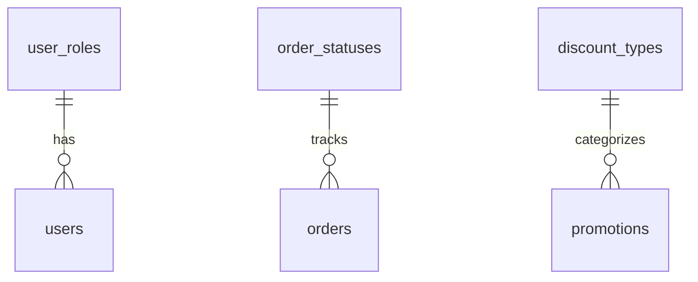
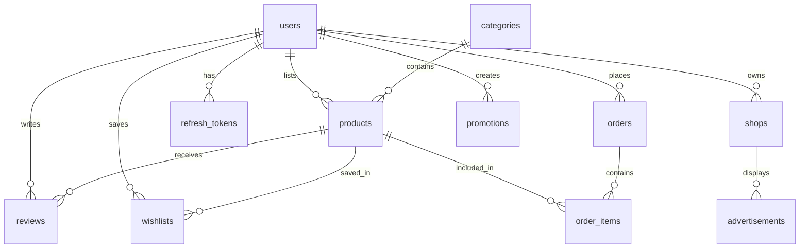
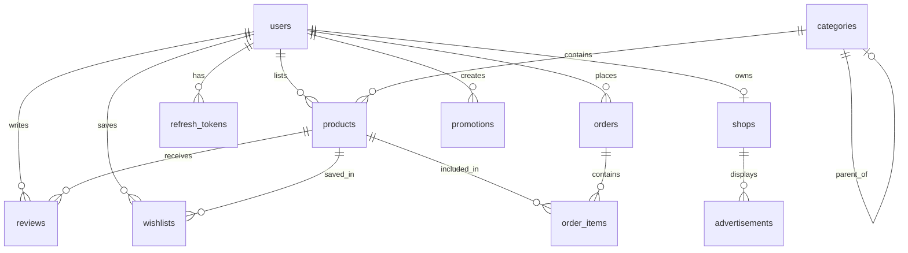

# Database Design Specification (データベース設計書)

---

## Document Control (ドキュメント管理)

| Attribute | Value |
| :--- | :--- |
| **Document ID** | SKM-DBS-001 |
| **System** | Cosmetics Finder |
| **Phase** | Technical Design |
| **Version** | 1.0 |
| **Created** | 2026-08-03 |
| **Last Updated** | 2026-08-10 |
| **Author** | Lead Database Engineer |
| **Status** | Released (承認済み) |

### Document Revision History

| Version | Date | Author | Description of Changes |
| :--- | :--- | :--- | :--- |
| 1.0 | 2026-08-03 | Lead Database Engineer | Initial technical design specification (新規作成) |
| 1.1 | 2026-08-10 | Lead Database Engineer | Added new fields to advertisements table for approval workflow, payment tracking, and weekly limits |

---

## 1. Database Overview & Naming Conventions

### 1.1 Database Engine Constraints
* **Primary Database:** PostgreSQL 16+
* **Storage Engine:** PostgreSQL Default Heap Storage with transaction support (ACID compliant).
* **Isolation Level:** Read Committed (Default, ensures prevention of dirty reads while keeping high concurrency).
* **Encoding:** `UTF8` for multi-language compatibility (including Japanese, Myanmar, and English character inputs).
* **Collation:** `C` or `en_US.utf8` for consistent sorting rules.

### 1.2 Naming Conventions
To ensure consistency across the platform, the database adheres to strict snake_case conventions:
* **Tables:** Pluralized, lowercase, separated by underscores (e.g., `products`, `order_items`).
* **Columns:** Lowercase, singular, separated by underscores (e.g., `merchant_id`, `stock_quantity`).
* **Primary Keys:** Standardized as `id` (CUID format for distributed systems). 
* **Foreign Keys:** Named as `<referenced_table_singular>_id` (e.g., `user_id` referencing `users`).
* **Indexes:** Prefixed with `idx_` followed by the table name and columns indexed (e.g., `idx_products_category_id`). Unique indexes use the `uq_` prefix.
* **Constraints:** Prefixed with `chk_` for check constraints, `fk_` for foreign keys, and `pk_` for primary keys.

### 1.3 Timezone & Temporal Configuration
* All datetime columns must use `TIMESTAMP WITH TIME ZONE` (or `TIMESTAMPTZ` in PostgreSQL).
* **Storage Standard:** All timestamps are normalized and stored in **UTC** (Coordinated Universal Time) at the database layer.
* **Application Handling:** The NestJS/Prisma backend is responsible for receiving and querying dates in UTC, while local time zone conversions are performed in the presentation/client layer.
* **Dates without time:** Columns tracking calendar dates without hours/minutes (like order dates) must use the `DATE` type.

### 1.4 ID Strategy
* **Primary Keys:** Use CUID (Collision-resistant Unique Identifier) for distributed-friendly, URL-safe IDs.
* **Format:** String type with `@default(cuid())` in Prisma schema.
* **Benefits:** Time-ordered, globally unique, no sequential gaps.

---

## 2. Master / Lookup Tables DDL

The lookup tables represent the master data that drives user roles, order statuses, discount types, and other categorical classifications. These tables are enforced via database-level foreign keys to protect data integrity.



### 2.1 SQL DDL Scripts

```sql
-- =========================================================================
-- 1. USER ROLES LOOKUP TABLE
-- =========================================================================
CREATE TABLE user_roles (
    role_id SERIAL,
    role_code VARCHAR(20) NOT NULL,
    role_name VARCHAR(50) NOT NULL,
    description VARCHAR(500),
    is_active BOOLEAN NOT NULL DEFAULT TRUE,
    created_at TIMESTAMP WITH TIME ZONE NOT NULL DEFAULT CURRENT_TIMESTAMP,
    CONSTRAINT pk_user_roles PRIMARY KEY (role_id),
    CONSTRAINT uq_user_roles_role_code UNIQUE (role_code),
    CONSTRAINT uq_user_roles_role_name UNIQUE (role_name)
);

-- =========================================================================
-- 2. ORDER STATUSES LOOKUP TABLE
-- =========================================================================
CREATE TABLE order_statuses (
    status_id SERIAL,
    status_code VARCHAR(20) NOT NULL,
    status_name VARCHAR(50) NOT NULL,
    display_order INTEGER NOT NULL,
    is_terminal_state BOOLEAN NOT NULL DEFAULT FALSE,
    description VARCHAR(500),
    CONSTRAINT pk_order_statuses PRIMARY KEY (status_id),
    CONSTRAINT uq_order_statuses_status_code UNIQUE (status_code),
    CONSTRAINT uq_order_statuses_status_name UNIQUE (status_name)
);

-- =========================================================================
-- 3. DISCOUNT TYPES LOOKUP TABLE
-- =========================================================================
CREATE TABLE discount_types (
    discount_type_id SERIAL,
    type_code VARCHAR(20) NOT NULL,
    type_name VARCHAR(50) NOT NULL,
    is_active BOOLEAN NOT NULL DEFAULT TRUE,
    created_at TIMESTAMP WITH TIME ZONE NOT NULL DEFAULT CURRENT_TIMESTAMP,
    CONSTRAINT pk_discount_types PRIMARY KEY (discount_type_id),
    CONSTRAINT uq_discount_types_type_code UNIQUE (type_code),
    CONSTRAINT uq_discount_types_type_name UNIQUE (type_name)
);
```

### 2.2 DML Master Seeding Scripts

```sql
-- Seed User Roles
INSERT INTO user_roles (role_code, role_name, description, is_active) VALUES
('buyer', 'Buyer', 'End user who browses and purchases products', TRUE),
('merchant', 'Merchant', 'Seller who lists products on the marketplace', TRUE),
('admin', 'Admin', 'Platform administrator with full access', TRUE);

-- Seed Order Statuses (Workflow lifecycle tracking)
INSERT INTO order_statuses (status_code, status_name, display_order, is_terminal_state, description) VALUES
('pending', 'Pending', 1, FALSE, 'Order created, awaiting confirmation'),
('confirmed', 'Confirmed', 2, FALSE, 'Order confirmed by merchant'),
('processing', 'Processing', 3, FALSE, 'Order is being prepared'),
('delivered', 'Delivered', 4, FALSE, 'Order delivered to customer'),
('done', 'Done', 5, TRUE, 'Order completed and confirmed');

-- Seed Discount Types
INSERT INTO discount_types (type_code, type_name, is_active) VALUES
('percentage', 'Percentage Discount', TRUE),
('fixed', 'Fixed Amount Discount', TRUE);
```

---

## 3. Core Entity Tables DDL & Structural Integrity

Transactional entities handle user credentials, products, orders, reviews, wishlists, shops, promotions, and advertisements. The relationships are designed to prevent orphan records while keeping clear histories.



### 3.1 Users Table (`users` - ユーザーマスタ)
Manages system user information with role-based access.

#### Data Dictionary
| No (項番) | Logical Name (論理名) | Physical Name (物理名) | Data Type & Length (データ型・桁数) | PK | FK | Nullable (NULL許容) | Default Value (初期値) | Constraints & Remarks (制約・備考) |
|---|---|---|---|---|---|---|---|---|
| 1 | ユーザーID | `id` | VARCHAR(25) | Y | - | N | cuid() | Primary key. CUID format. |
| 2 | メールアドレス | `email` | VARCHAR(255) | - | - | N | - | Unique key (`uq_users_email`). Used as login ID. |
| 3 | パスワードハッシュ | `password_hash` | VARCHAR(255) | - | - | N | - | Encrypted password hash (Argon2) for authentication. |
| 4 | フルネーム | `name` | VARCHAR(200) | - | - | N | - | Full name of the user. |
| 5 | ロール | `role` | VARCHAR(20) | - | - | N | 'buyer' | User role (buyer, merchant, admin). |
| 6 | アバターURL | `avatar_url` | VARCHAR(500) | - | - | Y | NULL | Profile picture URL. |
| 7 | 電話番号 | `phone` | VARCHAR(20) | - | - | Y | NULL | Contact phone number. |
| 8 | 有効フラグ | `is_active` | BOOLEAN | - | - | N | TRUE | Account active (TRUE) or inactive (FALSE) status. |
| 9 | メール認証済み | `email_verified` | BOOLEAN | - | - | N | FALSE | Email verification status. |
| 10 | 作成日時 | `created_at` | TIMESTAMPTZ | - | - | N | CURRENT_TIMESTAMP | Record creation timestamp. |
| 11 | 更新日時 | `updated_at` | TIMESTAMPTZ | - | - | N | CURRENT_TIMESTAMP | Record last modification timestamp. |

#### Reference SQL DDL
```sql
CREATE TABLE users (
    id VARCHAR(25) PRIMARY KEY,
    email VARCHAR(255) NOT NULL,
    password_hash VARCHAR(255) NOT NULL,
    name VARCHAR(200) NOT NULL,
    role VARCHAR(20) NOT NULL DEFAULT 'buyer',
    avatar_url VARCHAR(500),
    phone VARCHAR(20),
    is_active BOOLEAN NOT NULL DEFAULT TRUE,
    email_verified BOOLEAN NOT NULL DEFAULT FALSE,
    created_at TIMESTAMP WITH TIME ZONE NOT NULL DEFAULT CURRENT_TIMESTAMP,
    updated_at TIMESTAMP WITH TIME ZONE NOT NULL DEFAULT CURRENT_TIMESTAMP,
    CONSTRAINT uq_users_email UNIQUE (email),
    CONSTRAINT chk_users_role CHECK (role IN ('buyer', 'merchant', 'admin'))
);
```

---

### 3.2 Refresh Tokens Table (`refresh_tokens` - リフレッシュトークンテーブル)
Manages JWT refresh tokens for session management.

#### Data Dictionary
| No (項番) | Logical Name (論理名) | Physical Name (物理名) | Data Type & Length (データ型・桁数) | PK | FK | Nullable (NULL許容) | Default Value (初期値) | Constraints & Remarks (制約・備考) |
|---|---|---|---|---|---|---|---|---|
| 1 | リフレッシュトークンID | `id` | VARCHAR(25) | Y | - | N | cuid() | Primary key. CUID format. |
| 2 | ユーザーID | `user_id` | VARCHAR(25) | - | Y | N | - | Foreign key (`fk_refresh_tokens_user`). References `users(id)`. ON DELETE CASCADE ON UPDATE CASCADE. |
| 3 | トークンハッシュ | `token_hash` | VARCHAR(255) | - | - | N | - | Hashed refresh token value. |
| 4 | ファミリー | `family` | VARCHAR(255) | - | - | N | - | Token family for breach detection. |
| 5 | デバイス情報 | `device_info` | JSONB | - | - | Y | NULL | Device metadata (User-Agent parsing). |
| 6 | IPアドレス | `ip_address` | VARCHAR(50) | - | - | Y | NULL | Client IP address. |
| 7 | 無効化フラグ | `is_revoked` | BOOLEAN | - | - | N | FALSE | Token revocation status. |
| 8 | 絶対期限 | `absolute_limit_at` | TIMESTAMPTZ | - | - | N | - | Hard session cap (90 days). |
| 9 | 有効期限 | `expires_at` | TIMESTAMPTZ | - | - | N | - | Token expiration timestamp. |
| 10 | 作成日時 | `created_at` | TIMESTAMPTZ | - | - | N | CURRENT_TIMESTAMP | Record creation timestamp. |

#### Reference SQL DDL
```sql
CREATE TABLE refresh_tokens (
    id VARCHAR(25) PRIMARY KEY,
    user_id VARCHAR(25) NOT NULL,
    token_hash VARCHAR(255) NOT NULL,
    family VARCHAR(255) NOT NULL,
    device_info JSONB,
    ip_address VARCHAR(50),
    is_revoked BOOLEAN NOT NULL DEFAULT FALSE,
    absolute_limit_at TIMESTAMP WITH TIME ZONE NOT NULL,
    expires_at TIMESTAMP WITH TIME ZONE NOT NULL,
    created_at TIMESTAMP WITH TIME ZONE NOT NULL DEFAULT CURRENT_TIMESTAMP,
    CONSTRAINT fk_refresh_tokens_user FOREIGN KEY (user_id)
        REFERENCES users(id) ON DELETE CASCADE ON UPDATE CASCADE
);
```

---

### 3.3 Categories Table (`categories` - カテゴリテーブル)
Manages product categories with hierarchical tree structure.

#### Data Dictionary
| No (項番) | Logical Name (論理名) | Physical Name (物理名) | Data Type & Length (データ型・桁数) | PK | FK | Nullable (NULL許容) | Default Value (初期値) | Constraints & Remarks (制約・備考) |
|---|---|---|---|---|---|---|---|---|
| 1 | カテゴリID | `id` | VARCHAR(25) | Y | - | N | cuid() | Primary key. CUID format. |
| 2 | カテゴリ名 | `name` | VARCHAR(100) | - | - | N | - | Category display name. |
| 3 | スラッグ | `slug` | VARCHAR(100) | - | - | N | - | Unique key (`uq_categories_slug`). URL-friendly identifier. |
| 4 | 親カテゴリID | `parent_id` | VARCHAR(25) | - | Y | Y | NULL | Self-referencing foreign key for tree structure. ON DELETE SET NULL ON UPDATE CASCADE. |
| 5 | アイコンURL | `icon_url` | VARCHAR(500) | - | - | Y | NULL | Category icon image URL. |
| 6 | ソート順 | `sort_order` | INTEGER | - | - | N | 0 | Display ordering within parent category. |
| 7 | 作成日時 | `created_at` | TIMESTAMPTZ | - | - | N | CURRENT_TIMESTAMP | Record creation timestamp. |

#### Reference SQL DDL
```sql
CREATE TABLE categories (
    id VARCHAR(25) PRIMARY KEY,
    name VARCHAR(100) NOT NULL,
    slug VARCHAR(100) NOT NULL,
    parent_id VARCHAR(25),
    icon_url VARCHAR(500),
    sort_order INTEGER NOT NULL DEFAULT 0,
    created_at TIMESTAMP WITH TIME ZONE NOT NULL DEFAULT CURRENT_TIMESTAMP,
    CONSTRAINT uq_categories_slug UNIQUE (slug),
    CONSTRAINT fk_categories_parent FOREIGN KEY (parent_id)
        REFERENCES categories(id) ON DELETE SET NULL ON UPDATE CASCADE
);
```

---

### 3.4 Products Table (`products` - 商品テーブル)
Manages skincare product listings by merchants.

#### Data Dictionary
| No (項番) | Logical Name (論理名) | Physical Name (物理名) | Data Type & Length (データ型・桁数) | PK | FK | Nullable (NULL許容) | Default Value (初期値) | Constraints & Remarks (制約・備考) |
|---|---|---|---|---|---|---|---|---|
| 1 | 商品ID | `id` | VARCHAR(25) | Y | - | N | cuid() | Primary key. CUID format. |
| 2 | 出品者ID | `merchant_id` | VARCHAR(25) | - | Y | N | - | Foreign key (`fk_products_merchant`). References `users(id)`. ON DELETE CASCADE ON UPDATE CASCADE. |
| 3 | カテゴリID | `category_id` | VARCHAR(25) | - | Y | N | - | Foreign key (`fk_products_category`). References `categories(id)`. ON DELETE RESTRICT ON UPDATE CASCADE. |
| 4 | 商品名 | `name` | VARCHAR(255) | - | - | N | - | Product display name. |
| 5 | スラッグ | `slug` | VARCHAR(255) | - | - | N | - | Unique key (`uq_products_slug`). URL-friendly identifier. |
| 6 | 説明 | `description` | TEXT | - | - | Y | NULL | Detailed product description. |
| 7 | 短い説明 | `short_description` | VARCHAR(500) | - | - | Y | NULL | Brief product summary. |
| 8 | 価格 | `price` | NUMERIC(10,2) | - | - | N | - | Check constraint: `price > 0`. |
| 9 | 比較価格 | `compare_at_price` | NUMERIC(10,2) | - | - | Y | NULL | Original price for discount display. |
| 10 | SKU | `sku` | VARCHAR(100) | - | - | Y | NULL | Unique key (`uq_products_sku`). Stock Keeping Unit. |
| 11 | 在庫数 | `stock_quantity` | INTEGER | - | - | N | 0 | Check constraint: `stock_quantity >= 0`. |
| 12 | 低在庫閾値 | `low_stock_threshold` | INTEGER | - | - | N | 10 | Low stock warning threshold. |
| 13 | 画像URLs | `images` | TEXT[] | - | - | N | '{}' | Array of product image URLs. |
| 14 | タグ | `tags` | TEXT[] | - | - | N | '{}' | Product tags for search/filter. |
| 15 | 肌タイプ | `skin_types` | TEXT[] | - | - | N | '{}' | Compatible skin types. |
| 16 | 成分 | `ingredients` | TEXT[] | - | - | N | '{}' | Product ingredients list. |
| 17 | 有効フラグ | `is_active` | BOOLEAN | - | - | N | TRUE | Product visibility status. |
| 18 | おすすめフラグ | `is_featured` | BOOLEAN | - | - | N | FALSE | Featured product flag. |
| 19 | 平均評価 | `avg_rating` | NUMERIC(3,2) | - | - | N | 0 | Auto-calculated average rating. |
| 20 | レビュー数 | `review_count` | INTEGER | - | - | N | 0 | Auto-calculated review count. |
| 21 | 作成日時 | `created_at` | TIMESTAMPTZ | - | - | N | CURRENT_TIMESTAMP | Record creation timestamp. |
| 22 | 更新日時 | `updated_at` | TIMESTAMPTZ | - | - | N | CURRENT_TIMESTAMP | Record last modification timestamp. |

#### Reference SQL DDL
```sql
CREATE TABLE products (
    id VARCHAR(25) PRIMARY KEY,
    merchant_id VARCHAR(25) NOT NULL,
    category_id VARCHAR(25) NOT NULL,
    name VARCHAR(255) NOT NULL,
    slug VARCHAR(255) NOT NULL,
    description TEXT,
    short_description VARCHAR(500),
    price NUMERIC(10, 2) NOT NULL,
    compare_at_price NUMERIC(10, 2),
    sku VARCHAR(100),
    stock_quantity INTEGER NOT NULL DEFAULT 0,
    low_stock_threshold INTEGER NOT NULL DEFAULT 10,
    images TEXT[] DEFAULT '{}',
    tags TEXT[] DEFAULT '{}',
    skin_types TEXT[] DEFAULT '{}',
    ingredients TEXT[] DEFAULT '{}',
    is_active BOOLEAN NOT NULL DEFAULT TRUE,
    is_featured BOOLEAN NOT NULL DEFAULT FALSE,
    avg_rating NUMERIC(3, 2) DEFAULT 0,
    review_count INTEGER DEFAULT 0,
    created_at TIMESTAMP WITH TIME ZONE NOT NULL DEFAULT CURRENT_TIMESTAMP,
    updated_at TIMESTAMP WITH TIME ZONE NOT NULL DEFAULT CURRENT_TIMESTAMP,
    CONSTRAINT uq_products_slug UNIQUE (slug),
    CONSTRAINT uq_products_sku UNIQUE (sku),
    CONSTRAINT chk_products_price CHECK (price > 0),
    CONSTRAINT chk_products_stock CHECK (stock_quantity >= 0),
    CONSTRAINT fk_products_merchant FOREIGN KEY (merchant_id)
        REFERENCES users(id) ON DELETE CASCADE ON UPDATE CASCADE,
    CONSTRAINT fk_products_category FOREIGN KEY (category_id)
        REFERENCES categories(id) ON DELETE RESTRICT ON UPDATE CASCADE
);
```

---

### 3.5 Reviews Table (`reviews` - レビューテーブル)
Manages product reviews with ratings.

#### Data Dictionary
| No (項番) | Logical Name (論理名) | Physical Name (物理名) | Data Type & Length (データ型・桁数) | PK | FK | Nullable (NULL許容) | Default Value (初期値) | Constraints & Remarks (制約・備考) |
|---|---|---|---|---|---|---|---|---|
| 1 | レビューID | `id` | VARCHAR(25) | Y | - | N | cuid() | Primary key. CUID format. |
| 2 | ユーザーID | `user_id` | VARCHAR(25) | - | Y | N | - | Foreign key (`fk_reviews_user`). References `users(id)`. ON DELETE CASCADE ON UPDATE CASCADE. |
| 3 | 商品ID | `product_id` | VARCHAR(25) | - | Y | N | - | Foreign key (`fk_reviews_product`). References `products(id)`. ON DELETE CASCADE ON UPDATE CASCADE. |
| 4 | 評価 | `rating` | INTEGER | - | - | N | - | Check constraint: `rating >= 1 AND rating <= 5`. |
| 5 | タイトル | `title` | VARCHAR(255) | - | - | Y | NULL | Review title. |
| 6 | 本文 | `body` | TEXT | - | - | Y | NULL | Review content. |
| 7 | 画像URLs | `images` | TEXT[] | - | - | N | '{}' | Review image URLs. |
| 8 | 認証済み購入 | `is_verified_purchase` | BOOLEAN | - | - | N | FALSE | Verified purchase flag. |
| 9 | 承認済み | `is_approved` | BOOLEAN | - | - | N | TRUE | Admin moderation status. |
| 10 | 作成日時 | `created_at` | TIMESTAMPTZ | - | - | N | CURRENT_TIMESTAMP | Record creation timestamp. |
| 11 | 更新日時 | `updated_at` | TIMESTAMPTZ | - | - | N | CURRENT_TIMESTAMP | Record last modification timestamp. |

#### Reference SQL DDL
```sql
CREATE TABLE reviews (
    id VARCHAR(25) PRIMARY KEY,
    user_id VARCHAR(25) NOT NULL,
    product_id VARCHAR(25) NOT NULL,
    rating INTEGER NOT NULL,
    title VARCHAR(255),
    body TEXT,
    images TEXT[] DEFAULT '{}',
    is_verified_purchase BOOLEAN NOT NULL DEFAULT FALSE,
    is_approved BOOLEAN NOT NULL DEFAULT TRUE,
    created_at TIMESTAMP WITH TIME ZONE NOT NULL DEFAULT CURRENT_TIMESTAMP,
    updated_at TIMESTAMP WITH TIME ZONE NOT NULL DEFAULT CURRENT_TIMESTAMP,
    CONSTRAINT uq_reviews_user_product UNIQUE (user_id, product_id),
    CONSTRAINT chk_reviews_rating CHECK (rating >= 1 AND rating <= 5),
    CONSTRAINT fk_reviews_user FOREIGN KEY (user_id)
        REFERENCES users(id) ON DELETE CASCADE ON UPDATE CASCADE,
    CONSTRAINT fk_reviews_product FOREIGN KEY (product_id)
        REFERENCES products(id) ON DELETE CASCADE ON UPDATE CASCADE
);
```

---

### 3.6 Wishlists Table (`wishlists` - お気に入りテーブル)
Manages user's saved products.

#### Data Dictionary
| No (項番) | Logical Name (論理名) | Physical Name (物理名) | Data Type & Length (データ型・桁数) | PK | FK | Nullable (NULL許容) | Default Value (初期値) | Constraints & Remarks (制約・備考) |
|---|---|---|---|---|---|---|---|---|
| 1 | お気に入りID | `id` | VARCHAR(25) | Y | - | N | cuid() | Primary key. CUID format. |
| 2 | ユーザーID | `user_id` | VARCHAR(25) | - | Y | N | - | Foreign key (`fk_wishlists_user`). References `users(id)`. ON DELETE CASCADE ON UPDATE CASCADE. |
| 3 | 商品ID | `product_id` | VARCHAR(25) | - | Y | N | - | Foreign key (`fk_wishlists_product`). References `products(id)`. ON DELETE CASCADE ON UPDATE CASCADE. |
| 4 | 作成日時 | `created_at` | TIMESTAMPTZ | - | - | N | CURRENT_TIMESTAMP | Record creation timestamp. |

#### Reference SQL DDL
```sql
CREATE TABLE wishlists (
    id VARCHAR(25) PRIMARY KEY,
    user_id VARCHAR(25) NOT NULL,
    product_id VARCHAR(25) NOT NULL,
    created_at TIMESTAMP WITH TIME ZONE NOT NULL DEFAULT CURRENT_TIMESTAMP,
    CONSTRAINT uq_wishlists_user_product UNIQUE (user_id, product_id),
    CONSTRAINT fk_wishlists_user FOREIGN KEY (user_id)
        REFERENCES users(id) ON DELETE CASCADE ON UPDATE CASCADE,
    CONSTRAINT fk_wishlists_product FOREIGN KEY (product_id)
        REFERENCES products(id) ON DELETE CASCADE ON UPDATE CASCADE
);
```

---

### 3.7 Orders Table (`orders` - 注文テーブル)
Manages customer order information.

#### Data Dictionary
| No (項番) | Logical Name (論理名) | Physical Name (物理名) | Data Type & Length (データ型・桁数) | PK | FK | Nullable (NULL許容) | Default Value (初期値) | Constraints & Remarks (制約・備考) |
|---|---|---|---|---|---|---|---|---|
| 1 | 注文ID | `id` | VARCHAR(25) | Y | - | N | cuid() | Primary key. CUID format. |
| 2 | ユーザーID | `user_id` | VARCHAR(25) | - | Y | N | - | Foreign key (`fk_orders_user`). References `users(id)`. ON DELETE RESTRICT ON UPDATE CASCADE. |
| 3 | ステータス | `status` | VARCHAR(20) | - | - | N | 'pending' | Order status (pending, confirmed, processing, delivered, done). |
| 4 | 小計 | `subtotal` | NUMERIC(10,2) | - | - | N | - | Check constraint: `subtotal > 0`. |
| 5 | 配送料 | `shipping_cost` | NUMERIC(10,2) | - | - | N | 0 | Shipping cost. |
| 6 | 税金 | `tax` | NUMERIC(10,2) | - | - | N | 0 | Tax amount. |
| 7 | 合計 | `total` | NUMERIC(10,2) | - | - | N | - | Check constraint: `total > 0`. |
| 8 | 配送先住所 | `shipping_address` | JSONB | - | - | N | - | Shipping address details (JSON). |
| 9 | 決済方法 | `payment_method` | VARCHAR(50) | - | - | Y | NULL | Payment method used. |
| 10 | 決済ステータス | `payment_status` | VARCHAR(20) | - | - | N | 'pending' | Payment processing status (pending, completed, failed). |
| 11 | 備考 | `notes` | TEXT | - | - | Y | NULL | Order notes from customer. |
| 12 | 作成日時 | `created_at` | TIMESTAMPTZ | - | - | N | CURRENT_TIMESTAMP | Record creation timestamp. |
| 13 | 更新日時 | `updated_at` | TIMESTAMPTZ | - | - | N | CURRENT_TIMESTAMP | Record last modification timestamp. |

#### Reference SQL DDL
```sql
CREATE TABLE orders (
    id VARCHAR(25) PRIMARY KEY,
    user_id VARCHAR(25) NOT NULL,
    status VARCHAR(20) NOT NULL DEFAULT 'pending',
    subtotal NUMERIC(10, 2) NOT NULL,
    shipping_cost NUMERIC(10, 2) DEFAULT 0,
    tax NUMERIC(10, 2) DEFAULT 0,
    total NUMERIC(10, 2) NOT NULL,
    shipping_address JSONB NOT NULL,
    payment_method VARCHAR(50),
    payment_status VARCHAR(20) NOT NULL DEFAULT 'pending',
    notes TEXT,
    created_at TIMESTAMP WITH TIME ZONE NOT NULL DEFAULT CURRENT_TIMESTAMP,
    updated_at TIMESTAMP WITH TIME ZONE NOT NULL DEFAULT CURRENT_TIMESTAMP,
    CONSTRAINT chk_orders_subtotal CHECK (subtotal > 0),
    CONSTRAINT chk_orders_total CHECK (total > 0),
    CONSTRAINT fk_orders_user FOREIGN KEY (user_id)
        REFERENCES users(id) ON DELETE RESTRICT ON UPDATE CASCADE
);
```

---

### 3.8 Order Items Table (`order_items` - 注文商品テーブル)
Manages individual items within an order.

#### Data Dictionary
| No (項番) | Logical Name (論理名) | Physical Name (物理名) | Data Type & Length (データ型・桁数) | PK | FK | Nullable (NULL許容) | Default Value (初期値) | Constraints & Remarks (制約・備考) |
|---|---|---|---|---|---|---|---|---|
| 1 | 注文商品ID | `id` | VARCHAR(25) | Y | - | N | cuid() | Primary key. CUID format. |
| 2 | 注文ID | `order_id` | VARCHAR(25) | - | Y | N | - | Foreign key (`fk_order_items_order`). References `orders(id)`. ON DELETE CASCADE ON UPDATE CASCADE. |
| 3 | 商品ID | `product_id` | VARCHAR(25) | - | Y | N | - | Foreign key (`fk_order_items_product`). References `products(id)`. ON DELETE RESTRICT ON UPDATE CASCADE. |
| 4 | 出品者ID | `merchant_id` | VARCHAR(25) | - | Y | N | - | Foreign key (`fk_order_items_merchant`). References `users(id)`. ON DELETE RESTRICT ON UPDATE CASCADE. |
| 5 | 数量 | `quantity` | INTEGER | - | - | N | - | Check constraint: `quantity > 0`. |
| 6 | 単価 | `unit_price` | NUMERIC(10,2) | - | - | N | - | Price at time of order. |
| 7 | 合計金額 | `total_price` | NUMERIC(10,2) | - | - | N | - | Check constraint: `total_price > 0`. |

#### Reference SQL DDL
```sql
CREATE TABLE order_items (
    id VARCHAR(25) PRIMARY KEY,
    order_id VARCHAR(25) NOT NULL,
    product_id VARCHAR(25) NOT NULL,
    merchant_id VARCHAR(25) NOT NULL,
    quantity INTEGER NOT NULL,
    unit_price NUMERIC(10, 2) NOT NULL,
    total_price NUMERIC(10, 2) NOT NULL,
    CONSTRAINT chk_order_items_quantity CHECK (quantity > 0),
    CONSTRAINT chk_order_items_total CHECK (total_price > 0),
    CONSTRAINT fk_order_items_order FOREIGN KEY (order_id)
        REFERENCES orders(id) ON DELETE CASCADE ON UPDATE CASCADE,
    CONSTRAINT fk_order_items_product FOREIGN KEY (product_id)
        REFERENCES products(id) ON DELETE RESTRICT ON UPDATE CASCADE,
    CONSTRAINT fk_order_items_merchant FOREIGN KEY (merchant_id)
        REFERENCES users(id) ON DELETE RESTRICT ON UPDATE CASCADE
);
```

---

### 3.9 Shops Table (`shops` - 店舗テーブル)
Manages merchant shop profiles.

#### Data Dictionary
| No (項番) | Logical Name (論理名) | Physical Name (物理名) | Data Type & Length (データ型・桁数) | PK | FK | Nullable (NULL許容) | Default Value (初期値) | Constraints & Remarks (制約・備考) |
|---|---|---|---|---|---|---|---|---|
| 1 | 店舗ID | `id` | VARCHAR(25) | Y | - | N | cuid() | Primary key. CUID format. |
| 2 | ユーザーID | `user_id` | VARCHAR(25) | - | Y | N | - | Unique key (`uq_shops_user_id`). References `users(id)`. ON DELETE CASCADE ON UPDATE CASCADE. |
| 3 | 店舗名 | `name` | VARCHAR(200) | - | - | N | - | Shop display name. |
| 4 | スラッグ | `slug` | VARCHAR(200) | - | - | N | - | Unique key (`uq_shops_slug`). URL-friendly identifier. |
| 5 | 説明 | `description` | TEXT | - | - | Y | NULL | Shop description. |
| 6 | ロゴURL | `logo_url` | VARCHAR(500) | - | - | Y | NULL | Shop logo image URL. |
| 7 | バナーURL | `banner_url` | VARCHAR(500) | - | - | Y | NULL | Shop banner image URL. |
| 8 | 住所 | `address` | TEXT | - | - | Y | NULL | Physical shop address. |
| 9 | 電話番号 | `phone` | VARCHAR(20) | - | - | Y | NULL | Shop contact phone. |
| 10 | メール | `email` | VARCHAR(255) | - | - | Y | NULL | Shop contact email. |
| 11 | 緯度 | `latitude` | NUMERIC(10,7) | - | - | Y | NULL | GPS latitude for shop finder. |
| 12 | 経度 | `longitude` | NUMERIC(10,7) | - | - | Y | NULL | GPS longitude for shop finder. |
| 13 | 承認済み | `is_approved` | BOOLEAN | - | - | N | FALSE | Admin approval status. |
| 14 | 作成日時 | `created_at` | TIMESTAMPTZ | - | - | N | CURRENT_TIMESTAMP | Record creation timestamp. |
| 15 | 更新日時 | `updated_at` | TIMESTAMPTZ | - | - | N | CURRENT_TIMESTAMP | Record last modification timestamp. |

#### Reference SQL DDL
```sql
CREATE TABLE shops (
    id VARCHAR(25) PRIMARY KEY,
    user_id VARCHAR(25) NOT NULL,
    name VARCHAR(200) NOT NULL,
    slug VARCHAR(200) NOT NULL,
    description TEXT,
    logo_url VARCHAR(500),
    banner_url VARCHAR(500),
    address TEXT,
    phone VARCHAR(20),
    email VARCHAR(255),
    latitude NUMERIC(10, 7),
    longitude NUMERIC(10, 7),
    is_approved BOOLEAN NOT NULL DEFAULT FALSE,
    created_at TIMESTAMP WITH TIME ZONE NOT NULL DEFAULT CURRENT_TIMESTAMP,
    updated_at TIMESTAMP WITH TIME ZONE NOT NULL DEFAULT CURRENT_TIMESTAMP,
    CONSTRAINT uq_shops_user_id UNIQUE (user_id),
    CONSTRAINT uq_shops_slug UNIQUE (slug),
    CONSTRAINT fk_shops_user FOREIGN KEY (user_id)
        REFERENCES users(id) ON DELETE CASCADE ON UPDATE CASCADE
);
```

---

### 3.10 Promotions Table (`promotions` - プロモーションテーブル)
Manages discount codes and promotions.

#### Data Dictionary
| No (項番) | Logical Name (論理名) | Physical Name (物理名) | Data Type & Length (データ型・桁数) | PK | FK | Nullable (NULL許容) | Default Value (初期値) | Constraints & Remarks (制約・備考) |
|---|---|---|---|---|---|---|---|---|
| 1 | プロモーションID | `id` | VARCHAR(25) | Y | - | N | cuid() | Primary key. CUID format. |
| 2 | 出品者ID | `merchant_id` | VARCHAR(25) | - | Y | N | - | Foreign key (`fk_promotions_merchant`). References `users(id)`. ON DELETE CASCADE ON UPDATE CASCADE. |
| 3 | クーポンコード | `code` | VARCHAR(50) | - | - | N | - | Unique key (`uq_promotions_code`). Discount code. |
| 4 | 説明 | `description` | TEXT | - | - | Y | NULL | Promotion description. |
| 5 | 割引タイプ | `discount_type` | VARCHAR(20) | - | - | N | - | Enum type: 'percentage' or 'fixed'. |
| 6 | 割引値 | `discount_value` | NUMERIC(10,2) | - | - | N | - | Check constraint: `discount_value > 0`. |
| 7 | 最低注文金額 | `min_order_amount` | NUMERIC(10,2) | - | - | Y | NULL | Minimum order amount for discount. |
| 8 | 最大使用数 | `max_uses` | INTEGER | - | - | Y | NULL | Maximum times this code can be used. |
| 9 | 使用回数 | `used_count` | INTEGER | - | - | N | 0 | Current usage count. |
| 10 | 開始日時 | `starts_at` | TIMESTAMPTZ | - | - | N | - | Promotion start timestamp. |
| 11 | 終了日時 | `expires_at` | TIMESTAMPTZ | - | - | N | - | Promotion end timestamp. |
| 12 | 有効フラグ | `is_active` | BOOLEAN | - | - | N | TRUE | Promotion active status. |
| 13 | 作成日時 | `created_at` | TIMESTAMPTZ | - | - | N | CURRENT_TIMESTAMP | Record creation timestamp. |

#### Reference SQL DDL
```sql
CREATE TABLE promotions (
    id VARCHAR(25) PRIMARY KEY,
    merchant_id VARCHAR(25) NOT NULL,
    code VARCHAR(50) NOT NULL,
    description TEXT,
    discount_type VARCHAR(20) NOT NULL,
    discount_value NUMERIC(10, 2) NOT NULL,
    min_order_amount NUMERIC(10, 2),
    max_uses INTEGER,
    used_count INTEGER NOT NULL DEFAULT 0,
    starts_at TIMESTAMP WITH TIME ZONE NOT NULL,
    expires_at TIMESTAMP WITH TIME ZONE NOT NULL,
    is_active BOOLEAN NOT NULL DEFAULT TRUE,
    created_at TIMESTAMP WITH TIME ZONE NOT NULL DEFAULT CURRENT_TIMESTAMP,
    CONSTRAINT uq_promotions_code UNIQUE (code),
    CONSTRAINT chk_promotions_discount_type CHECK (discount_type IN ('percentage', 'fixed')),
    CONSTRAINT chk_promotions_discount_value CHECK (discount_value > 0),
    CONSTRAINT chk_promotions_dates CHECK (expires_at > starts_at),
    CONSTRAINT fk_promotions_merchant FOREIGN KEY (merchant_id)
        REFERENCES users(id) ON DELETE CASCADE ON UPDATE CASCADE
);
```

---

### 3.11 Advertisements Table (`advertisements` - 広告テーブル)
Manages shop advertisements with approval workflow, payment tracking, and weekly limits.

#### Data Dictionary
| No (項番) | Logical Name (論理名) | Physical Name (物理名) | Data Type & Length (データ型・桁数) | PK | FK | Nullable (NULL許容) | Default Value (初期値) | Constraints & Remarks (制約・備考) |
|---|---|---|---|---|---|---|---|---|
| 1 | 広告ID | `id` | VARCHAR(25) | Y | - | N | cuid() | Primary key. CUID format. |
| 2 | 店舗ID | `shop_id` | VARCHAR(25) | - | Y | N | - | Foreign key (`fk_advertisements_shop`). References `shops(id)`. ON DELETE CASCADE ON UPDATE CASCADE. |
| 3 | タイトル | `title` | VARCHAR(200) | - | - | N | - | Advertisement title. |
| 4 | 内容 | `content` | TEXT | - | - | Y | NULL | Advertisement content/description. |
| 5 | 告知メッセージ | `announcement_message` | VARCHAR(500) | - | - | N | - | Banner announcement message. |
| 6 | 画像URL | `image_url` | VARCHAR(500) | - | - | Y | NULL | Advertisement image URL. |
| 7 | リンクURL | `link_url` | VARCHAR(500) | - | - | Y | NULL | Click-through link URL. |
| 8 | 有効フラグ | `is_active` | BOOLEAN | - | - | N | TRUE | Advertisement active status. |
| 9 | 承認状態 | `approval_status` | VARCHAR(20) | - | - | N | 'pending' | Approval status: pending/approved/rejected. |
| 10 | 支払い状態 | `payment_status` | VARCHAR(20) | - | - | N | 'pending' | Payment status: pending/paid/failed/refunded. |
| 11 | 支払い金額 | `payment_amount` | DECIMAL(10,2) | - | - | Y | NULL | Advertising fee amount. |
| 12 | 支払い参照番号 | `payment_reference` | VARCHAR(100) | - | - | Y | NULL | Payment transaction reference. |
| 13 | 承認者ID | `approved_by` | VARCHAR(25) | - | Y | Y | NULL | Foreign key (`fk_advertisements_approved_by`). References `users(id)`. ON DELETE SET NULL ON UPDATE CASCADE. |
| 14 | 承認日時 | `approved_at` | TIMESTAMPTZ | - | - | Y | NULL | Approval/rejection timestamp. |
| 15 | 却下理由 | `rejection_reason` | TEXT | - | - | Y | NULL | Reason for rejection. |
| 16 | 週番号 | `week_number` | INTEGER | - | - | N | - | ISO week number for limit tracking. |
| 17 | 開始日時 | `starts_at` | TIMESTAMPTZ | - | - | N | - | Advertisement start timestamp. |
| 18 | 終了日時 | `expires_at` | TIMESTAMPTZ | - | - | N | - | Advertisement end timestamp. |
| 19 | 作成日時 | `created_at` | TIMESTAMPTZ | - | - | N | CURRENT_TIMESTAMP | Record creation timestamp. |

#### Reference SQL DDL
```sql
CREATE TABLE advertisements (
    id VARCHAR(25) PRIMARY KEY,
    shop_id VARCHAR(25) NOT NULL,
    title VARCHAR(200) NOT NULL,
    content TEXT,
    announcement_message VARCHAR(500) NOT NULL,
    image_url VARCHAR(500),
    link_url VARCHAR(500),
    is_active BOOLEAN NOT NULL DEFAULT TRUE,
    approval_status VARCHAR(20) NOT NULL DEFAULT 'pending',
    payment_status VARCHAR(20) NOT NULL DEFAULT 'pending',
    payment_amount DECIMAL(10,2),
    payment_reference VARCHAR(100),
    approved_by VARCHAR(25),
    approved_at TIMESTAMP WITH TIME ZONE,
    rejection_reason TEXT,
    week_number INTEGER NOT NULL,
    starts_at TIMESTAMP WITH TIME ZONE NOT NULL,
    expires_at TIMESTAMP WITH TIME ZONE NOT NULL,
    created_at TIMESTAMP WITH TIME ZONE NOT NULL DEFAULT CURRENT_TIMESTAMP,
    CONSTRAINT chk_advertisements_dates CHECK (expires_at > starts_at),
    CONSTRAINT chk_advertisements_approval_status CHECK (approval_status IN ('pending', 'approved', 'rejected')),
    CONSTRAINT chk_advertisements_payment_status CHECK (payment_status IN ('pending', 'paid', 'failed', 'refunded')),
    CONSTRAINT fk_advertisements_shop FOREIGN KEY (shop_id)
        REFERENCES shops(id) ON DELETE CASCADE ON UPDATE CASCADE,
    CONSTRAINT fk_advertisements_approved_by FOREIGN KEY (approved_by)
        REFERENCES users(id) ON DELETE SET NULL ON UPDATE CASCADE
);
```

---

## 4. Performance Optimization Layer (Indexes)

To satisfy non-functional requirement **NFR-001** (page load time ≤ 2 seconds) and optimize lookup times under concurrent access, we define specific B-Tree index structures.

### 4.1 Index Mapping Matrix

| No | Index Physical Name | Target Table | Key Columns | Target Optimization Purpose |
|---|---|---|---|---|
| 1 | `idx_users_email` | `users` | `email` | Optimizes email lookups during login and uniqueness validations. |
| 2 | `idx_users_role` | `users` | `role` | Optimizes user role filtering and permission sorting. |
| 3 | `idx_users_is_active` | `users` | `is_active` | Speeds up lookups filtering active users. |
| 4 | `idx_refresh_tokens_user_id` | `refresh_tokens` | `user_id` | Speeds up token lookups per user. |
| 5 | `idx_refresh_tokens_family` | `refresh_tokens` | `family` | Optimizes token family tracking for breach detection. |
| 6 | `idx_refresh_tokens_token_hash` | `refresh_tokens` | `token_hash` | Optimizes token verification lookups. |
| 7 | `idx_categories_parent_id` | `categories` | `parent_id` | Speeds up category tree traversal. |
| 8 | `idx_categories_slug` | `categories` | `slug` | Optimizes category lookups by URL slug. |
| 9 | `idx_products_merchant_id` | `products` | `merchant_id` | Speeds up merchant's product listings. |
| 10 | `idx_products_category_id` | `products` | `category_id` | Optimizes category-based product filtering. |
| 11 | `idx_products_slug` | `products` | `slug` | Optimizes product lookups by URL slug. |
| 12 | `idx_products_price` | `products` | `price` | Speeds up price-based sorting and filtering. |
| 13 | `idx_products_is_active` | `products` | `is_active` | Optimizes active product filtering. |
| 14 | `idx_products_created_at` | `products` | `created_at` | Speeds up newest product listings. |
| 15 | `idx_reviews_product_id` | `reviews` | `product_id` | Optimizes product review loading. |
| 16 | `idx_reviews_rating` | `reviews` | `rating` | Speeds up rating-based filtering. |
| 17 | `idx_wishlists_user_id` | `wishlists` | `user_id` | Optimizes user wishlist loading. |
| 18 | `idx_orders_user_id` | `orders` | `user_id` | Speeds up user order history. |
| 19 | `idx_orders_status` | `orders` | `status` | Optimizes order status filtering. |
| 20 | `idx_orders_created_at` | `orders` | `created_at` | Speeds up order date sorting. |
| 21 | `idx_order_items_order_id` | `order_items` | `order_id` | Optimizes order detail loading. |
| 22 | `idx_order_items_product_id` | `order_items` | `product_id` | Speeds up product order history. |
| 23 | `idx_order_items_merchant_id` | `order_items` | `merchant_id` | Optimizes merchant order filtering. |
| 24 | `idx_shops_slug` | `shops` | `slug` | Optimizes shop lookups by URL slug. |
| 25 | `idx_shops_is_approved` | `shops` | `is_approved` | Speeds up approved shop filtering. |
| 26 | `idx_promotions_merchant_id` | `promotions` | `merchant_id` | Optimizes merchant promotions loading. |
| 27 | `idx_promotions_code` | `promotions` | `code` | Speeds up coupon code validation. |
| 28 | `idx_promotions_is_active` | `promotions` | `is_active` | Optimizes active promotion filtering. |
| 29 | `idx_promotions_expires_at` | `promotions` | `expires_at` | Speeds up expired promotion cleanup. |
| 30 | `idx_advertisements_shop_id` | `advertisements` | `shop_id` | Optimizes shop advertisement loading. |
| 31 | `idx_advertisements_is_active` | `advertisements` | `is_active` | Speeds up active advertisement filtering. |
| 32 | `idx_advertisements_expires_at` | `advertisements` | `expires_at` | Optimizes expired ad cleanup. |
| 33 | `idx_advertisements_approval_status` | `advertisements` | `approval_status` | Speeds up approval status filtering. |
| 34 | `idx_advertisements_payment_status` | `advertisements` | `payment_status` | Optimizes payment status filtering. |
| 35 | `idx_advertisements_week_number` | `advertisements` | `week_number` | Speeds up weekly ad limit checks. |

### 4.2 DDL Index Scripts

```sql
-- Indexes for Users Table
CREATE INDEX idx_users_email ON users (email);
CREATE INDEX idx_users_role ON users (role);
CREATE INDEX idx_users_is_active ON users (is_active);

-- Indexes for Refresh Tokens Table
CREATE INDEX idx_refresh_tokens_user_id ON refresh_tokens (user_id);
CREATE INDEX idx_refresh_tokens_family ON refresh_tokens (family);
CREATE INDEX idx_refresh_tokens_token_hash ON refresh_tokens (token_hash);

-- Indexes for Categories Table
CREATE INDEX idx_categories_parent_id ON categories (parent_id);
CREATE INDEX idx_categories_slug ON categories (slug);

-- Indexes for Products Table
CREATE INDEX idx_products_merchant_id ON products (merchant_id);
CREATE INDEX idx_products_category_id ON products (category_id);
CREATE INDEX idx_products_slug ON products (slug);
CREATE INDEX idx_products_price ON products (price);
CREATE INDEX idx_products_is_active ON products (is_active);
CREATE INDEX idx_products_created_at ON products (created_at DESC);

-- Indexes for Reviews Table
CREATE INDEX idx_reviews_product_id ON reviews (product_id);
CREATE INDEX idx_reviews_rating ON reviews (rating);

-- Indexes for Wishlists Table
CREATE INDEX idx_wishlists_user_id ON wishlists (user_id);

-- Indexes for Orders Table
CREATE INDEX idx_orders_user_id ON orders (user_id);
CREATE INDEX idx_orders_status ON orders (status);
CREATE INDEX idx_orders_created_at ON orders (created_at DESC);

-- Indexes for Order Items Table
CREATE INDEX idx_order_items_order_id ON order_items (order_id);
CREATE INDEX idx_order_items_product_id ON order_items (product_id);
CREATE INDEX idx_order_items_merchant_id ON order_items (merchant_id);

-- Indexes for Shops Table
CREATE INDEX idx_shops_slug ON shops (slug);
CREATE INDEX idx_shops_is_approved ON shops (is_approved);

-- Indexes for Promotions Table
CREATE INDEX idx_promotions_merchant_id ON promotions (merchant_id);
CREATE INDEX idx_promotions_code ON promotions (code);
CREATE INDEX idx_promotions_is_active ON promotions (is_active);
CREATE INDEX idx_promotions_expires_at ON promotions (expires_at);

-- Indexes for Advertisements Table
CREATE INDEX idx_advertisements_shop_id ON advertisements (shop_id);
CREATE INDEX idx_advertisements_is_active ON advertisements (is_active);
CREATE INDEX idx_advertisements_expires_at ON advertisements (expires_at);
CREATE INDEX idx_advertisements_approval_status ON advertisements (approval_status);
CREATE INDEX idx_advertisements_payment_status ON advertisements (payment_status);
CREATE INDEX idx_advertisements_week_number ON advertisements (week_number);

-- Partial Indexing for Active Products (Soft Delete Equivalent)
CREATE INDEX idx_products_active_featured ON products (is_featured, created_at DESC) 
WHERE is_active = TRUE;
```

---

## 5. Redis Caching Layout Architecture

To satisfy performance metrics, Redis 7+ is utilized as a shared, high-speed in-memory store. Caching mitigates PostgreSQL load by dividing memory partitions into Session Management, Token Blacklisting, Master Table Lookups, and high-frequency API Response Caches.

```
┌──────────────────────────────────────────────────────────────────┐
│                          Redis Memory                            │
├───────────────────┬──────────────────────────┬───────────────────┤
│ Sessions Hash     │ Blacklist String         │ Cache String      │
│ TTL: 7d           │ TTL: 15min               │ TTL: 5min         │
│ session:<token>   │ blacklist:<jti>          │ cache:<entity>:<id>│
└───────────────────┴──────────────────────────┴───────────────────┘
```

### 5.1 Key Namespace & Schema Design

| Cache Domain | Key Pattern | Redis Data Type | Serialized Format | TTL Expiration | Cache Invalidation Trigger |
| :--- | :--- | :--- | :--- | :--- | :--- |
| **Access Token Blacklist** | `blacklist:{jti}` | **String** | "1" (exists) | Time until token expiry | User logout or token revocation |
| **Refresh Token Blacklist** | `refresh:blacklist:{jti}` | **String** | "1" (exists) | 7 days | Token reuse detection |
| **User Session** | `session:{userId}` | **Hash** | Field-value pairs (user details, role) | 7 days (sliding) | Logout or session expiry |
| **Product Cache** | `cache:product:{id}` | **String** | JSON Object | 5 minutes | Product update/delete |
| **Product List Cache** | `cache:products:list:{hash}` | **String** | JSON Array | 2 minutes | Any product mutation |
| **Category Cache** | `cache:categories` | **String** | JSON Array | 30 minutes | Category mutation |
| **User Profile Cache** | `cache:user:{id}` | **String** | JSON Object | 5 minutes | Profile update |
| **Shop Cache** | `cache:shop:{id}` | **String** | JSON Object | 10 minutes | Shop profile update |
| **API Rate Limiter** | `rate:api:{ip}` | **Sorted Set** | Timestamps | 60 seconds | Automatic sliding window |
| **Auth Rate Limiter** | `rate:auth:{ip}` | **String** | Counter | 300 seconds | Login attempt |
| **Upload Rate Limiter** | `rate:upload:{userId}` | **String** | Counter | 60 seconds | File upload |

### 5.2 Cache Invalidation & Event Sync Workflows

1. **Write-Through / Evict Strategy for Products:**
   To ensure data integrity, updates are always persisted to the relational database first. Upon transaction commit, the backend evicts the corresponding key from Redis via `DEL`.
   ```
   [NestJS Backend] ─► 1. Save changes to PostgreSQL
                    ─► 2. Evict cache key: DEL cache:product:<id>
                    ─► 3. Invalidate list cache: DEL cache:products:list:*
   ```

2. **Master Lookup Hot Caching:**
   Static configurations and lookups are managed using the Cache-Aside pattern. The application checks Redis first; on cache miss, it reads from PostgreSQL and seeds Redis with a 30-minute TTL.

3. **Rate Limiting with Sliding Window:**
   API rate limiting uses Redis sorted sets with sliding window algorithm for accurate, distributed rate limiting across multiple backend instances.

```lua
-- sliding_window.lua
local key = KEYS[1]
local limit = tonumber(ARGV[1])
local window = tonumber(ARGV[2])
local now = tonumber(ARGV[3])
local window_start = now - window

redis.call('ZREMRANGEBYSCORE', key, '-inf', window_start)
local count = redis.call('ZCARD', key)

if count < limit then
  redis.call('ZADD', key, now, now .. ':' .. math.random(1000000))
  redis.call('EXPIRE', key, window)
  return {1, limit - count - 1}
else
  return {0, 0}
end
```

---

## 6. Prisma ORM Integration Mapping Notes

Important implementation instructions for constructing NestJS backend entities:

### 6.1 Type Mapping

| PostgreSQL Type | Prisma Type | TypeScript Type | Notes |
|----------------|-------------|-----------------|-------|
| `VARCHAR(n)` | `String` | `string` | Direct mapping |
| `TEXT` | `String` | `string` | Direct mapping |
| `INTEGER` | `Int` | `number` | Direct mapping |
| `NUMERIC(p,s)` | `Decimal` | `string` | Use string to avoid float precision issues |
| `BOOLEAN` | `Boolean` | `boolean` | Direct mapping |
| `TIMESTAMPTZ` | `DateTime` | `Date` | Direct mapping |
| `JSONB` | `Json` | `JsonValue` | Use with caution |
| `TEXT[]` | `String[]` | `string[]` | PostgreSQL array type |
| `VARCHAR(25)` (CUID) | `String` | `string` | Use `@default(cuid())` |
| `SERIAL` | `Int` | `number` | Auto-increment for lookup tables |
| `VARCHAR(20)` (FK) | `String` | `string` | References lookup table |

### 6.2 Lookup Table Integration

#### Prisma Model Definitions

```prisma
// Lookup Table Models
model UserRole {
  id          Int      @id @default(autoincrement())
  roleCode    String   @unique @map("role_code")
  roleName    String   @unique @map("role_name")
  description String?
  isActive    Boolean  @default(true) @map("is_active")
  createdAt   DateTime @default(now()) @map("created_at")
  users       User[]
  @@map("user_roles")
}

model OrderStatus {
  id              Int      @id @default(autoincrement())
  statusCode      String   @unique @map("status_code")
  statusName      String   @unique @map("status_name")
  displayOrder    Int      @map("display_order")
  isTerminalState Boolean  @default(false) @map("is_terminal_state")
  description     String?
  orders          Order[]
  @@map("order_statuses")
}

model DiscountType {
  id        Int      @id @default(autoincrement())
  typeCode  String   @unique @map("type_code")
  typeName  String   @unique @map("type_name")
  isActive  Boolean  @default(true) @map("is_active")
  createdAt DateTime @default(now()) @map("created_at")
  promotions Promotion[]
  @@map("discount_types")
}
```

#### Foreign Key References

| Core Table | Column | References | On Delete | On Update |
|------------|--------|------------|-----------|-----------|
| `users` | `role` | `user_roles.role_code` | RESTRICT | CASCADE |
| `orders` | `status` | `order_statuses.status_code` | RESTRICT | CASCADE |
| `promotions` | `discount_type` | `discount_types.type_code` | RESTRICT | CASCADE |

### 6.2 Cascade Rules

| Relation | onDelete | onUpdate | Rationale |
|----------|----------|----------|-----------|
| User → RefreshToken | Cascade | Cascade | Delete all tokens when user is deleted |
| User → Product | Cascade | Cascade | Delete all products when merchant is deleted |
| User → Review | Cascade | Cascade | Delete all reviews when user is deleted |
| User → Wishlist | Cascade | Cascade | Delete all wishlist items when user is deleted |
| User → Order | Restrict | Cascade | Prevent deleting user with existing orders |
| User → Shop | Cascade | Cascade | Delete shop when merchant is deleted |
| User → Promotion | Cascade | Cascade | Delete promotions when merchant is deleted |
| Category → Product | Restrict | Cascade | Prevent deleting category with products |
| Product → Review | Cascade | Cascade | Delete reviews when product is deleted |
| Product → Wishlist | Cascade | Cascade | Delete wishlist items when product is deleted |
| Product → OrderItem | Restrict | Cascade | Prevent deleting product with order history |
| Order → OrderItem | Cascade | Cascade | Delete order items when order is deleted |
| Shop → Advertisement | Cascade | Cascade | Delete ads when shop is deleted |

### 6.3 Soft Delete Pattern

For tables requiring soft delete (products, shops), implement with `is_active` boolean flag:

```typescript
// Query filtering for active records
const activeProducts = await prisma.product.findMany({
  where: {
    isActive: true,
    // ... other filters
  }
});
```

### 6.4 Transactions

Use Prisma `$transaction` for multi-step writes requiring atomicity:

```typescript
// Example: Creating order with stock decrement
await prisma.$transaction(async (tx) => {
  const order = await tx.order.create({ data: orderData });
  await tx.orderItem.createMany({
    data: items.map(i => ({ ...i, orderId: order.id })),
  });
  await tx.product.updateMany({
    where: { id: { in: productIds } },
    data: { stockQuantity: { decrement: 1 } },
  });
});
```

### 6.5 Generated Types

Use Prisma-generated types instead of hand-written interfaces:

```typescript
import type { Prisma } from '../generated/prisma/client';

type ProductWithRelations = Prisma.ProductGetPayload<{
  include: { 
    category: true; 
    merchant: { select: { name: true; shop: true } };
    reviews: { select: { rating: true } };
  };
}>;
```

---

## 7. Database Schema Summary

### 7.1 Entity Relationship Diagram



### 7.2 Table Count Summary

| Category | Tables | Description |
|----------|--------|-------------|
| **Master/Lookup** | 7 | user_roles, order_statuses, discount_types, skin_types, skin_concerns, currencies, payment_statuses |
| **Core Entities** | 11 | users, refresh_tokens, categories, products, reviews, wishlists, orders, order_items, shops, promotions, advertisements |
| **Total** | 18 | Complete database schema |

---

**Document Management (文書管理):**
- Author: Lead Database Engineer
- Created: 2026-08-03
- Last Updated: 2026-08-03
- Next Review: Phase 2 Planning

---

*End of DATABASE_DESIGN_SPECIFICATION.md*
