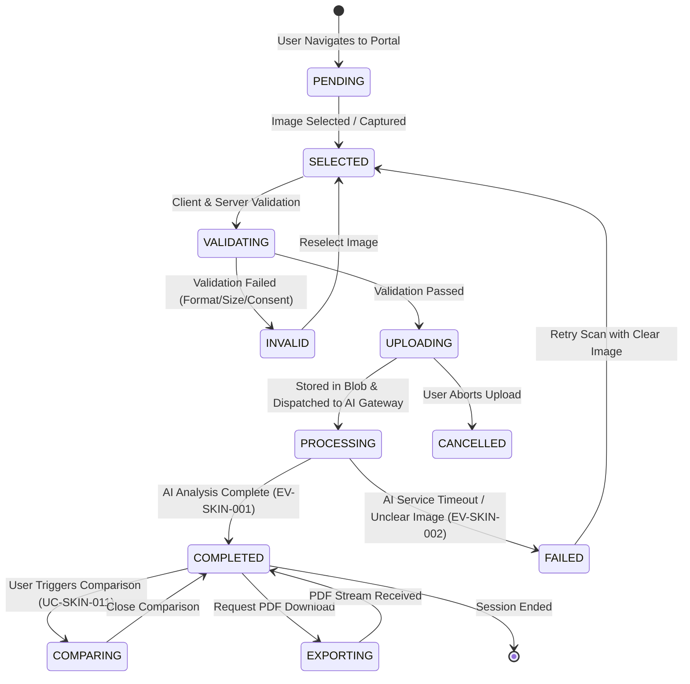

# DD_SKIN_01 — Module Overview

> **Doc ID:** SKM-DD-SKIN-01 | **Version:** 2.1 | **Status:** Released  
> **Last Updated:** 2026-09-21

---

## 1. Module Overview

The **AI Skin Analysis Module** (AI肌分析モジュール) is the core diagnostic and personalization engine within the Cosmetics Finder platform. It enables authenticated Buyers to upload facial images, receive automated AI-powered skin health diagnostics, view high-precision facial mesh overlays, inspect clinical findings across six major condition categories (acne, redness, texture, pigmentation, dryness, pore size), and track skin health metrics longitudinally over time.

This module combines client-side capture guidance, secure cloud storage with server-side encryption (SSE), asynchronous AI diagnostic gateway orchestration, Redis result caching, and automated PDF report generation. It enforces strict data privacy, data isolation (buyers can only access their own scans), daily rate limits (5 scans/user/day), and automated 90-day retention policies for raw facial images.

---

## 2. Supported Use Cases

| ID | Use Case | Description |
|---|----------|-------------|
| UC-SKIN-001 | Upload Facial Image | Buyer uploads a facial image file (JPG, PNG, WebP, max 10MB) with capture guidelines and explicit consent (BR-SKIN-010). Image is validated and securely stored in Azure Blob Storage. |
| UC-SKIN-002 | View Analysis Results | Displays completed analysis with overall health score (0-100), hydration percentage (0-100%), estimated skin age, skin type, AI confidence, 6-condition severity breakdown, facial mesh overlay, and clinical findings. |
| UC-SKIN-003 | View Analysis History | Displays chronological list of past analysis records for the authenticated buyer, sorted by latest date descending (`BR-SKIN-011`), with pagination and summary metrics. |
| UC-SKIN-004 | Export Single Analysis Report | Generates and downloads a branded PDF clinical report for a specific analysis record (`BR-SKIN-014`). |
| UC-SKIN-005 | Export Full Analysis History | Generates and downloads a comprehensive longitudinal PDF report containing all historical analysis records and trend charts (`BR-SKIN-014`). |
| UC-SKIN-006 | View Trend Visualization | Renders interactive health score and hydration percentage trend charts over time for buyers with 2+ completed analyses (`BR-SKIN-013`). |
| UC-SKIN-007 | Initiate New Scan | Displays capture guidelines panel and activates the camera or file uploader to begin a new scan workflow. |
| UC-SKIN-008 | View Product Recommendations | Displays AI-tailored cosmetic product recommendations linked to catalog items (`/products/:id`) based on diagnosed conditions (`BR-SKIN-022`). |
| UC-SKIN-009 | Provide Recommendation Feedback | Allows buyer to rate product recommendations as "Helpful" or "Not Helpful" to refine future suggestions (`BR-SKIN-021`). |
| UC-SKIN-010 | Export Single Analysis Report | Duplicate trigger allowing direct export from within the active results dashboard (`BR-SKIN-014`). |
| UC-SKIN-011 | Compare Analyses | Provides side-by-side comparative inspection between any two completed analyses, showing score deltas and condition severity shifts (`BR-SKIN-020`). |

---

## 3. Analysis State Machine

The AI Skin Analysis subsystem manages the complete analysis lifecycle from image selection through cloud upload, AI evaluation, and persistent reporting.

### Analysis Record States (`skin_analyses.status`)

| State | Description | Can View | Can Export | Can Compare |
|-------|-------------|:--------:|:----------:|:-----------:|
| `UPLOADING` | Image file being transferred to Azure Blob Storage | ✗ | ✗ | ✗ |
| `VALIDATING` | MIME sniffing, magic byte, and dimension checks in progress | ✗ | ✗ | ✗ |
| `PROCESSING` | Asynchronous AI facial diagnostic inference in progress | ✗ | ✗ | ✗ |
| `COMPLETED` | Analysis completed successfully; results persisted and cached | ✓ | ✓ | ✓ |
| `FAILED` | Analysis failed due to service error or unprocessable image | ✗ | ✗ | ✗ |
| `CANCELLED` | Upload explicitly aborted by the buyer | ✗ | ✗ | ✗ |

---

## 4. Security & Privacy Rules

1. **Role-Based Access Control**: Exclusively accessible by authenticated **Buyers** (`role: 'buyer'`). Merchants and Admins receive `403 Forbidden` (`BR-SKIN-001`).
2. **Data Isolation**: Buyers can strictly query and view their own analyses (`user_id == req.user.id`). Cross-account access attempts return `40301` (`BR-SKIN-006`).
3. **Explicit Consent Gate**: Explicit buyer consent (`consent: true`) is mandatory before any image ingestion or AI processing (`BR-SKIN-010`).
4. **Encryption at Rest & Transit**: Facial images are stored in Azure Blob Storage with Server-Side Encryption (SSE-256) and accessed strictly via time-limited SAS tokens (`BR-SKIN-008`).
5. **Image Retention Policy**: Raw facial scan images are retained for **90 days** then permanently purged via automated Azure Blob Lifecycle Management. Numerical analysis metrics and diagnostic records remain preserved indefinitely (`BR-SKIN-009`).
6. **Immutable Clinical Data**: Completed analysis records are read-only and immutable to preserve longitudinal clinical tracking integrity (`BR-SKIN-007`).
7. **Rate Limiting & Daily Quota**: Hard limit of **5 analyses per buyer per calendar day**, resetting daily at `00:00:00 UTC` (`BR-SKIN-005`, `CFG-SKIN-011`). Exceeding returns `42901`.
8. **File Validation Depth**: Multi-layer validation verifying file extension, magic byte headers, MIME types (`image/jpeg`, `image/png`, `image/webp`), and file size (`≤ 10MB`) (`BR-SKIN-002`, `BR-SKIN-003`).

---

## 5. Architectural Components Involved

| Layer | Files / Components |
|-------|--------------------|
| **Frontend Pages** | `SkinAnalysisPage.tsx`, `SkinAnalysisHistoryPage.tsx` |
| **Frontend Components** | `CameraCaptureModal.tsx`, `CaptureGuidelinesPanel.tsx`, `AnalysisSummaryCard.tsx`, `AIFacialAnalysisCard.tsx`, `MeshOverlayViewer.tsx`, `ConditionSeveritySection.tsx`, `ClinicalFindingsSection.tsx`, `AnalysisHistoryTable.tsx`, `TrendVisualizationChart.tsx`, `AnalysisComparisonModal.tsx`, `RecommendationList.tsx`, `ExportReportButton.tsx` |
| **Frontend Hooks** | `useSkinAnalysis.ts`, `useAnalysisHistory.ts`, `useAnalysisTrends.ts`, `useCompareAnalyses.ts`, `useExportReport.ts`, `useRecommendationFeedback.ts` |
| **Frontend Services** | `skin-analysis.service.ts` |
| **Frontend Schemas** | `skin-analysis.schema.ts` |
| **Backend Controller** | `skin-analysis.controller.ts` |
| **Backend Services** | `skin-analysis.service.ts`, `ai-gateway.service.ts`, `blob-storage.service.ts`, `pdf-report.service.ts` |
| **Backend DTOs** | `upload-image.dto.ts`, `start-analysis.dto.ts`, `analysis-response.dto.ts`, `history-query.dto.ts`, `compare-analyses.dto.ts`, `recommendation-feedback.dto.ts` |
| **Backend Guards** | `jwt-auth.guard.ts`, `roles.guard.ts` (Requires Buyer role) |
| **Backend Config** | `skin-analysis.config.ts`, `azure-blob.config.ts`, `ai-gateway.config.ts` |
| **Shared Services** | `prisma.service.ts` (`skin_analyses`, `skin_analysis_conditions`, `skin_analysis_findings`, `skin_analysis_recommendations`, `skin_analysis_feedback`), `redis.service.ts` (quota tracking & 5-minute result cache) |

---

## 6. API Endpoints

| Method | Endpoint | Description | Auth Required | Rate Limit |
|--------|----------|-------------|:-------------:|:----------:|
| `POST` | `/api/v1/skin-analysis/upload` | Upload & validate facial image | Yes (Buyer) | 10 / min |
| `POST` | `/api/v1/skin-analysis/analyze` | Initiate AI diagnostic processing | Yes (Buyer) | 5 / day |
| `GET` | `/api/v1/skin-analysis/latest` | Retrieve buyer's latest analysis summary | Yes (Buyer) | 60 / min |
| `GET` | `/api/v1/skin-analysis/:id` | Get complete analysis details & mesh URL | Yes (Buyer) | 60 / min |
| `GET` | `/api/v1/skin-analysis/history` | Get paginated analysis history | Yes (Buyer) | 60 / min |
| `GET` | `/api/v1/skin-analysis/trends` | Get longitudinal health & hydration trends | Yes (Buyer) | 60 / min |
| `POST` | `/api/v1/skin-analysis/compare` | Side-by-side comparison of 2 analyses | Yes (Buyer) | 30 / min |
| `GET` | `/api/v1/skin-analysis/:id/export` | Download single analysis PDF report | Yes (Buyer) | 20 / hour |
| `GET` | `/api/v1/skin-analysis/export-history` | Download full analysis history PDF | Yes (Buyer) | 20 / hour |
| `POST` | `/api/v1/skin-analysis/recommendations/:id/feedback` | Submit helpfulness rating for recommendation | Yes (Buyer) | 60 / min |

---

## 7. Database Tables Involved

| Table | Purpose | Operations |
|-------|---------|------------|
| `skin_analyses` | Stores primary analysis headers, scores, skin type, age, mesh URLs, and status | INSERT (start), UPDATE (completed/failed), SELECT (view/history/export) |
| `skin_analysis_conditions` | Stores 6 condition metrics (acne, redness, texture, pigmentation, dryness, pore size) | INSERT (on complete), SELECT (details/compare) |
| `skin_analysis_findings` | Stores clinical findings (primary and secondary diagnostic concerns) | INSERT (on complete), SELECT (details) |
| `skin_analysis_recommendations` | Stores AI-generated product recommendations linked to catalog items | INSERT (on complete), SELECT (details) |
| `skin_analysis_feedback` | Stores buyer feedback (`is_helpful`) per recommendation | INSERT/UPDATE (upsert on user vote), SELECT (stats) |

---

## 8. External Dependencies

| Dependency | Purpose | Configuration / Env |
|------------|---------|---------------------|
| Azure Blob Storage | Encrypted storage for facial images and mesh maps | `AZURE_STORAGE_CONNECTION_STRING`, `SKIN_BLOB_CONTAINER` (`skin-scans`) |
| AI Facial Analysis Service | Proprietary deep-learning skin condition inference | `AI_SERVICE_URL`, `AI_SERVICE_TIMEOUT_MS` (30000) |
| Azure Cache for Redis | Daily analysis quotas & 5-minute analysis result caching | `REDIS_URL`, `SKIN_CACHE_TTL_SECONDS` (300) |
| PDFKit / Puppeteer | Clinical PDF report generation for download | `PDF_STORAGE_TEMP_PATH`, `SKIN_PDF_EXPORT_ENABLED` |

---

## 9. Cross-References

| Related Document | Purpose |
|------------------|---------|
| `docs/screen/AI_Skin_Analysis/機能設計書_AI_Skin_Analysis.md` | Authoritative functional specification (`SKM-FDS-SKIN-001`, v2.1) |
| `docs/screen/AI_Skin_Analysis/画面項目設計書_AI_Skin_Analysis.md` | Authoritative screen item specification (`SKM-SIS-SCR-002`, v1.0) |
| `docs/core-work/要件定義書_REQUIREMENT_SPEC.md` | Platform requirements specification (`SKM-REQ-001`) |
| `docs/core-work/データベース設計書_DATABASE_SPEC.md` | Database schema & relationship specifications (`SKM-DBS-001`) |
| `docs/core-work/開発ルール_DEVELOPMENT_RULES.md` | Security rules, design tokens, error response format (`SKM-DEV-001`) |
