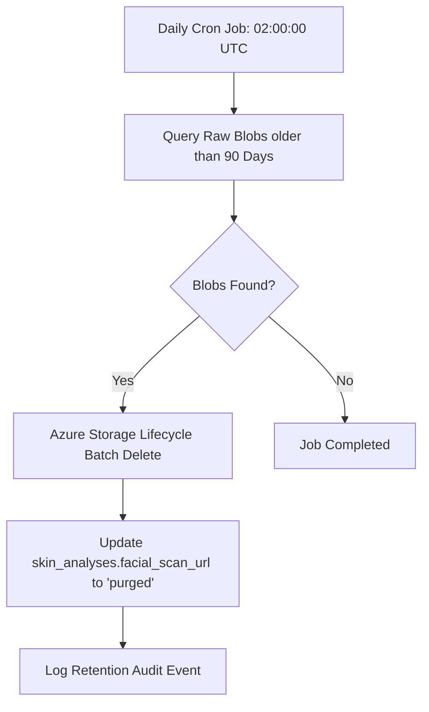

# DD_SKIN_05 — Business Logic Specification

> **Doc ID:** SKM-DD-SKIN-05 | **Version:** 2.1 | **Status:** Released  
> **Last Updated:** 2026-09-21

---

## 1. Overview

This document specifies the core business logic, validation pipelines, asynchronous AI orchestration, caching patterns, and calculations implemented in the `SkinAnalysisService`.

- **Service File:** `backend/src/modules/buyer/skin-analysis/skin-analysis.service.ts`
- **Dependencies:** `PrismaService`, `RedisService`, `AzureBlobService`, `AiGatewayService`, `PdfReportService`

---

## 2. Core Service Methods

### 2.1 `uploadImage(file, consent, userId)`

1. **Consent Verification:** Verify `consent === true`. If false, throw `BadRequestException` with code `40003` (`BR-SKIN-010`).
2. **File Validation:**
   - Verify size `file.size <= 10,485,760` bytes (10MB). If exceeded, throw `BadRequestException` with code `40002` (`BR-SKIN-003`).
   - Verify file extension and magic byte headers (`image/jpeg`, `image/png`, `image/webp`). If invalid, throw `BadRequestException` with code `40001` (`BR-SKIN-002`).
   - Extract dimensions using `sharp`. If width < 640 or height < 480, log a quality warning but permit ingestion (`BR-SKIN-004`).
3. **Storage Ingestion:**
   - Generate unique blob key: `scans/{userId}/{uuidv4()}_{timestamp}.{ext}`.
   - Upload buffer to Azure Blob Storage container `skin-scans` with Server-Side Encryption (`SSE-256`) (`BR-SKIN-008`).
   - Set metadata: `userId`, `uploadTimestamp`, `retentionTier: '90-days'`.
4. **Return:** Upload metadata including secure read SAS URL valid for 60 minutes.

---

### 2.2 `startAnalysis(userId, blobUrl)`

1. **Daily Quota Check (`BR-SKIN-005`):**
   - Key: `quota:skin:${userId}:${currentUtcDate()}` (e.g., `quota:skin:u123:20260821`).
   - Atomically increment counter via Redis `INCR`. If initial creation, set TTL to seconds until `00:00:00 UTC`.
   - If counter value > 5, throw `TooManyRequestsException` with code `42901` and remaining quota = 0.
2. **Analysis Initialization:**
   - Create record in `skin_analyses` table with `status = 'PROCESSING'` and `facial_scan_url = blobUrl`.
3. **AI Gateway Dispatch:**
   - Send async inference payload to `AiGatewayService` with a 30-second timeout ceiling (`CFG-SKIN-004`).
   - On inference completion:
     - Parse AI payload into conditions (`acne`, `redness`, `texture`, `pigmentation`, `dryness`, `pore_size`).
     - Generate facial landmark wireframe and store mesh overlay image in blob storage (`mesh_overlay_url`).
     - Normalize health score (0-100) and hydration percentage (0-100%) (`BR-SKIN-012`).
     - Populate `skin_analysis_conditions`, `skin_analysis_findings`, and catalog-linked `skin_analysis_recommendations` within a single Prisma transaction.
     - Update parent `skin_analyses` record to `status = 'COMPLETED'`.
     - Cache result in Redis at `skin:analysis:${analysisId}` with 300s TTL (`BR-SKIN-018`).
     - Invalidate historical summary cache: `DEL skin:history:${userId}:*`.
4. **Failure Handling:**
   - If AI gateway times out or returns unprocessable facial coordinates, update record status to `'FAILED'`.
   - Decrement daily quota counter to avoid penalizing buyer for system error.
   - Throw `InternalServerErrorException` with code `50002` or `50003`.

---

### 2.3 `getAnalysisById(userId, analysisId)`

1. **Cache Inspection:** Check Redis key `skin:analysis:${analysisId}`. If present, parse and verify `cached.userId === userId`.
2. **Database Fallback:**
   - Query `skin_analyses` with included relations (`conditions`, `findings`, `recommendations`).
   - If record not found, throw `NotFoundException` (`40401`).
   - If `record.userId !== userId`, throw `ForbiddenException` (`40301`, `BR-SKIN-006`).
3. **Cache Ingestion:** Write retrieved entity to Redis with 5-minute TTL.
4. **Return:** Formatted `AnalysisResultDto`.

---

### 2.4 `getAnalysisHistory(userId, queryDto)`

1. **Ordering & Scope:** Query `skin_analyses` where `userId === userId`, strictly ordered by `analysisDate DESC` (`BR-SKIN-011`).
2. **Date Filtering:** Apply `dateFrom` and `dateTo` if supplied in query.
3. **Summary KPI Calculation:**
   - `totalAnalyses`: Total count of completed scans for this user.
   - `bestScore`: `MAX(health_score)`.
   - `averageHydration`: `AVG(hydration)` rounded to nearest integer.
   - `improvementPercentage`: Calculate delta between oldest scan and most recent scan:
     $$\text{Improvement} = \left(\frac{\text{latestScore} - \text{firstScore}}{\text{firstScore}}\right) \times 100$$
     If `firstScore === 0` or only 1 scan exists, return `0`.
4. **Pagination:** Apply `take: pageSize`, `skip: (page - 1) * pageSize`.

---

### 2.5 `getTrends(userId, range)`

1. **Data Point Guard:** Check user's total completed analyses count. If < 2, return `minPointsMet = false` with empty arrays (`BR-SKIN-013`).
2. **Aggregation:** Extract sequential `analysisDate`, `healthScore`, and `hydration` data points.
3. **Format:** Output chronologically sorted array suitable for Recharts dual-axis line visualization.

---

### 2.6 `compareAnalyses(userId, analysisId1, analysisId2)`

1. **Validation:**
   - If `analysisId1 === analysisId2`, throw `BadRequestException` (`40005`).
2. **Ownership & Retrieval:**
   - Fetch both records along with condition relations. Verify both belong to `userId` (`BR-SKIN-006`).
   - Ensure both have `status === 'COMPLETED'`.
3. **Delta Computation:**
   - Order scans chronologically so `scan1` is baseline and `scan2` is comparison.
   - `scoreDelta = scan2.healthScore - scan1.healthScore`
   - `hydrationDelta = scan2.hydration - scan1.hydration`
   - `ageDelta = scan2.skinAge - scan1.skinAge`
   - `daysBetween = Math.round((scan2.analysisDate - scan1.analysisDate) / (1000 * 60 * 60 * 24))`
4. **Condition Shift Mapping:**
   - For each condition, compare severity scale: `NONE(0) < MILD(1) < MODERATE(2) < SEVERE(3)`.
   - If numeric severity decreases: `direction = 'IMPROVED'`.
   - If numeric severity increases: `direction = 'REGRESSED'`.
   - If equal: `direction = 'STABLE'`.

---

### 2.7 `exportReport(userId, analysisId, responseStream)`

1. Retrieve analysis and verify ownership (`40301`).
2. Delegate to `PdfReportService`:
   - Render header with Cosmetics Finder branding, buyer identifier, and timestamp.
   - Render facial scan image and superimposed landmark mesh.
   - Render health score gauge and hydration bar.
   - Render 6-condition clinical severity table.
   - Render primary/secondary clinical findings and product recommendations.
3. Pipe generated PDF binary stream directly to client response with attachment headers (`BR-SKIN-014`).

---

### 2.8 `updateRecommendationFeedback(userId, recommendationId, isHelpful)`

1. Query `skin_analysis_recommendations` joining `skin_analyses`.
2. Verify that parent `analysis.userId === userId` (`40301`).
3. Upsert into `skin_analysis_feedback`:
   - Unique key constraint: `(recommendation_id, user_id)`.
   - Update `is_helpful = isHelpful`, `updated_at = NOW()`.
4. Return success confirmation.

---

## 3. Data Retention & Cleanup Workflow (`BR-SKIN-009`)

- Raw facial images are permanently deleted from Azure Blob Storage after 90 days.
- Numerical scores, condition logs, and historical findings remain in PostgreSQL indefinitely for continuous longitudinal tracking.
