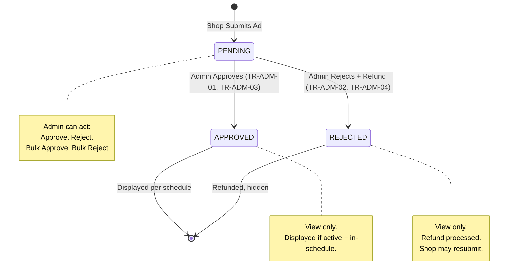

# DD_Ad_Management_Screen_01 — Module Overview

> **Doc ID:** SKM-DD-ADM-01 | **Version:** 1.0 | **Status:** Released
> **Last Updated:** 2026-09-01
> **Target Screen:** Admin Ad Management (管理者広告管理)
> **Subsystem:** Advertisement Management — Admin Ad Review, Approval, Fee Management, Analytics & Reporting
> **Function ID:** FN-ADM-001

---

## 1. Module Overview

The **Admin Ad Management Module** (管理者広告管理モジュール) provides platform administrators with full control over the advertisement lifecycle within the Cosmetics Finder platform. It covers the complete admin-side responsibilities: reviewing and approving/rejecting shop-submitted advertisements (individually or in bulk), managing advertisement package pricing and fee configurations, tracking fee change history, analyzing platform-wide ad revenue breakdowns by placement and tier, and exporting ad performance and fee history reports.

The advertisement system is a core monetization channel. Shops pay daily fees based on placement location and pricing tier. All advertisements require admin approval before display. This module defines every screen, operation, business rule, and API endpoint that the Admin interacts with to manage this subsystem.

The module spans one backend module group and six primary frontend screens:

| Side | Backend Module Path | Frontend Screen / Route |
|------|---------------------|-------------------------|
| **Admin** | `backend/src/modules/admin/advertisement-management/` | `/admin/ads` (Ad List) |
| **Admin** | `backend/src/modules/admin/advertisement-management/` | `/admin/ads/packages` (Package & Fee Management) |
| **Admin** | `backend/src/modules/admin/advertisement-management/` | `/admin/ads/fee-history` (Fee Change History) |
| **Admin** | `backend/src/modules/admin/advertisement-management/` | `/admin/ads/analytics` (Revenue Analytics) |
| **Admin** | `backend/src/modules/admin/advertisement-management/` | `/admin/ads/export` (Export Reports) |

> **Implementation Status (as of 2026-09-01):** Admin-side operations are implemented under `backend/src/modules/admin/advertisement-management/`. Frontend pages are to be implemented per this specification.

---

## 2. Supported Use Cases

| ID | Use Case | Description |
| --- | --- | --- |
| UC-ADM-001 | Review Pending Advertisements | Admin views pending ad list with filters (status, placement, tier, shop, date range). |
| UC-ADM-002 | Approve Single Advertisement | Admin selects a pending ad, reviews content, and approves. Sets `approved_by` and `approved_at`. Shop owner notified. |
| UC-ADM-003 | Reject Single Advertisement | Admin selects a pending ad with reason, rejects. Sets `rejection_reason`. Refund initiated. Shop owner notified. |
| UC-ADM-004 | Bulk Approve Advertisements | Admin selects multiple pending ads via checkboxes and approves all in batch. Each `approved_by` and `approved_at` recorded. Shop owners notified individually. |
| UC-ADM-005 | Bulk Reject Advertisements | Admin selects multiple pending ads with common reason, rejects all in batch. Batch refunds initiated. Shop owners notified individually. |
| UC-ADM-006 | View Ad Detail | Admin views full ad details, status, payment info, shop info, and analytics. |
| UC-ADM-007 | Manage Ad Fee Settings | Admin views, creates, edits, activates/deactivates fee settings per placement and tier. |
| UC-ADM-008 | View Fee Change History | Admin views historical fee changes with timestamps, reasons, and before/after values. |
| UC-ADM-009 | View Revenue Breakdown Analytics | Admin views financial charts and summary metrics broken down by placement and tier over custom date range. |
| UC-ADM-010 | Export Ad Performance Report | Admin exports CSV with ad metrics (impressions, clicks, CTR, revenue) per ad. |
| UC-ADM-011 | Export Shop Submission History | Admin exports CSV with all ad submissions, statuses, and outcomes per shop. |
| UC-ADM-012 | Export Fee History Log | Admin exports CSV with all fee setting changes, timestamps, and reasons. |
| UC-ADM-013 | Create Fee Setting | Admin creates a new fee configuration for a placement and tier. New fee setting created with status active. `ad_fee_history` record created with `old_daily_rate=null`. |
| UC-ADM-014 | Deactivate Fee Setting | Admin deactivates an existing active fee setting. Existing ads using this setting are unaffected. |

Covered requirements: **B-ADM-003**, **B-ADM-006** through **B-ADM-015**.

---

## 3. Advertisement Approval State Machine

The admin ad management module operates on advertisements with `approval_status` constrained to `pending/approved/rejected` and `payment_status` constrained to `pending/completed/refunded`.



**Approval States (Admin View):**

| State | Description | Is Displayed | Admin Can Act |
|-------|-------------|:------------:|:-------------:|
| `pending` | Submitted by shop, awaiting admin review | No | Approve, Reject, Bulk Approve, Bulk Reject |
| `approved` | Admin approved, displayed on platform | Yes | View only |
| `rejected` | Admin rejected with reason, refund processed | No | View only |

**Payment States (On Rejection):**

| State | Description | Ad Active | Refundable |
|-------|-------------|:---------:|:----------:|
| `pending` | Payment initiated, not yet confirmed | No | No |
| `completed` | Payment successful | Yes (if approved) | On rejection |
| `refunded` | Refund processed after rejection | No | — |

**Fee Settings State Transitions:**

| Transition ID | Origin State | Target State | Trigger Action | Guard Conditions |
|---------------|--------------|--------------|----------------|------------------|
| TR-FEE-01 | — | Active setting | Admin creates fee setting | Valid placement, tier, daily_rate > 0 |
| TR-FEE-02 | Active setting | Updated setting | Admin updates fee | Change logged to ad_fee_history |
| TR-FEE-03 | Active setting | Deactivated | Admin deactivates | Existing ads unaffected |

---

## 4. Security & Permissions

1. **Authentication**: JWT Bearer Token (`Authorization: Bearer <token>`) required for all admin endpoints.
2. **Role-Based Access Control (RBAC):** All admin ad management endpoints require `admin` role via `JwtAuthGuard` + `RolesGuard`.

```typescript
@UseGuards(JwtAuthGuard, RolesGuard)
@Roles('admin')
@Controller('admin')
export class AdminAdManagementController { ... }
```

3. **Role Permissions:**

| Role | Can Review/Approve/Reject | Can Bulk Approve/Reject | Can Manage Fees | Can View Analytics | Can Export |
|------|:-------------------------:|:-----------------------:|:---------------:|:------------------:|:----------:|
| `buyer` | No | No | No | No | No |
| `merchant` | No | No | No | No | No |
| `admin` | Yes | Yes | Yes | Yes | Yes |

4. **Audit Trail Integrity:** Audit logs are append-only. No UPDATE or DELETE operations permitted.
5. **Fee Change Accountability:** Every fee change must include `changed_by` (admin ID) and `change_reason`.
6. **Export Data Sanitization:** Exported data must not include sensitive fields (password hashes, tokens, internal IDs not relevant to the report).

---

## 5. Architectural Components Involved

```
┌──────────────────────────┐      ┌─────────────────────────────────────┐
│   Admin Actor            │      │     advertisements / ad_payments    │
│ (Reviews, Approves,     ├─────►│  Reads ad records, updates status   │
│  Manages Fees, Exports)  │      │  Processes refunds on rejection     │
└──────────────────────────┘      └──────────────┬────────────────────┘
                                                 │
                                      ┌──────────┴─────────────┐
                                      │                        │
                                      ▼                        ▼
                          ┌──────────────────┐    ┌────────────────────────┐
                          │ ad_fee_settings  │    │  Revenue Analytics     │
                          │ ad_fee_history   │    │  (aggregated metrics)  │
                          └──────────────────┘    └────────────────────────┘
                                                          │
                 ▼
                                               ┌────────────────────────┐
                                               │  Export Engine         │
                                               │  (CSV)                 │
                                               └────────────────────────┘
```

**Key Modules / Services:**
- `AdminAdManagementController` — admin endpoints (`/admin/ads`, `/admin/ad-fees`, `/admin/ads/analytics`, `/admin/ads/export`).
- `AdminAdManagementService` — business logic for approval, rejection, bulk operations, fee management, analytics aggregation, export generation.
- `AuditService` — logs admin actions (2-year retention for approval/rejection, 1-year for exports).
- `NotificationService` — sends individual notifications to shop owners on approval/rejection.
- `ExportService` — generates CSV reports synchronously and streams to client.

---

## 6. API Endpoints

Protected by admin scope (`/admin/*`). See the functional specification §6 for full processing steps.

| Method & Path | Access | Description |
| --- | --- | --- |
| `GET /admin/ads` | Admin | List all ads with filters (status, placement, tier, shop, date range) + pagination |
| `GET /admin/ads/:id` | Admin | View ad detail (shop info, fee info, payment info, analytics) |
| `POST /admin/ads/:id/approve` | Admin | Approve single ad (sets approved_by, approved_at) |
| `POST /admin/ads/:id/reject` | Admin | Reject single ad with reason; auto-refund |
| `POST /admin/ads/bulk/approve` | Admin | Bulk approve up to 50 ads in single transaction |
| `POST /admin/ads/bulk/reject` | Admin | Bulk reject up to 50 ads with common reason; batch refunds |
| `GET /admin/ad-fees` | Admin | List fee settings |
| `POST /admin/ad-fees` | Admin | Create fee setting (validates uniqueness of placement+tier) |
| `PUT /admin/ad-fees/:id` | Admin | Update fee setting (logs change to ad_fee_history) |
| `PATCH /admin/ad-fees/:id/deactivate` | Admin | Deactivate fee setting (existing ads unaffected) |
| `GET /admin/ad-fees/history` | Admin | View fee change history with filters + pagination |
| `GET /admin/ads/analytics/revenue` | Admin | Revenue breakdown analytics (summary, by placement, by tier, trend) |
| `POST /admin/ads/export/ad-performance` | Admin | Export ad performance report (CSV) |
| `POST /admin/ads/export/submission-history` | Admin | Export shop submission history (CSV) |
| `POST /admin/ads/export/fee-history` | Admin | Export fee history log (CSV) |

---

## 7. Database Tables Involved

| Table | Purpose | Key Columns / Usage |
| --- | --- | --- |
| `advertisements` | Core ad records, approval/payment state, schedule | `id`, `shop_id`, `title`, `content`, `announcement_message`, `image_url`, `link_url`, `is_active`, `approval_status`, `payment_status`, `payment_amount`, `approved_by`, `approved_at`, `rejection_reason`, `starts_at`, `expires_at` |
| `ad_payments` | Payment transaction ledger + refunds | `id`, `ad_id`, `amount`, `payment_status` (`pending/completed/refunded`), `refund_amount`, `refund_reason`, `refunded_at` |
| `ad_fee_settings` | Admin-created package catalog (placement × tier) | `id`, `placement`, `tier`, `daily_rate`, `duration_days`, `max_ads`, `is_active` |
| `ad_fee_history` | Fee change audit trail | `id`, `ad_fee_setting_id`, `placement`, `tier`, `old_daily_rate`, `new_daily_rate`, `old_duration_days`, `new_duration_days`, `old_max_ads`, `new_max_ads`, `changed_by`, `change_reason`, `effective_from` |
| `shops` | Merchant store info (joined for ad list) | `id`, `name` |
| `users` | Admin identity for `approved_by` / `changed_by` | `id`, `name` |
| `notifications` | Ad status notifications + export ready | `id`, `user_id`, `type`, `message` |
| `audit_logs` | All admin action logging (append-only) | `id`, `admin_id`, `event_type`, `entity_type`, `entity_id`, `details` |

**Constraints:** `chk_advertisements_approval_status` (`pending/approved/rejected`), `chk_advertisements_payment_status` (`pending/completed/refunded`), unique active fee setting per `placement+tier`.

---

## 8. Business Rules Summary

| Rule Cluster | Rule / Constraint |
| --- | --- |
| **Ad Review & Approval** (BR-ADM-001~005) | Only admins can approve/reject. Rejection requires reason (max 1000 chars). Approval metadata (`approved_by`, `approved_at`) recorded. Refund on rejection. Only `pending` ads can be approved/rejected. |
| **Bulk Operations** (BR-ADM-010~016) | Max 50 ads per bulk operation. All selected ads must be `pending` (pre-flight check). Atomic transaction for bulk approve. Common rejection reason for bulk reject. Sequential refunds (failures logged, don't block). Individual notifications per shop owner. Individual audit log entries per ad. |
| **Ad Display** (BR-ADM-020~025) | Only `approved` + `is_active=true` + in-schedule ads displayed. Priority: Premium > Standard > Basic. Round-robin within tier. Max 5 per slider. Auto-rotate every 5 seconds. |
| **Fee Management** (BR-ADM-030~039) | All fee changes logged to `ad_fee_history` with before/after values. Effective date: changes apply only to new ads after `effective_from`. Unique active fee per placement+tier. Daily rate, duration, max_ads > 0. Fee creation, update, and deactivation logged to audit. Deactivation only on active settings. |
| **Revenue Analytics** (BR-ADM-040~044) | Date range required (max 365 days). Revenue from `completed` payments on `approved` ads. Breakdown by placement and tier. |
| **Export** (BR-ADM-050~052) | CSV format only. Date range required (max 365 days). Export actions logged to audit. |
| **Security** (BR-ADM-060~063) | All endpoints require `admin` role. Audit logs append-only. Fee changes include `changed_by` and `change_reason`. Export data sanitized. |

---

## 9. External Dependencies

| Dependency | Reason |
| --- | --- |
| **JWT** | Authentication/signed access and role enforcement. |
| **File storage** | Export CSV generation and download. |
| **Payment System** | Refund processing on ad rejection (single and batch). |
| **Audit service** | Logs admin actions (2-year retention for approval/rejection, 1-year for exports). |
| **Notification service** | Sends individual notifications to shop owners via WebSocket and in-app notification center. |

---

## 10. Configurable Items

Defined via `.env` configuration:

| Definition Key | Default Value | Description |
|----------------|---------------|-------------|
| `AD_BULK_MAX_SIZE` | `50` | Maximum ads per bulk operation |
| `AD_ANALYTICS_MAX_RANGE_DAYS` | `365` | Maximum date range for analytics queries |
| `AD_SLIDER_MAX` | `5` | Maximum ads per slider rotation |
| `AD_SLIDER_INTERVAL` | `5000` | Slider auto-rotation interval in milliseconds |

**Fee settings** are managed dynamically via the `ad_fee_settings` database table and can be updated by admins through the Package & Fee Management screen.

---

## 11. Screen Transitions

| Source | Target | Trigger |
|--------|--------|---------|
| Admin dashboard | `/admin/ads` | Click "Advertisement Management" in nav |
| `/admin/ads` | Ad Review Modal | Click "Review" on ad row |
| `/admin/ads` | Bulk Approve Modal | Click "Bulk Approve" with ads selected |
| `/admin/ads` | Bulk Reject Modal | Click "Bulk Reject" with ads selected |
| `/admin/ads` | `/admin/ads/packages` | Click "Manage Packages" |
| `/admin/ads` | `/admin/ads/analytics` | Click "Revenue Analytics" |
| `/admin/ads` | `/admin/ads/export` | Click "Export" |
| `/admin/ads/packages` | Edit Fee Modal | Click "Edit" on fee setting |
| `/admin/ads/packages` | Create Fee Modal | Click "Create Fee Setting" |
| `/admin/ads/packages` | Deactivate Fee Confirmation Modal | Click "Deactivate" on fee setting |
| `/admin/ads/packages` | `/admin/ads/fee-history` | Click "View History" |
| `/admin/ads/fee-history` | `/admin/ads/packages` | Click "Back to Packages" |
| `/admin/ads/analytics` | `/admin/ads` | Click "Back to Ads" |
| `/admin/ads/export` | `/admin/ads` | Click "Back to Ads" |

---

## 12. Cross-References

| Related Document | Purpose |
| ----------------- | -------- |
| [DD_Ad_Management_Screen_02_FRONTEND_Page.md](./DD_Ad_Management_Screen_02_FRONTEND_Page.md) | Frontend page design |
| [機能設計書_Ad_Management_Screen](../機能設計書_Ad_Management_Screen.md) | Full functional specification |
| [画面項目設計書_Ad_Management_Screen](../画面項目設計書_Ad_Management_Screen.md) | Screen items specification |
| [要件定義書](../../../../docs/core-work/要件定義書_REQUIREMENT_SPEC.md) | Requirements (B-ADM-003~015) |
| [データベース設計書](../../../../docs/core-work/データベース設計書_DATABASE_SPEC.md) | Database schema (`advertisements`, `ad_fee_settings`, `ad_payments`, `ad_fee_history`) |
| [開発ルール](../../../../docs/core-work/開発ルール_DEVELOPMENT_RULES.md) | Development rules, REST conventions, audit retention |
