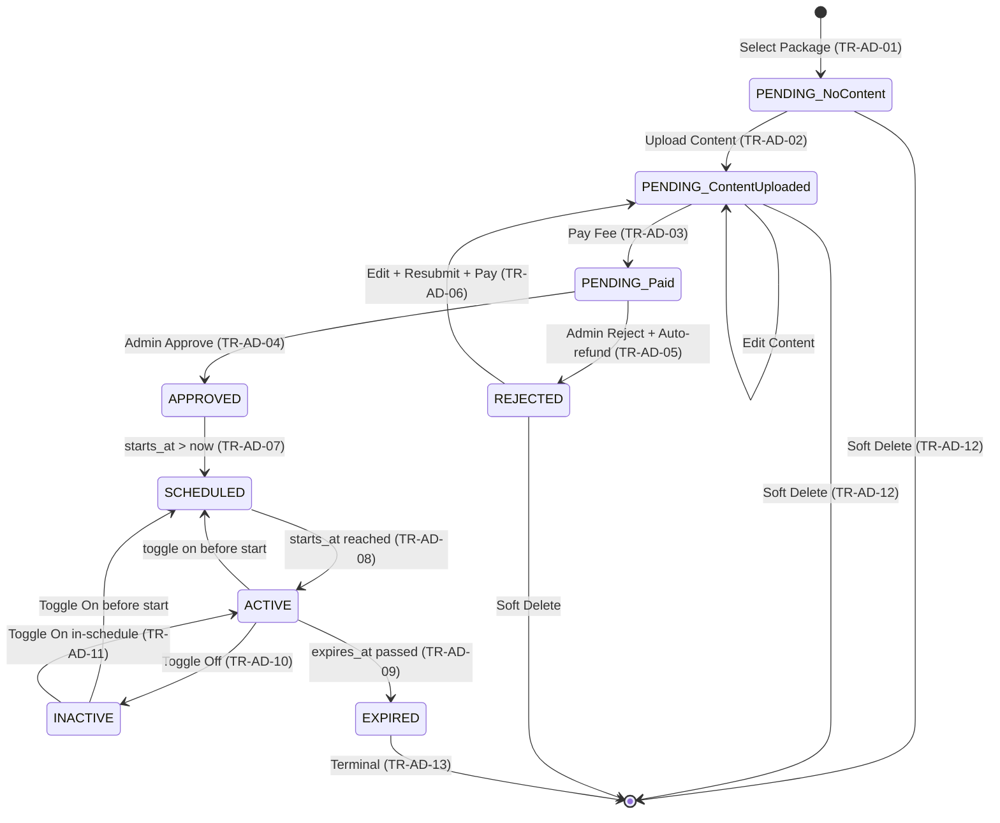

# DD_Advertisement_Management_01 — Module Overview

> **Doc ID:** SKM-DD-AD-01 | **Version:** 1.0 | **Status:** Released
> **Last Updated:** 2026-08-26
> **Target Screen:** Advertisement Management (広告管理)
> **Subsystem:** Advertisement — Shop Advertisement Management
> **Function ID:** FN-AD-001

---

## 1. Module Overview

The **Advertisement Management Module** (広告管理モジュール) manages the full lifecycle of shop advertisements within the Cosmetics Finder marketplace through a strict **6-step flow**: **1 · Select Package → 2 · Upload Content (image + content) → 3 · Pay Fee → 4 · Admin Review → 5 · Approved → 6 · Displayed**.

Merchants browse Admin-created advertisement packages (defined in `ad_fee_settings`), select a package to create a draft advertisement (`approval_status = pending`, `payment_status = pending`), upload their own ad content (`title`, `content`, `image_url`, `link_url`, `announcement_message`), pay the advertising fee (`daily_rate × duration_days`), and submit the ad for Admin review. Admins approve or reject advertisements (with a reason; rejection triggers an automatic refund). Only paid, approved, in-schedule, active advertisements are exposed to the public storefront for banner rendering. Rejected ads can be edited and resubmitted by the merchant.

The module spans two backend module groups and two primary screens:

| Side | Backend Module Path | Frontend Screen / Route |
|------|---------------------|-------------------------|
| **Merchant** | `backend/src/modules/merchant/advertisements/` | `/merchant/advertisements` (`frontend/src/pages/merchant/Advertisements.tsx`) |
| **Admin** | `backend/src/modules/admin/advertisement-management/` | `/admin/advertisements` (`/admin/ads`) |

> **Implementation Status (as of 2026-08-26):** Admin-side operations are implemented under `backend/src/modules/admin/advertisement-management/`. Merchant-side operations under `backend/src/modules/merchant/advertisements/` are to be implemented per this specification. The merchant module currently contains stub files (`advertisements.controller.ts`, `advertisements.service.ts`, `dto/create-advertisement.dto.ts`).

---

## 2. Supported Use Cases

| ID | Use Case | Description |
| --- | --- | --- |
| UC-AD-001 | Select Advertisement Package | Merchant selects an active Admin-created package; a draft advertisement is auto-created (`approval_status = pending`, `payment_status = pending`, `is_active = true`, no content, no schedule). |
| UC-AD-002 | Set Advertisement Schedule | Merchant sets `starts_at`; `expires_at` is derived as `starts_at + package duration_days`. |
| UC-AD-003 | Upload Ad Content | Merchant uploads `title`, `content`, `image_url`, `link_url`, `announcement_message`. Ad remains in `PENDING` with `payment_status = pending`. |
| UC-AD-004 | Manage Own Advertisements | Merchant views, edits content, toggles active/inactive, and soft-deletes own advertisements. |
| UC-AD-005 | Update Advertisement | Merchant edits content fields for ads in an editable state (`DRAFT`, `CONTENT_UPLOADED`, or `REJECTED`). |
| UC-AD-006 | Delete Advertisement (Soft) | Merchant soft-deletes an ad (`is_active = false`); hidden from display but retained for history. |
| UC-AD-007 | Toggle Advertisement Active/Inactive | Merchant toggles `is_active` on approved, paid advertisements. |
| UC-AD-008 | Display Active Advertisements | Public endpoint returns paid, approved, active, in-schedule ads; storefront slider caps at 5 per rotation, prioritizes Premium > Standard > Basic, round-robins within tier, and auto-rotates every 5 seconds. |
| UC-AD-009 | Pay Advertising Fee | Fee (`daily_rate × duration_days`) recorded in `ad_payments`; `payment_status = completed`; ad awaits admin review. |
| UC-AD-010 | Submit Advertisement for Approval | Payment completion makes the paid ad visible in the admin queue (no separate submit action). |
| UC-AD-011 | Approve Advertisement | Admin validates weekly limit (≤ 5/week per merchant) and sets `approval_status = approved`, `approved_by`, `approved_at`. |
| UC-AD-012 | Reject Advertisement | Admin sets `approval_status = rejected`, `rejection_reason`; triggers auto-refund (`ad_payments` → `refunded`). Merchant may edit and resubmit. |
| UC-AD-013 | Resubmit Rejected Advertisement | Merchant edits content and pays a fresh fee; ad returns to `PENDING`. |
| UC-AD-014 | Browse Advertisement Packages | Merchant browses the Admin-created package catalog. |
| UC-AD-015 | Manage Ad Packages | Admin CRUD on `ad_fee_settings` packages; rate changes logged to `ad_fee_history`. **Admin only.** |

Covered requirements: **M-AD-001** through **M-AD-011**. **M-AD-012** (per-merchant max 2 active ads) is **not defined in REQ v2.11** and is intentionally dropped. **M-AD-013/014** (7–30 day duration) are superseded by package-defined durations in `ad_fee_settings`.
---

## 3. Advertisement State Machine

The advertisement lifecycle uses an `approval_status` column constrained to `pending/approved/rejected` (DATABASE_SPEC v2.5), a `payment_status` column constrained to `pending/completed/refunded`, and `is_active`. Content-upload state is tracked via the presence of content fields; display state is derived from the schedule.



**Display States:**

| State | Description | Visible to Buyers | Can Edit | Can Delete | Toggle |
|-------|-------------|:-----------------:|:--------:|:----------:|:------:|
| `PENDING` (No Content) | Package selected; no content; `payment_status = pending` | ✗ | ✓ | ✓ | — |
| `PENDING` (Content Uploaded) | Content uploaded; `payment_status = pending` | ✗ | ✓ | ✓ | — |
| `PENDING` (Paid) | `payment_status = completed`; awaiting admin review | ✗ | ✗ | ✗ | — |
| `APPROVED` | `approval_status = approved`, `payment_status = completed` | depends on schedule + `is_active` | ✗ | ✗ | ✓ |
| `REJECTED` | `approval_status = rejected` (refund processed) | ✗ | ✓ (resubmit) | ✓ | — |
| `SCHEDULED` | approved, `is_active = true`, `starts_at > now` | ✗ | — (toggle) | — | ✓ |
| `ACTIVE` | approved, `is_active = true`, `starts_at <= now <= expires_at` | ✓ | — (toggle) | — | ✓ |
| `INACTIVE` | `is_active = false` (merchant-controlled) | ✗ | ✓ | ✓ | ✓ |
| `EXPIRED` | `expires_at < now` | ✗ | ✗ | ✗ | — |

> **Approval Status Enum:** `pending → approved`, `pending → rejected`, `rejected → pending` (on resubmit). Rejection is not allowed after approval.
>
> **Payment Status Enum:** `pending → completed`, `completed → refunded`, `refunded → pending` (on resubmit). `failed` is **not** in the DB check constraint and must not be persisted.

---

## 4. Security & Permissions

1. **Authentication**: JWT Bearer Token (`Authorization: Bearer <token>`) required for all merchant and admin operations. The active-ads display endpoint (`GET /ads/active`) is public (no auth).
2. **Role-Based Access Control (RBAC):**
   - `merchant` (approved): browse packages, select packages, upload content, pay fee, edit own ad content, toggle, soft-delete, resubmit rejected. Own-shop scope only.
   - `merchant` (pending / rejected): read-only list + package catalog browse. **Cannot** select packages, upload content, or pay.
   - `admin`: approve/reject any ad; full CRUD on `ad_fee_settings` package catalog; view all ads.
   - `buyer`: view active ads via public endpoint only; no management.
3. **License Status Enforcement:** Package selection (and other mutations) verify `shop.is_approved === true`; otherwise `403 SHOP_NOT_APPROVED`.
4. **Ownership Enforcement:** Merchant endpoints filter by `shop_id` resolved from the authenticated merchant; cross-ownership access returns `403 FORBIDDEN`. Guard chain:

```typescript
@UseGuards(JwtAuthGuard, RolesGuard)
@Roles('merchant', 'admin')
@Controller('ads')
export class AdvertisementsController { ... }

@UseGuards(JwtAuthGuard, RolesGuard)
@Roles('admin')
@Controller('admin')
export class AdminAdsController { ... }
```

---
## 5. Architectural Components Involved

```
┌────────────────────────┐
│  Merchant Actor        │  Select package / Upload content / Pay fee / Manage / Resubmit
└────────────┬───────────┘
             │
             ▼
┌─────────────────────────────────────────────────────────────┐
│                MERCHANT MODULE                               │
│  backend/src/modules/merchant/advertisements/                │
│  AdvertisementsController → AdvertisementsService            │
└───────────────┬─────────────────────────────────────────────┘
                │
                ▼
┌───────────────────────────────┐   ┌────────────────────────────────────────────┐
│  Data Layer (Prisma + PG)     │   │              ADMIN MODULE                   │
│  advertisements               │   │  (backend/src/modules/admin/                │
│  ad_fee_settings              │   │   advertisement-management/)                │
│  ad_payments                  │   │  Approve / Reject / Package CRUD           │
│  ad_fee_history               │   └───────────────────┬────────────────────────┤
│  shops / merchants / users    │                       │
└───────────────────────────────┘                       ▼
                │
                ▼
┌───────────────────────────────┐   ┌──────────────────────────────┐
│  Redis Cache                  │   │  Audit Log / Notifications  │
│  cache:ads:active  (TTL 5min) │   │  AD_SELECTED, AD_PAID, ...  │
│  cache:ads:packages (TTL 10m) │   └─────────────────────────────┘
└───────────────────────────────┘
                │
                ▼
             ┌─────────────────────────────┐
             │ STOREFRONT (public) — Buyer │
             │  GET /ads/active → Slider   │
             └─────────────────────────────┘
```

**Key Modules / Services:**
- `AdvertisementsController` (merchant) — merchant endpoints (`/ads`, `/ads/packages`, `/ads/:id/content`, `/ads/:id/pay`, etc.).
- `AdminAdsController` (admin) — admin endpoints (`/admin/ads`, `/admin/ad-fee-settings`).
- `AdvertisementsService` (merchant) — business logic, fee resolution, weekly-limit queries, cache invalidation.
- Cache service — `cache:ads:active` (5 min TTL), `cache:ads:packages` (10 min TTL).
- Audit service — logs merchant actions (90-day retention) and admin actions (2-year retention, Dev Rules §6.4).

---

## 6. API Endpoints

Protected by merchant scope (`/ads/*`) and admin scope (`/admin/*`), with one public route. See [DD_Advertisement_Management_03_API_ENDPOINTS.md](./DD_Advertisement_Management_03_API_ENDPOINTS.md) for full contracts.

| Method & Path | Access | Description | Caching |
| --- | --- | --- | --- |
| `GET /ads/packages` | Merchant/Admin | Browse Admin-created package catalog | `cache:ads:packages` (10 min) |
| `POST /ads/packages/:feeSettingId/select` | Merchant | Select package → creates draft ad | invalidates `cache:ads:packages` |
| `PATCH /ads/:id/content` | Merchant | Upload ad content + set schedule | invalidates `cache:ads:active` |
| `POST /ads/:id/pay` | Merchant | Pay advertising fee → `PENDING_APPROVAL` | invalidates `cache:ads:active` |
| `GET /ads` | Merchant | Paginated own ad list with filters | — |
| `PATCH /ads/:id` | Merchant | Update (edit) ad content | — |
| `DELETE /ads/:id` | Merchant | Soft-delete ad (`is_active = false`) | invalidates `cache:ads:active` |
| `PATCH /ads/:id/toggle` | Merchant | Toggle active/inactive | invalidates `cache:ads:active` |
| `GET /ads/active` | Public | Active, approved, in-schedule ads for storefront | `cache:ads:active` (5 min) |
| `GET /admin/ads` | Admin | All ads / pending approval queue | — |
| `PATCH /admin/ads/:id/approve` | Admin | Approve ad (validates weekly limit) | invalidates `cache:ads:active` |
| `PATCH /admin/ads/:id/reject` | Admin | Reject ad with reason; auto-refund | invalidates `cache:ads:active` |
| `GET /admin/ad-fee-settings` | Admin | List package fee settings | — |
| `POST /admin/ad-fee-settings` | Admin | Create package | invalidates `cache:ads:packages` |
| `PATCH /admin/ad-fee-settings/:id` | Admin | Update daily rate (logged) | invalidates `cache:ads:packages` |
| `DELETE /admin/ad-fee-settings/:id` | Admin | Deactivate package | invalidates `cache:ads:packages` |
## 7. Database Tables Involved

| Table | Purpose | Key Columns / Usage |
| --- | --- | --- |
| `advertisements` | Core ad records, approval/payment state, lifecycle | `id`, `shop_id`, `title`, `content`, `announcement_message`, `image_url`, `link_url`, `is_active`, `approval_status`, `payment_status`, `payment_amount`, `payment_reference`, `approved_by`, `approved_at`, `rejection_reason`, `week_number`, `starts_at`, `expires_at` |
| `ad_fee_settings` | Admin-created package catalog (placement × tier) | `id`, `placement`, `tier`, `daily_rate`, `duration_days`, `max_ads`, `is_active` |
| `ad_payments` | Payment transaction ledger | `id`, `ad_id`, `merchant_id` (→ `merchants.id`), `amount`, `payment_method`, `payment_status` (`pending/completed/refunded`), `transaction_id`, `paid_at`, `refund_amount`, `refund_reason`, `refunded_at` |
| `shops` | Merchant store + approval check | `id`, `name`, `is_approved` |
| `merchants` | Merchant profile + license status | `id`, `license_status` |
| `users` | Admin identity for `approved_by` / audit | `id` |

**Constraints:** `chk_advertisements_dates` (`expires_at > starts_at`), `chk_advertisements_approval_status` (`pending/approved/rejected`), `chk_advertisements_payment_status` (`pending/completed/refunded`).

---

## 8. Business Rules Summary

| Rule Cluster | Rule / Constraint |
| --- | --- |
| **Package Selection / Creation** (BR-AD-001~007, 024) | Required at some point: `title`, `announcementMessage`, `startsAt`. Title 1–200 chars; image ≤ 5MB (JPG/PNG/WebP); announcement ≤ 500 chars. Default `is_active = true`. Shop must be approved. |
| **Schedule** (BR-AD-008~010, 025) | `startsAt` required; `expiresAt = startsAt + duration_days` (server-derived); `expires_at > starts_at`; `week_number` derived ISO week. |
| **Status** (BR-AD-011~014, 026~027) | Only approved + paid + active + in-schedule served to buyers. Soft-delete retains record. Enums restricted by DB check constraints. |
| **Image/Content** (BR-AD-015~018) | Max 5MB; JPG/PNG/WebP; UUID filename `{uuid}.{ext}`; stored outside webroot. |
| **Ownership** (BR-AD-019~021) | Merchant manages own shop ads; admin overrides; buyers read-only. |
| **Approval Workflow** (BR-AD-028~032) | Approval required; payment required before `PENDING_APPROVAL`; rejection requires reason + auto-refund; resubmission allowed with fresh payment. |
| **Payment** (BR-AD-033~037) | Payment after content; fee = `daily_rate × duration_days`; recorded in `ad_payments`; payment verified before approval; rate changes logged in `ad_fee_history`. |
| **Weekly Limit** (BR-AD-046~049) | ≤ 5 active ads/week per merchant; validated at approval; `409 CONFLICT` when exceeded. |
| **Package & Duration** (BR-AD-050~053) | Active package required; duration fixed by package (7–30 days); rate snapshot stored at payment; multiple merchants may buy the same package. |
| **Cache** (BR-AD-022~023) | 5-min active cache; 10-min packages cache; invalidated on any mutation. |
| **Display Rules** (BR-AD-054~058) | Slider cap 5; Premium > Standard > Basic; round-robin within tier; auto-rotate 5s; expired/inactive/rejected/unpaid excluded. |

> **Placement/Tier Persistence Gap:** DATABASE_SPEC v2.5's `advertisements` table does not persist `placement`/`tier`. `GET /ads/active` returns ads ordered by `created_at DESC`; tier-based prioritization is applied client-side only when package context is available (see functional spec §4.11 Design Note).

---

## 9. External Dependencies

| Dependency | Reason |
| --- | --- |
| **Redis 7+** | Active-ads cache (`cache:ads:active`, 5 min TTL) and package catalog cache (`cache:ads:packages`, 10 min TTL). |
| **JWT** | Authentication/signed access and role enforcement. |
| **File storage** (local `./uploads/ads` or CDN/S3-like) | Stores `{uuid}.{ext}` banner images outside webroot; URL referenced by `image_url`. |
| **Payment System (stubbed)** | Charges fee `daily_rate × duration_days`; returns transaction reference recorded in `ad_payments`. |
| **Audit service** | Logs merchant events (90-day) and admin events (2-year). |

---

## 10. Screen Transitions

| Source | Target | Condition |
|--------|--------|-----------|
| Merchant dashboard | `/merchant/advertisements` | Click "Advertisements" menu |
| Admin dashboard | `/admin/advertisements` | Click "Advertisement Moderation" menu |
| `/merchant/advertisements` | Package Selection Dialog | Click "Select" on a package card |
| Package Selection Dialog | Upload Content Dialog | Click "Confirm Select" |
| Upload Content Dialog | `/merchant/advertisements` | Click "Save & Continue" (Pay Fee button becomes available) |
| Pay Fee button on ad card | Payment Confirmation Dialog | Click "Pay Fee" |
| Payment Confirmation Dialog | `/merchant/advertisements` | Payment success → ad `PENDING_APPROVAL` |
| Edit button on ad card | Edit Ad Content Dialog | Click "Edit" |
| `/admin/advertisements` | Approve/Reject Dialog | Click "Approve" / "Reject" |
| `/admin/advertisements` | Create Package Dialog | Click "New Package" |
| Ad banner (storefront) | `linkUrl` | Buyer clicks active banner |
| Any ad page | `/login` | 401 Unauthorized |
| Any ad page | `/merchant/advertisements` | 404 Advertisement not found (refresh list) |

---
## 11. Input Validation Summary

### Package Selection / Content Upload / Payment / Edit / Schedule

| Field | Type / Max | Required | Validation | Error Code |
|-------|-----------|:--------:|------------|------------|
| `feeSettingId` | UUID | Yes | `@IsUUID()`; resolves to active package | AD_PACKAGE_INVALID |
| `title` | String(200) | Yes | `@IsString()`, `@IsNotEmpty()`, `@MaxLength(200)` | VAL-AD-010 / 011 |
| `content` | TEXT | No | `@IsString()`, `@MaxLength(5000)` | VAL-AD-012 |
| `image` | File | No | MIME `image/jpeg`/`image/png`/`image/webp`; ≤ 5MB | VAL-AD-013 / 014 |
| `linkUrl` | String(2048) | No | `@IsUrl()`, `@MaxLength(2048)` | VAL-AD-015 / 016 |
| `announcementMessage` | String(500) | Yes | `@IsString()`, `@IsNotEmpty()`, `@MaxLength(500)` | VAL-AD-017 / 018 |
| `startsAt` | DATE | Yes | `@IsDateString()`; must be ≥ today | VAL-AD-019 / 020 |
| `expiresAt` | system-derived | Yes | `starts_at + duration_days`; DB check `expires_at > starts_at` | AD_SCHEDULE_INVALID |

### Admin Package Management & Moderation

| Endpoint | Field | Validation |
|----------|-------|------------|
| `PATCH /admin/ads/:id/reject` | `reason` | Required, `@MaxLength(2000)` |
| `PATCH /admin/ad-fee-settings/:id` | `daily_rate` | `@IsNumber()`, `@Min(0)`, `@Max(10000)` |
| `POST /admin/ad-fee-settings` | `placement` | `@IsIn(['homepage_slider','product_sidebar','category_banner','search_top'])`, unique per tier |
| `POST /admin/ad-fee-settings` | `tier` | `@IsIn(['basic','standard','premium'])` |
| `POST /admin/ad-fee-settings` | `daily_rate` | `@Min(0)`, `@Max(10000)` |
| `POST /admin/ad-fee-settings` | `duration_days` | `@IsInt()`, `@Min(7)`, `@Max(30)` |
| `POST /admin/ad-fee-settings` | `max_ads` | `@IsInt()`, `@Min(1)` |

---

## 12. Cross-References

| Related Document | Purpose |
| ----------------- | -------- |
| [DD_Advertisement_Management_02_FRONTEND_Page.md](./DD_Advertisement_Management_02_FRONTEND_Page.md) | Frontend page design |
| [DD_Advertisement_Management_03_API_ENDPOINTS.md](./DD_Advertisement_Management_03_API_ENDPOINTS.md) | API endpoint contracts |
| [機能設計書_Advertisement_Management](../機能設計書_Advertisement_Management.md) | Full functional specification |
| [画面項目設計書_Advertisement_Management](../画面項目設計書_Advertisement_Management.md) | Screen items specification |
| [要件定義書](../../../../docs/core-work/要件定義書_REQUIREMENT_SPEC.md) | Requirements (M-AD-001~014) |
| [データベース設計書](../../../../docs/core-work/データベース設計書_DATABASE_SPEC.md) | Database schema (`advertisements`, `ad_fee_settings`, `ad_payments`, `ad_fee_history`) |
| [開発ルール](../../../../docs/core-work/開発ルール_DEVELOPMENT_RULES.md) | Development rules, REST conventions, audit retention |