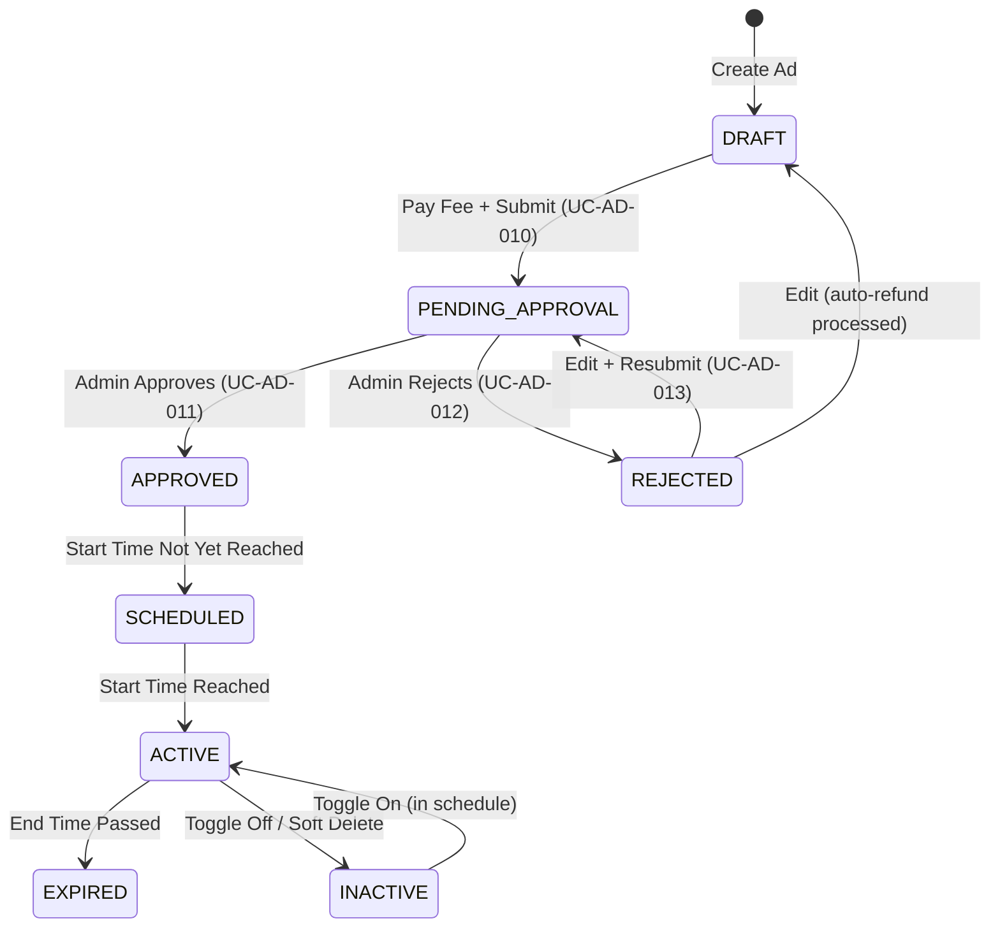

# DD_AD_01 — Module Overview

> **Doc ID:** SKM-DD-AD-01 | **Version:** 1.0 | **Status:** Released  
> **Last Updated:** 2026-08-19

---

## 1. Module Overview

The **Advertisement Management Module** (広告管理モジュール) manages the complete lifecycle of shop advertisements within the Cosmetics Finder marketplace. It enables merchants to create, schedule, pay for, and manage promotional banners tied to their approved shop, and admins to approve or reject submitted advertisements. Only paid, approved, active, and in-schedule advertisements are served to the public storefront for banner display with announcement messages. The module enforces a platform-wide weekly limit of 5 active advertisements, a per-merchant limit of 2 simultaneous active ads, and ad duration constraints of 7–30 days.

---

## 2. Supported Use Cases

| ID | Use Case | Description |
|---|----------|-------------|
| UC-AD-001 | Create Advertisement | Merchant creates a promotional ad with title, content, announcement message, optional image, optional link, and schedule. Ads are created as drafts (`payment_status = pending`, `approval_status = pending`). |
| UC-AD-002 | Schedule Advertisement | Merchant sets start/end dates; the ISO `week_number` is derived from `starts_at` for weekly limit tracking. |
| UC-AD-003 | Upload Ad Image | Merchant uploads an ad image (JPG, PNG, WebP, max 5MB) stored with UUID-based naming. |
| UC-AD-004 | List Own Advertisements | Merchant views paginated list of own ads with status and approval filters. |
| UC-AD-005 | Update Advertisement | Merchant updates ad fields; rejected ads return to `pending` approval on save. |
| UC-AD-006 | Delete Advertisement | Soft delete sets `is_active = false`, retaining the record for history. |
| UC-AD-007 | Toggle Active/Inactive | Merchant toggles ad visibility; ad displays only when active, approved, paid, and in-schedule. |
| UC-AD-008 | Display Active Advertisements | Public endpoint returns paid, approved, active, in-schedule ads for storefront banner carousel. |
| UC-AD-009 | Pay Advertising Fee | Merchant pays the advertising fee (stubbed gateway); payment transaction recorded in `ad_payments`. |
| UC-AD-010 | Submit for Approval | After payment, merchant submits ad; enters `approval_status = pending` for admin review. |
| UC-AD-011 | Approve Advertisement | Admin approves pending ad after validating weekly limit (max 5) and per-merchant limit (max 2). |
| UC-AD-012 | Reject Advertisement | Admin rejects ad with reason; automatic refund is processed (`payment_status = refunded`). |
| UC-AD-013 | Resubmit Rejected Advertisement | Merchant edits and resubmits rejected ad; `approval_status` returns to `pending`. |

---

## 3. Advertisement Lifecycle State Machine

The Advertisement module manages the complete ad lifecycle from creation through display to expiry, driven by `approval_status`, `payment_status`, `is_active`, and UTC schedule.

**Lifecycle States:**

| State | DB Conditions | Visible to Buyers | Can Edit | Can Delete |
|-------|---------------|:-----------------:|:--------:|:----------:|
| `DRAFT` | `approval_status = pending`, `payment_status = pending` | ✗ | ✓ | ✓ |
| `PENDING_APPROVAL` | `payment_status = completed`, `approval_status = pending` | ✗ | ✗ (unless rejected) | ✓ |
| `APPROVED` | `approval_status = approved`, `payment_status = completed` | depends on schedule + `is_active` | ✓ | ✓ |
| `REJECTED` | `approval_status = rejected` (refund processed) | ✗ | ✓ (resubmission) | ✓ |
| `SCHEDULED` | approved, `is_active = true`, `starts_at > now` | ✗ | ✓ | ✓ |
| `ACTIVE` | approved, `is_active = true`, `starts_at <= now <= expires_at` | ✓ | ✓ | ✓ |
| `INACTIVE` | `is_active = false` | ✗ | ✓ | ✓ |
| `EXPIRED` | `expires_at < now` | ✗ | ✓ | ✓ |

**Status Enums:**

| Enum | Allowed Values |
|------|---------------|
| `approval_status` | `pending`, `approved`, `rejected` |
| `payment_status` | `pending`, `completed`, `refunded`, `failed` |

---

## 4. Security & Permissions

1. **JWT Authentication**: Bearer Token via `Authorization` header for merchant and admin operations.
2. **Public Endpoint**: `GET /ads/active` requires no authentication for storefront banner display.
3. **Role-Based Access Control**:
   - `merchant`: CRUD on own shop's ads only (`shop_id` ownership check).
   - `admin`: Full access to all ads; approve/reject endpoints restricted to admin role.
   - `buyer`: Read-only access to active ads via public endpoint.
4. **Ownership Enforcement**: Merchants can only manage ads whose `shop_id` matches their own shop. Cross-shop access returns `403 Forbidden`.
5. **Approval Workflow**: Ads require admin approval before display; rejected ads auto-refund payment.
6. **Limit Enforcement**: Platform-wide weekly limit (5 active ads/week) and per-merchant limit (2 active ads) validated at approval time.
7. **Audit Logging**: All mutations and approval/payment actions logged with 90-day retention (`AD_CREATED`, `AD_PAID`, `AD_SUBMITTED`, `AD_APPROVED`, `AD_REJECTED`, `AD_UPDATED`, `AD_DELETED`).

---

## 5. Architectural Components Involved

| Layer | Files |
|-------|-------|
| **Frontend Pages** | `Advertisements.tsx` (merchant), `AdvertisementModeration.tsx` (admin) |
| **Frontend Components** | `AdvertisementCard.tsx`, `AdvertisementFormDialog.tsx`, `AdvertisementModerationCard.tsx`, `BannerCarousel.tsx` |
| **Frontend Hooks** | `useAdvertisements.ts` |
| **Frontend Services** | `advertisement.service.ts` |
| **Frontend Schemas** | `advertisement.schema.ts` |
| **Backend API** | `advertisements.controller.ts`, `admin-advertisements.controller.ts` |
| **Backend Service** | `advertisements.service.ts` |
| **Backend DTOs** | `create-advertisement.dto.ts`, `update-advertisement.dto.ts`, `reject-advertisement.dto.ts` |
| **Backend Guards** | `jwt-auth.guard.ts`, `roles.guard.ts` |
| **Shared Services** | `prisma.service.ts` (advertisements, ad_payments, ad_fee_settings, ad_fee_history, shops), `redis.service.ts` (active ads cache) |

---

## 6. API Endpoints

| Method | Endpoint | Description | Auth Required |
|--------|----------|-------------|:-------------:|
| `POST` | `/api/v1/ads` | Create advertisement (draft) | Yes (Merchant) |
| `GET` | `/api/v1/ads` | List own advertisements (paginated) | Yes (Merchant) |
| `PATCH` | `/api/v1/ads/:id` | Update advertisement | Yes (Merchant) |
| `DELETE` | `/api/v1/ads/:id` | Delete advertisement (soft delete) | Yes (Merchant) |
| `POST` | `/api/v1/ads/:id/pay` | Pay advertising fee | Yes (Merchant) |
| `POST` | `/api/v1/ads/:id/submit` | Submit advertisement for approval | Yes (Merchant) |
| `GET` | `/api/v1/ads/active` | List active ads for storefront display | No (Public) |
| `GET` | `/api/v1/admin/ads` | List all ads / pending approval queue | Yes (Admin) |
| `POST` | `/api/v1/admin/ads/:id/approve` | Approve advertisement | Yes (Admin) |
| `POST` | `/api/v1/admin/ads/:id/reject` | Reject advertisement (with reason + refund) | Yes (Admin) |

---

## 7. Database Tables Involved

| Table | Purpose | Operations |
|-------|---------|------------|
| `advertisements` | Store ad data, schedule, status, approval/payment fields | INSERT (create), SELECT (list/display), UPDATE (status/schedule), Soft DELETE (`is_active = false`) |
| `ad_fee_settings` | Dynamic placement/tier fee pricing | SELECT (fee lookup by placement + tier) |
| `ad_payments` | Payment transaction ledger | INSERT (payment record), UPDATE (status/refund) — linked to `merchants.id` |
| `ad_fee_history` | Audit trail for fee rate modifications | INSERT (rate change logging) |
| `shops` | Shop approval check (`is_approved`) | SELECT (verify shop before ad creation) |
| `merchants` | Merchant profile and license status | SELECT (ownership resolution) |
| `users` | Admin identity for `approved_by` FK | SELECT (approver reference) |

---

## 8. External Dependencies

| Dependency | Purpose | Configuration |
|------------|---------|---------------|
| Redis | Active ads cache (`cache:ads:active`, TTL 5 min), cache invalidation on mutations | `REDIS_URL` |
| File Storage | Ad image upload (UUID naming, outside webroot) | `AD_IMAGE_STORAGE_PATH` |
| Payment Gateway | Advertising fee payment (stubbed) | Payment service config |

---

## 9. Cross-References

| Related Document | Purpose |
|-----------------|---------|
| [DD_AD_02](./DD_Advertisement_Management_02_FRONTEND_Page.md) | Frontend page design |
| [DD_AD_03](./DD_Advertisement_Management_03_API_ENDPOINTS.md) | Backend REST API contract |
| [DD_AD_04](./DD_Advertisement_Management_04_DTOS_AND_TYPES.md) | DTO and type definitions |
| [DD_AD_05](./DD_Advertisement_Management_05_BUSINESS_LOGIC.md) | Backend business rules and ad lifecycle |
| [DD_AD_06](./DD_Advertisement_Management_06_TEST_SPEC.md) | Test specification |
| [機能設計書_Advertisement_Management](../機能設計書_Advertisement_Management.md) | Full functional specification |
| [画面項目設計書_Advertisement_Management](../画面項目設計書_Advertisement_Management.md) | Screen items specification |
