# DD_AUDIT_01 — Module Overview

> **Doc ID:** SKM-DD-AUDIT-01 | **Version:** 1.1 | **Status:** Draft  
> **Last Updated:** 2026-09-09

---

## 1. Module Overview

The **Audit Log module** provides the administrator-only audit trail for Cosmetics Finder. It supports read-only viewing, combined filtering, full-detail inspection, CSV export, and carefully constrained manual deletion of old audit records and generated export files. The module records platform activity; it does not modify audit events during viewing, filtering, refreshing, or exporting.

## 2. Supported Use Cases

| ID | Use Case | Description |
|---|---|---|
| UC-AUDIT-001 | View audit logs | Show newest-first, paginated audit events. |
| UC-AUDIT-002 | Filter and search | Combine user, action, entity, date, IP, entity ID, and text criteria using AND logic. |
| UC-AUDIT-003 | Inspect detail | Show actor, entity, JSON before/after values, IP, and user agent. |
| UC-AUDIT-004 | Export CSV | Create a CSV for the current filters, with a 365-day range and 10,000-row maximum. |
| UC-AUDIT-005 | Monitor activity | Refresh the current query every 30 seconds when enabled. |
| UC-AUDIT-006 | View related history | Reopen the list filtered by an actor or entity. |
| UC-AUDIT-007 | Manually delete retained data | Permanently remove eligible audit records and CSV export files aged at least 90 days. |

## 3. Lifecycle and Integrity Rules

```mermaid
stateDiagram-v2
  [*] --> ACTIVE: audit event inserted
  ACTIVE --> DELETABLE: age >= 90 days
  DELETABLE --> DELETED: admin manual delete
  ACTIVE: append-only; no update
  DELETABLE: append-only until delete
```

`ACTIVE` records remain protected until the configured minimum age. No scheduled purge exists. Export jobs are `NOT_STARTED → QUEUED → PROCESSING → COMPLETED|FAILED`; a completed file remains until eligible manual deletion. Export queries are read-only.

## 4. Architecture and Components

| Layer | Files / responsibilities |
|---|---|
| Frontend page | `AuditLogPage.tsx`, route `/admin/audit-logs` |
| Frontend components | `AuditLogFilters`, `AuditLogTable`, `AuditLogDetailModal`, `DeleteAuditLogsDialog`, `Pagination` |
| Frontend API/hooks | `audit-log.service.ts`, `useAuditLogs.ts`, `useAuditLogDetail.ts`, `useAuditFilters.ts`; existing admin-user search API for the actor autocomplete |
| Backend controller | `src/modules/admin/audit-logs/audit-logs.controller.ts` |
| Backend service | `src/modules/admin/audit-logs/audit-logs.service.ts`, export/deletion orchestration |
| DTOs | list, export, delete, response DTOs under `src/modules/admin/audit-logs/dto/` |
| Persistence | `audit_logs`, joined `users`, and `audit_export_files` metadata with private object storage |

## 5. Security and Permissions

- Every endpoint requires `JwtAuthGuard` and `RolesGuard` with `admin`.
- Sensitive fields (passwords, access tokens, refresh tokens, secrets) must never appear in stored or exported old/new JSON.
- Manual deletion: `olderThanDays` is always validated server-side against `AUDIT_LOG_MIN_RETENTION_DAYS` (default 90). An explicit-ID request is atomic: every target must be eligible before any target is deleted. Client validation is advisory only.
- Export objects are private. The returned download URL is a short-lived, storage-scoped signed URL; it is never a permanent public object URL.
- Deletion, export, and viewing may themselves be audited without changing the source records.

## 6. API Surface

| Method | Endpoint | Purpose |
|---|---|---|
| GET | `/api/v1/admin/audit-logs` | List current query |
| GET | `/api/v1/admin/audit-logs/:id` | Detail |
| GET | `/api/v1/admin/audit-logs/filters` | Distinct actions/entity types |
| POST | `/api/v1/admin/audit-logs/export` | CSV export |
| DELETE | `/api/v1/admin/audit-logs/files` | Delete eligible records/files |

## 7. Configuration

`AUDIT_LOG_PAGE_SIZE=50`, `AUDIT_LOG_MAX_PAGE_SIZE=200`, `AUDIT_LOG_EXPORT_MAX_ROWS=10000`, `AUDIT_LOG_AUTO_REFRESH_INTERVAL=30000`, and `AUDIT_LOG_MIN_RETENTION_DAYS=90` are external configuration defaults.

## 8. Cross-References

| Related document | Purpose |
|---|---|
| `DD_AUDIT_02_FRONTEND_PAGE.md` | Page/component behavior |
| `DD_AUDIT_03_API_ENDPOINTS.md` | REST contract |
| `DD_AUDIT_04_DTOS_AND_TYPES.md` | Validation and shared types |
| `DD_AUDIT_05_BUSINESS_LOGIC.md` | Service algorithms and rules |
| `DD_AUDIT_06_TEST_SPEC.md` | Verification scope |
| `../機能設計書_Audit_Log.md` | Functional source specification |
| `../画面項目設計書_Audit_Log.md` | Screen-item source specification |
