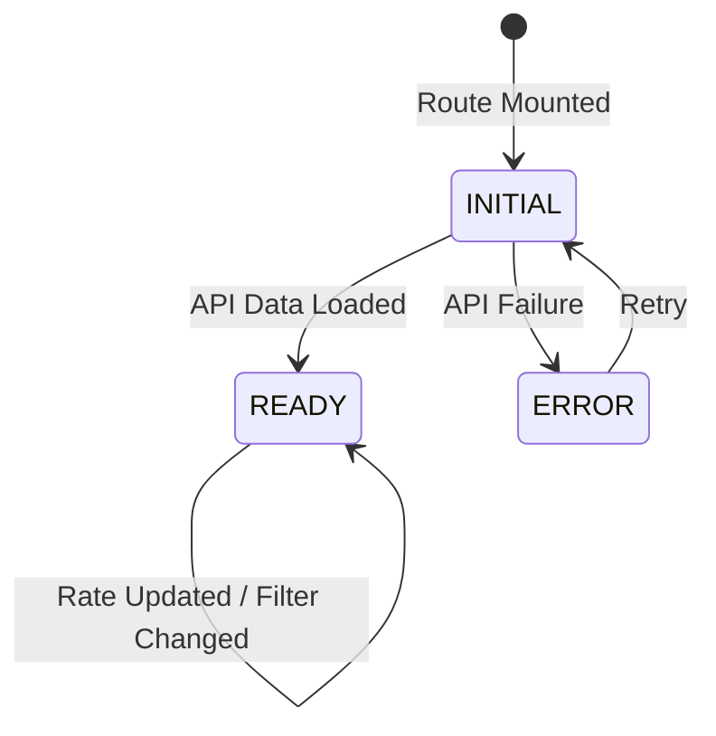
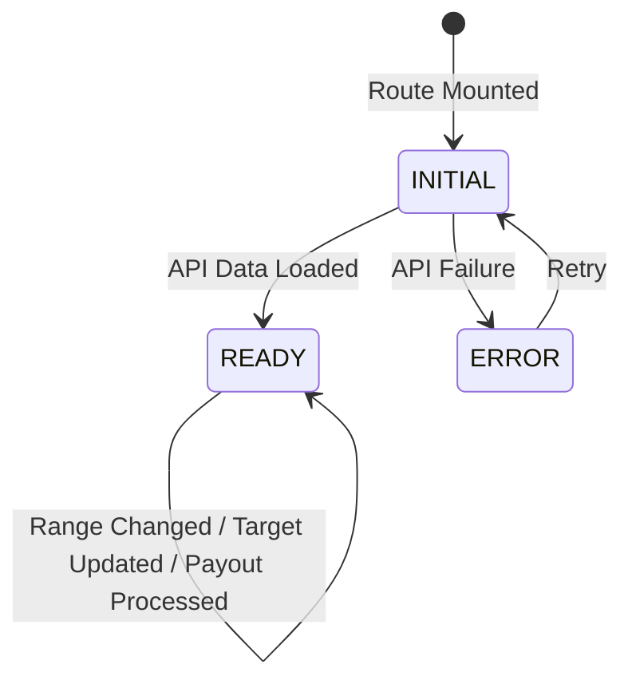

# DD_COMM_01 — Module Overview

> **Doc ID:** SKM-DD-COMM-01 | **Version:** 2.0 | **Status:** Released  
> **Last Updated:** 2026-08-26

---

## 1. Module Overview

The **Commission & Revenue Module** (手数料・収益管理モジュール) provides platform administrators with the tools required to manage commission settings, monitor revenue performance, review merchant commission reports, and process merchant payouts. The module ensures financial transparency and enables administrative control over platform fees, payouts, and revenue trends.

This module encompasses commission rate configuration, merchant-level commission report generation, revenue dashboard KPI visualization, advertisement fee revenue tracking, payment status breakdown, merchant payout management, revenue target progress monitoring, AI-powered revenue forecasting, and financial report export (CSV/Excel).

---

## 2. Supported Use Cases

| ID | Use Case | Description |
|---|----------|-------------|
| UC-COMM-001 | View Commission Dashboard | Admin navigates to `/admin/commission-revenue` and views Tab 1 (Commission) to see commission rate and report data. |
| UC-COMM-002 | Edit Commission Rate | Admin updates the platform commission rate applied to new transactions. Rate is decimal 0 < rate ≤ 100, max 2dp (default 12%). |
| UC-COMM-003 | Filter Commission Reports | Admin filters merchant commission reports by date range (`from`/`to`) with sorting and pagination. |
| UC-COMM-004 | View Revenue Dashboard | Admin navigates to `/admin/commission-revenue` Tab 2 (Revenue) to view KPI cards, trend chart, target progress, payment status, and payout list. |
| UC-COMM-005 | Process Payout | Admin processes a pending merchant payout with idempotency and status tracking. Commission deduction only; ad fees excluded. |
| UC-COMM-006 | Change Revenue Range | Admin selects `7d`/`30d`/`90d`/`1y` range to refresh trend chart and forecast data. |
| UC-COMM-007 | Set Revenue Target | Admin configures monthly or quarterly revenue target amount. Only one active target per period type. |
| UC-COMM-008 | View Target Progress | Admin views gauge bar displaying current progress toward the configured revenue target (order sales only; ad fees excluded). |
| UC-COMM-009 | View Revenue Forecast | Admin views AI-generated revenue and platform fee forecast as a dotted line on the trend chart. |
| UC-COMM-010 | View Ad Fee Revenue | Admin views advertisement fee revenue KPI and trend data in the revenue dashboard. |
| UC-COMM-011 | View Ad Fee Payment Status | Admin views ad fee payment status breakdown (completed, pending, refunded) alongside order payment statuses (completed, pending). |
| UC-COMM-012 | Export Commission Report | Admin exports merchant-level commission data as CSV or Excel file with configurable date range. |
| UC-COMM-013 | Export Revenue Report | Admin exports revenue KPI and trend data as CSV or Excel file with configurable date range. |
| UC-COMM-014 | Export Payout History | Admin exports payout records as CSV or Excel file with configurable date range. |

---

## 3. State Machine

### 3.1 Commission Page States

| State | Description | Can Edit Rate | Can View Reports |
|-------|-------------|:-------------:|:----------------:|
| `INITIAL` | Page loading data | ✓ | ✓ |
| `READY` | Data rendered | ✓ | ✓ |
| `ERROR` | Load failed | ✗ | ✗ |

### 3.2 Revenue Page States

| State | Description | Can View KPIs | Can View Target | Can View Forecast | Can Process Payout |
|-------|-------------|:-------------:|:---------------:|:-----------------:|:------------------:|
| `INITIAL` | Page loading data | ✓ | ✓ | ✓ | ✗ |
| `READY` | Data rendered | ✓ | ✓ | ✓ | ✓ |
| `ERROR` | Load failed | ✗ | ✗ | ✗ | ✗ |

### 3.3 Payout State Transitions

| Transition ID | Origin | Target | Trigger | Guard |
|---------------|--------|--------|---------|-------|
| TR-COMM-01 | `pending` | `processing` | Process payout clicked | payout exists, status = pending |
| TR-COMM-02 | `processing` | `completed` | Backend confirms payment | success response |
| TR-COMM-03 | `pending` | `failed` | Backend rejects processing | validation failure |

### 3.4 Revenue Target State Transitions

| Transition ID | Origin | Target | Trigger | Guard |
|---------------|--------|--------|---------|-------|
| TR-COMM-04 | none | `active` | Target saved | amount > 0, valid period |
| TR-COMM-05 | `active` | `active` | Target updated | new amount > 0, valid period |
| TR-COMM-06 | `active` | none | Target cleared | admin removes target |

---

## 4. Security & Permissions

1. **Authentication**: JWT access token via `Authorization` header. All endpoints are admin-only.
2. **RBAC**: Backend enforced via `@UseGuards(JwtAuthGuard, RolesGuard)` + `@Roles('admin')`. Frontend enforced via `<ProtectedRoute roles={['admin']} />`.
3. **Audit Logging**: Commission rate updates, revenue target updates, payout processing, and export generation are logged with admin identity, old/new values, IP, and timestamp. Retained 2 years (rate/target/payout) or 1 year (payout failure/export).
4. **Idempotency**: Payout processing is idempotent; retrying a processed payout returns `409 Conflict`.
5. **Currency Precision**: All monetary values transmitted and rendered as strings to preserve decimal precision. Never rendered as floats.
6. **Generic Error Messages**: Validation errors return field-specific messages. Unauthorized access returns a generic `403 Forbidden`.
7. **PII Exposure**: No PII in client logs.
8. **Export Security**: Export files do not include sensitive fields (password hashes, tokens). All export actions are logged to audit_logs.

| Role | Can View Commission | Can Edit Rate | Can Process Payout | Can Export |
|------|:-------------------:|:-------------:|:------------------:|:----------:|
| `admin` | ✓ | ✓ | ✓ | ✓ |
| `buyer` | ✗ | ✗ | ✗ | ✗ |
| `merchant` | ✗ | ✗ | ✗ | ✗ |

---

## 5. Architectural Components Involved

| Layer | Files |
|-------|-------|
| **Frontend Pages** | `CommissionRevenuePage.tsx` (single page with tabs) |
| **Frontend Components** | `CommissionRateCard.tsx`, `CommissionReportTable.tsx`, `ReportFilterPanel.tsx`, `EditRateDialog.tsx`, `RevenueKPICards.tsx`, `RevenueTrendChart.tsx`, `RangeToggle.tsx`, `PaymentStatusPanel.tsx`, `AdPaymentStatusPanel.tsx`, `PayoutTable.tsx`, `PayoutConfirmationDialog.tsx`, `RevenueTargetCard.tsx`, `GaugeBar.tsx`, `EditTargetDialog.tsx`, `ForecastSeries.tsx`, `AdFeeSummaryCard.tsx`, `ExportModal.tsx`, `ExportForm.tsx`, `RecentExportsTable.tsx` |
| **Frontend Hooks** | `useCommission.ts`, `useRevenue.ts`, `useRevenueTarget.ts`, `useRevenueForecast.ts`, `useAdFeeRevenue.ts`, `useExport.ts` |
| **Frontend Services** | `commission.service.ts`, `revenue.service.ts`, `export.service.ts` |
| **Frontend Schemas** | `commission.schema.ts`, `revenue.schema.ts`, `export.schema.ts` |
| **Backend API** | `admin-commission.controller.ts`, `admin-revenue.controller.ts` |
| **Backend Service** | `commission.service.ts`, `revenue.service.ts`, `payout.service.ts`, `forecast.service.ts`, `export.service.ts` |
| **Backend DTOs** | `update-commission-rate.dto.ts`, `revenue-target.dto.ts`, `payout-process.dto.ts`, `revenue-forecast-query.dto.ts`, `export-request.dto.ts` |
| **Backend Guards** | `jwt-auth.guard.ts`, `roles.guard.ts` |
| **Backend Config** | `jwt.config.ts` |
| **Shared Services** | `prisma.service.ts` (commission_settings, orders, merchants, payouts, revenue_targets, ad_payments, advertisements, audit_logs) |

---

## 6. API Endpoints

| Method | Endpoint | Description | Auth Required |
|--------|----------|-------------|:-------------:|
| `GET` | `/api/v1/admin/commission` | Fetch commission settings | Admin |
| `PATCH` | `/api/v1/admin/commission` | Update commission rate | Admin |
| `GET` | `/api/v1/admin/commission/reports` | Fetch merchant commission reports | Admin |
| `GET` | `/api/v1/admin/revenue` | Fetch revenue KPI data | Admin |
| `GET` | `/api/v1/admin/revenue/trends` | Fetch revenue trend series | Admin |
| `GET` | `/api/v1/admin/revenue/targets` | Fetch revenue target and progress | Admin |
| `PUT` | `/api/v1/admin/revenue/targets` | Save/update revenue target | Admin |
| `GET` | `/api/v1/admin/revenue/forecast` | Fetch AI revenue forecast series | Admin |
| `GET` | `/api/v1/admin/revenue/ad-fees` | Fetch ad fee revenue data | Admin |
| `GET` | `/api/v1/admin/revenue/payments` | Fetch payment status breakdown | Admin |
| `GET` | `/api/v1/admin/revenue/payouts` | Fetch payout list | Admin |
| `POST` | `/api/v1/admin/revenue/payouts/:id/process` | Process a payout | Admin |
| `POST` | `/api/v1/admin/commission/export` | Export commission report (CSV/Excel) | Admin |
| `POST` | `/api/v1/admin/revenue/export` | Export revenue report (CSV/Excel) | Admin |
| `POST` | `/api/v1/admin/revenue/payouts/export` | Export payout history (CSV/Excel) | Admin |

---

## 7. Database Tables Involved

| Table | Purpose | Operations |
|-------|---------|------------|
| `commission_settings` | Store platform commission rate | SELECT (load), UPDATE (edit rate) |
| `orders` | Store order transactions | SELECT (reports, KPIs, trends) |
| `merchants` | Store merchant business info | SELECT (reports, payouts) |
| `payouts` | Store payout records with status | SELECT (payout list), UPDATE (process payout) |
| `revenue_targets` | Store monthly/quarterly revenue targets | SELECT (load target), UPSERT (save target) |
| `ad_payments` | Store advertisement payment records | SELECT (ad fee KPIs, trends, payment status) |
| `advertisements` | Store advertisement records | SELECT (active ads count) |
| `audit_logs` | Store audit trail entries | INSERT (rate updates, target updates, payout processing, export generation) |

---

## 8. External Dependencies

| Dependency | Purpose | Configuration |
|------------|---------|---------------|
| Prisma ORM | Database access layer | `DATABASE_URL` |
| Redis | Rate limiting (optional) | `REDIS_URL` |
| Chart Library | Revenue trend and forecast visualization | Frontend config |
| i18next | Internationalization (EN/JA/MY) | `frontend/src/i18n.ts` |

---

## 9. Cross-References

| Related Document | Purpose |
|-----------------|---------|
| [DD_COMM_02](./DD_Commission_Revenue_02_FRONTEND_Page.md) | Frontend page design |
| [DD_COMM_03](./DD_Commission_Revenue_03_API_ENDPOINTS.md) | Backend REST API contract |
| [DD_COMM_04](./DD_Commission_Revenue_04_DTOS_AND_TYPES.md) | DTO and type definitions |
| [DD_COMM_05](./DD_Commission_Revenue_05_BUSINESS_LOGIC.md) | Backend business rules and payout lifecycle |
| [DD_COMM_06](./DD_Commission_Revenue_06_TEST_SPEC.md) | Test specification |
| [機能設計書_Commission_&_Revenue](../機能設計書_Commission_&_Revenue.md) | Full functional specification |
| [画面項目設計書_Commission_&_Revenue](../画面項目設計書_Commission_&_Revenue.md) | Screen items specification |
