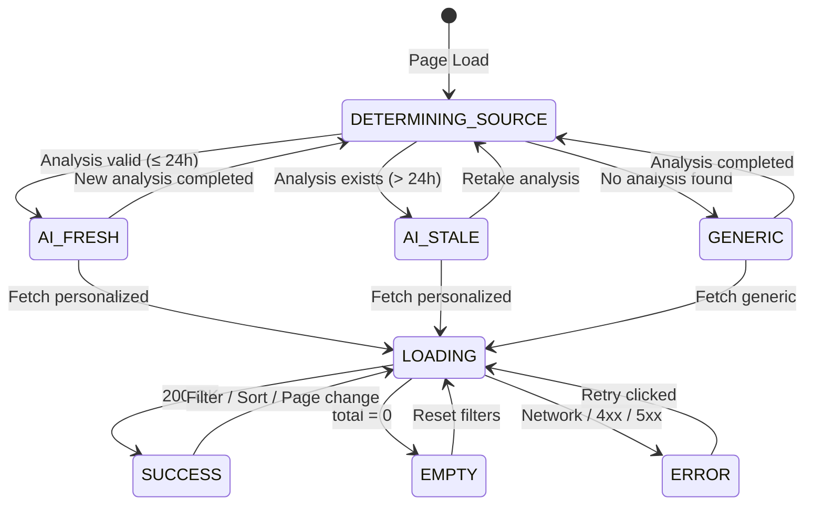

# DD_MATCH_01 — Module Overview

> **Doc ID:** SKM-DD-MATCH-01 | **Version:** 1.0 | **Status:** Released  
> **Last Updated:** 2026-09-01

---

## 1. Module Overview

The **Matching & Recommendation Module** (おすすめ・マッチングモジュール) is the personalized product discovery engine within the Cosmetics Finder platform. It translates a buyer's AI skin analysis results into ranked, score-annotated product recommendations, provides multi-dimensional filtering (skin type, ingredients, price range), maintains recommendation history from completed analysis sessions, and displays sponsored advertisements through a reusable cross-screen Slide-Down Panel.

This module bridges the AI Skin Analysis subsystem and the Product Catalog. It computes a 0–100 match score per product based on skin type compatibility, skin concern matching, average rating, and featured status, while maintaining performance through Redis caching and ensuring only active products from approved merchant shops are surfaced.

---

## 2. Supported Use Cases

| ID | Use Case | Description |
|---|----------|-------------|
| UC-MATCH-001 | Get Personalized Recommendations | Compute a ranked list of products ("Recommended for You") based on the buyer's skin type, skin concerns, and latest AI skin analysis results. Returns scored products when analysis exists; returns generic featured/top-rated products when no analysis is available. |
| UC-MATCH-002 | Get Similar Products | Recommend products similar to a given product (shared category and skin type compatibility) on product detail pages. Public endpoint — no authentication required. |
| UC-MATCH-003 | Filter by Skin Type | Narrow recommendation results to products compatible with selected skin types using `hasSome` semantics on `products.skin_types` array. |
| UC-MATCH-004 | Filter by Ingredients | Narrow recommendation results to products containing any selected ingredient using `hasSome` semantics on `products.ingredients` array. |
| UC-MATCH-005 | Filter by Price Range | Narrow recommendation results to products within `minPrice`/`maxPrice` bounds. |
| UC-MATCH-008 | View Recommendation History | View past recommendations from the buyer's completed AI skin analysis sessions, grouped by analysis date. |
| UC-MATCH-009 | View Sponsored Recommendations | Display sponsored ads from approved merchants in the Cross-Screen Slide-Down Panel (D0) with transparent disclosure. |
| UC-MATCH-010 | Track Ad Interactions | Record impressions (when panel visible ≥ 50%) and clicks (on CTA) for sponsored ad analytics. |

---

## 3. Session State Machine (Recommendation Scope)

The Matching & Recommendation module manages three distinct source states based on the buyer's analysis availability.

**Source States:**

| State | Description | UI Indicator | Match Scores | Prompt Banner |
|-------|-------------|:------------:|:------------:|:-------------:|
| `AI_FRESH` | Latest completed analysis ≤ 24h old | "🧬 AI Analysis" (emerald) | Shown | Hidden |
| `AI_STALE` | Latest completed analysis > 24h old | "🧬 AI Analysis" (emerald) | Shown | Subtle: "Want Fresh Results?" |
| `GENERIC` | No valid analysis available | "⬡ General Picks" (amber) | Hidden | Prominent: "Start Skin Analysis →" |

---

## 4. Security & Permissions

1. **JWT Authentication**: Personalized endpoints require a valid JWT Bearer Token with `buyer` role or higher.
2. **Public Endpoints**: Similar products and ad panel endpoints are public — no JWT required.
3. **Role-Based Access**: Visitor (guest) cannot access personalized features; `buyer` has full access; `merchant` and `admin` have read access.
4. **Rate Limiting**: Public similar products endpoint rate-limited to prevent abuse.
5. **Data Isolation**: Buyers only see their own recommendation history.
6. **Input Sanitization**: All filter parameters validated via Zod (frontend) and class-validator (backend).
7. **Prisma Parameterized Queries**: All database queries use parameterized statements — no raw SQL.
8. **Cache Security**: Personalized cache keys include user ID; no sensitive data cached in Redis.
9. **XSS Prevention**: User input sanitized before rendering; React auto-escaping.
10. **No console.log**: Production code uses NestJS Logger with `[MatchingService]` context.

---

## 5. Architectural Components Involved

| Layer | Files |
|-------|-------|
| **Frontend Pages** | `Recommendations.tsx`, `ProductDetail.tsx` (similar products section) |
| **Frontend Components** | `RecommendationCard.tsx`, `AdSlidePanel.tsx`, `FiltersPanel.tsx`, `SkeletonRecommendationGrid.tsx`, `HistoryAccordion.tsx`, `EmptyState.tsx` |
| **Frontend Hooks** | `useRecommendations.ts`, `useSimilarProducts.ts`, `useRecommendationHistory.ts`, `useAdPanel.ts`, `useMatchFilters.ts` |
| **Frontend Services** | `recommendation.service.ts`, `ad.service.ts` |
| **Frontend Schemas** | `matchingSearchParams.schema.ts` |
| **Frontend Providers** | — |
| **Backend API** | `recommendation.controller.ts`, `ad.controller.ts` |
| **Backend Service** | `matching.service.ts`, `ad.service.ts` |
| **Backend DTOs** | `match-query.dto.ts`, `recommendation-result.dto.ts`, `similar-query.dto.ts`, `history-query.dto.ts`, `ad-panel-query.dto.ts`, `ad-impression.dto.ts` |
| **Backend Guards** | `jwt-auth.guard.ts`, `roles.guard.ts` |
| **Backend Strategies** | `jwt-access.strategy.ts` |
| **Shared Services** | `prisma.service.ts` (products, skin_analyses, skin_analysis_recommendations, advertisements, shops), `redis.service.ts` (caching, ad rotation) |

---

## 6. API Endpoints

| Method | Endpoint | Description | Auth Required |
|--------|----------|-------------|:-------------:|
| `GET` | `/api/v1/recommendations/personalized` | Get personalized or generic recommendations | Yes (buyer) |
| `GET` | `/api/v1/recommendations/similar/:productId` | Get similar products for a given product | No |
| `GET` | `/api/v1/recommendations/history` | Get recommendation history from past analysis sessions | Yes (buyer) |
| `GET` | `/api/v1/ads/panel` | Get eligible ads for the Slide-Down Panel | No |
| `POST` | `/api/v1/ads/track/impression` | Record ad impressions when panel visible | No |
| `POST` | `/api/v1/ads/track/click` | Record ad click on CTA | No |

---

## 7. Database Tables Involved

| Table | Purpose | Operations |
|-------|---------|------------|
| `products` | Product catalog with skin_types, ingredients, price, is_featured, avg_rating, stock | SELECT (recommendations, similar) |
| `categories` | Product categories (used for similar product matching) | SELECT (JOIN with products) |
| `shops` | Merchant shop info, is_approved flag | SELECT (JOIN to filter approved shops only) |
| `skin_analyses` | Buyer's AI skin analysis results, skin_type, completed_at | SELECT (source determination, history) |
| `skin_analysis_recommendations` | Recommended products per analysis session | SELECT (history), INSERT (on analysis complete) |
| `advertisements` | Sponsored ad data, is_active, approval_status, payment_amount | SELECT (ad panel) |

---

## 8. External Dependencies

| Dependency | Purpose | Configuration |
|------------|---------|---------------|
| Redis | Personalized recommendation caching (TTL 5min), ad rotation session index (TTL 24h) | `REDIS_URL` |
| Prisma ORM | Database queries with type-safe WHERE clauses | `DATABASE_URL` |
| TanStack Query | Frontend data fetching, caching, and invalidation | — |
| Zod | Frontend query parameter validation and coercion | — |
| class-validator | Backend DTO validation | — |

---

## 9. Cross-References

| Related Document | Purpose |
|-----------------|---------|
| [DD_MATCH_02](./DD_MATCH_02_FRONTEND_Page.md) | Frontend page design |
| [DD_MATCH_03](./DD_MATCH_03_API_ENDPOINTS.md) | Backend REST API contract |
| [DD_MATCH_04](./DD_MATCH_04_DTOS_AND_TYPES.md) | DTO and type definitions |
| [DD_MATCH_05](./DD_MATCH_05_BUSINESS_LOGIC.md) | Backend business rules and matching algorithm |
| [DD_MATCH_06](./DD_MATCH_06_TEST_SPEC.md) | Test specification |
| [機能設計書_Matching_And_Recommendation](../機能設計書_Matching_And_Recommendation.md) | Full functional specification |
| [画面項目設計書_Matching_And_Recommendation](../画面項目設計書_Matching_And_Recommendation.md) | Screen items specification |
