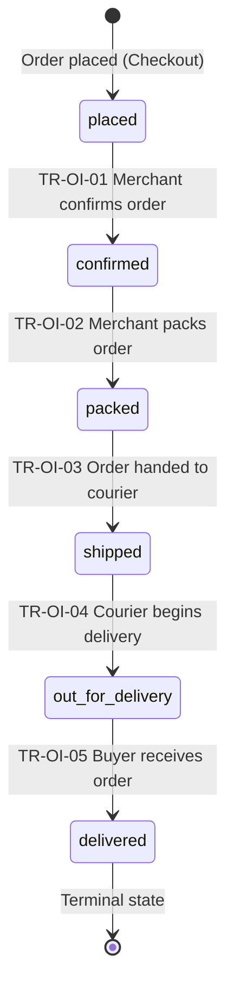

# DD_OI_01 — Module Overview

> **Doc ID:** SKM-DD-OI-01 | **Version:** 1.0 | **Status:** Draft  
> **Last Updated:** 2026-08-31

---

## 1. Module Overview

The **Order Insights Module** (注文インサイトモジュール) is the single, read-only view over the orders that belong to each platform role. It covers the **Buyer** Order History, Order Detail, and Order Tracking (機能設計書 §1, Requirement Spec §3.3); the **Merchant** own-shop Order History, Order Detail, Order Tracking, Sales Summary, and Revenue Summary (機能設計書 §1, Requirement Spec §4.5); and the **Admin** All Orders view with shop/merchant and status filters (機能設計書 §1, Requirement Spec §5.6).

The subsystem is **fully read-only** (BR-OI-007) — every figure is derived by aggregating `orders`, `order_items`, and `order_status_history`, with read-only access to `merchants`, `shops`, `users`, and `commission_settings`. Advancing an order's status belongs to the **Order Fulfillment module**; platform-level revenue, commission-rate configuration, and payouts belong to the **Revenue & Commission module** (Requirement Spec §5.7). Both are out of scope. Data is scoped server-side so each role sees only its own orders — buyer → own, merchant → own shop, admin → all (Requirement Spec §6.4, 機能設計書 §4.1).

---

## 2. Supported Use Cases

| ID | Use Case | Description |
|---|----------|-------------|
| UC-OI-001 | View Own Order History | Buyer views a paginated list of their own past orders (`orders.buyer_id = self`), sorted newest-first with optional status and date-range filters. |
| UC-OI-002 | View Own Order Detail | Buyer views order items, totals (subtotal, discount, total amount), and payment status for one of their own orders. |
| UC-OI-003 | Track Own Order | Buyer views the six-step status timeline (`placed → confirmed → packed → shipped → out_for_delivery → delivered`) for one of their own orders. |
| UC-OI-004 | View Own-Shop Order History | License-approved merchant views a paginated list of orders placed against their own shop (`orders.merchant_id = own merchants.id`), with status and date-range filters. |
| UC-OI-005 | View Own-Shop Order Detail | Merchant views order items **and customer information** (buyer name, contact, shipping address) for one own-shop order. |
| UC-OI-006 | Track Own-Shop Order | Merchant views the status timeline for one own-shop order. |
| UC-OI-007 | View Sales Summary | License-approved merchant views own-shop order counts — orders today, orders this month, and completed (`status = 'delivered'`) orders. |
| UC-OI-008 | View Revenue Summary | License-approved merchant views **Sales, Commission, Revenue, and AOV together** (never a single bare figure), with AOV computed on net Revenue. |
| UC-OI-009 | View All Orders | Admin views a paginated list of all platform orders with no implicit owner filter. |
| UC-OI-010 | Filter Orders by Shop / Merchant | Admin filters the All Orders list by shop or merchant via a searchable select. |
| UC-OI-011 | Filter Orders by Status | Admin filters the All Orders list by order status. |
| UC-OI-012 | View Any Order Detail / Tracking | Admin views the order detail (including customer information) and tracking timeline for any platform order. |

---

## 3. Order Status State Machine

The order-status state machine is **owned and enforced by the Order Fulfillment module**; it is specified here because Order Insights renders it (tracking timeline, status badges) and aggregates on it (Sales/Revenue Summaries). Transitions are forward-only — no regression, no skipping — and `delivered` is terminal (`is_terminal_state = TRUE`). Order Insights never triggers a transition (BR-OI-007).

**Order Statuses:** (matches DATABASE_SPEC §3.1 `order_statuses` — no invented states)

| State | Description | Who Can View | Can Transition |
|-------|-------------|--------------|:--------------:|
| `placed` | Order created, awaiting confirmation | Buyer (own), Merchant (own shop), Admin (all) | ✗ |
| `confirmed` | Merchant accepted order | Buyer (own), Merchant (own shop), Admin (all) | ✗ |
| `packed` | Order packed and ready to ship | Buyer (own), Merchant (own shop), Admin (all) | ✗ |
| `shipped` | Order sent to courier | Buyer (own), Merchant (own shop), Admin (all) | ✗ |
| `out_for_delivery` | Order on the way to buyer | Buyer (own), Merchant (own shop), Admin (all) | ✗ |
| `delivered` | Buyer received order — terminal | Buyer (own), Merchant (own shop), Admin (all) | ✗ |

> **Can Transition** reflects actions performed *by this module*: Order Insights is read-only, so **no** state can be advanced here (BR-OI-007). Transitions are performed exclusively by the Order Fulfillment module (機能設計書 §3.2, TR-OI-01~05).

---

## 4. Security & Permissions

1. **Authentication**: Every Order Insights endpoint requires a valid JWT Bearer Token. There are **no public endpoints** (機能設計書 §10.1).
2. **Own-Scope Principle** (BR-OI-001): Every query is scoped server-side to the caller's own data. The client never supplies its own identity filter; any client-supplied `buyerId` / `merchantId` is ignored for non-admin roles.
3. **Buyer Data Scope** (BR-OI-002): Buyer queries are scoped to `orders.buyer_id = currentUser.id`. A buyer can never see another buyer's order, nor any merchant/platform aggregate.
4. **Merchant Data Scope** (BR-OI-003): Merchant queries MUST resolve `merchants.id` via `merchants.user_id = currentUser.id`, then scope every query to `orders.merchant_id = <resolved merchants.id>`. A merchant can never see another merchant's orders or figures.
5. **Merchant Eligibility Gate** (BR-OI-006): The `merchant` role MUST have `merchants.license_status = 'approved'` to access any merchant Order Insights endpoint; otherwise `403 FORBIDDEN` — "Your merchant account is not approved". The `admin` role bypasses this check.
6. **Admin Data Scope** (BR-OI-004): Admin queries cover all platform orders with no implicit owner filter; shop/merchant and status filters are **optional and explicit** and are accepted from the admin role only.
7. **Ownership on Detail/Tracking** (BR-OI-008): Ownership is verified *after* loading; on mismatch the API returns `404 NOT_FOUND` (not `403`) so order IDs cannot be enumerated.
8. **Role Requirement** (BR-OI-005): Order History / Detail / Tracking — `buyer`, `merchant`, `admin` (each within their own scope). Sales Summary and Revenue Summary — `merchant` and `admin` only; buyers have **no** access.
9. **Read-Only Subsystem** (BR-OI-007): No write endpoints exist; status updates belong to the Order Fulfillment module, and commission-rate configuration / payouts belong to the Revenue & Commission module.
10. **PII Minimisation** (BR-OI-033): Customer information in Order Detail is limited to what fulfilment requires (name, contact, shipping address); it is projected to `merchant` / `admin` only (BR-OI-015).
11. **Filter Authorisation**: `merchantId` / `shopId` query parameters on `GET /orders` are rejected with `403` for any non-admin caller.
12. **Audit Logging** (機能設計書 §10.5): `ORDER_LIST_VIEWED`, `ORDER_DETAIL_VIEWED`, `ORDER_TRACKING_VIEWED`, `MERCHANT_SUMMARY_VIEWED` (retained 90 days) and `CROSS_SCOPE_ACCESS_DENIED` (retained 180 days, security signal).

---

## 5. Architectural Components Involved

| Layer | Files |
|-------|-------|
| **Frontend Pages** | `OrderHistoryPage.tsx` (`/orders`), `OrderDetailPage.tsx` (`/orders/:id`), `OrderTrackingPage.tsx` (`/orders/:id/tracking`), `MerchantOrderInsightsPage.tsx` (`/merchant/orders`), `MerchantOrderDetailPage.tsx` (`/merchant/orders/:id`), `AdminAllOrdersPage.tsx` (`/admin/orders`), `AdminOrderDetailPage.tsx` (`/admin/orders/:id`) |
| **Frontend Components** | `OrderListTable.tsx`, `OrderStatusBadge.tsx`, `PaymentStatusBadge.tsx`, `OrderFilterBar.tsx`, `OrderPagination.tsx`, `OrdersEmptyState.tsx`, `OrderDetailHeader.tsx`, `OrderItemsTable.tsx`, `TotalsPanel.tsx`, `ShippingAddressCard.tsx`, `CustomerInformationCard.tsx`, `TrackingTimeline.tsx`, `SalesSummaryTiles.tsx`, `RevenueSummaryGroup.tsx`, `PeriodSelector.tsx`, `AdminFilterChips.tsx` |
| **Frontend Hooks** | `useOrders.ts`, `useOrderDetail.ts`, `useOrderTracking.ts`, `useSalesSummary.ts`, `useRevenueSummary.ts` |
| **Frontend Services** | `orders.service.ts`, `merchant-summary.service.ts` |
| **Frontend Schemas** | `orders.schema.ts`, `merchant-summary.schema.ts` |
| **Backend API** | `orders.controller.ts` (scoped list / detail / tracking), `merchant-order-insights.controller.ts` (sales / revenue summaries) |
| **Backend Service** | `orders.service.ts` (query scoping, ownership, timeline build), `merchant-summary.service.ts` (aggregations, cache handling) |
| **Backend DTOs** | `order-list-query.dto.ts`, `order-id-param.dto.ts`, `summary-query.dto.ts`, `order-list-response.dto.ts`, `order-detail-response.dto.ts`, `tracking-response.dto.ts`, `sales-summary-response.dto.ts`, `revenue-summary-response.dto.ts`, `pagination-meta.dto.ts` |
| **Backend Guards** | `jwt-auth.guard.ts`, `roles.guard.ts` |
| **Backend Config** | `order-insights.config.ts` (page-size / max-page-size / cache-TTL constants) |
| **Shared Services** | `prisma.service.ts` (orders, order_items, order_statuses, order_status_history, merchants, shops, users, commission_settings), `redis.service.ts` (`cache:oi:merchant:{merchantId}:summary`), `logger.service.ts` (audit events) |

---

## 6. API Endpoints

| Method | Endpoint | Description | Auth Required |
|--------|----------|-------------|:-------------:|
| `GET` | `/api/v1/orders?status=&from=&to=&page=&limit=&sort=&order=` | Role-scoped order history list (admin additionally `&merchantId=&shopId=`) | Yes (Buyer/Merchant/Admin) |
| `GET` | `/api/v1/orders/:id` | Order detail — items, totals, payment status (+ customer info for merchant/admin) | Yes (Buyer/Merchant/Admin) |
| `GET` | `/api/v1/orders/:id/tracking` | Status timeline built from `order_statuses` + `order_status_history` | Yes (Buyer/Merchant/Admin) |
| `GET` | `/api/v1/order-insights/merchant/sales-summary` | Order counts: today / this month / completed | Yes (Merchant/Admin — merchant requires approved license) |
| `GET` | `/api/v1/order-insights/merchant/revenue-summary?period=` | Sales, Commission, Revenue, AOV — always returned together | Yes (Merchant/Admin — merchant requires approved license) |

---

## 7. Database Tables Involved

| Table | Purpose | Operations |
|-------|---------|------------|
| `orders` | Store customer order information (`buyer_id`, `merchant_id`, `status`, `total_amount`, payment fields, `shipping_address` JSONB) | SELECT (scoped list, detail header, sales counts, revenue aggregation) — **no writes** |
| `order_items` | Store line items per order with unit/total price locked at creation | SELECT (detail line items, item count) |
| `order_statuses` | Master data for status codes, labels, `display_order`, `is_terminal_state` | SELECT (tracking timeline skeleton, status badges, completed-count definition) |
| `order_status_history` | Append-only, chronological status-change audit trail per order | SELECT (tracking step timestamps) |
| `merchants` | Merchant ↔ user mapping, license status, shop name | SELECT (merchant ID resolution, license gate, shop name in admin list) |
| `shops` | Shop profiles | SELECT (admin shop filter option list) |
| `users` | User profiles incl. buyer name/contact | SELECT (customer-information block, merchant/admin only) |
| `commission_settings` | Platform commission rate (default 12%) | SELECT (revenue summary rate — read-only, BR-OI-023) |

---

## 8. External Dependencies

| Dependency | Purpose | Configuration |
|------------|---------|---------------|
| Prisma ORM | Database access layer | `DATABASE_URL` |
| Redis | Merchant sales/revenue summary cache and invalidation | `REDIS_URL`, `OI_SUMMARY_CACHE_TTL_SECONDS` |
| TanStack Query v5 | Frontend server-state fetching and cache invalidation | Frontend config |
| React Hook Form + Zod | Filter / pagination / period input validation | Frontend config |
| i18next | Internationalization (EN / MY / JA) | `frontend/src/i18n.ts` |

---

## 9. Cross-References

| Related Document | Purpose |
|-----------------|---------|
| [DD_OI_02](./DD_Order_Insights_02_FRONTEND_Page.md) | Frontend page design |
| [DD_OI_03](./DD_Order_Insights_03_API_ENDPOINTS.md) | Backend REST API contract |
| [DD_OI_04](./DD_Order_Insights_04_DTOS_AND_TYPES.md) | DTO and type definitions |
| [DD_OI_05](./DD_Order_Insights_05_BUSINESS_LOGIC.md) | Backend business rules and state machine |
| [DD_OI_06](./DD_Order_Insights_06_TEST_SPEC.md) | Test specification |
| [機能設計書_Order_Insights](../機能設計書_Order_Insights.md) | Full functional specification |
| [画面項目設計書_Order_Insights](../画面項目設計書_Order_Insights.md) | Screen items specification |
