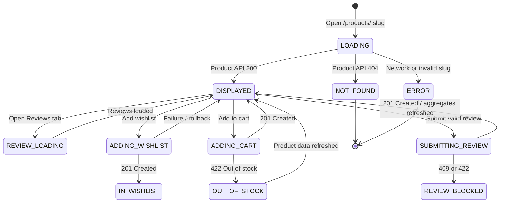

# DD_PROD_01 - Module Overview

> **Doc ID:** SKM-DD-PROD-01 | **Version:** 1.1 | **Status:** Draft  
> **Last Updated:** 2026-08-24

---

## 1. Module Overview

The Product Detail module displays one active product and supports the buyer journey around that product: viewing images and product data, reading reviews, viewing related products and active promotions, viewing sidebar advertisements, adding a product to a wishlist, and requesting an add-to-cart action.

- **Module Path:** `frontend/src/features/products`
- **Primary Route:** `/products/:slug`
- **Primary Actors:** Visitors (read-only) and authenticated buyers (mutations)
- **Source Specifications:** `SKM-FDS-PROD-001` (v7.1) and `SKM-SIS-SCR-002` (v1.10)

---

## 2. Supported Use Cases

| UC-ID | Use Case | Preconditions | Result |
|-------|----------|---------------|--------|
| UC-PROD-001 | View product detail | Product exists and `is_active = true` | Product, category, merchant, and shop information is rendered. |
| UC-PROD-002 | View reviews | Product exists | Approved reviews are displayed with pagination. |
| UC-PROD-003 | Submit review | Authenticated buyer has a delivered order containing the product | Review is created and rating aggregates refresh. |
| UC-PROD-004 | View similar products | Product exists | Up to eight active related products are displayed. |
| UC-PROD-005 | Add to wishlist | Authenticated buyer; no existing wishlist entry | Wishlist entry is created with optimistic UI confirmation. |
| UC-PROD-006 | Add product to cart | Authenticated buyer; product is in stock | Cart API request is accepted only after atomic stock validation. |
| UC-PROD-007 | View active promotions | Merchant has eligible promotions | Current promotions and remaining balances are displayed. |
| UC-PROD-008 | View sidebar advertisements | Product exists; approved, paid ads for the `product_sidebar` placement are running | Up to five sponsored ads are displayed in the sidebar slider (Rules BR-PROD-020~023). |

---

## 3. Product Interaction State Machine

| State | Description | Available Actions |
|-------|-------------|-------------------|
| `LOADING` | Product detail request is in progress. | None; skeleton UI shown. |
| `DISPLAYED` | Active product is loaded. | Browse, change image, change tab, and buyer mutations when authorized. |
| `IN_WISHLIST` | Wishlist add succeeded. | Browse; wishlist removal is out of scope. |
| `ADDING_CART` | Cart request is in progress. | Submission is disabled. |
| `OUT_OF_STOCK` | Product is unavailable for cart addition. | Browse; Add to Cart remains disabled. |
| `REVIEW_BLOCKED` | Buyer cannot submit another review or lacks a verified purchase. | Browse existing reviews. |
| `NOT_FOUND` | Product is missing or inactive. | Return to product listing. |
| `ERROR` | A recoverable request error occurred. | Retry affected request. |

---

## 4. Security & Permissions

1. Product detail, reviews, similar products, promotions, and sidebar advertisements are public read operations.
2. Review creation, wishlist addition, and cart addition require `JwtAuthGuard` and the `buyer` role.
3. Review creation requires a delivered order containing the product and the unique `(user_id, product_id)` review constraint.
4. Wishlist addition enforces the unique `(user_id, product_id)` constraint on `wishlist`.
5. Product detail reads only products where `is_active = true`; inactive products return 404 to buyers.
6. Review body and title are rendered through React escaping. No untrusted HTML is rendered directly.
7. Product cache is invalidated after a product or approved-review update.

---

## 5. Architectural Components Involved

| Layer | Files / Components |
|-------|--------------------|
| **Frontend Page** | `ProductDetailPage.tsx` |
| **Frontend Components** | `ProductGallery.tsx`, `ProductInfo.tsx`, `SkinTypeCompatibility.tsx`, `ProductTabs.tsx`, `ProductReviews.tsx`, `RelatedProducts.tsx`, `ActivePromotion.tsx`, `SidebarAdvertisements.tsx` |
| **Frontend Hooks** | `useProductDetail.ts`, `useProductReviews.ts`, `useWishlist.ts`, `useCart.ts`, `useSidebarAds.ts` |
| **Frontend Services** | `products.service.ts`, `reviews.service.ts`, `wishlist.service.ts`, `cart.service.ts`, `promotions.service.ts`, `advertisements.service.ts` |
| **Frontend Schemas** | `product-detail.schema.ts` |
| **Backend API** | `products.controller.ts`, `reviews.controller.ts`, `wishlist.controller.ts`, `cart.controller.ts`, `recommendations.controller.ts`, `advertisements.controller.ts` |
| **Backend Services** | Product, review, wishlist, cart, recommendation, promotion, and advertisement services |
| **Backend Guards** | `JwtAuthGuard`, `RolesGuard` |
| **Shared Services** | Prisma for persistence; Redis for product-detail caching |

---

## 6. API Endpoints

| Method | Endpoint | Description | Auth Required |
|--------|----------|-------------|:-------------:|
| `GET` | `/api/v1/products/:slug` | Get one active product detail. | No |
| `GET` | `/api/v1/products/:productId/reviews` | Get approved reviews, with `page` and `limit` (1-50). | No |
| `POST` | `/api/v1/products/:productId/reviews` | Create a verified-purchase review. | Buyer |
| `GET` | `/api/v1/recommendations/similar/:productId` | Get up to eight related products. | No |
| `POST` | `/api/v1/wishlist/:productId` | Add a product to the wishlist. | Buyer |
| `POST` | `/api/v1/cart/items` | Add or merge a cart item after stock validation. | Buyer |
| `GET` | `/api/v1/products/:slug/promotions` | Get eligible merchant promotions. | No |
| `GET` | `/api/v1/products/:slug/advertisements` | Get eligible sidebar ads for the `product_sidebar` placement (max 5 per rotation). | No |

---

## 7. Database Tables Involved

| Table | Purpose | Operations |
|-------|---------|------------|
| `products` | Product detail, availability, stock, images, rating aggregates | SELECT |
| `categories` | Product category information | SELECT |
| `merchants` | Product merchant and merchant display name | SELECT |
| `shops` | Shop name, slug, logo, and approval status | SELECT |
| `reviews` | Approved review list and review creation | SELECT, INSERT |
| `users` | Review author name and avatar | SELECT |
| `wishlist` | Buyer wishlist membership | SELECT, INSERT |
| `orders`, `order_items` | Verified-purchase eligibility check | SELECT |
| `promotions` | Eligible merchant promotions | SELECT |
| `advertisements` | Sidebar ads for the `product_sidebar` placement (approved/paid/active only) | SELECT |
| `ad_fee_settings` | Placement/tier fee configuration for the `product_sidebar` placement | SELECT |
| `ad_payments` | Payment status of displayed advertisements | SELECT |

> **Cart persistence:** Cart data is stored in the `carts` and `cart_items` tables per DATABASE_SPEC v2.4. Each authenticated buyer has one active cart (`uq_carts_user_id`), and cart lines use the unique constraint `uq_cart_items_cart_product` on `(cart_id, product_id)` to merge duplicate product additions (Rule B-CART-009). The `POST /api/v1/cart/items` endpoint is owned by the Cart team.

---

## 8. External Dependencies

| Dependency | Purpose | Configuration |
|------------|---------|---------------|
| Redis | Product detail cache and cache invalidation | `REDIS_HOST`, `REDIS_PORT` |
| Prisma / PostgreSQL | Product, review, wishlist, order, and promotion access | `DATABASE_URL` |
| File Storage | Product and review image URLs | Upload/CDN configuration |
| React Query | Query caching, invalidation, and optimistic wishlist state | Frontend query client |
| React Hook Form + Zod | Review and quantity validation | Frontend validation schemas |

---

## 9. Cross-References

| Related Document | Purpose |
|------------------|---------|
| [DD_PROD_02](./DD_ProductDetail_02_FRONTEND_Page.md) | Frontend page design |
| [DD_PROD_03](./DD_ProductDetail_03_API_ENDPOINTS.md) | API endpoint contracts, guards, and rate limits |
| [DD_PROD_04](./DD_ProductDetail_04_DTOS_AND_TYPES.md) | DTO and type definitions |
| [DD_PROD_05](./DD_ProductDetail_05_BUSINESS_LOGIC.md) | Business logic, caching, and security rules |
| [DD_PROD_06](./DD_ProductDetail_06_TEST.md) | Test specification and coverage requirements |
| [機能設計書_ProductDetail](../機能設計書_ProductDetail.md) | Full functional specification (v7.1) |
| [画面項目設計書_ProductDetail](../画面項目設計書_ProductDetail.md) | Screen-item definitions, UI behavior, and i18n keys (v1.10) |
| [データベース設計書_DATABASE_SPEC](../../../core-work/データベース設計書_DATABASE_SPEC.md) | Table constraints and UUID data model (v2.4) |
| [開発ルール_DEVELOPMENT_RULES](../../../core-work/開発ルール_DEVELOPMENT_RULES.md) | Security, accessibility, API, and quality rules (v2.1) |
