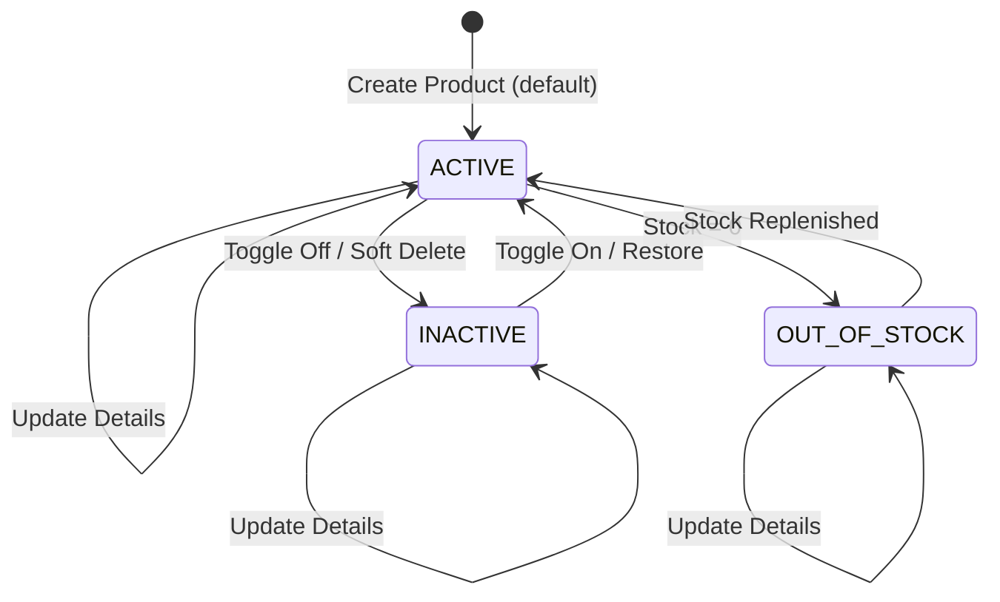

# DD_PROD_01 — Module Overview

> **Doc ID:** SKM-DD-PROD-01 | **Version:** 1.2 | **Status:** Released  
> **Last Updated:** 2026-08-18

---

## 1. Module Overview

The **Product Management Module** (商品管理モジュール) enables merchants to manage their skincare product catalog through full CRUD operations within the Cosmetics Finder marketplace. This module handles product creation, editing, soft deletion, image management, inventory tracking, and status toggling. It ensures data integrity through merchant ownership enforcement, slug/SKU uniqueness validation, and Redis-based cache invalidation. The module is central to the marketplace, connecting merchants to buyers through product listings, categories, and search functionality.

---

## 2. Supported Use Cases

| ID | Use Case | Description |
|---|----------|-------------|
| UC-PROD-001 | Create New Product | Merchant creates a new product listing with name, description, price, category, images, skin type compatibility, ingredients, and tags. |
| UC-PROD-002 | Edit Existing Product | Merchant updates product details, pricing, images, and metadata. Slug uniqueness validated on name change. |
| UC-PROD-003 | Delete Product (Soft) | Merchant soft-deletes a product by setting `is_active = false`. Product hidden from public view but retained in database. |
| UC-PROD-004 | Upload Product Images | Merchant uploads up to 10 product images (JPG, PNG, WebP, max 5MB each). Images stored with UUID-based filenames. |
| UC-PROD-005 | Update Stock Quantity | Merchant updates inventory count. System checks low stock threshold and out-of-stock conditions. |
| UC-PROD-006 | Toggle Product Active/Inactive | Merchant toggles product visibility without deleting. Inactive products hidden from searches. |
| UC-PROD-007 | Set Product as Featured | Merchant flags product as featured. Featured products appear on home page featured section. |
| UC-PROD-008 | View Merchant Product List | Merchant views paginated list of own products with search, filter, and bulk action capabilities. |

---

## 3. Product State Machine

The Product Management module manages product lifecycle through distinct states with well-defined transitions.



**Product States:**

| State | Description | Visible to Buyers | Can Add to Cart | Can Edit |
|-------|-------------|:-----------------:|:---------------:|:--------:|
| `ACTIVE` | Product is live and available for purchase | ✓ | ✓ | ✓ |
| `INACTIVE` | Product hidden by merchant (soft delete) | ✗ | ✗ | ✓ |
| `OUT_OF_STOCK` | Product has zero stock quantity | ✓ (read-only) | ✗ | ✓ |

---

## 4. Security & Permissions

1. **Authentication**: JWT Bearer Token required for all merchant operations.
2. **Role-Based Access Control (RBAC)**:
   - `merchant`: Can create, edit, delete own products only.
   - `admin`: Can manage all products across all merchants.
3. **Ownership Enforcement**: Merchants can only modify products where `merchantId` matches their user ID.
4. **Input Validation**: Multi-layer validation — Frontend (Zod) → Backend (class-validator DTOs) → Database (CHECK constraints).
5. **File Upload Security**:
   - MIME type validation (image/jpeg, image/png, image/webp).
   - File size limit: 5MB per image.
   - Maximum 10 images per product.
   - UUID-based filenames to prevent path traversal.
6. **Slug Uniqueness**: Auto-generated from product name, validated for uniqueness.
7. **SKU Uniqueness**: Optional but globally unique if provided.
8. **Soft Delete**: Products are never physically removed; `is_active = false` hides from public view.
9. **Cache Invalidation**: Product mutations trigger Redis cache eviction for data consistency.
10. **Audit Logging**: All product mutations written to `audit_logs` table with merchant_id, product_id, action type, timestamp, and change details. Previously logged to console only; now persisted for compliance and debugging.
11. **License Status Guard (`requireApprovedMerchant`)**: All merchant product CRUD operations (Create, Update, Delete, Stock Update) are protected by the `requireApprovedMerchant` guard. Merchants with `pending` status receive `403 MERCHANT_NOT_APPROVED`. Merchants with `rejected` status receive `403 MERCHANT_REJECTED` with rejection reason from database.
12. **Active Order Deletion Guard (BR-PROD-024)**: Products with active orders (status NOT IN 'delivered', 'cancelled') cannot be soft-deleted. This prevents data integrity issues with ongoing transactions.

---

## 5. Architectural Components Involved

| Layer | Files |
|-------|-------|
| **Frontend Pages** | `merchant/Products.tsx`, `merchant/ProductForm.tsx` |
| **Frontend Components** | `ProductCard.tsx`, `ProductGrid.tsx`, `ProductDetail.tsx`, `ProductReviews.tsx` |
| **Frontend Hooks** | `useProducts.ts`, `useProductDetail.ts`, `useInventoryTransactions.ts` |
| **Frontend Services** | `product.service.ts`, `inventory.service.ts` |
| **Frontend Schemas** | `product.schema.ts` |
| **Backend API** | `products.controller.ts`, `inventory.controller.ts` |
| **Backend Service** | `products.service.ts`, `inventory.service.ts`, `audit.service.ts` |
| **Backend DTOs** | `create-product.dto.ts`, `update-product.dto.ts`, `product-query.dto.ts`, `inventory-transaction.dto.ts` |
| **Backend Guards** | `jwt-auth.guard.ts`, `roles.guard.ts`, `require-approved-merchant.guard.ts` |
| **Backend Interceptors** | `logging.interceptor.ts`, `transform.interceptor.ts` |
| **Shared Services** | `prisma.service.ts` (products, categories, inventory_transactions, audit_logs, notifications), `redis.service.ts` (cache invalidation) |
| **Shared Utils** | `slug.util.ts` (slug generation) |

---

## 6. API Endpoints

| Method | Endpoint | Description | Auth Required | Role |
|--------|----------|-------------|:-------------:|------|
| `GET` | `/api/v1/products` | List products (public, filterable, paginated) | No | Public |
| `GET` | `/api/v1/products/:slug` | Get product detail by slug (public) | No | Public |
| `POST` | `/api/v1/products` | Create new product | Yes | merchant, admin |
| `PATCH` | `/api/v1/products/:id` | Update product details | Yes | merchant, admin |
| `DELETE` | `/api/v1/products/:id` | Soft delete product (set `is_active = false`) | Yes | merchant, admin |
| `PATCH` | `/api/v1/products/:id/stock` | Update stock quantity (creates `inventory_transactions` record) | Yes | merchant, admin |
| `GET` | `/api/v1/products/:id/inventory-transactions` | Get stock change history for a product | Yes | merchant, admin |
| `GET` | `/api/v1/categories` | Get category tree structure | No | Public |

**Query Parameters (GET /products):**

| Parameter | Type | Description |
|-----------|------|-------------|
| `search` | string | Search by product name or SKU |
| `categoryId` | string | Filter by category ID |
| `skinType` | string | Filter by skin type compatibility |
| `minPrice` | number | Minimum price filter |
| `maxPrice` | number | Maximum price filter |
| `sortBy` | string | Sort by: `price`, `rating`, `newest`, `name` |
| `sortOrder` | string | Sort direction: `asc`, `desc` |
| `page` | number | Page number (default: 1) |
| `limit` | number | Items per page (default: 20) |
| `isActive` | boolean | Filter by active status (merchant only) |
| `isFeatured` | boolean | Filter by featured status |

---

## 7. Database Tables Involved

| Table | Purpose | Operations |
|-------|---------|------------|
| `products` | Store product listings with details, pricing, inventory | INSERT (create), SELECT (list/detail), UPDATE (edit/stock/toggle), UPDATE is_active (soft delete) |
| `categories` | Product category tree structure | SELECT (category tree, filter) |
| `merchants` | Merchant profiles with license status | SELECT (ownership verification, license check) |
| `users` | User accounts and authentication | SELECT (merchant user lookup) |
| `reviews` | Product reviews with ratings | SELECT (avg rating, review count), aggregation |
| `wishlist` | User saved products | SELECT (wishlist status), INSERT/DELETE (toggle) |
| `order_items` | Order line items linking products to orders | SELECT (sales history), UPDATE (stock decrement) |
| `orders` | Customer orders linking buyers to merchants | SELECT (active order check for deletion guard) |
| `inventory_transactions` | Track all stock changes (adjustments, sales, returns) for products | INSERT (on stock update), SELECT (stock history) |
| `order_status_history` | Track order status changes for active order guard validation | SELECT (verify order terminal states) |
| `audit_logs` | Store audit events for all product mutations (create, update, delete, stock change) | INSERT (on product mutation), SELECT (audit trail) |
| `notifications` | User notifications including low stock alerts | INSERT (on low stock threshold breach) |
| `carts` | Shopping carts linking buyers to merchants | SELECT (check product availability in carts) |
| `cart_items` | Line items in shopping carts with product references | SELECT (verify product not in active carts before deletion) |

**Key Relationships:**
- `products.merchant_id` → `merchants.id` (ON DELETE CASCADE, ON UPDATE CASCADE)
- `products.category_id` → `categories.id` (ON DELETE RESTRICT, ON UPDATE CASCADE)
- `merchants.user_id` → `users.id` (ON DELETE CASCADE, ON UPDATE CASCADE)
- `users.merchant_id` → `merchants.id` (ON DELETE SET NULL, ON UPDATE CASCADE)
- `reviews.product_id` → `products.id` (ON DELETE CASCADE, ON UPDATE CASCADE)
- `wishlist.product_id` → `products.id` (ON DELETE CASCADE, ON UPDATE CASCADE)
- `order_items.product_id` → `products.id` (ON DELETE RESTRICT, ON UPDATE CASCADE)
- `order_items.order_id` → `orders.id` (ON DELETE CASCADE, ON UPDATE CASCADE)
- `orders.merchant_id` → `merchants.id` (ON DELETE RESTRICT, ON UPDATE CASCADE)
- `inventory_transactions.product_id` → `products.id` (ON DELETE RESTRICT, ON UPDATE CASCADE)
- `inventory_transactions.merchant_id` → `merchants.id` (ON DELETE RESTRICT, ON UPDATE CASCADE)
- `audit_logs.merchant_id` → `merchants.id` (ON DELETE SET NULL, ON UPDATE CASCADE)
- `notifications.user_id` → `users.id` (ON DELETE CASCADE, ON UPDATE CASCADE)
- `carts.merchant_id` → `merchants.id` (ON DELETE RESTRICT, ON UPDATE CASCADE)
- `carts.buyer_id` → `users.id` (ON DELETE CASCADE, ON UPDATE CASCADE)
- `cart_items.cart_id` → `carts.id` (ON DELETE CASCADE, ON UPDATE CASCADE)
- `cart_items.product_id` → `products.id` (ON DELETE RESTRICT, ON UPDATE CASCADE)
- `cart_items.merchant_id` → `merchants.id` (ON DELETE RESTRICT, ON UPDATE CASCADE)

---

## 8. External Dependencies

| Dependency | Purpose | Configuration |
|------------|---------|---------------|
| Redis | Product cache, list cache, category cache | `REDIS_URL` |
| File Storage | Product image upload and storage | `PRODUCT_STORAGE_PATH`, `PRODUCT_IMAGES_MAX`, `PRODUCT_IMAGE_MAX_SIZE_MB` |
| PostgreSQL | Primary data store for products, categories, reviews | `DATABASE_URL` |
| Prisma ORM | Type-safe database access and migrations | `backend/prisma/schema.prisma` |

**Cache Keys:**

| Key Pattern | TTL | Invalidation Trigger |
|-------------|-----|---------------------|
| `cache:product:{slug}` | 5 minutes | Product update/delete |
| `cache:products:list:{hash}` | 2 minutes | Any product mutation |
| `cache:categories` | 30 minutes | Category mutation |

---

## 9. Business Rules Summary

| Rule ID | Rule Name | Description | Enforcement |
|---------|-----------|-------------|-------------|
| BR-PROD-001 | Required Fields | Product must have: name, categoryId, price, description | Backend DTO + Frontend Zod |
| BR-PROD-002 | Price Positive | Price must be > 0 | DB constraint `chk_products_price` |
| BR-PROD-003 | Compare Price | compareAtPrice must be > price (if provided) | Backend DTO validation |
| BR-PROD-004 | SKU Uniqueness | SKU must be unique across all products (if provided) | DB constraint `uq_products_sku` |
| BR-PROD-005 | Slug Generation | Slug auto-generated from product name, must be unique | Backend slug util |
| BR-PROD-006 | Category Existence | Category must exist and be valid | DB FK constraint |
| BR-PROD-007 | Default Status | New products default to `is_active = true` | DB default |
| BR-PROD-008 | Default Featured | New products default to `is_featured = false` | DB default |
| BR-PROD-009 | Max Images | Maximum 10 images per product | Backend DTO validation |
| BR-PROD-010 | File Size | Maximum 5MB per image | Backend file upload validation |
| BR-PROD-011 | File Types | Allowed: JPG, PNG, WebP | Backend MIME type validation |
| BR-PROD-012 | Primary Image | First image is the primary/cover image | Frontend display logic |
| BR-PROD-013 | File Naming | UUID-based filenames to prevent conflicts | Backend upload service |
| BR-PROD-014 | Active Visibility | Only `is_active = true` products are publicly visible | Backend query filter |
| BR-PROD-015 | Inactive Hidden | Inactive products hidden from public view but visible to merchant | Backend role-based query |
| BR-PROD-016 | Soft Delete | Delete sets `is_active = false`, does not remove record. Audit event written to `audit_logs` table. | Backend service logic + audit_logs INSERT |
| BR-PROD-017 | Featured Flag | Featured products appear on home page | Backend query filter |
| BR-PROD-018 | Stock Non-Negative | Stock quantity cannot go below 0 | DB constraint `chk_products_stock` |
| BR-PROD-019 | Low Stock Threshold | Default threshold is 10 units. Warning when stock ≤ threshold. Notification created in `notifications` table when threshold breached. | Backend service logic + notifications INSERT |
| BR-PROD-020 | Out of Stock | Products with 0 stock marked as out of stock | Backend status logic |
| BR-PROD-021 | Atomic Decrement | Stock decremented atomically on order creation. Record inserted into `inventory_transactions` with transaction_type='sale' and before/after quantities. | Backend DB transaction + inventory_transactions INSERT |
| BR-PROD-021a | Inventory Transaction Logging | Every stock change (manual update, sale, return, adjustment) creates an `inventory_transactions` record capturing: product_id, merchant_id, transaction_type, quantity delta, before_quantity, after_quantity, reference_type, reference_id, reason, created_by. | Backend service logic |
| BR-PROD-022 | Merchant Ownership | Merchants can only edit/delete their own products | Backend service check |
| BR-PROD-023 | Admin Override | Admins can manage all products | Backend RBAC |
| BR-PROD-024 | Active Order Deletion Guard | Product cannot be soft-deleted if it has any associated orders with status NOT IN ('delivered', 'cancelled'). Validates against `order_status_history` to confirm terminal states. Only products with no orders or all orders in terminal states can be deleted. | Backend service logic (softDelete method) + order_status_history SELECT |
| BR-PROD-025 | Deletion Restriction Message | When deletion is blocked due to active orders, return 409 Conflict with error message: "Cannot delete product with active orders. All orders must be completed first." Audit event written to `audit_logs`. | Backend error response (409 CONFLICT) + audit_logs INSERT |
| BR-PROD-026 | Pending License Restriction | Merchants with license status `pending` are restricted from all Product CRUD operations (Create, Update, Delete, Stock Update). Merchants with `rejected` status are also restricted. | Backend `requireApprovedMerchant` guard |
| BR-PROD-027 | Pending License Redirect | When a merchant with `pending` status attempts to access `/merchant/products/*`, the backend returns `403 MERCHANT_NOT_APPROVED`. Frontend displays error toast and redirects to home page (`/`). For rejected merchants, backend returns `403 MERCHANT_REJECTED` with rejection reason from `merchants.rejection_reason` column included in error message: "Your account has been rejected. Reason: [rejection_reason]". | Backend `requireApprovedMerchant` guard + Frontend route guard |

---

## 10. Screen Transitions

### 10.1 Navigation Flow

```
Merchant Dashboard
    │
    ▼
/merchant/products ──────────────────────────────┐
    │                                             │
    ├──► /merchant/products/new (Create)          │
    │         │                                   │
    │         ├──► /merchant/products (Success)   │
    │         └──► /merchant/products (Cancel)    │
    │                                             │
    ├──► /merchant/products/:id/edit (Edit)       │
    │         │                                   │
    │         ├──► /merchant/products (Success)   │
    │         └──► /merchant/products (Cancel)    │
    │                                             │
    └──► /products/:slug (Public Detail) ─────────┘
```

### 10.2 Error Navigation

| Source | Target | Condition |
|--------|--------|-----------|
| Any merchant product page | `/login` | 401 Unauthorized |
| Any merchant product page | `/unauthorized` | 403 Forbidden |
| Any merchant product page | `/` (Home) | 403 `MERCHANT_NOT_APPROVED` — error toast displayed before redirect |
| `/merchant/products/:id/edit` | `/merchant/products` | 404 Product not found |

---

## 11. Input Validation Summary

### 11.1 Product Form Fields

| Field | Type | Required | Validation | Error Code |
|-------|------|:--------:|------------|------------|
| `name` | String(255) | Yes | `@IsString()`, `@IsNotEmpty()`, `@MaxLength(255)` | VAL-PROD-001/002 |
| `shortDescription` | String(500) | Yes | `@IsString()`, `@IsNotEmpty()`, `@MaxLength(500)` | VAL-PROD-003/004 |
| `description` | TEXT | Yes | `@IsString()`, `@IsNotEmpty()` | VAL-PROD-005 |
| `categoryId` | String(25) | Yes | `@IsString()`, `@IsNotEmpty()` | VAL-PROD-006 |
| `price` | Decimal(10,2) | Yes | `@IsNumber()`, `@Min(0.01)` | VAL-PROD-007 |
| `compareAtPrice` | Decimal(10,2) | No | `@IsOptional()`, `@IsNumber()`, `@Min(0)` | VAL-PROD-008 |
| `sku` | String(100) | No | `@IsOptional()`, `@IsString()`, `@MaxLength(100)`, unique | VAL-PROD-009 |
| `stockQuantity` | Integer | Yes | `@IsInt()`, `@Min(0)` | VAL-PROD-014 |
| `lowStockThreshold` | Integer | No | `@IsInt()`, `@Min(0)` | — |
| `skinTypes` | String[] | No | `@IsArray()`, `@IsIn(['dry','oily','combination','sensitive','normal'])` | — |
| `ingredients` | String[] | No | `@IsArray()`, `@IsString({ each: true })` | VAL-PROD-015 |
| `tags` | String[] | No | `@IsArray()`, `@IsString({ each: true })` | VAL-PROD-016 |
| `isActive` | Boolean | Yes | `@IsBoolean()`, default true | — |
| `isFeatured` | Boolean | No | `@IsBoolean()`, default false | — |
| `images` | File[] | Yes | Max 10 files, 5MB each, JPG/PNG/WebP | VAL-PROD-010~013 |

---

## 12. Cross-References

| Related Document | Purpose |
|-----------------|---------|
| [DD_PROD_02](./DD_PROD_02_FRONTEND_PRODUCT_LIST.md) | Product list page frontend design |
| [DD_PROD_03](./DD_PROD_03_FRONTEND_PRODUCT_FORM.md) | Product form (create/edit) frontend design |
| [DD_PROD_04](./DD_PROD_04_API_ENDPOINTS.md) | Backend REST API contract |
| [DD_PROD_05](./DD_PROD_05_BUSINESS_LOGIC.md) | Backend business rules and state transitions |
| [DD_PROD_06](./DD_PROD_06_IMAGE_MANAGEMENT.md) | Image upload and management implementation |
| [機能設計書_Product_Management](../商品管理画面_機能設計書.md) | Full functional specification |
| [画面項目設計書_Product_Management](../画面項目設計書_Product_Management.md) | Screen items specification |
| [要件定義書](../../../../core-work/要件定義書_REQUIREMENT_SPEC.md) | Requirements definition (M-PROD-001~010) |
| [データベース設計書](../../../../core-work/データベース設計書_DATABASE_SPEC.md) | Database schema (`products`, `categories`) |
| [開発ルール](../../../../core-work/開発ルール_DEVELOPMENT_RULES.md) | Development rules and naming conventions |
