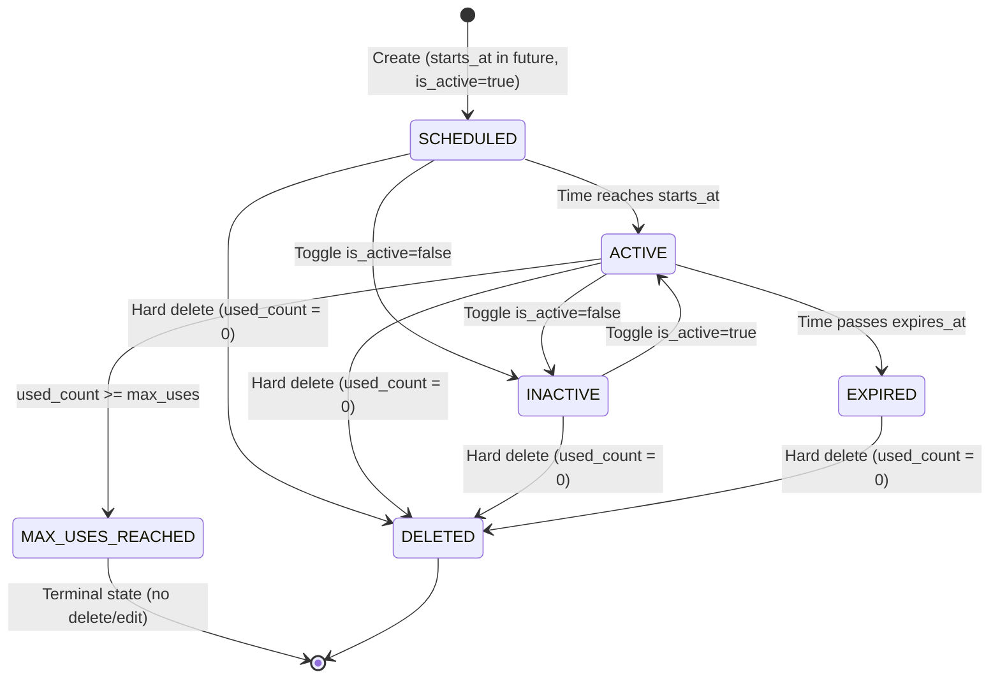

# DD_PROMO_01 — Module Overview

> **Doc ID:** SKM-DD-PROMO-01 | **Version:** 1.0 | **Status:** Draft  
> **Last Updated:** 2026-08-25

---

## 1. Module Overview

The **Promotion Management Module** (プロモーション管理モジュール) manages the complete lifecycle of promotional discount codes (coupons) within the Cosmetics Finder marketplace. It provides merchants with full CRUD capabilities for promotions (create, list, edit, hard delete, and active-status toggle) and enables buyers to validate and apply coupon codes at checkout. The module enforces merchant license-status guards, ownership restrictions, global code uniqueness, strict input validation (three layers), decimal-safe MMK currency handling, and a Redis cache invalidation strategy. It is central to the platform's sales strategy, allowing merchants to design targeted discount campaigns to increase conversion rates.

- **Module Path:** `frontend/src/features/promotions`, `backend/src/modules/promotions`
- **Primary Routes:** `/merchant/promotions`, `/merchant/promotions/new`, `/merchant/promotions/:id/edit`
- **Primary Actors:** Authenticated merchants (own promotions), admins (all promotions), buyers (coupon validation at checkout)
- **Restricted Actor:** Pending/rejected merchants (read-only list, no mutations)
- **Source Specifications:** `SKM-FDS-PROMO-001` (v1.6) and `SKM-SIS-SCR-PROMO-001` (v1.3)

---

## 2. Supported Use Cases

| ID | Use Case | Description |
|---|----------|-------------|
| UC-PROMO-001 | Create New Promotion | Merchant (license `approved`) creates a promotion with code, description, discount type (percentage/fixed), discount value, minimum order amount, max uses, and validity period. New promotion defaults to `is_active = true`, `used_count = 0`. |
| UC-PROMO-002 | View Merchant Promotion List | Merchant views their own promotions in a paginated list with search/filter. Pending/rejected merchants receive a read-only list with a status banner; mutation controls are hidden. |
| UC-PROMO-003 | Edit Existing Promotion | Merchant edits a promotion that belongs to them, is not used (`used_count = 0`), and whose license status is `approved`. The `code` field is read-only after creation. |
| UC-PROMO-004 | Delete Promotion (Hard) | Merchant permanently deletes a promotion that belongs to them, is not used (`used_count = 0`), and whose license status is `approved`. Confirmation dialog is required in the UI. |
| UC-PROMO-005 | Validate Coupon Code | Buyer validates a coupon code at checkout, checking active status, validity window (`starts_at` → `expires_at`), max uses, minimum order amount, and the one-coupon-per-order rule. Discount is calculated but usage is not incremented here. |
| UC-PROMO-006 | View Promotion Statistics | Merchant views usage counts (`used_count` / `max_uses`) and last usage/expiry information on the promotion list. |

---

## 3. Promotion State Machine

The module manages the promotion lifecycle from creation (`ACTIVE`) through deactivation, expiration, and max-usage exhaustion.

**Promotion States:**

| State | Description | Can Edit | Can Delete | Can Validate |
|-------|-------------|:--------:|:----------:|:------------:|
| `SCHEDULED` | `is_active = true` and `starts_at` in the future | ✓ (if `used_count = 0`) | ✓ (if `used_count = 0`) | ✗ |
| `ACTIVE` | `is_active = true` and within validity period | ✓ (if `used_count = 0`) | ✓ (if `used_count = 0`) | ✓ |
| `INACTIVE` | `is_active = false` | ✓ | ✓ (if `used_count = 0`) | ✗ |
| `EXPIRED` | Current time is at/after `expires_at` | ✓ | ✓ (if `used_count = 0`) | ✗ |
| `MAX_USES_REACHED` | `max_uses` set and `used_count >= max_uses` | ✗ | ✗ | ✗ |

---

## 4. Security & Permissions

1. **Authentication**: All promotion endpoints require a JWT Bearer token via `Authorization` header.
2. **Role-Based Access Control (RBAC):** `merchant` manages own promotions; `admin` manages all; `buyer` may only validate coupons. Guards: `JwtAuthGuard` + `RolesGuard`.
3. **License Status Guard:** Merchants with `license_status = 'pending'` or `'rejected'` may view a read-only list, but every mutation (create/edit/delete/toggle) returns `403` with `MERCHANT_NOT_APPROVED` / `MERCHANT_REJECTED`.
4. **Ownership Enforcement:** A merchant may only manage promotions where `promotion.merchant_id === user.merchant_id`; otherwise `403 FORBIDDEN`.
5. **Usage Restriction:** Promotions with `used_count > 0` cannot be edited or deleted (`409` with `PROMO_EDIT_RESTRICTED` / `PROMO_DELETE_RESTRICTED`).
6. **Global Code Uniqueness:** `code` is globally unique via DB constraint `uq_promotions_code`.
7. **Decimal-Safe Currency:** All MMK monetary values are `DECIMAL(10,2)`; discounts are computed with integer MMK math (`Math.floor` on divisions) to avoid floating-point drift; values are serialized as strings.
8. **UTC Timestamps:** All `starts_at` / `expires_at` are stored and transmitted as ISO 8601 UTC.
9. **Data Isolation:** Merchants can only see their own promotions; admins see all.

---

## 5. Architectural Components Involved

| Layer | Files |
|-------|-------|
| **Frontend Pages** | `PromotionListPage.tsx`, `PromotionCreatePage.tsx`, `PromotionEditPage.tsx` |
| **Frontend Components** | `PromotionTable.tsx`, `PromotionForm.tsx`, `SearchInput.tsx`, `StatusFilter.tsx`, `PendingBanner.tsx`, `DeleteConfirmDialog.tsx`, `StatusBadge.tsx`, `DiscountTypeBadge.tsx` |
| **Frontend Hooks** | `usePromotionList.ts`, `usePromotionForm.ts` |
| **Frontend Services** | `promotions.service.ts` |
| **Frontend Schemas** | `promotion.schema.ts` |
| **Frontend Providers** | `DashboardLayout.tsx` (shared layout with sidebar/header) |
| **Backend API** | `promotions.controller.ts` |
| **Backend Service** | `promotions.service.ts`, `promotions.validation.service.ts` |
| **Backend DTOs** | `create-promotion.dto.ts`, `update-promotion.dto.ts`, `validate-coupon.dto.ts`, `promotion-response.dto.ts` |
| **Backend Guards** | `jwt-auth.guard.ts`, `roles.guard.ts` |
| **Backend Config** | `promotion.constants.ts` |
| **Shared Services** | `prisma.service.ts` (`promotions`, `merchants`), `redis.service.ts` (detail/list caches, rate limiting), `logger.service.ts` (audit events) |

---

## 6. API Endpoints

| Method | Endpoint | Description | Auth Required |
|--------|----------|-------------|:-------------:|
| `POST` | `/api/v1/promotions` | Create new promotion | Yes (merchant/admin) |
| `GET` | `/api/v1/promotions` | List merchant promotions (paginated, search/filter) | Yes (merchant/admin) |
| `PATCH` | `/api/v1/promotions/:id` | Update promotion or toggle active status | Yes (merchant/admin) |
| `DELETE` | `/api/v1/promotions/:id` | Hard-delete promotion | Yes (merchant/admin) |
| `POST` | `/api/v1/promotions/validate` | Validate a coupon code at checkout | Yes (buyer) |

---

## 7. Database Tables Involved

| Table | Purpose | Operations |
|-------|---------|------------|
| `promotions` | Store promotion metadata, discount settings, validity window, usage counters | INSERT (create), SELECT (list/detail/validate), UPDATE (edit/toggle), DELETE (hard delete) |
| `merchants` | Store merchant business info and license status | SELECT (license guard, ownership check) |
| `users` | Store user credentials and role | SELECT (authentication identity) |

---

## 8. External Dependencies

| Dependency | Purpose | Configuration |
|------------|---------|---------------|
| Redis | `promo:detail:{code}`, `promo:list:{merchantId}` caches and rate limiting | `REDIS_URL`, `PROMO_CACHE_TTL_SECONDS`, `PROMO_LIST_CACHE_TTL_SECONDS` |
| Prisma ORM | Data access for `promotions` and `merchants` tables | `DATABASE_URL` |
| class-validator / class-transformer | Request DTO validation and transformation | — |
| decimal.js (or MMK integer helpers) | Decimal-safe money arithmetic | — |
| Zod + React Hook Form | Frontend form validation | — |

---

## 9. Cross-References

| Related Document | Purpose |
|------------------|---------|
| [DD_PROMO_02](./DD_Promotion_02_FRONTEND_Page.md) | Frontend page design |
| [DD_PROMO_03](./DD_Promotion_03_API_ENDPOINTS.md) | API endpoint contracts, guards, and rate limits |
| [DD_PROMO_04](./DD_Promotion_04_DTOS_AND_TYPES.md) | DTO and type definitions |
| [DD_PROMO_05](./DD_Promotion_05_BUSINESS_LOGIC.md) | Business logic, caching, and security rules |
| [DD_PROMO_06](./DD_Promotion_06_TEST.md) | Test specification and coverage requirements |
| [プロモーション管理画面_機能設計書](../プロモーション管理画面_機能設計書.md) | Full functional specification (v1.6) |
| [プロモーション管理画面_画面項目設計書](../プロモーション管理画面_画面項目設計書.md) | Screen-item definitions, UI behavior, and i18n keys (v1.3) |
| [データベース設計書_DATABASE_SPEC](../../../core-work/データベース設計書_DATABASE_SPEC.md) | Table constraints and UUID data model (v2.4) |
| [開発ルール_DEVELOPMENT_RULES](../../../core-work/開発ルール_DEVELOPMENT_RULES.md) | Security, accessibility, API, and quality rules (v2.1) |