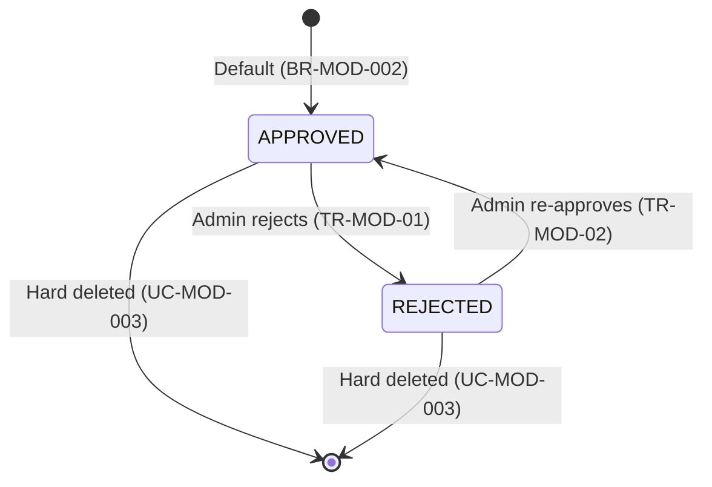
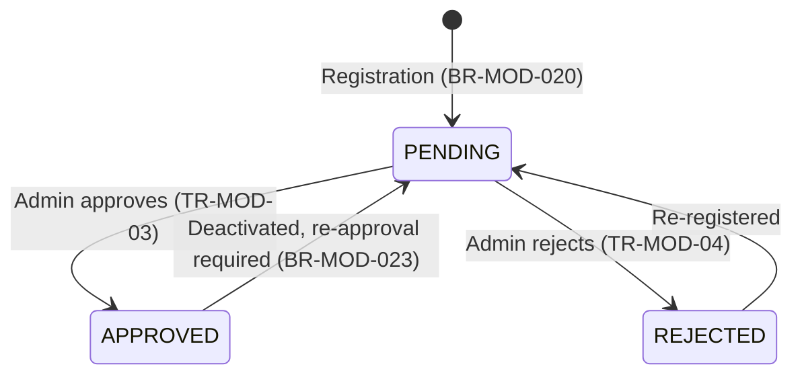
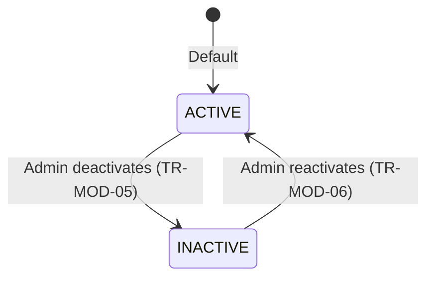
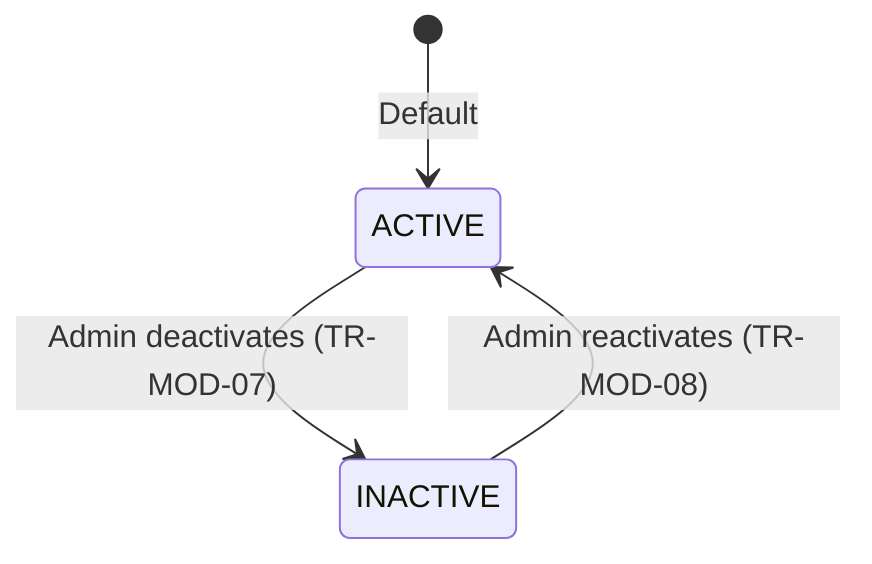
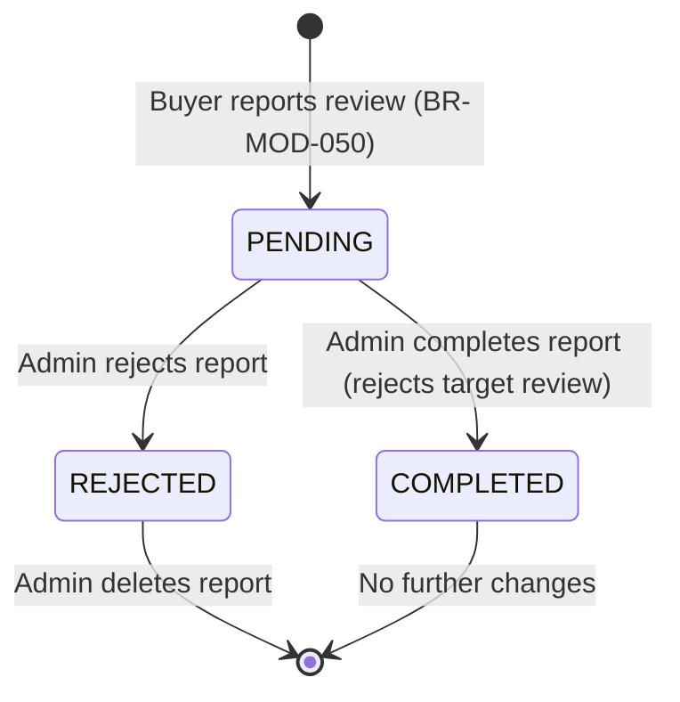

# DD_MOD_01 — Module Overview

> **Doc ID:** SKM-DD-MOD-01 | **Version:** 1.1 | **Status:** Released  
> **Last Updated:** 2026-08-18

---

## 0. Document Revision History

| Version | Date | Author | Description of Changes |
|---------|------|--------|------------------------|
| 1.0 | 2026-08-17 | Software Architect | Initial module overview for Review & Content Moderation. |
| 1.1 | 2026-08-18 | Software Architect | Added Review Reports feature (UC-MOD-007): report management endpoints, `review_reports` table, `notifications` table, report-related architectural components, and audit log events. |

---

## 1. Module Overview

The **Review & Content Moderation Module** (レビュー・コンテンツ管理モジュール) is the central administration hub for maintaining platform integrity within the Cosmetics Finder platform. It provides administrators with complete tools to moderate product reviews (approve/reject/delete), manage merchant registrations (approve/reject), moderate product content (activate/deactivate), manage review reports (confirm/reject/complete), and perform user account moderation (activate/deactivate). All actions are protected by admin-only RBAC enforcement with comprehensive audit logging.

---

## 2. Supported Use Cases

| ID | Use Case | Description |
|---|----------|-------------|
| UC-MOD-001 | View All Reviews | Admin views all reviews with filters (All/Approved/Rejected), search, sort, and pagination. |
| UC-MOD-002 | Moderate Review (Approve/Reject) | Admin approves or rejects a review. Product `avg_rating` and `review_count` are recalculated from approved reviews only. Product cache is invalidated. |
| UC-MOD-003 | Delete Inappropriate Review | Admin permanently deletes a review. Product statistics are recalculated from remaining approved reviews. |
| UC-MOD-004 | Remove Violating Content | Admin deactivates products that violate platform policy by setting `is_active = false`. Products are soft-deleted to preserve order history integrity. |
| UC-MOD-005 | Approve/Reject Merchant Registration | Admin approves or rejects a merchant. `merchants.license_status` is updated and `shops.is_approved` is synchronized. On rejection, merchant's products are deactivated. Website notification is created. |
| UC-MOD-006 | Activate/Deactivate User Account | Admin activates or deactivates user accounts. Deactivation revokes all active sessions (refresh tokens). Admin cannot deactivate their own account. |
| UC-MOD-007 | Manage Review Reports | Admin processes reported reviews: confirms, rejects, or completes reports. When a report is completed, the target review is automatically rejected. Reports start with `pending` status. Completed reports cannot be changed. |

---

## 3. State Machines

### 3.1 Review Moderation States

| State | Description | Visible to Buyers | Can Be Edited |
|-------|-------------|:-----------------:|:-------------:|
| `APPROVED` | Review is approved and displayed on product page | Yes | No |
| `REJECTED` | Review is rejected and hidden from product page | No | No |

### 3.2 Merchant Approval States

| State | Description | Can List Products | Can Access Dashboard |
|-------|-------------|:-----------------:|:--------------------:|
| `PENDING` | Merchant registered, shop created, awaiting admin approval | No | Yes (limited) |
| `APPROVED` | Merchant approved by admin, shop is active | Yes | Yes |
| `REJECTED` | Merchant rejected by admin, shop deactivated | No | Yes (limited) |

### 3.3 Product Moderation States

| State | Description | Visible in Search | Can Be Purchased |
|-------|-------------|:-----------------:|:----------------:|
| `ACTIVE` | Product is active and approved | Yes | Yes |
| `INACTIVE` | Product is deactivated (soft delete or admin action) | No | No |

### 3.4 User Account Moderation States

| State | Description | Can Login | Can Perform Actions |
|-------|-------------|:---------:|:-------------------:|
| `ACTIVE` | Account is active | Yes | Yes |
| `INACTIVE` | Account deactivated by admin | No | No |

### 3.5 Review Report States

| State | Description | Can Be Changed | Can Be Deleted |
|-------|-------------|:--------------:|:--------------:|
| `PENDING` | New report awaiting admin review | Yes | Yes |
| `REJECTED` | Report rejected by admin | No | Yes |
| `COMPLETED` | Report resolved; target review auto-rejected | No | No |

---

## 4. Security & Permissions

1. **Authentication**: JWT Bearer Token with `admin` role required for all endpoints. `JwtAuthGuard` + `RolesGuard` enforced on backend.
2. **RBAC Enforcement**: Backend-only enforcement. Admin role required for all moderation actions. Never trust frontend for access control.
3. **Self-Deactivation Prevention**: Admin cannot deactivate their own account (BR-MOD-042).
4. **Session Termination**: Deactivating a user revokes all active refresh tokens (BR-MOD-041).
5. **Confirmation Dialogs**: Required for all destructive actions (delete review, reject merchant, deactivate product/user).
6. **Audit Logging**: All moderation actions logged with admin ID, target ID, action, and timestamp. Retention: 2 years. Events include: `REVIEW_APPROVED`, `REVIEW_REJECTED`, `REVIEW_DELETED`, `MERCHANT_APPROVED`, `MERCHANT_REJECTED`, `USER_DEACTIVATED`, `USER_ACTIVATED`, `REPORT_REJECTED`, `REPORT_COMPLETED`, `REPORT_DELETED`, `RBAC_VIOLATION`.
7. **Rate Limiting**: Admin API endpoints limited to 100 requests per minute.
8. **Data Isolation**: Admin can moderate any record. Merchants can only view their own products.
9. **Input Sanitization**: All user input sanitized to prevent XSS. Backend ValidationPipe + class-validator DTOs on all endpoints.
10. **Cache Invalidation**: Product and product list caches in Redis are invalidated on moderation state changes.

---

## 5. Architectural Components Involved

| Layer | Files |
|-------|-------|
| **Frontend Pages** | `AdminReviews.tsx`, `AdminMerchants.tsx`, `AdminContent.tsx`, `AdminUsers.tsx`, `AdminReports.tsx` |
| **Frontend Components** | `ReviewsTable.tsx`, `ReviewDetailModal.tsx`, `MerchantsTable.tsx`, `MerchantDetailModal.tsx`, `ProductsTable.tsx`, `ProductModerationModal.tsx`, `UsersTable.tsx`, `UserDetailModal.tsx`, `ReportsTable.tsx`, `ReportDetailModal.tsx`, `ModerationReasonForm.tsx`, `BulkActions.tsx` |
| **Frontend Hooks** | `useAdminReviews.ts`, `useAdminMerchants.ts`, `useAdminContent.ts`, `useAdminUsers.ts`, `useAdminReports.ts` |
| **Frontend Services** | `admin.service.ts` |
| **Frontend Schemas** | `admin.schema.ts` (moderation reason validation) |
| **Backend API** | `admin.controller.ts` |
| **Backend Service** | `admin.service.ts` (review moderation), `merchant-admin.service.ts`, `content-moderation.service.ts`, `user-admin.service.ts`, `report-admin.service.ts` |
| **Backend DTOs** | `moderate-review.dto.ts`, `moderate-merchant.dto.ts`, `moderate-product.dto.ts`, `moderate-user.dto.ts`, `update-report-status.dto.ts` |
| **Backend Guards** | `jwt-auth.guard.ts`, `roles.guard.ts` |
| **Backend Interceptors** | `audit.interceptor.ts` |
| **Shared Services** | `prisma.service.ts` (reviews, products, shops, merchants, users, review_reports), `redis.service.ts` (cache invalidation), `notification.service.ts` (website notifications for merchant status changes) |

---

## 6. API Endpoints

| Method | Endpoint | Description | Auth Required |
|--------|----------|-------------|:-------------:|
| `GET` | `/api/v1/admin/reviews` | View all reviews with filters, search, sort, pagination | Admin |
| `POST` | `/api/v1/admin/reviews/:id/moderate` | Approve or reject a review | Admin |
| `DELETE` | `/api/v1/admin/reviews/:id` | Permanently delete a review | Admin |
| `POST` | `/api/v1/admin/reviews/bulk/moderate` | Bulk approve/reject reviews | Admin |
| `DELETE` | `/api/v1/admin/reviews/bulk` | Bulk delete reviews | Admin |
| `GET` | `/api/v1/admin/merchants` | View all merchants with filters and pagination | Admin |
| `GET` | `/api/v1/admin/merchants/:id` | View merchant detail | Admin |
| `PATCH` | `/api/v1/admin/merchants/:id/status` | Approve or reject merchant registration | Admin |
| `GET` | `/api/v1/admin/content` | View all products with filters, search, sort, pagination | Admin |
| `GET` | `/api/v1/admin/content/:id` | View product detail for moderation | Admin |
| `PATCH` | `/api/v1/admin/content/:id/status` | Deactivate or reactivate a product | Admin |
| `PATCH` | `/api/v1/admin/content/bulk/status` | Bulk deactivate/reactivate products | Admin |
| `GET` | `/api/v1/admin/users` | View all users with filters and pagination | Admin |
| `GET` | `/api/v1/admin/users/:id` | View user detail | Admin |
| `PATCH` | `/api/v1/admin/users/:id/status` | Activate or deactivate a user account | Admin |
| `GET` | `/api/v1/admin/reports` | View all review reports with filters and pagination | Admin |
| `PATCH` | `/api/v1/admin/reports/:id/status` | Update report status (reject/complete) | Admin |
| `DELETE` | `/api/v1/admin/reports/:id` | Delete a review report | Admin |

---

## 7. Database Tables Involved

| Table | Purpose | Operations |
|-------|---------|------------|
| `reviews` | Store product reviews with approval status | SELECT (list/detail), UPDATE (is_approved), DELETE (hard delete) |
| `products` | Store product data, avg_rating, review_count | SELECT (list/detail), UPDATE (avg_rating, review_count, is_active) |
| `shops` | Store shop data, approval status | SELECT (merchant list/detail), UPDATE (is_approved) |
| `merchants` | Store merchant business info, license status | SELECT (list/detail), UPDATE (license_status, rejection_reason, reviewed_at, reviewed_by) |
| `users` | Store user accounts, active status | SELECT (list/detail), UPDATE (is_active) |
| `categories` | Store product categories | SELECT (product detail) |
| `refresh_tokens` | Store hashed refresh tokens | DELETE (revoke all on user deactivation) |
| `review_reports` | Store buyer-submitted review reports | SELECT (list/detail), UPDATE (status, resolved_by, resolved_at), DELETE (pending/rejected reports only) |
| `audit_logs` | Append-only audit trail for all moderation actions | INSERT (every moderation action) |
| `notifications` | Store website notifications for merchant status changes | INSERT (on merchant approve/reject) |

---

## 8. External Dependencies

| Dependency | Purpose | Configuration |
|------------|---------|---------------|
| Redis | Product cache invalidation, product list cache invalidation | `REDIS_URL` |
| Prisma ORM | Database access layer for all tables | `DATABASE_URL` |
| NestJS ValidationPipe | DTO validation on all endpoints | Built-in |
| class-validator | Input validation decorators | Built-in |
| i18next | Internationalization (EN, JA, MY) | `i18n.config.ts` |

---

## 9. Cross-References

| Related Document | Purpose |
|-----------------|---------|
| [DD_MOD_02](./DD_ReviewContent_Moderation_02_FRONTEND_PAGES.md) | Frontend page designs |
| [DD_MOD_03](./DD_ReviewContent_Moderation_03_API_ENDPOINTS.md) | Backend REST API contracts |
| [DD_MOD_04](./DD_ReviewContent_Moderation_04_DTOS_AND_TYPES.md) | DTO and type definitions |
| [DD_MOD_05](./DD_ReviewContent_Moderation_05_BUSINESS_LOGIC.md) | Backend business rules and state transitions |
| [DD_MOD_06](./DD_ReviewContent_Moderation_06_TEST_SPEC.md) | Test specification |
| [機能設計書_Review_Content_Moderation](../機能設計書_Review_Content_Moderation.md) | Full functional specification |
| [画面項目設計書_Review_Content_Moderation](../画面項目設計書_Review_Content_Moderation.md) | Screen items specification |
