# DD_SEARCH_01 — Module Overview

> **Doc ID:** SKM-DD-SEARCH-01 | **Version:** 1.2 | **Status:** Released  
> **Last Updated:** 2026-08-25

---

## 1. Module Overview

The **Search & Filter Module** (検索・フィルタモジュール) is the product discovery and exploration subsystem within the Cosmetics Finder platform. It provides the complete set of capabilities necessary for all users (Visitor, Buyer, Merchant, Admin — REQUIREMENT_SPEC §2.2) to locate skincare products by keyword search, navigate the hierarchical category tree, apply multi-dimensional filters (skin type, ingredients, price range, minimum rating), sort results, and paginate through the catalog. The search results page also hosts the "Search Results Top" sponsored advertisement placement (REQUIREMENT_SPEC §5.3). All search state is persisted in URL query parameters as the single source of truth, ensuring results are shareable, bookmarkable, and back-button friendly. Performance is maintained through Redis cache-aside patterns (product list TTL 2 min, category tree TTL 30 min) and TanStack Query client-side caching.

**Page layout flow:** A → Advertisement → B+C → D — The page header ([A]) renders at the top, followed by the sponsored ad slide-down panel (between [A] and [B+C]), then the search bar ([B]) and filters panel ([C]) in the same row, with the results area ([D]) below. On desktop, [B] and [C] are side-by-side; on mobile, [B] and [C] trigger are in the same row. On page load, the Ad API and Product Search API start in parallel and are non-blocking: the ad response may slide down when ready, while product search renders independently and is never delayed by ad loading.

---

## 2. Supported Use Cases

| ID | Use Case | Description |
|---|----------|-------------|
| UC-SEARCH-001 | Search Products by Keyword | Users (all roles) search products by keyword with partial (case-insensitive) matching on name, short description, tags, and ingredients. |
| UC-SEARCH-002 | Browse Products by Category | Users navigate the nested category tree and filter by a category including all descendant categories. |
| UC-SEARCH-003 | Filter by Skin Type | Users filter results to products compatible with one or more selected skin types (multi-select, `hasEvery` semantics). |
| UC-SEARCH-004 | Filter by Ingredients | Users filter results to products containing any of the selected ingredients (multi-select, `hasSome` semantics). |
| UC-SEARCH-005 | Filter by Price Range | Users filter results to products within min/max price bounds. |
| UC-SEARCH-006 | Filter by Minimum Rating | Users filter results to products with `avg_rating >= selected rating` (1–5 stars). |
| UC-SEARCH-007 | Sort Results | Users sort by newest, price (low-to-high or high-to-low), or highest rating. |
| UC-SEARCH-008 | Paginate Results | Users page through results with configurable page size (10, 20, or 50 items; default 20; max 100). |
| UC-SEARCH-009 | View Product Detail from Results | User clicks a product card and navigates to `/products/:slug`. |
| UC-SEARCH-010 | View Sponsored Advertisements | Approved, in-schedule ads rendered in a slide-down panel between the page header ([A]) and the search bar + filters row ([B]+[C]) via `GET /api/v1/ads?placement=search_top` (REQUIREMENT_SPEC §5.3). |
| UC-SEARCH-011 | Toggle View Mode | Users switch result layout between responsive Grid (1–4 columns) and mobile-optimized List (single-column stacked rows). Selection persists to `localStorage`, defaults to Grid, and does not affect URL state. |
| UC-CATEGORY-001 | Load Category Tree | Nested category tree fetched from Redis/DB and rendered in the filter panel sidebar or mobile drawer. |

---

## 3. Query Lifecycle State Machine

The Search & Filter module manages the UI state lifecycle from page load through query execution, result rendering, and error handling.

```mermaid
stateDiagram-v2
    [*] --> IDLE : Page Load (default catalog)
    
    IDLE --> LOADING : Keyword (after 300ms debounce) / Filter / Sort / Page change
    LOADING --> SUCCESS : Fetch resolves 200
    LOADING --> EMPTY : Fetch resolves total = 0
    LOADING --> ERROR : Fetch rejects (network/4xx/5xx)
    
    SUCCESS --> LOADING : Filter / Sort / Page changed
    SUCCESS --> IDLE : Clear all filters + keyword
    
    EMPTY --> LOADING : Filters reset / new keyword
    EMPTY --> IDLE : Clear all filters + keyword
    
    ERROR --> LOADING : Retry clicked
    ERROR --> IDLE : Clear all filters + keyword
    
    LOADING --> LOADING : URL state changed (cancel/overwrite prior query; latest request only)
```



**Query Lifecycle States:**

| State | Description | Results Displayed | Actions Available |
|-------|-------------|:-----------------:|-------------------|
| `IDLE` | Page loaded, no query in-flight | ✓ (default catalog) | Search, filter, sort, paginate |
| `LOADING` | Query in-flight | Skeleton grid | New query (replaces in-flight) |
| `SUCCESS` | Query returned successfully | ✓ | Sort, filter, paginate, view detail |
| `EMPTY` | Query returned zero matches | Empty state | Reset filters, broaden keyword |
| `ERROR` | Query failed (network/4xx/5xx) | Error banner | Retry |

---

## 4. URL-State Architecture & Request Lifecycle

1. **URL as Single Source of Truth**: All search state (`q`, `categoryId`, `skinTypes`, `ingredients`, `minPrice`, `maxPrice`, `rating`, `sort`, `order`, `page`, `limit`) is persisted in URL query parameters (BR-SEARCH-003). Never React Context.
2. **Separate URL-State Lifecycle**: URL search-state parsing, validation, serialization, and history updates are managed separately from product request execution. Each canonical URL-state snapshot produces one product query; unrelated UI state must not trigger a search.
3. **Latest State Wins**: When the canonical URL search state changes, cancel the previous in-flight product request where supported, overwrite its request identity, and start the latest request. Ignore any late response whose request identity no longer matches the current URL state; only the latest result may update the UI (ST-DEB-004).
4. **Parallel Ad and Product Requests**: The Ad API (`GET /api/v1/ads?placement=search_top`) and Product Search API start independently and in parallel. Ad loading, failure, or an empty response must never block, cancel, defer, or replace product search. The ad panel degrades to hidden on failure or when no eligible ad exists.
5. **Public Endpoints**: Search, category browsing, and product detail require no authentication — fully open to visitors and authenticated users alike.
6. **Visibility Rules**: Only `is_active = true` products from `shops.is_approved = true` are surfaced (BR-SEARCH-012, BR-SEARCH-013). Out-of-stock products remain listed but flagged `isInStock: false` (BR-SEARCH-014).
7. **Debounce**: Keyword input fires after 300ms of typing inactivity (ST-DEB-001). Search button and filter changes fire immediately (ST-DEB-003).
8. **Cache-Aside Pattern**: Redis checked first → miss → query DB → seed Redis. List cache key is a hash of serialized query params. Always set TTL; never cache sensitive data (BR-SEARCH-005).
9. **Page Reset on Change**: Any filter or sort change resets `page` to 1 (BR-SEARCH-011).
10. **Rate Limiting**: Public search endpoint is rate-limited to protect against abuse (429 response with retry-after).
11. **Data Isolation**: Unapproved merchant/shop products are excluded at the query level (REQUIREMENT_SPEC §2.4, DEV §12.2). SQL injection prevented via Prisma parameterized queries.
12. **View Mode Toggle**: Grid/List toggle persists to `localStorage` (`search.viewMode`), defaults to Grid, and is never written to URL params — search/filter/sort/page state is unaffected. Switching views re-renders already-fetched data — no API refetch triggered.
13. **Sponsored Ad Panel**: `slotAdTop` renders between the page header ([A]) and the search bar + filters row ([B]+[C]) as a slide-down panel spanning the full container width.

---

## 5. Page Layout Flow

```
┌──────────────────────────────────────────────────────────┐
│ [A] PAGE HEADER / TITLE                                  │
│     Logo + System Name + Page Title                      │
├──────────────────────────────────────────────────────────┤
│ [D0] SPONSORED AD SLIDE-DOWN PANEL (conditional)         │
│     Horizontally centered between [A] and [B+C]          │
│     Full container width, slide-down animation           │
├──────────────────────────────────────────────────────────┤
│ ┌────────────────────┐  ┌──────────────────────────────┐ │
│ │ [B] SEARCH BAR     │  │ [C] FILTERS PANEL            │ │
│ │ [B1] Keyword Input │  │ [C1] Categories              │ │
│ │ [B2] Search Button │  │ [C2] Skin Type               │ │
│ │ [B3] Clear Search  │  │ [C3] Ingredients             │ │
│ │                    │  │ [C4] Price Range              │ │
│ │                    │  │ [C5] Rating                   │ │
│ │                    │  │ [C6] Apply / [C7] Reset       │ │
│ └────────────────────┘  └──────────────────────────────┘ │
├──────────────────────────────────────────────────────────┤
│ [D] RESULTS AREA                                         │
│     [D1] Results Count  [D2] Sort  [D2a] View Toggle     │
│     [D3] Active Filter Chips                             │
│     [D4] Product Grid / List                             │
│     [D5] Pagination + Page Size                          │
├──────────────────────────────────────────────────────────┤
│ [E] FOOTER CONTROLS — [Language] [Theme]                 │
└──────────────────────────────────────────────────────────┘
```

---

## 6. Architectural Components Involved

| Layer | Files |
|-------|-------|
| **Frontend Pages** | `Products.tsx` (route: `/products`), `Search.tsx` (route: `/search`) |
| **Frontend Components** | `FilterPanel.tsx`, `FilterChips.tsx`, `SearchBar.tsx`, `SortSelect.tsx`, `ViewToggle.tsx`, `ProductCard.tsx`, `Pagination.tsx`, `Skeleton.tsx`, `EmptyState.tsx`, `SponsoredAdSlider.tsx` |
| **Frontend Hooks** | `useSearchParams.ts` (URL state), `useProductSearch.ts` (TanStack Query), `useCategoryTree.ts` (TanStack Query) |
| **Frontend Services** | `product.service.ts`, `category.service.ts` |
| **Frontend Schemas** | `searchParams.schema.ts` (Zod — URL query param parsing/validation) |
| **Backend API** | `products.controller.ts`, `categories.controller.ts`, `ads.controller.ts` |
| **Backend Service** | `products.service.ts`, `categories.service.ts`, `search.service.ts`, `ads.service.ts` |
| **Backend DTOs** | `product-query.dto.ts` (query params), `product-summary.dto.ts`, `category-node.dto.ts`, `sponsored-ad.dto.ts` |
| **Backend Caching** | `redis.service.ts` (cache-aside for product lists, category tree, and sponsored ads) |
| **Shared Services** | `prisma.service.ts` (products, categories, shops, advertisements tables) |

---

## 7. API Endpoints

| Method | Endpoint | Description | Auth Required |
|--------|----------|-------------|:-------------:|
| `GET` | `/api/v1/products` | Search/filter/sort/paginate the product catalog | No |
| `GET` | `/api/v1/categories` | Fetch the nested category tree for navigation | No |
| `GET` | `/api/v1/products/:slug` | Fetch full product detail by slug (from result click) | No |
| `GET` | `/api/v1/ads?placement=search_top` | Sponsored ads for the Search Results Top placement (approved & active only) | No |

---

## 8. Database Tables Involved

| Table | Purpose | Operations |
|-------|---------|------------|
| `products` | Store product data, pricing, stock, rating, skin types, ingredients, tags | SELECT (search, count, detail), filtered by `is_active` |
| `categories` | Store hierarchical category tree (self-referencing `parent_id`) | SELECT (tree build, recursive parent/child lookup) |
| `merchants` | Store merchant account info and license approval status | SELECT (join filter: `license_status = 'approved'`, DBS §3.2) |
| `shops` | Store merchant shop info and approval status | SELECT (join filter: `is_approved = true`) |
| `reviews` | Store product reviews; `avg_rating` and `review_count` maintained as aggregates | SELECT (via `products.avg_rating`, `products.review_count`) |
| `advertisements` | Store sponsored ad content, schedule, tier, and approval status | SELECT (by placement, `approval_status`, schedule; DBS §3.13) |
| `ad_fee_settings` | Store placement/tier fee & duration configuration | SELECT (reference for placement enum, DBS §3.14) |

---

## 9. External Dependencies

| Dependency | Purpose | Configuration |
|------------|---------|---------------|
| Redis | Product list cache (`cache:products:list:{hash}`), category tree cache (`cache:categories`), sponsored ads cache (`cache:ads:search-top`) | `REDIS_URL`, `SEARCH_CACHE_TTL_SECONDS` (120s), `CATEGORY_CACHE_TTL_SECONDS` (1800s), `SEARCH_ADS_CACHE_TTL_SECONDS` (300s) |
| PostgreSQL | Source of truth for products, categories, shops, reviews, advertisements | `DATABASE_URL` |
| TanStack Query | Client-side query caching, deduplication, `keepPreviousData` on pagination | Frontend config |

---

## 10. Cross-References

| Related Document | Purpose |
|-----------------|---------|
| [DD_SEARCH_02](./DD_Search_And_Filter_02_FRONTEND_Page.md) | Frontend page design |
| [DD_SEARCH_03](./DD_Search_And_Filter_03_API_ENDPOINTS.md) | Backend REST API contract |
| [DD_SEARCH_04](./DD_Search_And_Filter_04_DTOS_AND_TYPES.md) | DTO and type definitions |
| [DD_SEARCH_05](./DD_Search_And_Filter_05_BUSINESS_LOGIC.md) | Backend business rules, caching, and query building |
| [DD_SEARCH_06](./DD_Search_And_Filter_06_TEST_SPEC.md) | Test specification |
| [機能設計書_Search_And_Filter](../機能設計書%20_Search_And_Filter.md) | Full functional specification (v2.3) |
| [画面項目設計書_Search_And_Filter](../画面項目設計書_Search_And_Filter.md) | Screen items specification (v2.6) |
