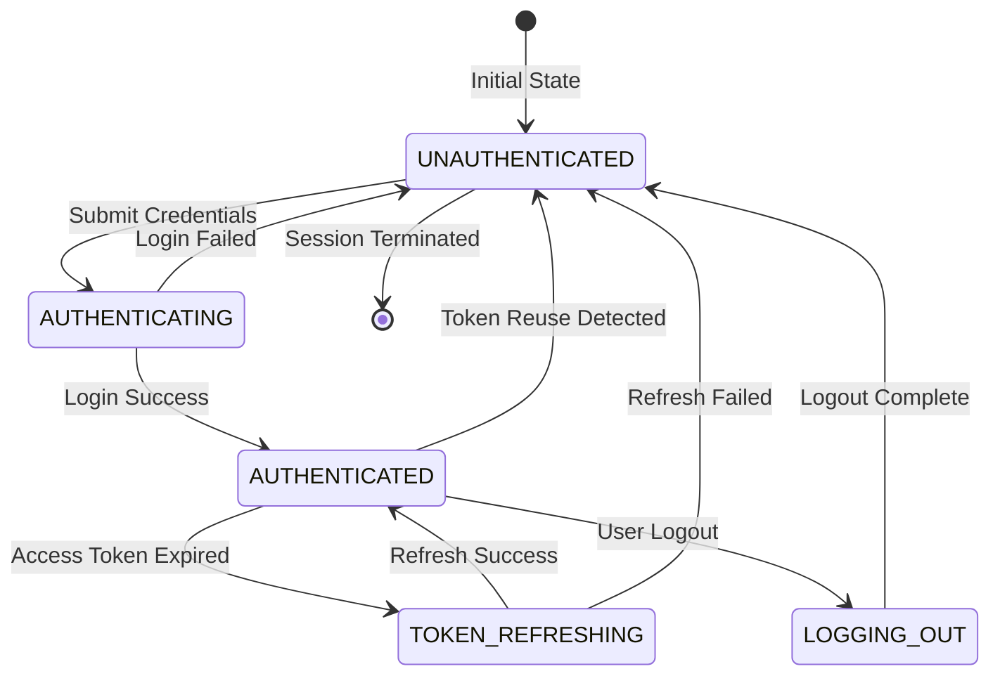

# DD_AUTH_01 — Module Overview

> **Doc ID:** SKM-DD-AUTH-01 | **Version:** 1.0 | **Status:** Released  
> **Last Updated:** 2026-08-10

---

## 1. Module Overview

The **Authentication Module** (認証モジュール) is the gateway for all user authentication within the Cosmetics Finder platform. It handles user registration (Buyer and Merchant), credential validation, JWT token lifecycle management, and secure session termination. This module ensures that only properly validated, authenticated users can access protected platform features while maintaining security through dual-token architecture, Argon2 password hashing, and Redis-based token blacklisting.

---

## 2. Supported Use Cases

| ID | Use Case | Description |
|---|----------|-------------|
| UC-AUTH-01 | Register New Account | Create a new user account with email, password, name, and role selection (Buyer/Merchant). |
| UC-AUTH-02 | Upload Merchant License | When registering as Merchant, upload business license PDF (license.pdf, max 10MB). |
| UC-AUTH-03 | Login with Credentials | Authenticate with email and password, receive JWT access token (15min) and refresh token (7 days). |
| UC-AUTH-04 | Refresh Access Token | Automatically refresh expired access token using refresh token cookie with rotation. |
| UC-AUTH-05 | Logout | Terminate session by blacklisting access token in Redis and revoking refresh token. |
| UC-AUTH-06 | Verify Token Validity | Validate access token and return user profile data for protected route access. |
| UC-AUTH-07 | Detect Token Reuse | Detect and handle revoked refresh token reuse by revoking all user tokens. |

---

## 3. Session State Machine (Authentication Scope)

The Authentication module manages the complete token lifecycle from unauthenticated state through session establishment and termination.

**Session States:**

| State | Description | Can Access API | Can Refresh |
|-------|-------------|:--------------:|:-----------:|
| `UNAUTHENTICATED` | No tokens issued or session terminated | ✗ | ✗ |
| `AUTHENTICATING` | Credentials submitted, awaiting validation | ✗ | ✗ |
| `AUTHENTICATED` | Valid access token active (≤15 min) | ✓ | ✓ |
| `TOKEN_REFRESHING` | Access token expired, refresh in progress | ✗ | ✓ |
| `LOGGING_OUT` | Logout initiated, tokens being revoked | ✗ | ✗ |

---

## 4. Security & Permissions

1. **Password Hashing**: Argon2id algorithm with 64MB memory cost, 3 iterations, 4 threads.
2. **JWT Dual-Token Architecture**: 
   - Access Token: 15-minute expiry, stored in memory only (never localStorage).
   - Refresh Token: 7-day expiry, stored in httpOnly secure cookie.
3. **Token Rotation**: New refresh token issued on every refresh request. Old token revoked.
4. **Token Family Tracking**: Each login session has unique family ID for breach detection.
5. **Reuse Detection**: If revoked refresh token is used, ALL tokens for user are revoked.
6. **Redis Blacklisting**: On logout, access token `jti` added to Redis blacklist with TTL.
7. **Rate Limiting**: Login attempts limited to 5 per IP per 300 seconds.
8. **Cookie Security**: httpOnly, Secure, SameSite=Strict, Path restricted to refresh endpoint.
9. **Data Isolation**: Users can only access their own profile data.
10. **Generic Error Messages**: Login failures return "Invalid email or password" to prevent user enumeration.

---

## 5. Architectural Components Involved

| Layer | Files |
|-------|-------|
| **Frontend Pages** | `Login.tsx`, `Register.tsx` |
| **Frontend Components** | `LoginForm.tsx`, `RegisterForm.tsx`, `PasswordStrengthIndicator.tsx`, `LicenseUpload.tsx` |
| **Frontend Hooks** | `useAuth.ts` |
| **Frontend Services** | `auth.service.ts` |
| **Frontend Schemas** | `auth.schema.ts` |
| **Frontend Providers** | `AuthProvider.tsx` |
| **Backend API** | `auth.controller.ts` |
| **Backend Service** | `auth.service.ts` |
| **Backend DTOs** | `login.dto.ts`, `register.dto.ts` |
| **Backend Strategies** | `jwt-access.strategy.ts`, `jwt-refresh.strategy.ts` |
| **Backend Guards** | `jwt-auth.guard.ts`, `local-auth.guard.ts` |
| **Backend Config** | `jwt.config.ts`, `argon2.config.ts` |
| **Shared Services** | `prisma.service.ts` (users, refresh_tokens), `redis.service.ts` (blacklist) |

---

## 6. API Endpoints

| Method | Endpoint | Description | Auth Required |
|--------|----------|-------------|:-------------:|
| `POST` | `/api/v1/auth/register` | Register new user account | No |
| `POST` | `/api/v1/auth/login` | Authenticate user, issue tokens | No |
| `POST` | `/api/v1/auth/refresh` | Refresh access token via cookie | Cookie |
| `POST` | `/api/v1/auth/logout` | Terminate session, blacklist token | Yes |
| `GET` | `/api/v1/auth/verify` | Validate token, return user profile | Yes |

---

## 7. Database Tables Involved

| Table | Purpose | Operations |
|-------|---------|------------|
| `users` | Store user credentials, profile, role | SELECT (login), INSERT (register), SELECT (verify) |
| `refresh_tokens` | Store hashed refresh tokens with family tracking | INSERT (login), SELECT (refresh), UPDATE (revoke) |
| `user_roles` | Master lookup for role validation | SELECT (registration validation) |

---

## 8. External Dependencies

| Dependency | Purpose | Configuration |
|------------|---------|---------------|
| Redis | Token blacklisting, rate limiting | `REDIS_URL` |
| Argon2 Library | Password hashing | `ARGON2_MEMORY_COST`, `ARGON2_TIME_COST`, `ARGON2_PARALLELISM` |
| JWT Library | Token generation/verification | `JWT_ACCESS_SECRET`, `JWT_REFRESH_SECRET` |
| File Storage | Merchant license upload | `LICENSE_STORAGE_PATH` |

---

## 9. Cross-References

| Related Document | Purpose |
|-----------------|---------|
| [DD_AUTH_02](./DD_AUTH_02_FRONTEND_LOGIN.md) | Login page frontend design |
| [DD_AUTH_03](./DD_AUTH_03_FRONTEND_REGISTER.md) | Register page frontend design |
| [DD_AUTH_04](./DD_AUTH_04_API_ENDPOINTS.md) | Backend REST API contract |
| [DD_AUTH_05](./DD_AUTH_05_BUSINESS_LOGIC.md) | Backend business rules and token lifecycle |
| [DD_AUTH_06](./DD_AUTH_06_SECURITY.md) | Security implementation details |
| [機能設計書_SignUp_Login](./機能設計書_SignUp_Login_New.md) | Full functional specification |
