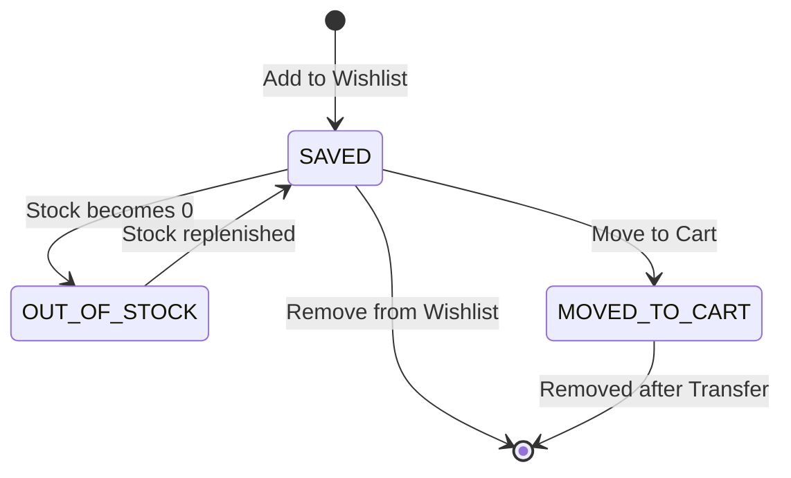

# DD_WISH-CART_01 — Module Overview

> **Doc ID:** SKM-DD-WISH-CART-01 | **Version:** 1.0 | **Status:** Released
> **Last Updated:** 2026-08-12

---

## 1. Module Overview

The **Wishlist & Cart Module** (お気に入り＆カートモジュール) is a core e-commerce module that bridges product browsing and order placement in the Cosmetics Finder platform. The Wishlist subsystem enables authenticated users to save products for future reference, while the Cart subsystem manages the complete pre-purchase workflow including product selection, quantity management, stock validation, and price calculation. Both subsystems ensure seamless product curation and persistence across sessions for logged-in users, while providing a guest user experience that encourages authentication through login modals.

---

## 2. Supported Use Cases

| ID | Use Case | Description |
|---|----------|-------------|
| UC-WISH-001 | Add Product to Wishlist | Authenticated user saves a product to their wishlist by clicking the heart icon. |
| UC-WISH-002 | Remove Product from Wishlist | Authenticated user removes a saved product from their wishlist. |
| UC-WISH-003 | View Wishlist | Authenticated user views all saved products with images, prices, and availability. |
| UC-WISH-004 | Move Wishlist Item to Cart | Authenticated user transfers a wishlist item directly into the shopping cart. |
| UC-CART-001 | Add Product to Cart | Authenticated user adds an in-stock product to the cart with quantity 1. |
| UC-CART-002 | Update Cart Item Quantity | Authenticated user adjusts item quantity via stepper or direct input. |
| UC-CART-003 | Remove Item from Cart | Authenticated user deletes an item from the cart. |
| UC-CART-004 | View Cart | Authenticated user reviews all cart items with quantities, subtotals, and stock status. |
| UC-CART-005 | Guest User Add to Cart Attempt | Unauthenticated user sees alert modal with [Log in] button navigating to `/login?redirect={currentPath}`. |
| UC-CART-006 | Clear All Cart Items | Authenticated user removes all items from the cart via confirmation dialog. |

---

## 3. State Transition Specification

### 3.1 Wishlist Item States

| State | Description | Visible in Wishlist | Can Move to Cart |
|-------|-------------|:-------------------:|:----------------:|
| `SAVED` | Product saved in wishlist, in stock | ✓ | ✓ |
| `OUT_OF_STOCK` | Product saved but currently out of stock | ✓ | ✗ |
| `PRODUCT_DELETED` | Saved product was removed from platform | ✓ (with notice) | ✗ |
| `MOVED_TO_CART` | Item transferred to cart (optional auto-remove) | ✗ (if removed) | — |

### 3.2 Cart Item States

| State | Description | Visible in Cart | Can Checkout |
|-------|-------------|:---------------:|:------------:|
| `ACTIVE` | Item in cart with valid stock | ✓ | ✓ |
| `LOW_STOCK` | Item in cart, stock ≤ threshold (≤10) | ✓ (warning) | ✓ |
| `OUT_OF_STOCK` | Item in cart, stock = 0 | ✓ (error) | ✗ |
| `QUANTITY_EXCEEDED` | Requested quantity exceeds available stock | ✓ (error) | ✗ |
| `PRODUCT_DELETED` | Cart item's product was removed | ✓ (with notice) | ✗ |

---

## 4. Business Rules

### 4.1 Wishlist Rules

| Rule ID | Rule | Description |
|---------|------|-------------|
| BR-WISH-001 | Authentication Required | Only authenticated users can manage wishlists. |
| BR-WISH-002 | One Wishlist Per Product | Each user can save a product only once. Unique constraint on `[user_id, product_id]`. |
| BR-WISH-003 | Active Product Only | Only active products can be added to wishlist. |
| BR-WISH-004 | Owner-Only Access | Users can only view/modify their own wishlist items. |
| BR-WISH-005 | Move to Cart Validation | Moving to cart requires `stock_quantity > 0`. |

### 4.2 Cart Rules

| Rule ID | Rule | Description |
|---------|------|-------------|
| BR-CART-001 | Authentication Required | Only authenticated users can manage cart. |
| BR-CART-002 | Stock Availability | Cannot add product to cart if `stock_quantity = 0`. |
| BR-CART-003 | Quantity Limit | Cart item quantity cannot exceed available `stock_quantity`. |
| BR-CART-004 | Quantity Minimum | Cart item quantity must be ≥ 1. |
| BR-CART-005 | Active Product Only | Only active products can be added to cart. |
| BR-CART-006 | Cart Persistence | Cart items are stored in database for logged-in users. |
| BR-CART-007 | Subtotal Calculation | Subtotal = `unit_price × quantity`. Discounts/coupons are applied at checkout, not cart. |
| BR-CART-008 | Duplicate Handling | Adding an existing cart item increments quantity instead of creating duplicate. |
| BR-CART-009 | Guest User Restriction | Unauthenticated users see alert modal: "Please log in to add items to your cart." |

---

## 5. Architectural Components Involved

| Layer | Files |
|-------|-------|
| **Frontend Pages** | `Wishlist.tsx`, `Cart.tsx` |
| **Frontend Components** | `WishlistItemCard.tsx`, `CartItemRow.tsx`, `CartSummaryPanel.tsx`, `GuestLoginAlertModal.tsx`, `EmptyState.tsx` |
| **Frontend Hooks** | `useWishlist.ts`, `useCart.ts` |
| **Frontend Services** | `wishlist.service.ts`, `cart.service.ts` |
| **Frontend Schemas** | `cart.schema.ts` (quantity validation) |
| **Frontend UI** | `Badge.tsx`, `Button.tsx`, `Dialog.tsx`, `Skeleton.tsx`, `Toast.tsx` |
| **Backend API** | `wishlist.controller.ts`, `cart.controller.ts` |
| **Backend Service** | `wishlist.service.ts`, `cart.service.ts` |
| **Backend DTOs** | `wishlist-response.dto.ts`, `cart-response.dto.ts`, `update-quantity.dto.ts` |
| **Backend Guards** | `jwt-auth.guard.ts` (all endpoints protected) |
| **Shared Services** | `prisma.service.ts` (wishlists, cart_items, products) |

---

## 6. API Endpoints

### 6.1 Wishlist Endpoints

| Method | Endpoint | Description | Auth Required |
|--------|----------|-------------|:-------------:|
| `GET` | `/api/v1/wishlist` | Get user's wishlist items | Yes |
| `POST` | `/api/v1/wishlist/:productId` | Add product to wishlist | Yes |
| `DELETE` | `/api/v1/wishlist/:productId` | Remove product from wishlist | Yes |
| `POST` | `/api/v1/wishlist/:productId/move-to-cart` | Move wishlist item to cart | Yes |

### 6.2 Cart Endpoints

| Method | Endpoint | Description | Auth Required |
|--------|----------|-------------|:-------------:|
| `GET` | `/api/v1/cart` | Get user's cart with items and summary | Yes |
| `POST` | `/api/v1/cart/items` | Add product to cart | Yes |
| `PATCH` | `/api/v1/cart/items/:id` | Update cart item quantity | Yes |
| `DELETE` | `/api/v1/cart/items/:id` | Remove item from cart | Yes |
| `DELETE` | `/api/v1/cart` | Clear all cart items | Yes |

---

## 7. Database Tables Involved

| Table | Purpose | Operations |
|-------|---------|------------|
| `wishlists` | Store user-product wishlist associations | SELECT, INSERT, DELETE |
| `cart_items` | Store user cart with product and quantity | SELECT, INSERT, UPDATE, DELETE |
| `products` | Read product details, stock, and pricing | SELECT (join) |

---

## 8. External Dependencies

| Dependency | Purpose | Configuration |
|------------|---------|---------------|
| Prisma ORM | Database access for wishlists, cart_items, products | `DATABASE_URL` |
| Redis | Optional: cart caching (currently no caching for user-specific data) | `REDIS_URL` |

---

## 9. Cross-References

| Related Document | Purpose |
|-----------------|---------|
| [DD_WISH-CART_02](./DD_Wishlist_CartPage_02_FRONTEND_Page.md) | Frontend page design |
| [DD_WISH-CART_03](./DD_Wishlist_CartPage_03_API_ENDPOINTS.md) | Backend REST API contract |
| [DD_WISH-CART_04](./DD_Wishlist_CartPage_04_DTOS_AND_TYPES.md) | DTO and type definitions |
| [DD_WISH-CART_05](./DD_Wishlist_CartPage_05_BUSINESS_LOGIC.md) | Backend business rules and state transitions |
| [DD_WISH-CART_06](./DD_Wishlist_CartPage_06_TEST_SPEC.md) | Test specification |
| [機能設計書_Wishlist_CartPage](../機能設計書_Wishlist_CartPage.md) | Full functional specification |
| [画面項目設計書_Wishlist_CartPage](../画面項目設計書_Wishlist_CartPage.md) | Screen items specification |
