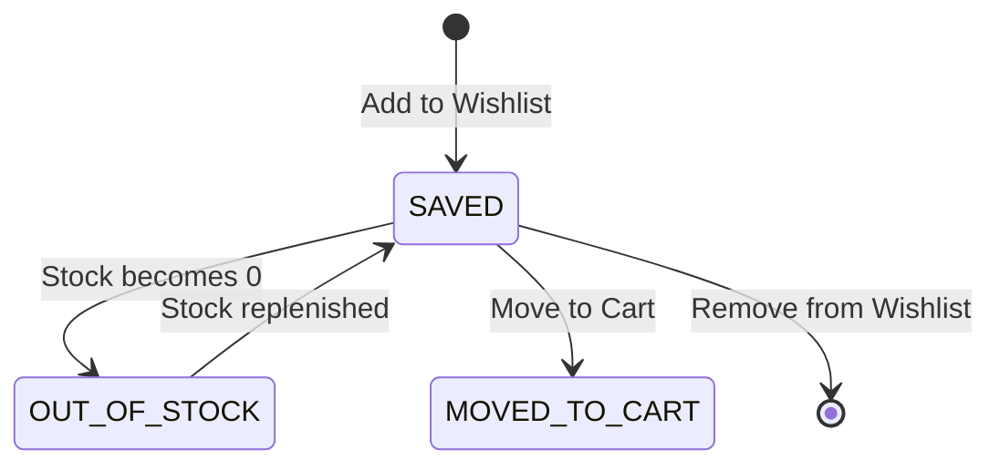
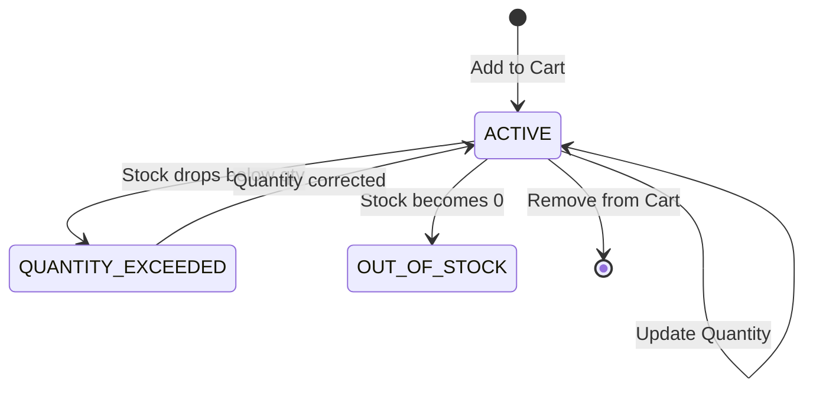

# DD_WISH-CART_01 — Module Overview

> **Doc ID:** SKM-DD-WISH-CART-01 | **Version:** 1.0 | **Status:** Released  
> **Last Updated:** 2026-08-14

---

## 1. Module Overview

The **Wishlist & Cart Module** (お気に入り & カートモジュール) is the core e-commerce workflow component for the Cosmetics Finder platform. It manages product curation through wishlists, shopping cart operations, stock validation, and price calculation to support a seamless purchasing experience. This module bridges product browsing and order placement, ensuring authenticated users can save products, manage quantities, validate stock availability, and proceed to checkout.

The Wishlist subsystem enables users to save products for future reference, while the Cart subsystem manages the complete purchase workflow from product selection through checkout initiation. Both subsystems enforce strict ownership rules and stock validation to maintain data integrity and prevent inventory issues.

---

## 2. Supported Use Cases

| ID | Use Case | Description |
|---|----------|-------------|
| UC-WISH-001 | Add Product to Wishlist | Authenticated user saves a product to their wishlist for future reference. |
| UC-WISH-002 | Remove Product from Wishlist | Authenticated user removes a saved product from their wishlist. |
| UC-WISH-003 | View Wishlist | Authenticated user views all saved products with images, prices, and availability status. |
| UC-WISH-004 | Move Wishlist Item to Cart | Authenticated user transfers a wishlist item directly into the shopping cart. |
| UC-CART-001 | Add Product to Cart | Authenticated user adds an in-stock product to their shopping cart with quantity 1. |
| UC-CART-002 | Update Cart Item Quantity | Authenticated user modifies the quantity of an existing cart item, with stock validation. |
| UC-CART-003 | Remove Item from Cart | Authenticated user removes an item from their shopping cart. |
| UC-CART-004 | View Cart | Authenticated user views all cart items with images, names, prices, quantities, subtotals, and stock status. |
| UC-CART-005 | Guest User Add to Cart Attempt | Unauthenticated user attempts to add items to cart, triggering login modal. |

---

## 3. State Transition Specification

The Wishlist & Cart module manages two primary state machines: Wishlist Item States and Cart Item States.

### 3.1 Wishlist Item States

| State | Description | Visible in Wishlist | Can Move to Cart |
|-------|-------------|:-------------------:|:----------------:|
| `SAVED` | Product saved in wishlist, in stock | ✓ | ✓ |
| `OUT_OF_STOCK` | Product saved but currently out of stock | ✓ | ✗ |
| `MOVED_TO_CART` | Item transferred to cart (optional auto-remove) | ✗ (if removed) | — |

### 3.2 Cart Item States

| State | Description | Visible in Cart | Can Checkout |
|-------|-------------|:---------------:|:------------:|
| `ACTIVE` | Item in cart with valid stock | ✓ | ✓ |
| `LOW_STOCK` | Item in cart, stock below threshold (≤10) | ✓ (warning) | ✓ |
| `OUT_OF_STOCK` | Item in cart, stock = 0 | ✓ (error) | ✗ |
| `QUANTITY_EXCEEDED` | Requested quantity exceeds available stock | ✓ (error) | ✗ |

---

## 4. Security & Permissions

1. **Authentication Required**: All wishlist and cart endpoints require valid JWT Bearer token via `Authorization` header.
2. **Role-Based Access**: Only `buyer` role can access wishlist and cart features. Merchants and Admins receive 403 Forbidden.
3. **Ownership Validation**: Users can only view/modify their own wishlist and cart items (filtered by `user_id` from JWT).
4. **Stock Validation**: Server-side stock checks prevent adding out-of-stock items or exceeding available quantities.
5. **Price Integrity**: Prices fetched from database, not client-provided, preventing manipulation.
6. **Atomic Operations**: Stock decrements and cart updates use Prisma transactions to prevent race conditions.
7. **Guest User Handling**: Unauthenticated users cannot add items to cart; alert modal directs to login page.
8. **IDOR Prevention**: Ownership validation ensures users cannot access other users' wishlist or cart items.

---

## 5. Architectural Components Involved

| Layer | Files |
|-------|-------|
| **Frontend Pages** | `Wishlist.tsx`, `Cart.tsx` |
| **Frontend Components** | `WishlistItemCard.tsx`, `CartItemRow.tsx`, `CartSummary.tsx`, `QuantityStepper.tsx`, `GuestLoginModal.tsx`, `EmptyState.tsx` |
| **Frontend Hooks** | `useWishlist.ts`, `useCart.ts` |
| **Frontend Services** | `wishlist.service.ts`, `cart.service.ts` |
| **Frontend Schemas** | `wishlist.schema.ts`, `cart.schema.ts` |
| **Backend API** | `wishlist.controller.ts`, `cart.controller.ts` |
| **Backend Service** | `wishlist.service.ts`, `cart.service.ts` |
| **Backend DTOs** | `wishlist-item.dto.ts`, `cart-item.dto.ts`, `cart-summary.dto.ts` |
| **Backend Guards** | `jwt-auth.guard.ts`, `roles.guard.ts` |
| **Backend Strategies** | `jwt-access.strategy.ts` |
| **Shared Services** | `prisma.service.ts` (wishlists, carts, products), `redis.service.ts` (optional caching) |

---

## 6. API Endpoints

| Method | Endpoint | Description | Auth Required |
|--------|----------|-------------|:-------------:|
| `GET` | `/api/v1/wishlist` | Get user's wishlist items | Yes |
| `POST` | `/api/v1/wishlist/:productId` | Add product to wishlist | Yes |
| `DELETE` | `/api/v1/wishlist/:productId` | Remove product from wishlist | Yes |
| `POST` | `/api/v1/wishlist/:productId/move-to-cart` | Move wishlist item to cart | Yes |
| `GET` | `/api/v1/cart` | Get user's cart items with summary | Yes |
| `POST` | `/api/v1/cart/items` | Add product to cart | Yes |
| `PATCH` | `/api/v1/cart/items/:id` | Update cart item quantity | Yes |
| `DELETE` | `/api/v1/cart/items/:id` | Remove item from cart | Yes |

---

## 7. Database Tables Involved

| Table | Purpose | Operations |
|-------|---------|------------|
| `wishlists` | Store user's saved products | INSERT (add), DELETE (remove), SELECT (view), DELETE (move to cart) |
| `carts` | Store user's cart items with quantities | INSERT (add), UPDATE (quantity), DELETE (remove), SELECT (view) |
| `products` | Product details, stock, pricing | SELECT (validation, display), UPDATE (stock decrement on order) |
| `users` | User authentication and role validation | SELECT (JWT validation) |

---

## 8. External Dependencies

| Dependency | Purpose | Configuration |
|------------|---------|---------------|
| Redis | Optional caching for product details | `REDIS_URL` |
| Prisma ORM | Database operations and transactions | `DATABASE_URL` |
| JWT Library | Token verification for authentication | `JWT_ACCESS_SECRET` |

---

## 9. Cross-References

| Related Document | Purpose |
|-----------------|---------|
| [DD_WISH-CART_02](./DD_Wishlist_CartPage_02_FRONTEND_Page.md) | Frontend page design |
| [DD_WISH-CART_03](./DD_Wishlist_CartPage_03_API_ENDPOINTS.md) | Backend REST API contract |
| [DD_WISH-CART_04](./DD_Wishlist_CartPage_04_DTOS_AND_TYPES.md) | DTO and type definitions |
| [DD_WISH-CART_05](./DD_Wishlist_CartPage_05_BUSINESS_LOGIC.md) | Backend business rules and state transitions |
| [DD_WISH-CART_06](./DD_Wishlist_CartPage_06_TEST_SPEC.md) | Test specification |
| [機能設計書_Wishlist_CartPage](../機能設計書_Wishlist_CartPage.md) | Full functional specification |